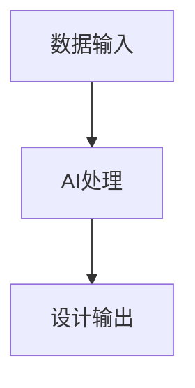
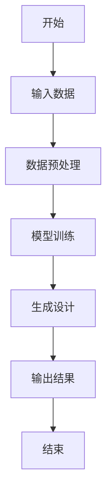
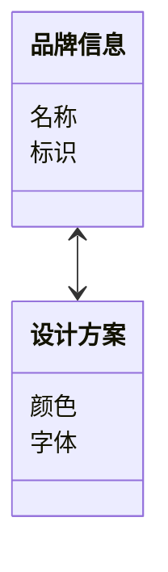
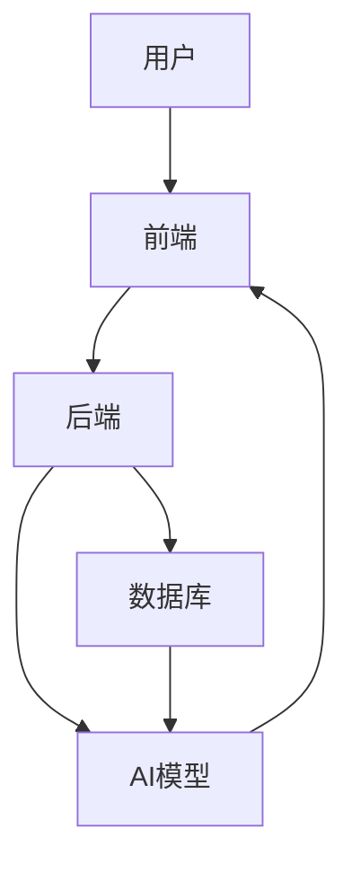
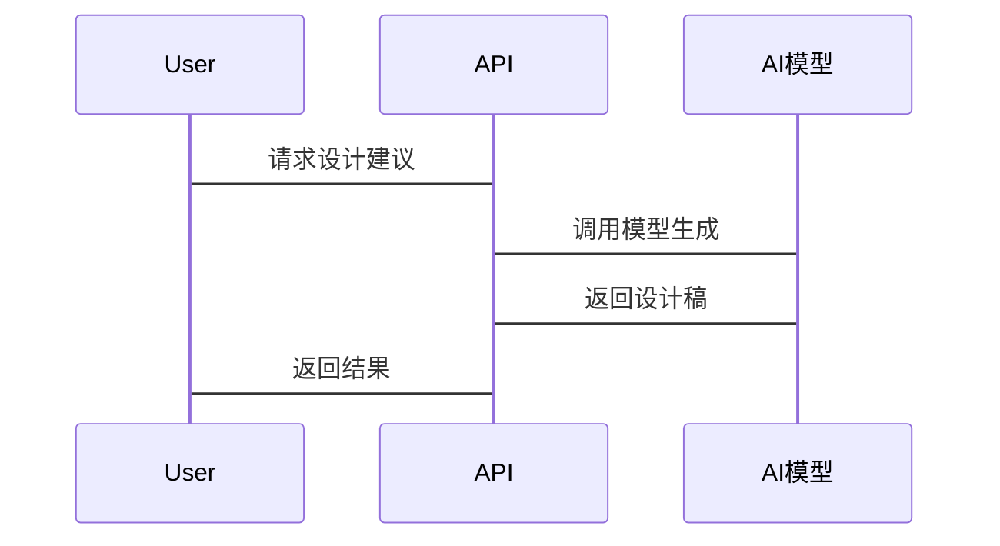

                 


```markdown
# AI辅助品牌形象设计与管理的创新方法

> 关键词：AI辅助设计，品牌形象管理，创新方法，系统架构，项目实战

> 摘要：本文探讨AI技术在品牌形象设计与管理中的创新应用，分析其核心概念、算法原理、系统架构，并通过项目实战和最佳实践提供全面的解决方案。

---

# 第1章: 背景介绍

## 1.1 问题背景
### 1.1.1 品牌形象设计的传统方法
- 传统设计依赖设计师的经验和创造力，效率低且成本高。
- 传统方法难以满足快速变化的市场需求。

### 1.1.2 传统方法的局限性
- 设计周期长，难以快速响应市场变化。
- 设计结果受设计师主观因素影响较大。
- 难以量化评估设计效果。

### 1.1.3 AI技术如何解决这些问题
- AI技术可以提高设计效率，降低设计成本。
- 通过数据驱动的方法，提供更客观的设计评估。

## 1.2 问题描述
### 1.2.1 品牌形象设计的核心要素
- 品牌标识、字体设计、色彩搭配等。

### 1.2.2 当前设计与管理中的痛点
- 设计资源分散，管理复杂。
- 设计结果难以量化评估。

### 1.2.3 AI辅助的必要性
- 提高设计效率和质量。
- 通过数据驱动优化设计决策。

## 1.3 问题解决
### 1.3.1 AI在设计与管理中的应用
- AI辅助设计工具生成初始设计稿。
- AI分析市场趋势，提供设计建议。

### 1.3.2 创新方法的具体实现
- 使用机器学习模型优化设计结果。
- 通过反馈机制不断改进设计。

### 1.3.3 实际案例分析
- 某品牌通过AI辅助设计缩短了设计周期。

## 1.4 边界与外延
### 1.4.1 AI辅助的适用范围
- 适用于品牌标识、广告设计等场景。

### 1.4.2 与其他技术的区分
- 区分于纯人工设计和传统自动化设计。

### 1.4.3 可能的未来发展
- AI设计工具将更加智能化和个性化。

## 1.5 概念结构与核心要素
### 1.5.1 核心概念的定义
- AI辅助设计：利用AI技术生成和优化设计。

### 1.5.2 各要素之间的关系
- 数据输入 → AI处理 → 设计输出。

### 1.5.3 系统架构图


---

# 第2章: 核心概念与联系

## 2.1 核心概念原理
### 2.1.1 AI在设计中的作用
- 生成初始设计稿，提供创意建议。

### 2.1.2 数据驱动的设计方法
- 使用市场数据优化设计决策。

### 2.1.3 创意与效率的平衡
- AI帮助设计师提高效率，同时保持创意。

## 2.2 概念属性特征对比
### 2.2.1 AI辅助设计的优缺点对比
| 特性    | 传统设计 | AI辅助设计 |
|---------|----------|------------|
| 效率     | 低       | 高         |
| 可控性   | 高       | 中         |
| 创意     | 依赖设计师 | 可辅助生成 |

### 2.2.2 传统设计与AI设计的差异
- 传统设计依赖人工，AI设计利用数据和算法。

### 2.2.3 数据质量对结果的影响
- 高质量数据提高设计准确性。

## 2.3 ER实体关系图
```mermaid
erDiagram
    brand : 品牌信息
    design : 设计方案
    feedback : 用户反馈
    AI_model : AI模型
    brand_info <--- design : 包含
    design <--> feedback : 基于反馈优化
    design <--> AI_model : 使用模型生成
```

---

# 第3章: 算法原理讲解

## 3.1 算法原理
### 3.1.1 算法流程图


### 3.1.2 算法实现
- 使用深度学习模型生成设计稿。

## 3.2 算法实现
### 3.2.1 Python代码实现
```python
import numpy as np
from keras.models import Model

# 示例代码：生成颜色搭配
def generate_colors():
    colors = np.random.randint(0, 256, size=(3,3))
    return colors

colors = generate_colors()
print(colors)
```

### 3.2.2 算法原理的数学模型
- 颜色空间转换：RGB到HSL的转换公式。
- 设计优化：基于损失函数的反向传播。

## 3.3 算法流程图


## 3.4 举例说明
- 通过训练数据生成品牌标识。

---

# 第4章: 数学模型和公式

## 4.1 算法的数学模型
- 颜色模型：RGB颜色空间。
- 设计优化：基于梯度下降的优化算法。

## 4.2 公式推导
### 4.2.1 颜色空间转换公式
$$ RGB(r, g, b) \rightarrow HSL(h, s, l) $$

### 4.2.2 损失函数
$$ L = \sum (y_i - \hat{y_i})^2 $$

---

# 第5章: 系统分析与架构设计

## 5.1 问题场景介绍
- 品牌设计与管理中的问题。

## 5.2 系统功能设计
### 5.2.1 领域模型


## 5.3 系统架构设计图


## 5.4 接口设计
- API接口：RESTful风格。

## 5.5 交互流程图


---

# 第6章: 项目实战

## 6.1 环境安装
- 安装Python、深度学习框架。

## 6.2 核心代码实现
### 6.2.1 品牌标识生成
```python
import tensorflow as tf
from tensorflow.keras import layers

model = tf.keras.Sequential([
    layers.Dense(128, activation='relu'),
    layers.Dense(3, activation='sigmoid')
])
```

### 6.2.2 模型训练
```python
model.compile(optimizer='adam', loss='binary_crossentropy')
model.fit(X_train, y_train, epochs=10)
```

## 6.3 代码解读
- 使用深度学习模型生成品牌标识。

## 6.4 案例分析
- 某品牌通过AI辅助设计优化品牌形象。

## 6.5 项目小结
- 成功案例和经验总结。

---

# 第7章: 最佳实践与总结

## 7.1 最佳实践 tips
- 确保数据质量。
- 结合设计师的反馈进行优化。

## 7.2 小结
- AI辅助设计的优势和未来发展方向。

## 7.3 注意事项
- 数据隐私保护。
- 确保模型的泛化能力。

## 7.4 拓展阅读
- 推荐相关书籍和论文。

---

# 作者：AI天才研究院 & 禅与计算机程序设计艺术
```

