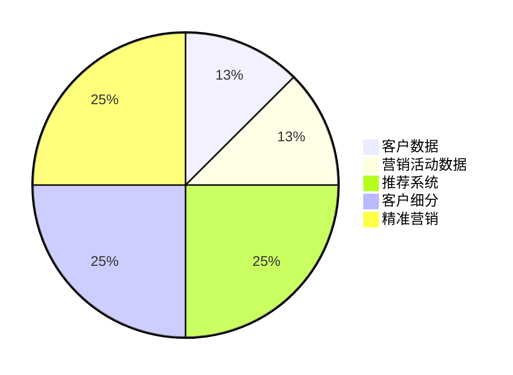
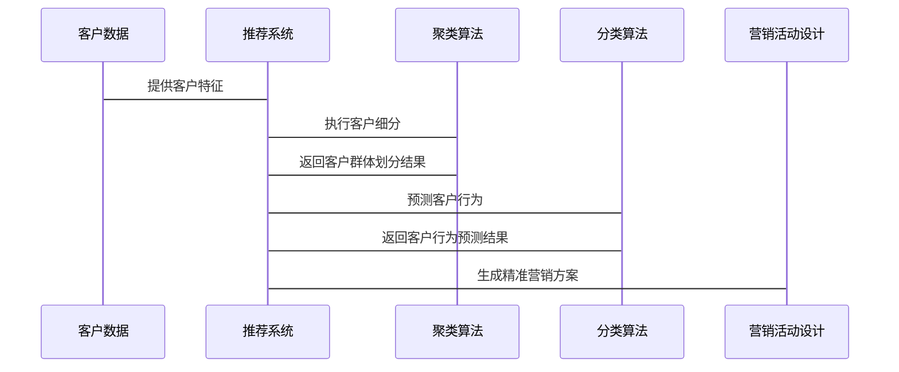

                 


# AI辅助客户细分与精准营销的最佳实践

## 关键词：客户细分、精准营销、人工智能、机器学习、数据挖掘

## 摘要：  
本文深入探讨了人工智能在客户细分与精准营销中的应用，从理论基础到实践案例，系统地分析了AI如何提升客户细分的效率与精准度，并通过实际项目案例展示了如何利用AI技术实现精准营销。文章内容涵盖客户细分的核心概念、AI算法原理、系统架构设计、项目实战以及最佳实践，旨在为读者提供一份全面而深入的指南。

---

# 第1章: 客户细分与精准营销的背景介绍

## 1.1 客户细分的定义与重要性

### 1.1.1 什么是客户细分  
客户细分是指将客户群体按照某些共同特征（如 demographics、行为习惯、价值贡献等）进行划分，以便更好地理解客户的需求和行为模式。  

**客户细分的核心特征：**
- **人口统计特征**：年龄、性别、收入水平等。
- **行为特征**：购买频率、购买金额、渠道偏好等。
- **价值特征**：客户生命周期价值（Customer Lifetime Value, CLV）。

### 1.1.2 客户细分的必要性  
- **提升营销效率**：通过细分客户，企业可以针对不同群体设计不同的营销策略。
- **提高客户满意度**：个性化服务能够更好地满足客户的需求。
- **降低运营成本**：通过精准定位目标客户，减少无效营销支出。

### 1.1.3 客户细分的常见方法  
- **基于规则的细分**：根据预设的规则（如年龄、收入）进行划分。
- **基于统计的细分**：利用聚类分析等统计方法进行划分。
- **基于机器学习的细分**：使用无监督学习算法（如K-means）自动划分客户群体。

## 1.2 精准营销的概念与目标

### 1.2.1 精准营销的定义  
精准营销是指基于客户细分和数据分析，针对特定客户群体或个体设计个性化营销策略的过程。  

### 1.2.2 精准营销的核心目标  
- **提升转化率**：通过精准定位目标客户，提高营销活动的转化效果。
- **降低营销成本**：减少对非目标客户的无效营销。
- **增强客户忠诚度**：通过个性化服务提升客户满意度和忠诚度。

### 1.2.3 精准营销与传统营销的区别  
| 特性                | 精准营销                        | 传统营销                        |
|---------------------|--------------------------------|----------------------------------|
| 客户定位            | 针对特定客户群体或个体          | 面向全体客户或广泛市场          |
| 营销策略            | 定制化、个性化                   | 标准化、通用化                   |
| 数据依赖            | 高度依赖数据分析                | 依赖市场调研和经验               |
| 营销效果            | 高转化率、低浪费                | 转化率较低、浪费较多            |

## 1.3 AI在客户细分与精准营销中的作用

### 1.3.1 AI技术如何提升客户细分的效率  
- **自动化数据处理**：AI能够快速处理大量数据，提取客户特征。
- **无监督学习算法**：如聚类分析可以帮助发现潜在的客户群体。
- **动态调整**：AI可以实时更新客户数据，动态调整细分策略。

### 1.3.2 AI在精准营销中的应用价值  
- **预测客户行为**：通过机器学习模型预测客户的购买意愿。
- **个性化推荐**：基于客户的兴趣和行为推荐相关内容。
- **优化营销渠道**：通过数据分析选择最佳营销渠道。

### 1.3.3 AI辅助客户细分与精准营销的未来趋势  
- **实时分析**：未来的精准营销将更加注重实时数据分析。
- **多模态数据融合**：结合文本、图像、语音等多种数据源进行客户分析。
- **自动化决策**：AI将更多地应用于自动化营销决策过程。

## 1.4 本章小结  
本章介绍了客户细分和精准营销的基本概念，分析了AI在客户细分与精准营销中的作用，并展望了未来的发展趋势。

---

# 第2章: 客户细分与精准营销的核心概念

## 2.1 客户细分的核心要素

### 2.1.1 客户的基本属性  
- **人口统计属性**：年龄、性别、地理位置等。
- **心理属性**：兴趣、价值观、生活方式等。

### 2.1.2 客户的行为特征  
- **购买频率**：客户在一定时间内的购买次数。
- **购买金额**：客户的平均消费金额。
- **渠道偏好**：客户偏好的购买渠道（如线上、线下）。

### 2.1.3 客户的价值评估  
- **客户生命周期价值（CLV）**：客户在生命周期内为企业带来的总收益。
- **客户满意度（CSAT）**：客户对企业的满意度。

## 2.2 精准营销的关键策略

### 2.2.1 目标客户的选择  
- **高价值客户**：那些为企业带来较高收益的客户。
- **高潜力客户**：那些有较大增长潜力的客户。

### 2.2.2 定制化营销方案的设计  
- **个性化推荐**：基于客户特征推荐相关产品或服务。
- **定制化优惠**：针对不同客户群体设计不同的优惠活动。

### 2.2.3 营销渠道的优化选择  
- **线上渠道**：如社交媒体、电子邮件营销。
- **线下渠道**：如实体店、传统广告。

## 2.3 AI在客户细分与精准营销中的核心算法

### 2.3.1 聚类分析算法  
- **K-means算法**：一种常用的无监督学习算法，用于将客户分成不同的群体。
- **层次聚类算法**：通过构建树状结构将客户逐步划分成不同的群体。

### 2.3.2 分类算法  
- **决策树算法**：用于预测客户的行为或分类客户群体。
- **支持向量机（SVM）**：用于客户分类和预测。

### 2.3.3 关联规则挖掘算法  
- **Apriori算法**：用于发现客户的关联购买行为。

## 2.4 本章小结  
本章详细介绍了客户细分的核心要素和精准营销的关键策略，并探讨了AI在其中的核心算法。

---

# 第3章: AI辅助客户细分与精准营销的算法原理

## 3.1 聚类分析算法

### 3.1.1 K-means算法  
- **目标**：将客户数据分成K个簇，每个簇内的客户具有较高的相似性。
- **步骤**：
  1. 随机选择K个初始质心。
  2. 计算每个客户到质心的距离，将客户分配到最近的簇。
  3. 重新计算每个簇的质心。
  4. 重复步骤2和3，直到质心不再变化或达到收敛条件。

- **数学公式**：
  $$ \text{目标函数} = \sum_{i=1}^{k} \sum_{j=1}^{n_i} (x_j - c_i)^2 $$
  其中，\( x_j \) 是客户特征向量，\( c_i \) 是第i个簇的质心，\( n_i \) 是第i个簇的客户数量。

### 3.1.2 层次聚类算法  
- **步骤**：
  1. 将每个客户作为一个独立的簇。
  2. 计算每对簇之间的距离，选择距离最小的两个簇进行合并。
  3. 重复步骤2，直到所有客户合并成一个簇。

- **距离计算公式**：
  $$ d(i,j) = \sqrt{\sum_{p=1}^{m}(x_{i,p} - x_{j,p})^2} $$
  其中，\( x_{i,p} \) 和 \( x_{j,p} \) 分别是第i个和第j个簇的第p个特征值。

### 3.1.3 DBSCAN算法  
- **特点**：基于密度的聚类算法，能够发现任意形状的簇。
- **步骤**：
  1. 选择一个距离参数ε和最小簇大小参数MinPts。
  2. 对于每个客户，计算其在ε范围内的邻居数量。
  3. 如果邻居数量大于等于MinPts，则将该客户标记为噪声点或核心点。
  4. 将核心点聚类成簇。

## 3.2 分类算法

### 3.2.1 决策树算法  
- **ID3算法**：基于信息增益选择特征。
  $$ \text{信息增益} = H(T) - H(T, a) $$
  其中，\( H(T) \) 是数据集T的熵，\( H(T, a) \) 是按特征a划分后的熵。

### 3.2.2 支持向量机（SVM）  
- **目标**：在特征空间中找到一个超平面，使得正负样本分开。
- **优化目标**：
  $$ \max \left( \sum_{i=1}^{n} \alpha_i y_i - \frac{1}{2} \sum_{i,j} \alpha_i \alpha_j y_i y_j K(x_i, x_j) \right) $$
  其中，\( \alpha_i \) 是拉格朗日乘子，\( y_i \) 是样本标签，\( K(x_i, x_j) \) 是核函数。

### 3.2.3 随机森林算法  
- **特点**：通过集成多个决策树模型，提升模型的准确性和鲁棒性。

## 3.3 关联规则挖掘算法

### 3.3.1 Apriori算法  
- **目标**：发现客户的关联购买行为，例如“购买商品A的客户通常会购买商品B”。
- **步骤**：
  1. 生成所有可能的频繁项集。
  2. 计算每个项集的支持度，筛选出支持度大于阈值的项集。
  3. 生成关联规则。

- **支持度计算公式**：
  $$ \text{支持度} = \frac{\text{项集在数据中出现的次数}}{\text{总数据条数}} $$

### 3.3.2 FP-Growth算法  
- **特点**：比Apriori算法更高效，通过构建前缀树（prefix tree）来挖掘频繁项集。

## 3.4 本章小结  
本章详细介绍了AI辅助客户细分与精准营销中常用的算法，包括聚类分析、分类算法和关联规则挖掘算法的原理和应用场景。

---

# 第4章: 数学模型与公式解析

## 4.1 聚类分析的数学模型

### 4.1.1 K-means算法的数学公式  
$$ \text{目标函数} = \sum_{i=1}^{k} \sum_{j=1}^{n_i} (x_j - c_i)^2 $$
其中，\( x_j \) 是客户特征向量，\( c_i \) 是第i个簇的质心，\( n_i \) 是第i个簇的客户数量。

### 4.1.2 层次聚类的距离计算公式  
$$ d(i,j) = \sqrt{\sum_{p=1}^{m}(x_{i,p} - x_{j,p})^2} $$

## 4.2 分类算法的数学模型

### 4.2.1 决策树的ID3算法信息增益公式  
$$ \text{信息增益} = H(T) - H(T, a) $$
其中，\( H(T) \) 是数据集T的熵，\( H(T, a) \) 是按特征a划分后的熵。

### 4.2.2 支持向量机算法的优化目标  
$$ \max \left( \sum_{i=1}^{n} \alpha_i y_i - \frac{1}{2} \sum_{i,j} \alpha_i \alpha_j y_i y_j K(x_i, x_j) \right) $$

## 4.3 关联规则挖掘的数学模型

### 4.3.1 Apriori算法的频繁项集计算公式  
$$ \text{支持度} = \frac{\text{项集在数据中出现的次数}}{\text{总数据条数}} $$

## 4.4 本章小结  
本章通过数学公式详细解析了AI辅助客户细分与精准营销中常用的算法模型，帮助读者更好地理解这些算法的内在逻辑。

---

# 第5章: 系统分析与架构设计方案

## 5.1 问题场景介绍  
某电商平台希望通过AI技术实现客户细分与精准营销，提升营销效果和客户满意度。

## 5.2 系统功能设计

### 5.2.1 领域模型类图  
```mermaid
classDiagram
    class 客户 {
        id: 整数
        姓名: 字符串
        性别: 字符串
        年龄: 整数
        收入: 整数
        购买历史: 列表
    }
    class 营销活动 {
        id: 整数
        名称: 字符串
        类型: 字符串
        目标客户群体: 列表
    }
    class 推荐系统 {
        id: 整数
        客户id: 整数
        推荐产品: 列表
        推荐理由: 字符串
    }
    customer -> marketing_activity: 参与
    customer -> recommendation_system: 收到推荐
    marketing_activity -> recommendation_system: 基于推荐结果设计活动
```

### 5.2.2 系统架构图  


### 5.2.3 系统接口设计  
- **输入接口**：接收客户数据和营销活动数据。
- **输出接口**：输出客户细分结果和精准营销方案。

### 5.2.4 系统交互序列图  


## 5.3 本章小结  
本章通过系统分析和架构设计，展示了如何利用AI技术实现客户细分与精准营销的完整流程。

---

# 第6章: 项目实战

## 6.1 环境安装

### 6.1.1 安装Python环境  
```bash
python --version
pip install numpy
pip install scikit-learn
pip install matplotlib
pip install seaborn
```

## 6.2 系统核心实现源代码

### 6.2.1 客户细分代码  
```python
from sklearn.cluster import KMeans
from sklearn.metrics import silhouette_score
import pandas as pd

# 加载数据
data = pd.read_csv('customer_data.csv')

# 提取特征
X = data[['age', 'income', 'purchase_frequency']]

# 模型训练
kmeans = KMeans(n_clusters=3, random_state=0)
kmeans.fit(X)

# 计算轮廓系数
print(silhouette_score(X, kmeans.labels_))
```

### 6.2.2 精准营销代码  
```python
from sklearn.tree import DecisionTreeClassifier
from sklearn.model_selection import train_test_split
import pandas as pd

# 加载数据
data = pd.read_csv('marketing_data.csv')

# 提取特征和标签
X = data[['age', 'gender', 'income', 'purchase_amount']]
y = data['response']

# 数据分割
X_train, X_test, y_train, y_test = train_test_split(X, y, test_size=0.2, random_state=0)

# 模型训练
clf = DecisionTreeClassifier()
clf.fit(X_train, y_train)

# 预测
print(clf.predict(X_test))
```

## 6.3 代码应用解读与分析  
- **客户细分代码**：使用K-means算法将客户分成3个群体，并通过轮廓系数评估模型的聚类效果。
- **精准营销代码**：使用决策树算法预测客户是否会对营销活动做出响应。

## 6.4 实际案例分析  
以某电商平台为例，通过上述代码实现客户细分和精准营销，分析不同客户群体的特征和行为模式，制定针对性的营销策略。

## 6.5 本章小结  
本章通过实际项目案例，展示了如何利用Python和机器学习算法实现客户细分与精准营销。

---

# 第7章: 最佳实践、小结、注意事项、拓展阅读

## 7.1 最佳实践  
- **数据质量**：确保数据的完整性和准确性。
- **模型评估**：通过交叉验证等方法评估模型的性能。
- **实时更新**：定期更新客户数据和模型，确保营销策略的实时性。

## 7.2 小结  
本文从理论到实践，系统地介绍了AI辅助客户细分与精准营销的最佳实践，包括算法原理、系统架构设计和项目实战。

## 7.3 注意事项  
- **数据隐私**：在处理客户数据时，需遵守相关法律法规，保护客户隐私。
- **模型解释性**：复杂的模型可能导致解释性较差，需选择合适的模型以确保业务可理解性。

## 7.4 拓展阅读  
- **书籍推荐**：
  1. 《集体智慧编程》（Programming Collective Intelligence）
  2. 《机器学习实战》（Hands-On Machine Learning with Scikit-Learn, Keras, and TensorFlow）
- **在线资源**：
  1. scikit-learn官方文档：[https://scikit-learn.org](https://scikit-learn.org)
  2. TensorFlow官方文档：[https://tensorflow.org](https://tensorflow.org)

---

# 作者：AI天才研究院 & 禅与计算机程序设计艺术

