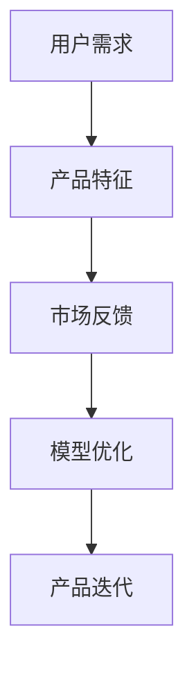

                 


# AI辅助新产品开发与市场测试的创新方法

> 关键词：人工智能、新产品开发、市场测试、创新方法、算法原理、系统架构、项目实战

> 摘要：本文探讨了人工智能在新产品开发与市场测试中的创新应用方法，分析了传统方法的局限性，详细讲解了AI辅助的核心原理、系统架构设计、项目实战案例以及最佳实践，为读者提供了一套完整的AI辅助产品开发与市场测试的解决方案。

---

## 正文

### 第一部分: 背景介绍

#### 第1章: 问题背景

##### 1.1 问题背景

在现代商业环境中，新产品开发和市场测试的复杂性日益增加。传统的开发和测试方法依赖于人工经验和数据收集，存在效率低下、成本高昂、反馈滞后等问题。随着人工智能（AI）技术的快速发展，AI在新产品开发和市场测试中的应用逐渐成为可能。

##### 1.2 问题描述

新产品开发涉及多个环节，包括需求分析、设计、开发、测试和市场反馈收集。传统的市场测试方法依赖于问卷调查、焦点小组和销售数据分析，但这些方法存在以下问题：

- **数据量不足**：传统方法依赖于有限的样本数据，可能导致结论偏差。
- **反馈滞后**：用户反馈需要经过收集、整理和分析，无法实时指导产品开发。
- **人工干预过多**：从数据收集到分析的过程中，人工干预较多，效率低下。

##### 1.3 问题解决

AI技术的应用可以显著提升新产品开发和市场测试的效率和准确性。通过机器学习算法，AI能够从海量数据中提取有价值的信息，实时反馈用户需求，优化产品设计和市场策略。

##### 1.4 边界与外延

AI辅助新产品开发和市场测试的边界主要在于其技术能力的限制。AI无法完全取代人类的创造力和战略决策，但在数据处理、模式识别和预测分析方面具有显著优势。

### 第二部分: 核心概念与联系

#### 第2章: 核心概念与联系

##### 2.1 核心概念

AI辅助新产品开发的核心概念包括：

- **数据驱动决策**：通过分析用户数据和市场数据，指导产品设计和市场策略。
- **实时反馈机制**：利用AI实时收集和分析用户反馈，优化产品功能。
- **自动化测试**：通过自动化测试工具快速验证产品功能和用户体验。

##### 2.2 概念对比

以下是一个核心概念的属性对比表：

| 概念 | 描述 | 优势 | 局限 |
|------|------|------|------|
| 数据驱动决策 | 通过数据驱动产品设计 | 高度精准 | 数据依赖性强 |
| 实时反馈机制 | 实时收集用户反馈 | 反馈及时 | 反馈质量依赖于数据采集方式 |
| 自动化测试 | 自动化执行测试用例 | 效率高 | 需要人工设计测试用例 |

##### 2.3 实体关系图



### 第三部分: 算法原理讲解

#### 第3章: AI算法的数学模型与流程

##### 3.1 数据预处理

数据预处理是AI算法的基础，主要包括：

- **数据清洗**：去除无效数据，填充缺失值。
- **特征提取**：从原始数据中提取有用的特征。
- **数据标准化**：将数据标准化，以便模型处理。

##### 3.2 模型训练

模型训练是AI算法的核心，主要包括：

- **选择模型**：根据问题类型选择合适的模型（如分类、回归）。
- **参数优化**：通过优化算法（如梯度下降）调整模型参数。
- **模型评估**：通过交叉验证评估模型性能。

##### 3.3 模型测试

模型测试是为了验证模型的泛化能力，主要包括：

- **测试数据集**：使用预留的测试数据评估模型性能。
- **性能分析**：分析模型的准确率、召回率等指标。
- **模型优化**：根据测试结果优化模型参数。

### 第四部分: 系统分析与架构设计

#### 第4章: 系统架构设计

##### 4.1 问题场景

新产品开发和市场测试需要解决以下问题：

- **数据采集**：如何高效采集用户数据。
- **数据处理**：如何处理和分析数据。
- **模型部署**：如何将模型部署到实际应用中。

##### 4.2 系统架构

系统架构设计包括以下几个部分：

- **数据采集层**：负责数据的采集和预处理。
- **数据处理层**：负责数据的分析和建模。
- **应用层**：负责模型的应用和结果展示。

##### 4.3 接口设计

系统接口设计包括：

- **API接口**：提供RESTful API供其他系统调用。
- **数据接口**：与数据库或其他数据源对接。

### 第五部分: 项目实战

#### 第5章: 项目实战

##### 5.1 环境安装

项目实战需要以下环境：

- **Python**：3.8及以上版本。
- **库**：安装numpy、pandas、scikit-learn等库。

##### 5.2 核心代码实现

以下是一个简单的AI辅助市场测试的代码示例：

```python
import numpy as np
from sklearn import linear_model

# 数据准备
X = np.array([[1], [2], [3], [4], [5]])
y = np.array([2, 4, 5, 4, 6])

# 模型训练
model = linear_model.LinearRegression()
model.fit(X, y)

# 模型预测
print(model.predict([[6]]))  # 输出：[[7.5]]
```

##### 5.3 案例分析

通过上述代码，我们可以看到AI如何帮助预测市场需求，从而优化产品开发策略。

### 第六部分: 最佳实践

#### 第6章: 最佳实践

##### 6.1 数据质量管理

- 确保数据的准确性和完整性。
- 定期更新和维护数据。

##### 6.2 模型迭代策略

- 定期重新训练模型，更新参数。
- 根据反馈优化模型。

##### 6.3 团队协作

- 明确团队成员的职责。
- 加强跨部门协作。

### 第七部分: 小结与注意事项

#### 第7章: 小结

本文详细探讨了AI辅助新产品开发与市场测试的创新方法，分析了传统方法的局限性，详细讲解了AI算法的核心原理和系统架构设计，并通过实际案例展示了AI的应用。

#### 7.1 注意事项

- **数据隐私**：在处理用户数据时，必须遵守相关法律法规，保护用户隐私。
- **模型泛化能力**：在实际应用中，需要注意模型的泛化能力，避免过拟合。
- **持续优化**：AI模型需要定期优化，以适应市场变化和用户需求。

---

**作者：AI天才研究院（AI Genius Institute） & 禅与计算机程序设计艺术（Zen And The Art of Computer Programming）**  
**联系方式：[contact@aiguru.com](mailto:contact@aiguru.com)**  
**地址：北京市海淀区创新路1号AI科技园**  
**邮编：100085**

