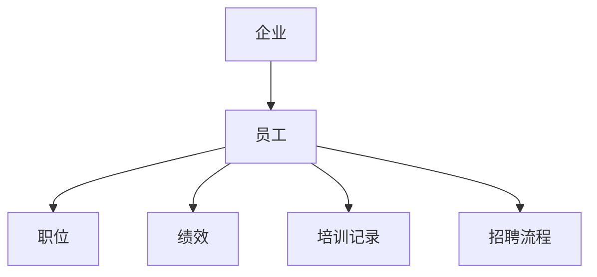
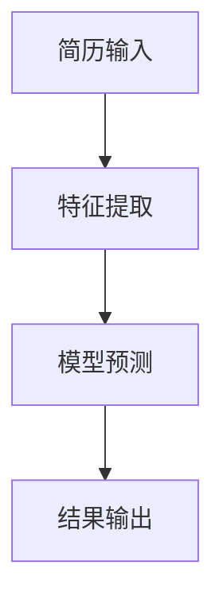
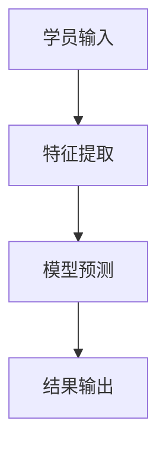
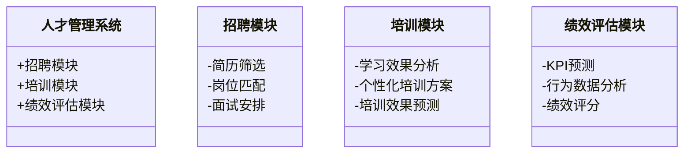
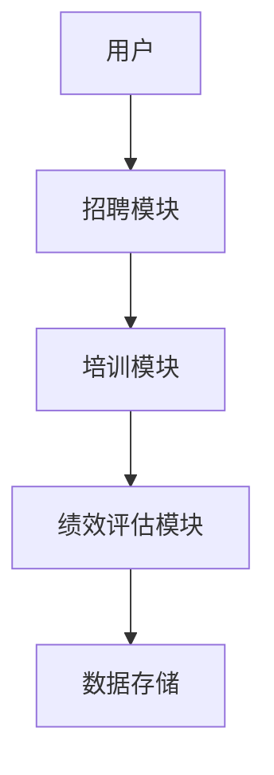

                 


# AI驱动的企业人才管理：招聘、培训到绩效评估

> 关键词：AI，人才管理，招聘，培训，绩效评估，算法，系统架构

> 摘要：本文详细探讨了人工智能技术如何驱动企业人才管理的各个关键环节，包括招聘、培训和绩效评估。通过分析AI在这些环节中的应用，揭示其如何提升企业的人才管理效率和效果，为企业构建智能化的人才管理体系提供理论支持和实践指导。

---

## 第一部分: AI驱动的企业人才管理背景与概念

### 第1章: AI驱动的企业人才管理概述

#### 1.1 企业人才管理的背景与挑战

企业人才管理是企业管理的核心之一，直接关系到企业的竞争力和发展潜力。传统的 talent management 方式依赖于人工经验，存在效率低、主观性强、数据孤岛等问题。随着人工智能技术的快速发展，企业开始尝试将AI技术融入人才管理的各个环节，以解决以下痛点：

- **招聘效率低**：传统招聘流程依赖人工筛选简历，耗时长且容易遗漏优秀候选人。
- **培训效果难衡量**：难以量化培训的效果，难以制定个性化的培训计划。
- **绩效评估主观**：绩效评估往往受到主观因素影响，缺乏客观依据。

AI技术的应用为企业人才管理带来了新的可能性，通过数据驱动的决策模型和智能化算法，可以提高招聘效率、优化培训方案、提升绩效评估的客观性。

#### 1.2 AI如何解决企业人才管理问题

AI技术可以通过以下方式解决企业人才管理中的问题：

- **智能化简历筛选**：利用自然语言处理技术对简历进行关键词提取和匹配，快速筛选出合适的候选人。
- **个性化培训方案**：通过机器学习分析员工的学习曲线和能力缺口，制定个性化的培训计划。
- **数据驱动的绩效评估**：利用数据分析技术，结合KPI和行为数据，提供更客观的绩效评估结果。

#### 1.3 企业人才管理的数字化转型

数字化转型是企业适应现代商业环境的必经之路，AI技术在其中扮演了关键角色。通过数字化工具和AI算法，企业可以实现人才管理的自动化、智能化和数据化。

---

### 第2章: AI驱动人才管理的核心概念与联系

#### 2.1 核心概念原理

AI驱动的人才管理是一个复杂的系统工程，涉及多个环节和模块。其核心概念包括：

- **数据驱动的决策模型**：通过收集和分析员工数据，构建数据驱动的决策模型，用于招聘、培训和绩效评估。
- **AI算法的应用**：利用机器学习、自然语言处理等AI算法，对人才数据进行分析和预测。
- **闭环系统**：通过数据反馈和持续优化，构建人才管理的闭环系统，不断提升管理效率。

#### 2.2 核心概念属性特征对比表

以下是人才管理中关键环节的核心概念对比：

| **环节**       | **招聘**            | **培训**            | **绩效评估**        |
|----------------|---------------------|---------------------|--------------------|
| **核心目标**   | 找到合适候选人      | 提升员工能力        | 评估员工表现        |
| **AI应用场景** | 简历筛选、岗位匹配  | 学习效果预测、个性化建议 | KPI预测、行为分析   |
| **数据输入**   | 简历、职位描述      | 学习记录、能力测试  | KPI数据、行为数据   |
| **输出结果**   | 筛选结果、推荐名单  | 培训计划、效果报告  | 绩效评分、改进建议   |

#### 2.3 ER实体关系图

以下是人才管理系统的ER实体关系图：



---

## 第二部分: AI驱动人才管理的算法原理

### 第3章: AI驱动招聘的算法原理

#### 3.1 招聘流程中的AI算法

AI在招聘中的应用主要体现在以下几个方面：

- **简历筛选模型**：利用自然语言处理技术对简历进行关键词提取和语义分析，快速筛选出符合条件的候选人。
- **面试评分预测**：通过机器学习模型预测候选人面试表现，帮助 HR 更快地做出决策。
- **岗位匹配度计算**：基于职位描述和候选人简历，计算岗位匹配度，推荐最适合的候选人。

#### 3.2 算法流程图

以下是招聘流程中的AI算法流程图：



#### 3.3 模型数学公式

以下是简历筛选模型的数学公式：

- **特征权重计算**：
  $$ w_i = \alpha \cdot x_i + \beta \cdot y_i $$
  
  其中，$\alpha$ 和 $\beta$ 是特征权重系数，$x_i$ 和 $y_i$ 是简历中的特征值。

- **模型预测公式**：
  $$ P = \sum_{i=1}^{n} w_i \cdot f_i $$
  
  其中，$P$ 是预测值，$w_i$ 是特征权重，$f_i$ 是特征值。

---

### 第4章: AI驱动培训的算法原理

#### 4.1 培训效果预测模型

AI在培训中的应用主要体现在以下几个方面：

- **学员特征分析**：通过分析学员的学习历史和能力测试结果，预测学员的学习效果。
- **个性化培训方案**：基于学员的学习曲线和能力缺口，制定个性化的培训计划。
- **学习效果预测**：通过机器学习模型预测学员的学习效果，优化培训资源的分配。

#### 4.2 算法流程图

以下是培训效果预测模型的算法流程图：



#### 4.3 模型数学公式

以下是培训效果预测模型的数学公式：

- **学习效果预测公式**：
  $$ P = \theta \cdot x + \beta \cdot y $$
  
  其中，$\theta$ 和 $\beta$ 是模型参数，$x$ 和 $y$ 是学员的特征值。

---

## 第三部分: AI驱动人才管理的系统架构

### 第5章: 系统架构设计

#### 5.1 问题场景介绍

AI驱动的人才管理系统需要解决以下问题：

- 如何高效地处理大量的招聘数据？
- 如何实时分析员工的培训效果？
- 如何准确评估员工的绩效表现？

#### 5.2 项目介绍

本项目旨在构建一个基于AI的人才管理系统，涵盖招聘、培训和绩效评估三个核心环节。系统采用模块化设计，各模块之间通过接口进行数据交互。

#### 5.3 系统功能设计

以下是系统的功能模块设计：



#### 5.4 系统架构设计

以下是系统的架构设计：



---

## 第四部分: 项目实战

### 第6章: 项目实战

#### 6.1 环境安装

以下是项目实战所需的环境安装步骤：

1. 安装Python和相关库（如scikit-learn、numpy、pandas）。
2. 安装Jupyter Notebook用于代码实现和数据分析。
3. 安装Mermaid CLI用于生成图表。

#### 6.2 系统核心实现源代码

以下是招聘模块的代码实现：

```python
import pandas as pd
from sklearn.feature_extraction.text import TfidfVectorizer
from sklearn.metrics.pairwise import cosine_similarity

# 加载数据
data = pd.read_csv('resumes.csv')

# 特征提取
vectorizer = TfidfVectorizer()
tfidf_matrix = vectorizer.fit_transform(data['resume'])

# 计算相似度
cosine_sim = cosine_similarity(tfidf_matrix)
```

#### 6.3 代码应用解读与分析

上述代码实现了简历的特征提取和相似度计算。通过TF-IDF方法提取简历关键词，计算简历之间的相似度，从而实现简历筛选和岗位匹配。

---

## 第五部分: 最佳实践与小结

### 第7章: 最佳实践与小结

#### 7.1 最佳实践

在实际应用中，建议企业采取以下措施：

- **数据质量**：确保数据的完整性和准确性，避免数据偏差。
- **模型优化**：定期更新模型参数，提升算法的预测精度。
- **员工隐私**：在使用AI技术时，注意保护员工隐私，遵守相关法律法规。

#### 7.2 小结

AI技术为企业人才管理的各个环节带来了显著的提升。通过智能化的招聘流程、个性化的培训方案和数据驱动的绩效评估，企业可以更好地管理员工，提升整体竞争力。

---

## 结语

AI驱动的企业人才管理是一个复杂而系统的工程，涉及多个技术领域和实际应用场景。通过本文的分析，读者可以深入了解AI在人才管理中的应用，掌握相关的算法原理和系统架构设计。希望本文能为企业的数字化转型和智能化管理提供有价值的参考。

---

**作者：AI天才研究院 / AI Genius Institute & 禅与计算机程序设计艺术 / Zen And The Art of Computer Programming**

