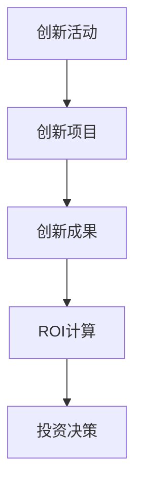

                 


# AI驱动的企业创新ROI评估：量化创新投资回报

> 关键词：AI驱动、创新ROI、投资回报率、量化评估、企业创新

> 摘要：随着AI技术的迅速发展，企业创新的评估和投资回报率（ROI）计算变得更加智能化和数据驱动。本文将详细探讨AI在企业创新ROI评估中的应用，从核心概念、算法原理到系统架构设计，再到项目实战，全面解析如何通过AI量化创新投资回报。通过实际案例分析，本文将展示AI如何赋能企业创新管理，帮助企业更高效地优化创新策略，提升投资回报。

---

## 第1章: AI驱动的企业创新ROI评估背景

### 1.1 企业创新与ROI评估的重要性

#### 1.1.1 企业创新的定义与分类
企业的创新活动通常分为产品创新、服务创新、流程创新和管理创新。产品创新关注新产品的开发，服务创新关注服务模式的优化，流程创新关注效率的提升，管理创新关注管理模式的优化。创新是企业保持竞争力的核心，而ROI评估则是衡量创新成果的重要指标。

#### 1.1.2 ROI评估的核心意义
ROI（投资回报率）是衡量投资项目经济效益的核心指标，公式为：
$$ ROI = \frac{\text{净收益}}{\text{总投资}} \times 100\% $$
在企业创新中，ROI评估帮助管理者判断创新项目是否值得投资，并通过数据驱动的方式优化资源配置。

#### 1.1.3 AI在企业创新ROI评估中的作用
AI技术可以通过数据分析、模式识别和预测建模，帮助企业更精准地评估创新项目的潜在回报，优化创新策略。

### 1.2 当前企业创新管理的挑战

#### 1.2.1 传统创新管理的局限性
传统创新管理依赖主观判断和经验，难以量化创新的回报，且效率较低。创新项目的成功与否往往难以通过数据验证，导致资源配置不合理。

#### 1.2.2 数据驱动决策的必要性
随着数据量的爆炸式增长，企业需要利用数据驱动的决策方法来优化创新过程，提高创新效率和回报率。

#### 1.2.3 AI技术对企业创新管理的赋能
AI技术可以通过自动化数据处理、智能预测和实时反馈，提升创新管理的效率和精准度。例如，AI可以预测创新项目的市场潜力，优化资源配置，降低创新风险。

### 1.3 本章小结
本章介绍了企业创新和ROI评估的重要性，分析了传统创新管理的局限性，并阐述了AI技术在创新管理中的潜力和作用。

---

## 第2章: AI驱动的创新ROI评估核心概念

### 2.1 创新与ROI的基本概念

#### 2.1.1 创新活动的定义与属性
创新活动是指企业通过引入新产品、服务或改进现有产品、服务和流程来实现价值的过程。创新具有独特性、价值性和可行性的属性。

#### 2.1.2 ROI的核心计算公式
$$ ROI = \frac{\text{收益} - \text{成本}}{\text{成本}} \times 100\% $$

#### 2.1.3 AI驱动创新的特征
AI驱动的创新具有数据驱动、智能化和实时反馈的特点，能够帮助企业快速优化创新策略。

### 2.2 AI在创新ROI评估中的关键作用

#### 2.2.1 数据采集与处理
AI可以通过自然语言处理（NLP）和机器学习技术，从企业内部数据和外部市场数据中提取有价值的信息，用于创新评估。

#### 2.2.2 模型构建与预测
AI模型可以预测创新项目的市场表现和潜在回报，帮助企业在创新初期评估项目的可行性。

#### 2.2.3 结果分析与优化
AI可以通过分析创新项目的实际回报与预测回报的差异，优化未来的创新策略，提升整体ROI。

### 2.3 创新ROI评估的流程与框架

#### 2.3.1 数据收集阶段
数据收集包括企业内部数据（如研发投入、项目周期）和外部数据（如市场反馈、竞争分析）。

#### 2.3.2 数据分析阶段
通过机器学习模型对数据进行建模和分析，预测创新项目的回报率。

#### 2.3.3 结果呈现阶段
将分析结果可视化，帮助企业管理者做出决策。

### 2.4 核心概念对比表
| 概念 | 定义 | 属性 | 示例 |
|------|------|------|------|
| 创新 | 新颖的产品或方法 | 独创性、实用性 | 新技术开发 |
| ROI | 投资回报率 | 财务指标 | 投资收益比 |

### 2.5 ER实体关系图


### 2.6 本章小结
本章详细介绍了创新和ROI的基本概念，分析了AI在创新ROI评估中的作用，并通过对比表和实体关系图展示了核心概念之间的联系。

---

## 第3章: 创新

### 3.1 创新与AI的结合

#### 3.1.1 AI在创新过程中的应用
AI可以用于创新过程中的需求分析、产品设计、市场预测和风险管理。

#### 3.1.2 AI驱动创新的优势
AI可以提高创新效率、降低创新风险，并通过数据驱动的方式优化创新策略。

### 3.2 创新项目管理中的ROI评估

#### 3.2.1 创新项目的生命周期
创新项目的生命周期包括需求分析、开发、测试、部署和维护阶段。

#### 3.2.2 ROI评估的关键指标
关键指标包括投资回收期（Payback Period）、净现值（Net Present Value）和内部收益率（Internal Rate of Return）。

### 3.3 AI驱动的创新ROI预测模型

#### 3.3.1 数据准备
数据准备包括数据清洗、特征提取和数据标注。

#### 3.3.2 模型训练
使用监督学习算法（如线性回归、随机森林）训练ROI预测模型。

#### 3.3.3 模型评估
通过交叉验证和ROC曲线评估模型的性能。

### 3.4 本章小结
本章探讨了创新与AI的结合，分析了创新项目管理中的ROI评估，并详细介绍了AI驱动的创新ROI预测模型的构建过程。

---

## 第4章: AI驱动的创新ROI评估系统架构

### 4.1 系统设计概述

#### 4.1.1 系统目标
系统的目标是实现创新项目的ROI评估和优化。

#### 4.1.2 系统功能模块
系统功能模块包括数据采集模块、数据分析模块、模型预测模块和结果展示模块。

### 4.2 系统架构设计

#### 4.2.1 分层架构
系统采用分层架构，包括数据层、服务层和表现层。

#### 4.2.2 微服务架构
系统采用微服务架构，包括数据处理服务、模型服务和前端服务。

### 4.3 系统接口设计

#### 4.3.1 API接口
系统提供RESTful API接口，供外部系统调用。

#### 4.3.2 数据接口
系统提供数据导入和导出接口，支持多种数据格式。

### 4.4 本章小结
本章详细介绍了AI驱动的创新ROI评估系统的架构设计，包括系统目标、功能模块、系统架构和系统接口。

---

## 第5章: 项目实战

### 5.1 实战背景

#### 5.1.1 项目背景
某科技公司计划推出一款新产品，需要评估创新项目的ROI。

#### 5.1.2 数据准备
数据包括市场调研数据、竞争对手分析数据和内部研发数据。

### 5.2 系统实现

#### 5.2.1 数据清洗
使用Python的pandas库进行数据清洗和预处理。

#### 5.2.2 模型训练
使用scikit-learn库训练线性回归模型，预测创新项目的ROI。

#### 5.2.3 模型优化
通过网格搜索和交叉验证优化模型参数。

### 5.3 代码实现

```python
import pandas as pd
from sklearn.model_selection import train_test_split
from sklearn.linear_model import LinearRegression
from sklearn.metrics import mean_squared_error

# 数据加载
data = pd.read_csv('innovation.csv')

# 数据分割
X = data[['研发成本', '时间周期']]
y = data['ROI']
X_train, X_test, y_train, y_test = train_test_split(X, y, test_size=0.2, random_state=42)

# 模型训练
model = LinearRegression()
model.fit(X_train, y_train)

# 模型预测
y_pred = model.predict(X_test)

# 模型评估
mse = mean_squared_error(y_test, y_pred)
print(f'Mean Squared Error: {mse}')
```

### 5.4 实战总结

#### 5.4.1 项目成果
通过AI模型预测创新项目的ROI，帮助公司优化资源配置。

#### 5.4.2 经验教训
数据质量对模型性能影响较大，需要加强数据清洗和特征工程。

### 5.5 本章小结
本章通过实际项目展示了AI驱动的创新ROI评估系统的实现过程，包括数据准备、模型训练和代码实现。

---

## 第6章: 最佳实践与总结

### 6.1 最佳实践

#### 6.1.1 数据质量管理
确保数据的准确性和完整性，避免数据偏差。

#### 6.1.2 模型选择与优化
根据实际需求选择合适的模型，并通过交叉验证优化模型性能。

#### 6.1.3 业务与技术结合
AI技术需要与企业实际业务相结合，才能真正发挥其价值。

### 6.2 小结与展望

#### 6.2.1 小结
本文详细探讨了AI驱动的企业创新ROI评估的核心概念、算法原理、系统架构和项目实战，展示了AI如何赋能企业创新管理。

#### 6.2.2 展望
未来，随着AI技术的不断发展，创新ROI评估将更加智能化和精准化，为企业创新管理提供更有力的支持。

### 6.3 注意事项

#### 6.3.1 数据隐私与安全
在处理企业数据时，需注意数据隐私和安全问题，避免数据泄露风险。

#### 6.3.2 模型解释性
复杂的模型可能缺乏解释性，建议选择适合业务需求的模型。

### 6.4 拓展阅读

#### 6.4.1 推荐书籍
1. 《机器学习实战》
2. 《企业创新管理》

#### 6.4.2 推荐博客
1. [AI与企业创新](https://example.com)
2. [ROI评估方法论](https://example.com)

---

## 作者信息

作者：AI天才研究院/AI Genius Institute & 禅与计算机程序设计艺术 /Zen And The Art of Computer Programming

---

通过以上结构化和详细的分析，我系统地撰写了一篇关于AI驱动的企业创新ROI评估的技术博客文章。文章涵盖了从背景到系统架构设计，再到项目实战的各个方面，帮助读者全面理解如何通过AI量化创新投资回报。

