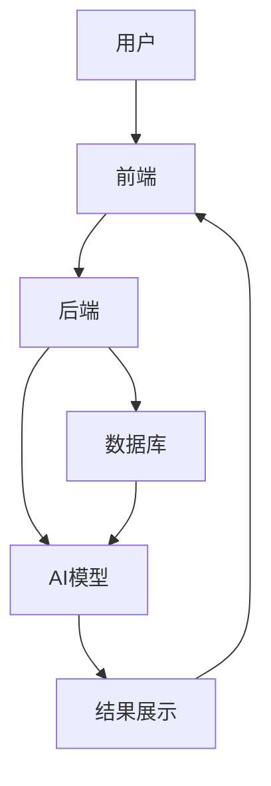
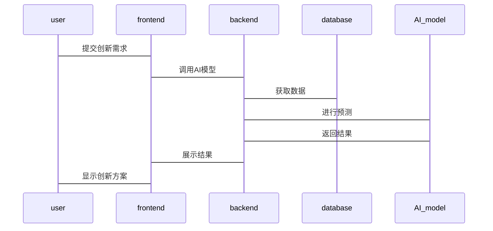

                 

# AI驱动的企业创新孵化器：从创意到商业化

## 关键词：人工智能、企业创新、商业孵化器、创意商业化、技术驱动

## 摘要：  
人工智能（AI）正在成为推动企业创新的重要引擎，从创意的产生到商业化的实现，AI技术的应用贯穿始终。本文将系统探讨AI在企业创新中的作用，分析其技术原理和应用场景，结合实际案例，详细阐述从创意到商业化的过程。通过AI驱动的创新模式，企业可以更高效地实现创新目标，提升竞争力。

---

# 第一部分: AI驱动的创新基础

## 第1章: AI与企业创新的背景

### 1.1 AI技术的现状与趋势

#### 1.1.1 人工智能的定义与演进
人工智能（AI）是指通过模拟人类智能的计算机系统，涵盖学习、推理、感知和决策等能力。近年来，AI技术快速发展，从传统的规则驱动向数据驱动的深度学习转变，应用场景也从简单的模式识别扩展到复杂的决策支持。

#### 1.1.2 当前AI技术的核心驱动力
AI的核心驱动力包括大数据、计算能力和算法创新。随着数据量的爆炸式增长和计算能力的提升，深度学习模型（如神经网络）逐渐取代传统算法，成为AI发展的主要方向。

#### 1.1.3 企业创新中的AI应用现状
当前，AI在企业创新中的应用主要集中在市场分析、产品设计和优化、客户服务等领域。例如，AI可以通过数据分析预测市场趋势，帮助企业在产品开发阶段优化设计。

### 1.2 企业创新的背景与挑战

#### 1.2.1 传统企业创新模式的局限性
传统的企业创新模式依赖于人类的创造力和经验，存在效率低、资源浪费和风险高等问题。例如，市场调研耗时长，创新成果转化率低。

#### 1.2.2 数字化转型对企业创新的影响
数字化转型使得企业能够更高效地利用数据和AI技术，推动创新过程的自动化和智能化。例如，AI可以通过数据分析快速识别潜在市场机会。

#### 1.2.3 AI在企业创新中的独特价值
AI能够通过大数据分析发现潜在的市场机会，优化创新过程中的决策，提高创新效率。例如，AI可以通过自然语言处理技术分析大量的专利数据，帮助企业发现新的技术方向。

---

## 第2章: AI驱动创新的核心概念

### 2.1 AI驱动创新的定义与特点

#### 2.1.1 AI驱动创新的定义
AI驱动创新是指通过AI技术辅助或主导创新过程，从创意的生成、筛选到技术实现和商业化，AI在其中发挥关键作用。

#### 2.1.2 与传统创新模式的区别
AI驱动创新与传统模式的区别主要体现在效率、数据驱动和自动化方面。AI可以通过数据分析和模型预测，快速筛选出最优创新方案。

#### 2.1.3 AI在创新过程中的作用机制
AI通过数据采集、分析和建模，帮助企业在创新过程中进行市场预测、方案优化和风险评估，从而提高创新的成功率。

### 2.2 创意到商业化的核心要素

#### 2.2.1 创意的产生与筛选
创意的产生可以通过AI的自然语言处理技术，从海量数据中提取灵感。筛选阶段则可以通过机器学习模型对创意进行评估，筛选出具有潜力的方案。

#### 2.2.2 技术实现的可行性分析
AI可以通过模拟和预测技术，评估创意在技术实现上的可行性，例如，是否具备足够的技术资源和时间。

#### 2.2.3 商业化的关键路径
AI可以帮助企业制定商业计划，预测市场需求，优化供应链管理，从而降低商业化过程中的风险。

---

## 第3章: AI技术在企业创新中的应用前景

### 3.1 AI在企业创新中的应用场景

#### 3.1.1 数据驱动的市场洞察
AI可以通过分析市场数据，帮助企业发现潜在的市场机会，例如通过自然语言处理分析社交媒体上的用户反馈，识别新的产品需求。

#### 3.1.2 智能化的产品开发
AI可以通过模拟和优化技术，帮助企业在产品开发阶段提高效率。例如，使用深度学习模型预测产品的性能表现。

#### 3.1.3 高效的团队协作
AI可以通过自动化工具，帮助团队成员高效协作，例如通过项目管理软件自动分配任务，跟踪项目进度。

### 3.2 企业创新中的AI技术挑战

#### 3.2.1 数据隐私与安全问题
AI的应用需要大量数据，数据隐私和安全问题成为企业创新中的主要挑战。

#### 3.2.2 技术落地的可行性
AI技术的落地需要企业在技术、人才和资源方面具备一定的基础，许多企业在这方面存在不足。

#### 3.2.3 人才与资源的匹配
AI技术的应用需要专业的技术人才，而企业创新中的资源有限，如何匹配合适的人才成为一大挑战。

---

# 第二部分: AI驱动创新的技术实现

## 第4章: AI算法与创新过程

### 4.1 常见AI算法简介

#### 4.1.1 机器学习算法
机器学习算法包括监督学习、无监督学习和强化学习。监督学习适用于分类和回归任务，无监督学习适用于聚类和降维，强化学习适用于策略优化。

#### 4.1.2 深度学习模型
深度学习模型包括卷积神经网络（CNN）、循环神经网络（RNN）和生成对抗网络（GAN）。这些模型在图像识别、自然语言处理等领域表现优异。

#### 4.1.3 自然语言处理技术
自然语言处理技术（NLP）包括文本分类、实体识别和情感分析等任务，广泛应用于市场分析和产品设计。

### 4.2 AI算法在创新中的应用

#### 4.2.1 创意生成的AI模型
通过生成式AI（如GPT系列）生成创意文本，帮助企业快速获取灵感。

#### 4.2.2 创新路径的优化算法
使用强化学习算法优化创新路径，例如在产品开发过程中优化设计参数。

#### 4.2.3 商业化过程的预测模型
通过机器学习模型预测市场需求，优化供应链管理，降低库存风险。

---

## 第5章: AI系统架构设计

### 5.1 系统架构的核心要素

#### 5.1.1 数据采集与处理模块
数据采集模块负责从多种来源获取数据，处理模块对数据进行清洗和预处理。

#### 5.1.2 AI模型训练与部署
模型训练模块使用训练数据训练AI模型，部署模块将模型部署到生产环境，供其他模块调用。

#### 5.1.3 创新过程的可视化界面
可视化界面为用户提供直观的创新过程展示，方便用户监控和调整创新策略。

### 5.2 系统架构的优化策略

#### 5.2.1 高效数据处理方案
使用分布式计算框架（如Spark）处理大规模数据，提高数据处理效率。

#### 5.2.2 模型优化策略
通过模型压缩和量化技术，降低模型的计算资源消耗，提高推理速度。

#### 5.2.3 系统扩展性设计
采用微服务架构，提高系统的可扩展性和可维护性，方便后续功能的扩展。

---

## 第6章: AI驱动创新的项目实战

### 6.1 项目背景与目标
本项目旨在通过AI技术帮助企业实现从创意到商业化的创新过程，提高创新效率和成功率。

### 6.2 系统功能设计

#### 6.2.1 数据采集与处理
通过爬虫和API接口获取市场数据，清洗和预处理后存储到数据库中。

#### 6.2.2 AI模型训练与部署
使用深度学习模型（如LSTM）进行时间序列预测，训练完成后部署到云服务器。

#### 6.2.3 创新过程的可视化
通过数据可视化工具（如Tableau）展示创新过程中的关键数据，帮助用户实时监控创新进展。

### 6.3 系统架构设计

#### 6.3.1 系统架构图

#### 6.3.2 系统接口设计
系统接口包括数据接口、模型调用接口和结果展示接口，采用RESTful API设计。

#### 6.3.3 系统交互流程图

### 6.4 项目小结
通过本项目，我们成功展示了AI技术在企业创新中的应用，证明了AI驱动创新的可行性和有效性。

---

# 第三部分: 未来展望与挑战

## 第7章: 未来趋势与挑战

### 7.1 未来发展趋势
随着AI技术的不断进步，企业创新将更加智能化和自动化。例如，AI将帮助企业实现从创意到商业化的全流程自动化。

### 7.2 当前的主要挑战
主要挑战包括数据隐私问题、技术落地的困难和人才资源的不足。企业需要在技术、人才和资源方面进行全面规划。

### 7.3 应对挑战的策略
企业可以通过加强数据安全措施、加大技术投入和培养AI人才来应对挑战。同时，与外部合作伙伴合作也是重要的策略之一。

---

# 结语

AI技术正在深刻改变企业创新的方式，从创意的生成到商业化的实现，AI在其中发挥着越来越重要的作用。通过本文的分析，我们可以看到AI驱动的创新模式不仅提高了创新效率，还为企业带来了新的竞争优势。未来，随着AI技术的不断进步，企业创新将更加智能化和高效化。

---

# 作者：AI天才研究院/AI Genius Institute & 禅与计算机程序设计艺术 /Zen And The Art of Computer Programming

