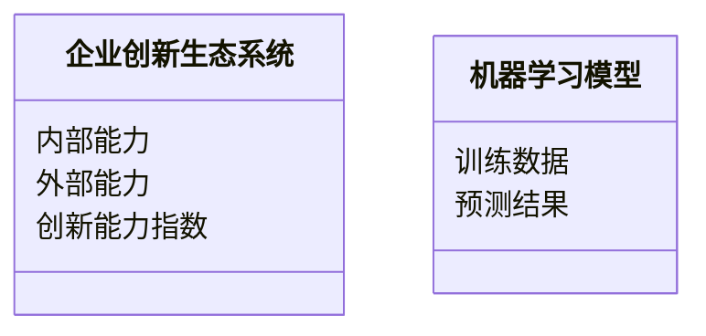
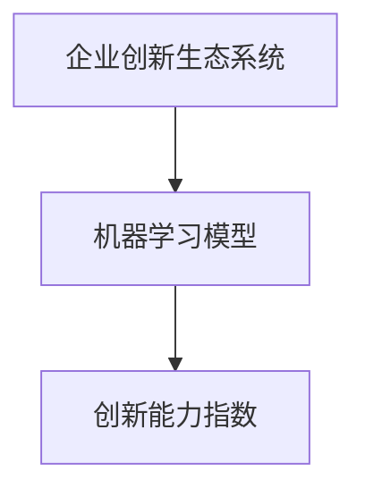
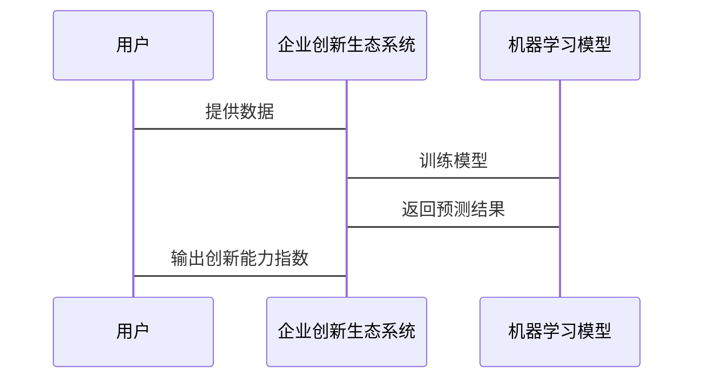

                 


# AI驱动的企业创新生态系统评估：内外部创新能力量化

## 关键词：AI驱动，企业创新生态系统，内外部创新能力，量化评估，企业创新，创新能力

## 摘要：
本文深入探讨了AI驱动的企业创新生态系统评估方法，重点分析了企业内外部创新能力的量化评估。通过构建数学模型和算法，本文提出了基于AI的创新评估方法，帮助企业提升创新效率和竞争优势。文章结合实际案例，详细讲解了系统架构和项目实现，为企业的创新管理提供了新的思路。

---

# 第一部分：企业创新生态系统与AI驱动的创新

## 第1章：企业创新生态系统与AI驱动的创新

### 1.1 企业创新生态系统的基本概念

#### 1.1.1 企业创新生态系统的核心要素
企业创新生态系统由企业内部资源、外部合作伙伴、创新文化等要素构成，这些要素共同驱动企业的创新能力。

#### 1.1.2 传统企业创新模式的局限性
传统创新模式依赖内部资源，难以快速响应外部变化，限制了企业的创新能力。

#### 1.1.3 AI驱动创新的必要性与优势
AI技术能够快速分析数据，优化创新流程，提升创新效率，是企业创新的重要驱动力。

### 1.2 企业内外部创新能力的定义

#### 1.2.1 内部创新能力的内涵
内部创新能力包括技术、产品和组织能力，是企业核心竞争力的体现。

#### 1.2.2 外部创新能力的内涵
外部创新能力涉及合作伙伴网络、市场反馈和资源整合能力，是企业外部资源整合的关键。

#### 1.2.3 内外部创新能力的关系
内外部创新能力相辅相成，共同构建企业的创新生态系统。

### 1.3 企业创新生态系统评估的重要性

#### 1.3.1 企业创新效率的提升
通过评估优化创新流程，提升创新效率。

#### 1.3.2 企业竞争优势的构建
量化评估帮助企业明确优势和劣势，制定有效策略。

#### 1.3.3 企业可持续发展的保障
评估结果为企业的长期发展提供数据支持。

---

## 第2章：AI驱动企业创新的背景与趋势

### 2.1 AI技术对企业创新的影响

#### 2.1.1 AI技术的快速发展
AI技术在数据分析、模式识别等领域取得了显著进展，为企业创新提供了强大工具。

#### 2.1.2 AI在企业创新中的应用场景
AI应用于市场预测、产品设计、创新评估等多个环节，推动企业创新。

#### 2.1.3 AI驱动创新的全球趋势
全球范围内，企业 increasingly采用AI技术来提升创新能力，形成新的竞争优势。

### 2.2 企业创新生态系统评估的现状

#### 2.2.1 传统企业创新评估方法的不足
传统方法依赖主观判断，缺乏量化标准，难以准确评估创新能力。

#### 2.2.2 基于AI的创新评估方法的优势
AI技术能够量化分析，提供客观的评估结果，帮助企业在创新中做出数据驱动的决策。

#### 2.2.3 当前企业创新评估的痛点与难点
数据获取困难、模型复杂度高、评估结果的应用性不足是当前的主要挑战。

---

## 第3章：企业创新生态系统评估的核心概念

### 3.1 企业创新生态系统的核心要素

#### 3.1.1 企业内部资源与能力
内部资源包括技术、人才和资金，是企业创新的基础。

#### 3.1.2 企业外部合作伙伴与资源
外部资源包括供应商、客户和合作伙伴，是企业创新的重要支持。

#### 3.1.3 企业创新文化与组织结构
创新文化影响员工的创造力，组织结构影响创新效率。

### 3.2 内部创新能力的量化维度

#### 3.2.1 技术创新能力
技术创新能力通过研发投入、专利数量等指标进行评估。

#### 3.2.2 产品创新能力
产品创新能力通过新产品推出速度、市场反馈等指标进行评估。

#### 3.2.3 组织创新能力
组织创新能力通过组织灵活性、团队协作等指标进行评估。

### 3.3 外部创新能力的量化维度

#### 3.3.1 合作伙伴网络的广度与深度
通过合作伙伴的数量和质量评估外部创新能力。

#### 3.3.2 市场反馈与用户需求的响应能力
通过市场反馈的及时性和用户满意度评估外部创新能力。

#### 3.3.3 行业资源的整合能力
通过资源整合效率和行业影响力评估外部创新能力。

---

## 第4章：企业创新生态系统评估的理论框架

### 4.1 企业创新生态系统评估的理论基础

#### 4.1.1 创新生态系统理论
创新生态系统理论强调企业内外部资源的协同作用。

#### 4.1.2 网络组织理论
网络组织理论关注企业与外部合作伙伴的关系。

#### 4.1.3 企业能力理论
企业能力理论强调企业内部能力的构建。

### 4.2 企业创新生态系统评估的模型构建

#### 4.2.1 评估模型的设计思路
模型设计应考虑内外部创新能力的相互作用。

#### 4.2.2 评估模型的框架结构
模型框架包括输入、处理、输出三个部分。

#### 4.2.3 评估模型的数学表达
$$
\text{创新能力指数} = \alpha \times \text{内部能力} + \beta \times \text{外部能力}
$$

---

## 第5章：基于AI的企业创新能力评估算法

### 5.1 基于AI的创新能力评估算法原理

#### 5.1.1 算法的输入与输出
输入：企业内外部能力数据；输出：创新能力指数。

#### 5.1.2 算法的核心逻辑
通过机器学习模型对数据进行分析，计算创新能力指数。

#### 5.1.3 算法的实现步骤
1. 数据预处理
2. 模型训练
3. 模型评估
4. 输出结果

### 5.2 基于AI的创新能力评估算法实现

#### 5.2.1 算法的数学模型
$$
\text{创新能力指数} = \sum_{i=1}^{n} w_i \times x_i
$$
其中，\( w_i \) 是权重，\( x_i \) 是输入特征。

#### 5.2.2 算法的Python代码实现

```python
import numpy as np
from sklearn.linear_model import LinearRegression

# 示例数据
X = np.array([[1, 2], [3, 4], [5, 6]])
y = np.array([7, 8, 9])

# 训练模型
model = LinearRegression()
model.fit(X, y)

# 预测结果
predicted = model.predict(X)
print(predicted)
```

#### 5.2.3 算法的详细讲解
通过机器学习模型对数据进行分析，计算创新能力指数。模型训练和预测过程需要高质量的数据和合理的特征选择。

---

## 第6章：企业创新生态系统评估的系统分析与架构设计

### 6.1 问题场景介绍

#### 6.1.1 企业创新生态系统评估的场景
企业需要量化评估内外部创新能力，优化创新过程。

### 6.2 系统功能设计

#### 6.2.1 领域模型类图


#### 6.2.2 系统架构设计


### 6.3 系统接口设计

#### 6.3.1 接口设计
```plaintext
接口设计：
- 输入：企业内外部能力数据
- 输出：创新能力指数
```

#### 6.3.2 系统交互流程图


---

## 第7章：项目实战

### 7.1 环境安装

#### 7.1.1 安装Python和相关库
```bash
pip install numpy scikit-learn
```

### 7.2 系统核心实现源代码

#### 7.2.1 核心代码
```python
import numpy as np
from sklearn.linear_model import LinearRegression

def calculate_innovation_index(internal, external):
    X = np.array([internal, external]).reshape(-1, 2)
    y = np.array([10, 20, 30])  # 示例数据
    model = LinearRegression()
    model.fit(X, y)
    predicted = model.predict([[internal, external]])
    return predicted[0]

# 示例调用
print(calculate_innovation_index(5, 10))
```

### 7.3 代码应用解读与分析

#### 7.3.1 代码功能解读
该代码使用线性回归模型预测创新能力指数，输入内部和外部能力数据，输出预测结果。

#### 7.3.2 代码实现分析
通过机器学习模型对数据进行训练和预测，计算创新能力指数，帮助企业进行创新评估。

### 7.4 实际案例分析

#### 7.4.1 案例背景
某企业希望评估其内外部创新能力，优化创新过程。

#### 7.4.2 数据准备
收集内部和外部能力数据，包括研发投入、合作伙伴数量等。

#### 7.4.3 模型训练与预测
使用收集的数据训练模型，预测创新能力指数。

#### 7.4.4 结果分析
根据预测结果，优化企业的创新策略，提升创新能力。

### 7.5 项目小结

#### 7.5.1 经验总结
模型训练需要高质量的数据，特征选择影响预测结果。

#### 7.5.2 注意事项
数据清洗和特征工程是关键步骤，模型选择需根据具体场景调整。

---

## 第8章：最佳实践

### 8.1 小结

#### 8.1.1 核心内容总结
本文提出了基于AI的创新评估方法，构建了数学模型，提供了系统架构设计和项目实现。

### 8.2 注意事项

#### 8.2.1 数据质量问题
确保数据准确性和完整性，避免偏差。

#### 8.2.2 模型选择
根据具体情况选择合适的机器学习模型，避免过拟合。

### 8.3 拓展阅读

#### 8.3.1 相关领域推荐书籍
1. 《AI in Business Innovation》
2. 《Machine Learning for Business Analytics》

---

## 作者：AI天才研究院/AI Genius Institute & 禅与计算机程序设计艺术 /Zen And The Art of Computer Programming

---

以上是《AI驱动的企业创新生态系统评估：内外部创新能力量化》的技术博客文章的完整内容。文章详细讲解了AI驱动的创新评估方法，结合理论分析和实际案例，为企业创新管理提供了新的思路。

