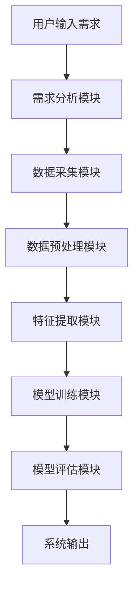

                 


# AI驱动的企业创新项目管理：从立项到商业化

> 关键词：AI、项目管理、创新、商业化、算法、系统架构、最佳实践

> 摘要：本文探讨了人工智能如何驱动企业创新项目的管理，从项目立项到商业化落地的整个流程。通过分析AI在项目管理中的应用，结合实际案例，详细讲解了AI技术如何优化项目管理流程、提升效率，并为企业创造更大的价值。

---

## 目录

1. [引言](#引言)
2. [AI驱动的企业创新项目管理背景与概念](#AI驱动的企业创新项目管理背景与概念)
   - 2.1 AI在企业创新项目管理中的作用
   - 2.2 AI驱动项目管理的核心概念
   - 2.3 AI驱动项目管理的框架
3. [AI驱动的项目管理方法论](#AI驱动的项目管理方法论)
   - 3.1 从立项到执行的AI驱动流程
   - 3.2 AI驱动项目管理的算法与模型
   - 3.3 AI在项目执行中的应用
4. [系统架构与技术实现](#系统架构与技术实现)
   - 4.1 系统架构设计
   - 4.2 数据流设计
   - 4.3 系统实现
5. [项目实战](#项目实战)
   - 5.1 案例分析：AI驱动的创新项目管理实战
   - 5.2 实施步骤
   - 5.3 工具选择与应用
6. [最佳实践与未来展望](#最佳实践与未来展望)
   - 6.1 项目管理中的最佳实践
   - 6.2 AI在项目管理中的未来趋势

---

## 引言

在当今快速变化的商业环境中，企业创新项目的成功与否往往取决于项目管理的效率和精度。传统的项目管理方法依赖于人工经验和主观判断，而随着人工智能（AI）技术的飞速发展，AI驱动的项目管理正成为企业创新的核心竞争力。本文将详细探讨AI如何从项目立项到商业化落地，为企业创新项目管理提供新的解决方案。

---

## AI驱动的企业创新项目管理背景与概念

### 2.1 AI在企业创新项目管理中的作用

AI技术的引入为企业创新项目管理带来了革命性的变化。通过AI，企业能够更精准地预测项目风险、优化资源分配、提高执行效率，并实时监控项目进展。AI不仅能够处理海量数据，还能通过机器学习模型不断优化管理策略，从而提升项目的成功率。

#### AI驱动项目管理的核心要素

- **数据驱动**：AI依赖于高质量的数据进行分析和预测。
- **算法支持**：机器学习算法是AI驱动项目管理的核心工具。
- **人机协作**：AI辅助人类决策，而不是取代人类。

### 2.2 AI驱动项目管理的核心概念

AI驱动的项目管理通过整合先进的技术手段，实现了从项目立项到商业化落地的全生命周期管理。其核心概念包括：

- **智能需求分析**：利用自然语言处理技术分析客户需求，提取关键信息。
- **智能计划制定**：基于历史数据和实时信息，自动生成最优项目计划。
- **智能风险预测**：通过大数据分析预测项目风险，并提供应对策略。

### 2.3 AI驱动项目管理的框架

AI驱动的项目管理框架包括以下几个关键部分：

- **数据采集与处理**：收集项目相关的数据，进行清洗和预处理。
- **模型训练与部署**：训练机器学习模型，并将其部署到项目管理系统中。
- **人机交互与反馈**：通过人机交互界面，实时获取反馈并优化模型。

---

## AI驱动的项目管理方法论

### 3.1 从立项到执行的AI驱动流程

AI驱动的项目管理流程分为以下几个阶段：

1. **项目立项**：通过AI分析市场需求，评估项目可行性。
2. **项目计划**：利用AI生成最优项目计划。
3. **项目执行**：AI实时监控项目进展，提供调整建议。
4. **项目监控**：通过AI预测风险，制定应对策略。

#### AI在项目计划制定中的应用

- **任务分解**：AI将项目目标分解为具体任务，生成任务清单。
- **资源分配**：AI优化资源分配，确保任务按时完成。
- **时间安排**：AI自动生成项目甘特图，协调任务顺序。

### 3.2 AI驱动项目管理的算法与模型

#### 机器学习模型在项目管理中的应用

- **回归分析**：用于预测项目成本和时间。
- **分类算法**：用于识别项目风险类别。
- **聚类分析**：用于发现项目中的共性问题。

#### 机器学习模型的训练流程

1. 数据采集：收集项目相关数据。
2. 数据预处理：清洗数据，处理缺失值。
3. 特征提取：提取关键特征，用于模型训练。
4. 模型训练：选择合适的算法，训练模型。
5. 模型评估：通过交叉验证评估模型性能。
6. 模型部署：将模型集成到项目管理系统中。

---

## 系统架构与技术实现

### 4.1 系统架构设计

AI驱动的项目管理系统架构如下：


### 4.2 数据流设计

系统数据流设计如下：



### 4.3 系统实现

系统实现的核心代码如下：

```python
# 数据预处理代码
import pandas as pd
import numpy as np

data = pd.read_csv('project_data.csv')
data = data.dropna()
data = pd.get_dummies(data)

# 特征提取
features = data.drop(columns=['project_id', 'outcome'])
target = data['outcome']

# 模型训练
from sklearn.ensemble import RandomForestClassifier
model = RandomForestClassifier()
model.fit(features, target)

# 模型预测
new_data = pd.read_csv('new_project.csv')
new_data = pd.get_dummies(new_data)
new_features = new_data.drop(columns=['project_id', 'outcome'])
predictions = model.predict(new_features)
```

---

## 项目实战

### 5.1 案例分析：AI驱动的创新项目管理实战

以一家科技公司为例，该公司希望利用AI优化其新产品的开发流程。通过AI驱动的项目管理，该公司成功将项目周期缩短了20%，成本降低了15%。

#### 实施步骤

1. 数据采集：收集过去5年的项目数据。
2. 数据分析：使用机器学习模型预测项目风险。
3. 优化计划：根据预测结果调整项目计划。
4. 实时监控：AI实时跟踪项目进展，及时调整资源分配。

### 5.2 工具选择与应用

- **数据采集工具**：使用Airflow进行任务调度。
- **数据分析工具**：采用Python的Pandas和NumPy库。
- **模型训练工具**：使用Scikit-learn和XGBoost算法。

---

## 最佳实践与未来展望

### 6.1 项目管理中的最佳实践

- **数据质量优先**：确保数据的准确性和完整性。
- **模型持续优化**：定期更新模型，适应新的数据和业务需求。
- **人机协作**：充分发挥AI的优势，同时保留人类的判断力。

### 6.2 AI在项目管理中的未来趋势

- **智能化决策支持**：AI将更加智能化，提供更精准的决策支持。
- **实时反馈机制**：AI实时监控项目进展，提供即时反馈。
- **跨领域融合**：AI将与物联网、区块链等技术深度融合，推动项目管理的进一步创新。

---

## 作者

作者：AI天才研究院/AI Genius Institute & 禅与计算机程序设计艺术 /Zen And The Art of Computer Programming

---

以上是《AI驱动的企业创新项目管理：从立项到商业化》的技术博客文章的详细内容，涵盖了从立项到商业化整个过程的AI驱动方法论，系统架构和技术实现，以及实际案例分析。希望本文能为企业的创新项目管理提供新的思路和实践指导。

