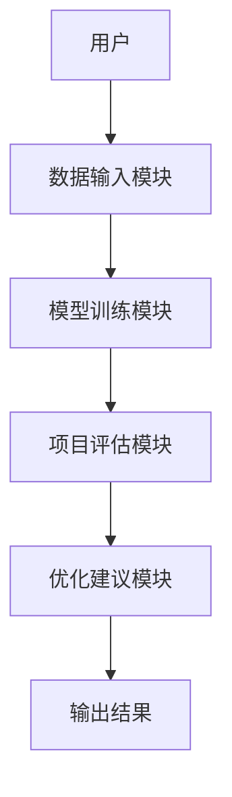
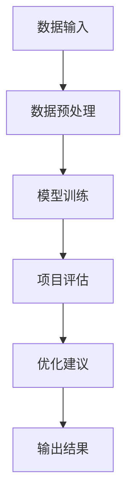
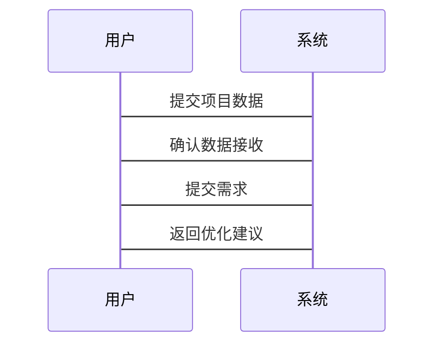

                 


# AI驱动的企业创新项目组合管理

> 关键词：AI、项目组合管理、企业创新、多目标优化、强化学习、自然语言处理

> 摘要：本文探讨了AI技术如何驱动企业创新项目组合管理的优化。通过分析AI在项目筛选、优先级排序和资源分配中的应用，结合多目标优化模型和强化学习算法，提出了一种基于AI的项目组合管理方法。文章详细介绍了算法原理、系统架构，并通过案例展示了AI的实际应用效果，最后总结了最佳实践和未来发展方向。

---

# 第1章: AI驱动的企业创新项目组合管理概述

## 1.1 项目组合管理的基本概念

### 1.1.1 项目组合管理的定义
项目组合管理（Portfolio Management）是指在企业战略目标指导下，对多个项目进行优先级排序、资源分配和风险管理的过程，以实现企业价值最大化。

### 1.1.2 项目组合管理的核心要素
- **项目目标**：明确每个项目的战略价值。
- **资源分配**：合理分配人力、时间和预算。
- **风险评估**：识别和应对项目风险。
- **优先级排序**：根据战略目标和资源约束，确定项目的优先级。

### 1.1.3 项目组合管理的流程与挑战
流程包括需求收集、项目筛选、评估、优先级排序和监控。挑战在于平衡短期收益和长期战略目标，以及在不确定环境中的动态调整。

---

## 1.2 AI在企业创新中的作用

### 1.2.1 AI技术对企业创新的影响
AI通过数据分析和机器学习，帮助企业发现新的创新机会，优化创新流程，提高创新效率。

### 1.2.2 AI驱动创新的典型场景
- **需求预测**：利用NLP分析客户需求，识别市场趋势。
- **创意生成**：通过生成模型（如GPT）提出创新方案。
- **风险评估**：预测创新项目的技术和市场风险。

### 1.2.3 企业创新中的AI技术趋势
AI在创新中的应用将更加智能化和个性化，结合实时数据动态调整创新策略。

---

## 1.3 AI驱动的项目组合管理的背景与意义

### 1.3.1 传统项目组合管理的局限性
- **信息过载**：难以处理大量项目数据。
- **主观性**：依赖管理者的经验和判断。
- **静态优化**：无法动态适应变化。

### 1.3.2 AI如何优化项目组合管理
AI通过自动化数据处理和模型优化，帮助管理者做出更科学的决策。

### 1.3.3 项目组合管理的创新价值
提升企业创新能力，优化资源配置，提高项目成功率。

---

## 1.4 本章小结
本章介绍了项目组合管理的基本概念和AI在企业创新中的作用，强调了AI驱动项目组合管理的重要性和潜力。

---

# 第2章: AI驱动的项目组合管理核心概念与模型

## 2.1 项目组合管理的AI驱动模型

### 2.1.1 基于AI的项目筛选与评估
- **数据输入**：项目描述、市场数据、技术参数。
- **模型评估**：使用机器学习模型预测项目成功率和潜在收益。

### 2.1.2 基于AI的项目优先级排序
- **特征提取**：识别影响优先级的关键因素。
- **排序算法**：利用多目标优化模型进行排序。

### 2.1.3 基于AI的资源分配与风险预测
- **资源分配**：根据项目需求和资源约束，优化分配。
- **风险预测**：预测项目可能面临的风险，并制定应对策略。

---

## 2.2 AI驱动的创新项目识别与筛选

### 2.2.1 创新项目的特征分析
- **市场潜力**：项目的市场前景和竞争状况。
- **技术可行性**：技术实现的可能性和成本。
- **战略一致性**：与企业战略目标的一致性。

### 2.2.2 基于NLP的项目需求识别
- **需求分析**：通过NLP技术分析客户需求，提取关键需求。
- **文本生成**：生成项目建议书和可行性报告。

### 2.2.3 基于机器学习的项目潜力评估
- **模型训练**：使用历史数据训练机器学习模型。
- **评估结果**：输出项目潜力评分和优先级建议。

---

## 2.3 项目组合优化的数学模型

### 2.3.1 多目标优化模型
目标函数包括最大化净现值（NPV）、最小化项目风险。约束条件包括资源限制和时间限制。

数学公式：
$$
\text{Maximize } NPV = \sum_{i=1}^{n} \frac{CF_i}{(1+r)^t_i}
$$
$$
\text{Subject to } \sum_{i=1}^{n} r_i \leq R, \quad t_i \leq T
$$

### 2.3.2 基于强化学习的项目组合优化
通过强化学习智能体学习最优策略，动态调整项目组合。

算法步骤：
1. 初始化状态空间和动作空间。
2. 环境反馈奖励或惩罚。
3. 智能体更新策略，最大化期望奖励。

---

## 2.4 本章小结
本章介绍了AI驱动的项目组合管理核心概念和数学模型，强调了AI在项目识别、优先级排序和资源分配中的应用。

---

# 第3章: AI驱动的项目组合管理算法与实现

## 3.1 基于多目标优化的算法

### 3.1.1 多目标优化模型
目标：最大化项目收益和最小化风险。
算法：使用非支配排序遗传算法（NSGA-II）。

流程：
1. 初始化种群。
2. 计算适应度。
3. 进行选择、交叉和变异。
4. 更新种群，直到收敛。

### 3.1.2 基于粒子群优化的多目标优化
通过粒子群算法寻找 Pareto 最优解。

流程：
1. 初始化粒子群。
2. 计算适应度。
3. 更新粒子位置和速度。
4. 重复迭代。

---

## 3.2 基于机器学习的项目组合优化

### 3.2.1 机器学习在项目组合管理中的应用
- **监督学习**：预测项目成功概率。
- **无监督学习**：发现潜在的项目群。

### 3.2.2 基于深度学习的项目潜力预测
- **神经网络模型**：训练深度学习模型，预测项目潜在收益和风险。

### 3.2.3 基于强化学习的项目组合优化
- **强化学习模型**：学习最优项目组合策略。

---

## 3.3 基于NLP的项目需求分析

### 3.3.1 自然语言处理的基本概念
- **文本预处理**：分词、去停用词、向量化。
- **文本分析**：情感分析、主题建模。

### 3.3.2 基于BERT的项目需求分析
- **模型训练**：使用预训练BERT模型进行微调。
- **需求提取**：提取关键需求和关键词。

### 3.3.3 基于GPT的项目描述生成
- **生成模型**：生成项目描述和可行性报告。

---

## 3.4 本章小结
本章详细介绍了AI驱动的项目组合管理算法，包括多目标优化、机器学习和NLP技术，并展示了这些算法在项目组合管理中的应用。

---

# 第4章: AI驱动的项目组合管理系统架构设计

## 4.1 系统功能设计

### 4.1.1 数据输入模块
- **项目数据**：项目描述、市场数据、技术参数。
- **用户输入**：用户需求和偏好。

### 4.1.2 模型训练模块
- **特征提取**：提取项目特征。
- **模型训练**：训练机器学习模型。

### 4.1.3 项目评估模块
- **优先级排序**：根据模型输出排序项目。
- **风险评估**：评估项目风险。

### 4.1.4 优化建议模块
- **资源分配**：生成资源分配建议。
- **动态调整**：根据反馈调整项目组合。

---

## 4.2 系统架构设计

### 4.2.1 系统架构图


### 4.2.2 数据流程图


---

## 4.3 系统交互设计

### 4.3.1 交互流程
1. 用户输入项目数据和需求。
2. 系统进行数据预处理。
3. 训练机器学习模型。
4. 生成项目评估和优化建议。
5. 输出结果并反馈用户。

### 4.3.2 交互序列图


---

## 4.4 本章小结
本章设计了一个基于AI的项目组合管理系统架构，展示了系统的功能模块和数据流程。

---

# 第5章: 项目实战

## 5.1 环境配置

### 5.1.1 安装依赖
```bash
pip install numpy pandas scikit-learn transformers
```

### 5.1.2 配置开发环境
- **编程语言**：Python 3.8+
- **框架**：Scikit-learn、Hugging Face Transformers

---

## 5.2 核心实现代码

### 5.2.1 多目标优化模型实现
```python
import numpy as np
from sklearn.metrics import pairwise

def nsga2_optimizer(objective_functions, constraints, population_size=100):
    # 初始化种群
    population = np.random.rand(population_size, len(objective_functions))
    
    # 计算适应度
    fitness = np.zeros((population_size, len(objective_functions)))
    for i in range(population_size):
        for j in range(len(objective_functions)):
            fitness[i][j] = objective_functions[j](population[i])
    
    # 非支配排序
    dominated = np.zeros(population_size, dtype=bool)
    for i in range(population_size):
        for j in range(population_size):
            if i != j:
                if all(fitness[i][j] >= fitness[j][j] for j in range(len(objective_functions))):
                    dominated[j] = True
    non_dominated = population[~dominated]
    
    return non_dominated
```

### 5.2.2 NLP需求分析实现
```python
from transformers import pipeline

nlp = pipeline('text-classification', model='bert-base')
text = "开发一个在线教育平台"
result = nlp(text)
print(result)
```

---

## 5.3 案例分析与结果解读
通过实际案例分析，展示AI如何优化项目组合管理，提升企业创新能力。

---

## 5.4 本章小结
本章通过项目实战展示了AI驱动的项目组合管理系统的实现过程，包括环境配置、代码实现和案例分析。

---

# 第6章: 最佳实践与总结

## 6.1 最佳实践

### 6.1.1 数据质量
确保数据的准确性和完整性。

### 6.1.2 模型选择
根据具体问题选择合适的算法和模型。

### 6.1.3 系统优化
定期更新模型和优化系统架构。

---

## 6.2 小结
AI驱动的企业创新项目组合管理是一种高效的方法，能够显著提升企业的创新能力和项目管理效率。

---

## 6.3 注意事项

### 6.3.1 数据隐私
确保数据的隐私和安全。

### 6.3.2 模型解释性
选择具有可解释性的模型，便于理解和调整。

### 6.3.3 持续改进
定期评估和优化系统，以适应变化的环境。

---

## 6.4 拓展阅读
推荐阅读相关书籍和论文，深入理解AI在项目组合管理中的应用。

---

# 作者：AI天才研究院/AI Genius Institute & 禅与计算机程序设计艺术 /Zen And The Art of Computer Programming

---

感谢您的阅读，希望本文对您理解AI驱动的企业创新项目组合管理有所帮助！

