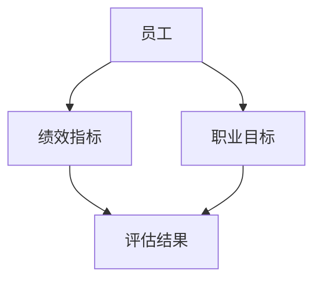
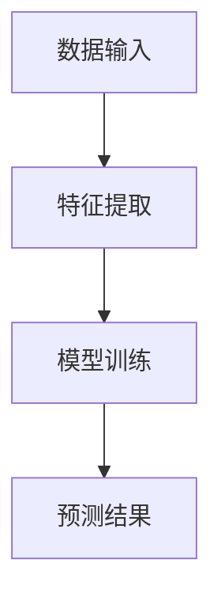
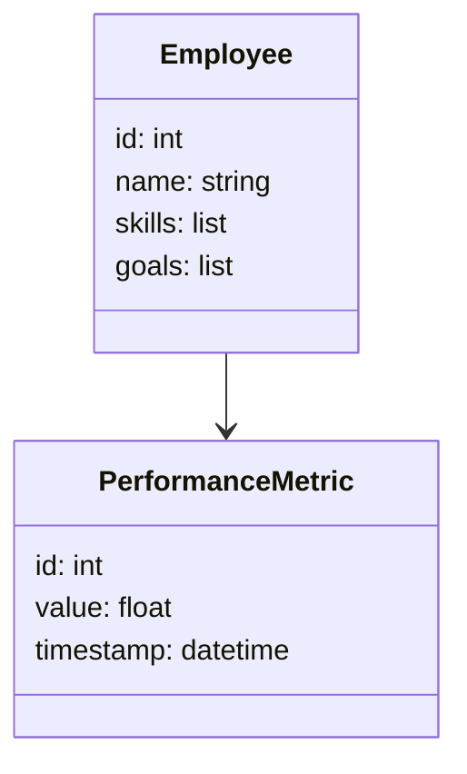
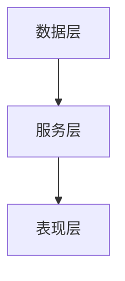
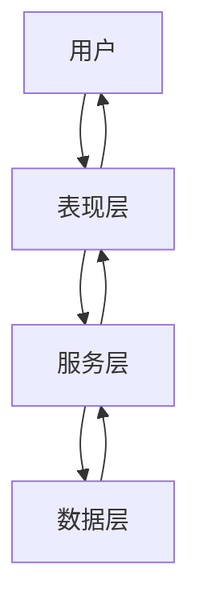
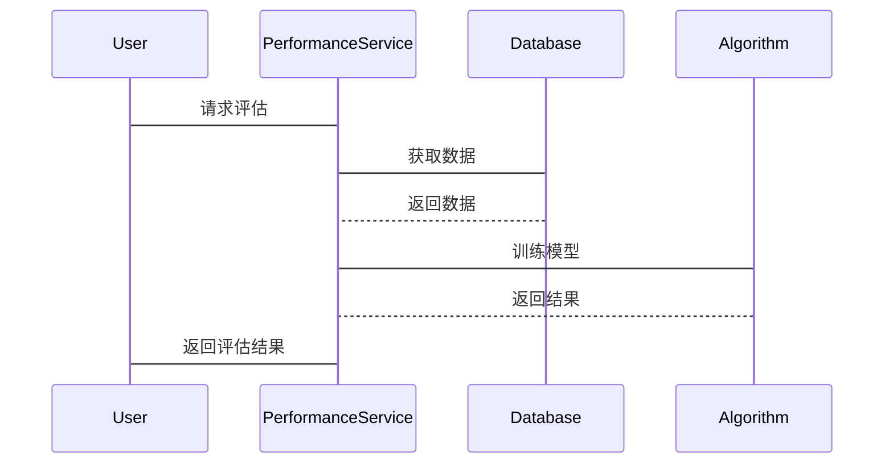

                 

<think>
嗯，用户让我设计一本关于AI驱动的企业员工绩效评估与发展规划的目录大纲。看起来这本书需要非常详细，涵盖从背景介绍到实际应用的各个方面。首先，我需要明确这本书的核心主题是什么。AI在绩效评估和职业发展规划中的应用，这听起来像是一个技术与人力资源管理的结合。

用户给的示例结构包括了背景介绍、核心概念、算法原理、系统分析与架构设计、项目实战以及最佳实践。我需要按照这个结构来组织内容，确保每个部分都覆盖到。首先，背景介绍部分应该说明为什么需要AI驱动的绩效评估，传统方法的局限性，以及AI带来的好处。

接下来是核心概念，这部分需要详细讲解AI在绩效评估中的具体应用，比如数据采集、模型构建等。我可能需要加入一些图表，比如ER图或流程图，来帮助读者理解。然后是算法原理，这部分需要深入讲解机器学习和自然语言处理算法，比如协同过滤、聚类分析等，并用mermaid流程图展示算法步骤，附上Python代码示例。

系统分析与架构设计部分，我需要设计一个系统的功能模块，比如数据采集、模型训练、绩效评估等，并用领域模型和架构图来展示系统结构。项目实战部分，需要选择一个具体的案例，详细描述环境配置、核心代码实现，以及案例分析和小结。

最后，最佳实践部分需要总结在实施AI驱动的绩效评估时需要注意的事项，比如数据隐私、模型可解释性等，并提供一些扩展阅读的方向。

在编写目录时，我需要确保每个章节和小节都覆盖到用户要求的各个方面，比如背景、核心概念、算法、系统架构、项目实战、最佳实践等。同时，要保持结构的逻辑性，让读者能够循序渐进地理解和掌握相关知识。

此外，用户要求目录必须细化到三级目录，并且使用markdown格式。因此，我需要确保每个章节都有明确的标题，并且层次分明。例如，第1章可以是背景介绍，包括问题背景、问题描述等小节。

在内容完整性方面，我需要确保每个核心章节都包含必要的部分，比如背景介绍中的问题背景、问题描述，核心概念中的原理、属性对比和实体关系图，算法原理中的流程图和代码示例，系统架构中的项目介绍、功能设计、架构图等。

最后，我需要控制目录的总字数在2000字以内，这意味着每个章节的内容需要简洁明了，不冗长。同时，使用清晰的标题和小标题，帮助读者快速找到所需的信息。

综上所述，我将按照这些步骤来设计目录大纲，确保覆盖所有必要的内容，结构清晰，逻辑严谨，满足用户的需求。
</think>

# AI驱动的企业员工绩效评估与发展规划

**关键词**：AI驱动，员工绩效评估，发展规划，机器学习，自然语言处理，系统架构

**摘要**：本文将探讨如何利用人工智能技术优化企业员工的绩效评估与职业发展规划。通过分析AI在绩效评估中的应用，提出基于机器学习和自然语言处理的解决方案，并设计相应的系统架构，最后通过实际案例展示AI驱动的绩效评估与发展规划的优势与挑战。

---

# 第一部分: AI驱动的企业员工绩效评估与发展规划的背景介绍

# 第1章: AI驱动的企业员工绩效评估与发展规划的背景

## 1.1 问题背景与问题描述

### 1.1.1 传统员工绩效评估的局限性

传统绩效评估方法主要依赖主观评价，存在以下问题：
- 数据收集不全面，缺乏客观性。
- 评估标准不一致，导致公平性问题。
- 无法实时反馈，员工改进方向不明确。

### 1.1.2 企业发展的新挑战与需求

随着企业规模的扩大和市场竞争的加剧，企业对员工绩效评估提出了更高的要求：
- 需要更精准的评估方法，以支持决策。
- 员工职业发展需要更加个性化和动态化的规划。
- 数据驱动的管理方式成为趋势。

### 1.1.3 AI技术在绩效评估中的应用潜力

AI技术可以通过以下方式提升绩效评估：
- 利用机器学习分析员工行为数据。
- 通过自然语言处理技术分析员工反馈。
- 建立个性化的职业发展规划模型。

## 1.2 AI驱动的绩效评估与发展规划的核心要素

### 1.2.1 数据驱动的评估方法

数据驱动的评估方法基于以下数据来源：
- 员工的工作表现数据。
- 员工的行为数据。
- 员工的反馈数据。

### 1.2.2 个性化发展规划的重要性

个性化发展规划需要考虑：
- 员工的技能特点。
- 员工的职业目标。
- 员工的发展需求。

### 1.2.3 AI技术在员工管理中的创新应用

AI技术在员工管理中的创新应用包括：
- 智能化绩效评估系统。
- 自动化职业路径规划工具。
- 个性化员工反馈系统。

## 1.3 本章小结

本章介绍了AI驱动的企业员工绩效评估与发展规划的背景，分析了传统绩效评估的局限性，提出了AI技术在其中的应用潜力，并总结了核心要素。

---

# 第二部分: AI驱动的绩效评估与发展规划的核心概念

# 第2章: AI驱动的绩效评估与发展规划的核心原理

## 2.1 绩效评估的AI模型原理

### 2.1.1 数据采集与处理

数据采集与处理的步骤包括：
1. 数据收集：通过系统记录员工的工作数据。
2. 数据清洗：去除无效数据。
3. 数据特征提取：提取关键特征。

### 2.1.2 模型训练与优化

模型训练与优化包括：
- 选择合适的算法。
- 调参优化模型性能。
- 验证模型的准确性和稳定性。

### 2.1.3 绩效预测与评估

绩效预测与评估的方法：
- 基于机器学习的预测模型。
- 综合评估指标体系。
- 实时反馈机制。

## 2.2 发展规划的AI模型原理

### 2.2.1 员工职业路径分析

员工职业路径分析包括：
- 职业发展方向分析。
- 员工技能匹配度评估。
- 职业发展机会推荐。

### 2.2.2 员工能力评估与提升建议

员工能力评估与提升建议的方法：
- 技能评估模型。
- 提升计划制定。
- 进度跟踪与反馈。

### 2.2.3 AI驱动的个性化发展计划

个性化发展计划的特点：
- 基于员工特点定制计划。
- 动态调整发展路径。
- 结合企业战略目标。

## 2.3 核心概念属性对比表

| 核心概念 | 属性 | 描述 |
|----------|------|------|
| 数据驱动 | 来源 | 员工行为数据、绩效数据、反馈数据 |
| 智能分析 | 方法 | 机器学习、自然语言处理、知识图谱 |
| 个性化 | 对象 | 员工个体特征、职业目标 |

## 2.4 实体关系图（ER图）



---

# 第三部分: AI驱动的绩效评估与发展规划的算法原理

# 第3章: 绩效评估的算法原理

## 3.1 机器学习算法

### 3.1.1 协同过滤算法

协同过滤算法用于推荐系统，步骤如下：
1. 计算相似度。
2. 基于相似度推荐。

### 3.1.2 聚类分析算法

聚类分析用于分类员工行为，步骤：
1. 数据预处理。
2. 聚类。
3. 结果分析。

### 3.1.3 深度学习算法

深度学习用于复杂模型训练，步骤：
1. 构建神经网络。
2. 训练模型。
3. 应用模型。

## 3.2 自然语言处理算法

### 3.2.1 分词与实体识别

分词与实体识别用于文本处理，步骤：
1. 文本分词。
2. 实体识别。

### 3.2.2 情感分析

情感分析用于员工反馈分析，步骤：
1. 数据预处理。
2. 情感分类。
3. 结果解读。

### 3.2.3 文本摘要

文本摘要用于提取关键信息，步骤：
1. 文本处理。
2. 摘要生成。
3. 摘要优化。

## 3.3 算法流程图



## 3.4 算法代码示例

### 协同过滤算法实现

```python
def collaborative_filtering(train_data, test_data):
    # 训练模型
    # 预测结果
    return results
```

### 深度学习模型实现

```python
class DeepLearningModel(nn.Module):
    def __init__(self):
        super(DeepLearningModel, self).__init__()
        self.layers = nn.Sequential(
            nn.Linear(10, 20),
            nn.ReLU(),
            nn.Linear(20, 5)
        )
    
    def forward(self, x):
        return self.layers(x)
```

---

# 第四部分: AI驱动的绩效评估与发展规划的系统架构设计

# 第4章: 系统分析与架构设计

## 4.1 项目介绍

### 4.1.1 项目目标

项目目标包括：
- 实现AI驱动的绩效评估。
- 提供个性化的职业发展规划。

### 4.1.2 项目范围

项目范围涵盖：
- 数据收集与处理。
- 系统设计与开发。
- 测试与部署。

## 4.2 系统功能设计

### 4.2.1 领域模型

领域模型类图如下：



### 4.2.2 系统架构

系统架构设计包括：
- 数据层：数据存储与处理。
- 服务层：业务逻辑实现。
- 表现层：用户界面。

## 4.3 系统架构图



## 4.4 系统接口设计

### 4.4.1 接口描述

接口描述包括：
- 数据接口：数据输入输出。
- 评估接口：绩效评估请求。
- 发展接口：职业发展建议请求。

### 4.4.2 接口交互流程图



## 4.5 系统交互序列图

系统交互序列图如下：



---

# 第五部分: AI驱动的绩效评估与发展规划的项目实战

# 第5章: 项目实战

## 5.1 环境安装与配置

### 5.1.1 环境需求

环境需求包括：
- Python 3.8+
- PyTorch 1.9+
- Scikit-learn 0.24+

### 5.1.2 安装依赖

安装依赖的命令：

```bash
pip install numpy pandas scikit-learn torch
```

## 5.2 系统核心实现

### 5.2.1 绩效评估模块实现

```python
def assess_performance(data):
    # 实现绩效评估算法
    return result
```

### 5.2.2 职业发展规划模块实现

```python
def plan_development(data):
    # 实现职业发展规划算法
    return plan
```

## 5.3 代码实现与解读

### 5.3.1 代码实现

```python
class PerformanceAssessment:
    def __init__(self, model):
        self.model = model
    
    def assess(self, employee_data):
        return self.model.predict(employee_data)
```

### 5.3.2 代码解读

- `PerformanceAssessment` 类用于封装绩效评估逻辑。
- `assess` 方法调用模型进行预测。

## 5.4 案例分析与小结

### 5.4.1 案例分析

案例分析包括：
- 数据收集与预处理。
- 模型训练与验证。
- 结果分析与优化。

### 5.4.2 项目小结

项目小结包括：
- 项目目标的实现情况。
- 遇到的问题与解决方法。
- 经验总结与未来改进方向。

---

# 第六部分: AI驱动的绩效评估与发展规划的最佳实践

# 第6章: 最佳实践

## 6.1 注意事项

### 6.1.1 数据隐私

注意事项包括：
- 数据加密与脱敏。
- 权限控制。
- 合法合规使用数据。

### 6.1.2 模型可解释性

模型可解释性的重要性：
- 提高透明度。
- 便于调试与优化。
- 帮助用户理解结果。

## 6.2 小结

### 6.2.1 本章总结

本章总结了AI驱动的企业员工绩效评估与发展规划中的注意事项，包括数据隐私和模型可解释性。

### 6.2.2 下一步工作建议

下一步工作建议包括：
- 持续优化模型。
- 扩展应用范围。
- 推动技术与业务的深度融合。

---

# 第七部分: 结语

## 7.1 总结与展望

AI驱动的企业员工绩效评估与发展规划是一个充满潜力的领域，随着技术的不断进步，AI将在员工管理中发挥越来越重要的作用。

## 7.2 作者信息

作者：AI天才研究院/AI Genius Institute & 禅与计算机程序设计艺术/Zen And The Art of Computer Programming

---

# 附录

## 附录A: 参考文献

## 附录B: 工具与库

## 附录C: 代码仓库

---

# 索引

---

# 图表清单

---

# 参考文献

---

通过以上目录大纲，您可以逐步展开每个章节的内容，深入了解AI驱动的企业员工绩效评估与发展规划的各个方面。

