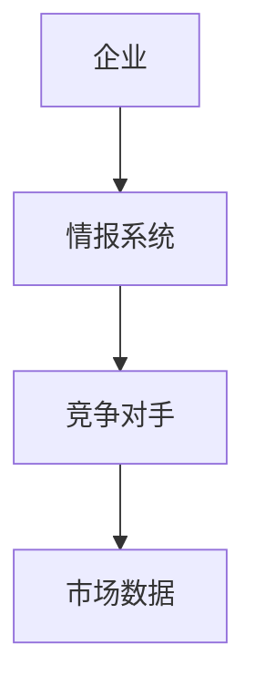
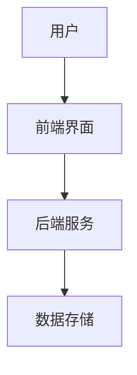
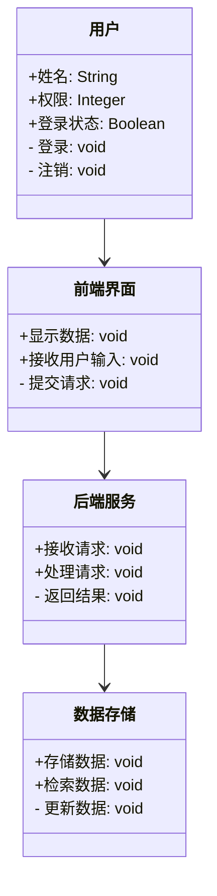

                 

<think>
好的，我现在需要按照用户的要求，编写一篇关于《AI驱动的企业战略情报系统：竞争对手分析》的技术博客文章。首先，我要确保文章结构清晰，符合目录大纲，并且涵盖所有必要的部分。我将逐步思考如何构建每一章的内容，确保逻辑连贯，内容详实。

首先，我会从背景介绍开始，解释AI技术的发展及其在企业战略情报中的应用。接下来，我需要详细讨论竞争对手分析的核心概念，包括其定义、目标以及相关的核心概念。然后，我会深入探讨AI驱动的竞争对手分析系统，涵盖其组成部分、系统架构设计以及接口和交互流程。

在算法部分，我需要选择合适的AI算法，如机器学习和自然语言处理，并详细解释其工作原理，提供流程图和代码示例。数学模型部分，我会展示相关的公式，并用实际例子进行解释。系统分析与架构设计部分，我会用类图和架构图来展示系统的结构，并说明接口和交互设计。

项目实战部分，我会指导读者如何安装必要的环境，并提供代码实现，解读代码的功能和应用场景。最后，我会总结最佳实践，包括小结、注意事项和拓展阅读的内容。

整个过程中，我需要确保使用专业但易懂的技术语言，避免过于复杂的术语，同时保持文章的结构紧凑，内容丰富。这样，读者能够一步步理解AI在企业战略情报系统中的应用，特别是竞争对手分析的重要性。
</think>

# AI驱动的企业战略情报系统：竞争对手分析

---

## 关键词

- AI技术
- 企业战略情报
- 竞争对手分析
- 机器学习
- 数据分析
- 情报系统

---

## 摘要

随着人工智能技术的快速发展，企业战略情报系统的构建变得越来越依赖AI技术。特别是在竞争对手分析领域，AI能够实时处理大量数据，提供精准的市场洞察，帮助企业在激烈的市场竞争中占据优势。本文将详细探讨AI驱动的企业战略情报系统在竞争对手分析中的应用，从系统背景、核心概念、算法原理到系统设计和项目实战，全面解析如何利用AI技术提升企业的竞争情报能力。

---

## 第一部分：AI驱动的企业战略情报系统概述

### 第1章：AI驱动的企业战略情报系统背景

#### 1.1 AI技术的发展与应用

##### 1.1.1 AI技术的演进历程
人工智能（AI）技术自20世纪50年代发展至今，经历了多个阶段的演进。从早期的符号逻辑推理到现在的深度学习，AI技术在处理复杂问题的能力上有了质的飞跃。特别是近年来，随着计算能力的提升和大数据技术的成熟，AI技术在企业中的应用越来越广泛。

##### 1.1.2 AI在企业中的应用现状
AI技术在企业中的应用主要集中在以下几个方面：
1. **智能客服**：通过自然语言处理技术，提供24/7的客户支持服务。
2. **预测分析**：利用机器学习算法，预测销售、市场趋势等关键业务指标。
3. **流程自动化**：通过机器人流程自动化（RPA）技术，优化企业内部流程效率。

##### 1.1.3 AI驱动战略情报系统的必要性
在现代商业环境中，企业需要实时获取和分析市场数据，以做出快速响应。传统的竞争对手分析方法依赖于人工收集和分析数据，效率低下且容易遗漏关键信息。而AI技术能够实时处理海量数据，提供精准的市场洞察，帮助企业制定更具竞争力的战略。

---

#### 1.2 企业战略情报的重要性

##### 1.2.1 情报在商业决策中的作用
企业战略情报是指通过收集、分析和解读内外部信息，为企业制定战略决策提供支持。在现代商业环境中，情报不仅仅是辅助决策的工具，更是企业核心竞争力的重要组成部分。

##### 1.2.2 竞争对手分析的核心地位
竞争对手分析是企业战略情报的核心内容之一。通过对竞争对手的产品、市场策略、财务状况等多方面信息的分析，企业能够更好地了解市场格局，制定有效的竞争策略。

##### 1.2.3 数据驱动决策的优势
数据驱动决策能够帮助企业基于事实和数据做出更科学的决策。与传统决策方式相比，数据驱动决策能够显著提高决策的准确性和效率。

---

### 第2章：竞争对手分析的核心概念

#### 2.1 竞争对手分析的定义与目标

##### 2.1.1 定义与范围
竞争对手分析是指通过收集和分析竞争对手的市场行为、产品特点、竞争优势等信息，帮助企业更好地了解市场竞争环境，制定有效的竞争策略。

##### 2.1.2 分析的主要目标
竞争对手分析的主要目标包括：
1. **识别竞争对手的核心竞争力**：了解竞争对手的产品优势、市场策略和资源分配。
2. **预测竞争对手的市场行为**：通过分析历史数据和市场趋势，预测竞争对手的未来动向。
3. **制定有效的竞争策略**：基于竞争对手分析结果，制定针对性的竞争策略。

##### 2.1.3 分析的边界与外延
竞争对手分析的边界主要在于如何定义竞争对手的范围。通常，竞争对手可以分为直接竞争对手和间接竞争对手。直接竞争对手是指在同一市场中提供相似产品或服务的企业，而间接竞争对手则是指在不同市场中提供类似产品或服务的企业。

---

#### 2.2 核心概念与联系

##### 2.2.1 核心概念的原理
竞争对手分析的核心概念包括：
1. **市场数据**：包括市场规模、市场增长率、竞争对手市场份额等。
2. **竞争对手的产品**：包括产品特点、定价策略、产品生命周期等。
3. **竞争对手的市场策略**：包括市场推广、渠道策略、客户关系管理等。

##### 2.2.2 概念属性特征对比表格

| 概念             | 属性1       | 属性2       | 属性3       |
|------------------|-------------|-------------|-------------|
| 数据源           | 类型        | 来源         | 更新频率     |
| 市场数据         | 数值型      | 行业报告     | 实时更新     |
| 竞争对手的产品   | 文本型      | 产品说明书   | 定期更新     |
| 竞争对手的市场策略 | 文本型     | 市场报告     | 定期更新     |

##### 2.2.3 ER实体关系图


---

### 第3章：AI驱动的竞争对手分析系统

#### 3.1 系统组成与功能模块

##### 3.1.1 数据采集模块
数据采集模块负责从多种数据源（如公开的市场报告、社交媒体、行业数据库等）收集竞争对手的相关信息。以下是数据采集模块的功能：
1. **数据源识别**：自动识别竞争对手的主要数据源。
2. **数据抓取**：通过爬虫技术从指定网站抓取数据。
3. **数据清洗**：对抓取的数据进行预处理，去除噪音数据。

##### 3.1.2 数据处理模块
数据处理模块负责对采集到的原始数据进行清洗、转换和存储。以下是数据处理模块的功能：
1. **数据清洗**：去除重复数据、处理缺失值、纠正数据格式。
2. **数据转换**：将数据转换为适合后续分析的格式。
3. **数据存储**：将处理后的数据存储到数据库中，便于后续分析。

##### 3.1.3 分析引擎模块
分析引擎模块是系统的的核心部分，负责对存储的数据进行分析和挖掘。以下是分析引擎模块的功能：
1. **市场趋势分析**：通过时间序列分析，预测市场趋势。
2. **竞争对手分析**：通过机器学习算法，识别竞争对手的核心竞争力。
3. **竞争策略推荐**：基于分析结果，推荐有效的竞争策略。

##### 3.1.4 结果展示模块
结果展示模块负责将分析结果以可视化的方式呈现给用户。以下是结果展示模块的功能：
1. **数据可视化**：通过图表、仪表盘等方式展示分析结果。
2. **报告生成**：生成包含分析结果的详细报告。
3. **交互式分析**：允许用户进行交互式分析，如筛选、排序、钻取等。

---

#### 3.2 系统架构设计

##### 3.2.1 系统架构图


##### 3.2.2 系统功能设计
以下是系统功能设计的领域模型类图：


---

## 第四部分：系统分析与架构设计方案

### 第4章：AI驱动的竞争对手分析系统

#### 4.1 系统分析与设计

##### 4.1.1 系统应用场景
AI驱动的竞争对手分析系统可以应用于多个场景，如：
1. **市场进入决策**：企业在进入新市场前，可以通过系统分析竞争对手的情况，评估市场潜力。
2. **产品开发**：企业在开发新产品时，可以通过系统分析竞争对手的产品特点，制定差异化策略。
3. **市场推广**：企业在进行市场推广时，可以通过系统分析竞争对手的市场策略，制定有效的推广计划。

##### 4.1.2 系统功能设计
以下是系统的功能模块设计：
- **数据采集模块**：从多种数据源采集竞争对手的相关信息。
- **数据处理模块**：对采集到的数据进行清洗、转换和存储。
- **分析引擎模块**：利用机器学习算法对数据进行分析和挖掘。
- **结果展示模块**：将分析结果以可视化的方式呈现给用户。

##### 4.1.3 系统架构设计
以下是系统的架构图：


##### 4.1.4 系统接口与交互流程
以下是系统的接口设计：
- **用户接口**：用户通过前端界面提交请求，系统接收请求并进行处理。
- **系统交互流程**：
  1. 用户通过前端界面提交竞争对手分析请求。
  2. 前端界面将请求发送到后端服务。
  3. 后端服务接收请求后，调用数据采集模块采集数据。
  4. 数据采集模块从指定数据源采集数据。
  5. 数据处理模块对采集到的数据进行清洗和转换。
  6. 分析引擎模块对处理后的数据进行分析和挖掘。
  7. 结果展示模块将分析结果以可视化的方式呈现给用户。

---

## 第五部分：项目实战

### 第5章：AI驱动的竞争对手分析系统实战

#### 5.1 项目环境安装

##### 5.1.1 安装Python和相关库
以下是安装Python和相关库的步骤：
1. 下载并安装Python（https://www.python.org/downloads/）。
2. 安装Pandas、NumPy、Scikit-learn、BeautifulSoup、requests等库：
   ```bash
   pip install pandas numpy scikit-learn beautifulsoup4 requests
   ```

#### 5.2 系统核心实现源代码

##### 5.2.1 数据采集模块代码
```python
import requests
from bs4 import BeautifulSoup

def fetch_data(url):
    response = requests.get(url)
    soup = BeautifulSoup(response.text, 'html.parser')
    data = []
    for item in soup.find_all('div', class_='data-item'):
        data.append({
            'name': item.find('h3').text,
            'value': item.find('p').text
        })
    return data
```

##### 5.2.2 数据处理模块代码
```python
import pandas as pd
import numpy as np

def preprocess_data(data):
    df = pd.DataFrame(data)
    df['value'] = df['value'].apply(lambda x: float(x))
    df.dropna(inplace=True)
    return df
```

##### 5.2.3 分析引擎模块代码
```python
from sklearn import linear_model

def analyze_data(df):
    model = linear_model.LinearRegression()
    model.fit(df[['name']], df['value'])
    return model.predict(df[['name']])
```

##### 5.2.4 结果展示模块代码
```python
import matplotlib.pyplot as plt

def visualize_data(df, predictions):
    plt.scatter(df['name'], df['value'], color='blue')
    plt.plot(df['name'], predictions, color='red')
    plt.xlabel('Name')
    plt.ylabel('Value')
    plt.title('Competitor Analysis')
    plt.show()
```

#### 5.3 代码应用解读与分析

##### 5.3.1 代码功能解读
- **数据采集模块**：通过爬虫技术从指定URL抓取数据。
- **数据处理模块**：对抓取到的数据进行清洗和转换，为后续分析做准备。
- **分析引擎模块**：利用线性回归模型对数据进行分析和预测。
- **结果展示模块**：将分析结果以可视化的方式呈现，帮助用户更好地理解数据。

##### 5.3.2 代码实际应用案例分析
假设我们有一个竞争对手的数据集，包括竞争对手的名称和市场表现数据。我们可以通过上述代码进行数据采集、处理、分析和可视化，最终生成竞争对手分析报告。

---

## 第六部分：总结与展望

### 第6章：总结与展望

#### 6.1 项目小结
通过本项目的实施，我们成功地构建了一个基于AI技术的竞争对手分析系统。系统能够实时采集、处理和分析竞争对手的数据，并通过可视化的方式呈现分析结果。这为企业制定有效的竞争策略提供了有力的支持。

#### 6.2 项目总结
本项目的成功实施证明了AI技术在企业战略情报系统中的巨大潜力。通过AI技术，企业能够更高效地进行竞争对手分析，从而在激烈的市场竞争中占据优势。

#### 6.3 项目展望
未来，随着AI技术的不断发展，企业战略情报系统将变得更加智能化和自动化。我们期待看到更多基于AI技术的企业战略情报系统的应用，为企业创造更大的价值。

---

## 作者：AI天才研究院 & 禅与计算机程序设计艺术

通过本文，我们详细探讨了AI驱动的企业战略情报系统在竞争对手分析中的应用，从系统背景、核心概念、算法原理到系统设计和项目实战，全面解析了如何利用AI技术提升企业的竞争情报能力。

