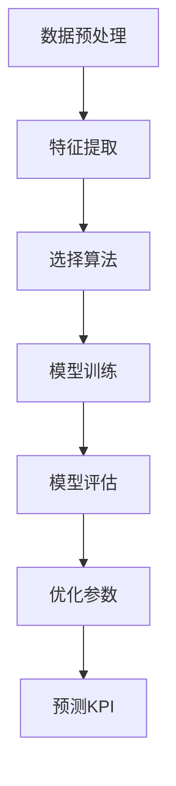
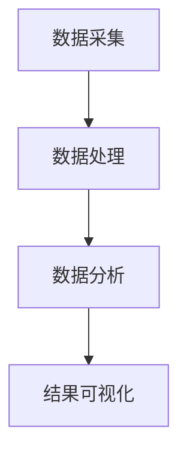
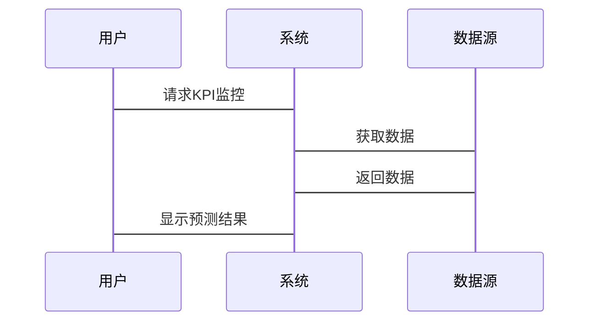

                 


# AI驱动的企业战略执行监控：KPI追踪与调整

> 关键词：AI驱动，KPI追踪，战略执行监控，企业战略，AI算法

> 摘要：随着企业规模的不断扩大和市场竞争的日益激烈，如何高效地进行战略执行监控成为企业管理中的关键问题。本文将从AI驱动的角度出发，详细探讨KPI追踪与调整的核心概念、算法原理、系统架构设计以及实际应用案例，为企业提供一套基于AI的KPI监控解决方案。

---

# 第1章: 企业战略执行监控的背景与挑战

## 1.1 企业战略执行监控的重要性

### 1.1.1 企业战略执行的定义与目标
企业战略执行是指将企业的战略目标转化为具体行动的过程，其核心目标是确保战略目标的实现。KPI（关键绩效指标）是衡量战略执行效果的重要工具，通过KPI可以量化企业的实际成果与目标之间的差距。

### 1.1.2 KPI在企业战略执行中的作用
KPI不仅是衡量企业绩效的工具，更是企业战略执行监控的核心指标。通过KPI，企业可以实时跟踪战略执行的进度，发现问题并及时调整。

### 1.1.3 当前企业战略执行监控的挑战
传统的企业战略执行监控主要依赖人工数据分析，存在效率低、成本高、实时性差等问题。此外，企业面临的外部环境和内部条件不断变化，传统的静态KPI监控方法难以适应动态调整的需求。

---

## 1.2 AI技术在企业战略执行监控中的应用

### 1.2.1 AI技术的基本概念
AI（人工智能）是指计算机系统模拟人类智能的能力，包括学习、推理、判断等功能。AI技术的应用可以帮助企业实现自动化、智能化的KPI监控。

### 1.2.2 AI在KPI追踪中的优势
AI技术可以实时分析海量数据，快速识别KPI的变化趋势，并提供预测性洞察。此外，AI还可以根据企业战略目标动态调整KPI权重，确保战略执行的灵活性。

### 1.2.3 企业战略执行监控的未来趋势
随着AI技术的不断发展，企业战略执行监控将更加智能化、自动化。未来的监控系统将能够根据外部环境和内部条件的变化，自动优化KPI指标，并提供个性化的调整建议。

---

# 第2章: KPI的核心概念与属性

## 2.1 KPI的定义与分类

### 2.1.1 KPI的定义
KPI（Key Performance Indicators）是衡量企业绩效的关键指标，通常用于评估企业在特定时间段内的表现。

### 2.1.2 KPI的主要分类
KPI可以分为财务类、客户类、内部流程类和学习与成长类四类。

### 2.1.3 KPI在企业中的应用场景
KPI广泛应用于企业战略规划、绩效管理、资源配置和决策支持等领域。

---

## 2.2 AI驱动的KPI追踪原理

### 2.2.1 数据采集与预处理
AI驱动的KPI追踪需要收集企业的相关数据，包括销售数据、财务数据、客户反馈等。数据预处理包括数据清洗、特征提取和数据标准化。

### 2.2.2 KPI追踪的算法选择
根据KPI的类型和应用场景，可以选择不同的AI算法。例如，线性回归适用于时间序列数据，而支持向量机适用于分类问题。

### 2.2.3 KPI调整的策略制定
AI系统可以根据历史数据和预测结果，自动调整KPI的权重和目标，确保战略执行的灵活性和高效性。

---

## 2.3 KPI追踪与调整的流程

### 2.3.1 数据收集与清洗
通过企业内部系统（如ERP、CRM）收集数据，并进行数据清洗，确保数据的准确性和完整性。

### 2.3.2 数据分析与建模
使用机器学习算法对数据进行建模，预测KPI的变化趋势，并识别影响KPI的关键因素。

### 2.3.3 模型评估与优化
通过交叉验证和网格搜索等方法，优化模型的参数，提高预测的准确性。

---

# 第3章: AI驱动的KPI追踪算法原理

## 3.1 基于机器学习的KPI预测模型

### 3.1.1 线性回归模型
线性回归是一种简单的回归模型，适用于线性关系的预测。其数学公式为：
$$ y = \beta_0 + \beta_1x + \epsilon $$

### 3.1.2 支持向量回归模型
支持向量回归是一种基于支持向量机的回归模型，适用于非线性关系的预测。其数学公式为：
$$ y = f(x) = \text{sign}(w \cdot x + b) $$

### 3.1.3 神经网络模型
神经网络是一种复杂的深度学习模型，适用于高度非线性的预测任务。其数学公式为：
$$ y = \sigma(w x + b) $$

---

## 3.2 算法流程图



---

## 3.3 代码实现与分析

### 3.3.1 环境安装
```bash
pip install numpy pandas scikit-learn
```

### 3.3.2 核心代码实现

```python
import numpy as np
import pandas as pd
from sklearn.linear_model import LinearRegression
from sklearn.svm import SVR
from sklearn.neural_networks import MLPRegressor

# 数据加载与预处理
data = pd.read_csv('kpi_data.csv')
X = data[['销售额', '成本', '利润']]
y = data['KPI']

# 模型训练
model_linear = LinearRegression().fit(X, y)
model_svm = SVR().fit(X, y)
model_nn = MLPRegressor().fit(X, y)

# 模型预测
y_pred_linear = model_linear.predict(X)
y_pred_svm = model_svm.predict(X)
y_pred_nn = model_nn.predict(X)

# 模型评估
print('线性回归模型的R²:', model_linear.score(X, y))
print('支持向量回归模型的R²:', model_svm.score(X, y))
print('神经网络模型的R²:', model_nn.score(X, y))
```

---

## 3.4 算法选择与优化

### 3.4.1 算法选择
根据数据的特性和预测任务的需求，选择合适的算法。例如，对于时间序列数据，可以选择ARIMA模型；对于分类问题，可以选择随机森林或梯度提升树。

### 3.4.2 模型优化
通过交叉验证和网格搜索，优化模型的超参数，提高预测的准确性和稳定性。

---

# 第4章: 系统架构设计与实现

## 4.1 系统架构设计

### 4.1.1 系统功能模块
- 数据采集模块：负责收集企业的相关数据。
- 数据处理模块：对数据进行清洗、转换和标准化。
- 数据分析模块：基于机器学习算法，预测KPI的变化趋势。
- 可视化模块：将预测结果以图表形式展示，方便用户查看和分析。

### 4.1.2 系统架构图



---

## 4.2 系统实现

### 4.2.1 数据采集与处理
```python
import requests
import json

# 数据采集
response = requests.get('http://example.com/api/kpi')
data = json.loads(response.text)
df = pd.DataFrame(data)
```

### 4.2.2 数据分析与预测
```python
# 数据分析
X_train, X_test, y_train, y_test = train_test_split(X, y)
model = LinearRegression().fit(X_train, y_train)
y_pred = model.predict(X_test)

# 结果可视化
plt.scatter(y_test, y_pred)
plt.xlabel('真实值')
plt.ylabel('预测值')
plt.title('KPI预测结果')
plt.show()
```

---

## 4.3 系统交互流程



---

# 第5章: 项目实战与案例分析

## 5.1 项目背景

### 5.1.1 项目介绍
某跨国企业希望通过AI技术实现KPI的实时监控和动态调整，提升战略执行的效率。

### 5.1.2 数据准备
收集过去三年的销售数据、成本数据和利润数据，作为模型的输入。

---

## 5.2 项目实现

### 5.2.1 环境安装
```bash
pip install numpy pandas scikit-learn matplotlib
```

### 5.2.2 核心代码实现

```python
import numpy as np
import pandas as pd
from sklearn.linear_model import LinearRegression
import matplotlib.pyplot as plt

# 数据加载与预处理
data = pd.read_csv('kpi.csv')
X = data[['销售额', '成本']]
y = data['利润']

# 模型训练
model = LinearRegression().fit(X, y)

# 模型预测
y_pred = model.predict(X)

# 模型评估与可视化
print('模型的R²:', model.score(X, y))
plt.scatter(y, y_pred)
plt.xlabel('实际利润')
plt.ylabel('预测利润')
plt.title('利润预测结果')
plt.show()
```

---

## 5.3 案例分析

### 5.3.1 数据分析结果
通过模型预测，发现企业的利润增长率低于预期，主要原因是销售成本较高。

### 5.3.2 KPI调整建议
根据预测结果，建议调整销售成本的权重，并优化供应链管理，降低采购成本。

---

# 第6章: 最佳实践与总结

## 6.1 最佳实践

### 6.1.1 数据质量管理
确保数据的准确性和完整性，是AI驱动的KPI监控系统成功的关键。

### 6.1.2 模型选择与优化
根据具体场景选择合适的算法，并通过交叉验证和网格搜索优化模型性能。

### 6.1.3 持续监控与调整
企业外部环境和内部条件不断变化，需要持续监控KPI，并根据实际情况动态调整战略执行方案。

---

## 6.2 小结

AI驱动的企业战略执行监控，通过KPI追踪与调整，能够帮助企业实现战略目标的高效达成。随着AI技术的不断发展，未来的监控系统将更加智能化、自动化，并为企业提供更加精准的决策支持。

---

# 作者：AI天才研究院/AI Genius Institute & 禅与计算机程序设计艺术 /Zen And The Art of Computer Programming

