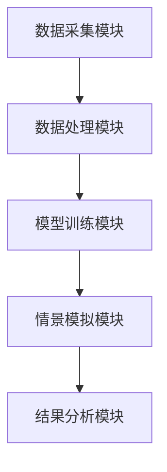

                 


# AI驱动的企业战略规划：大数据分析与预测性情景模拟

> 关键词：AI驱动，企业战略规划，大数据分析，预测性情景模拟，机器学习，企业决策

> 摘要：本文探讨了AI技术在企业战略规划中的应用，重点分析了大数据分析与预测性情景模拟的核心原理、实现方法及其对企业战略决策的支持作用。通过详细阐述AI算法、大数据处理技术以及系统架构设计，本文为读者提供了从理论到实践的全面指导，展示了如何利用AI技术优化企业战略规划过程，提升企业竞争力。

---

# {{此处是文章标题}}

> 关键词：{{此处列出文章的5-7个核心关键词}}

> 摘要：{{此处给出文章的核心内容和主题思想}}

---

# 第一章: AI驱动的企业战略规划概述

## 1.1 引言

### 1.1.1 企业战略规划的背景与重要性
企业战略规划是企业在复杂多变的市场环境中制定长期发展目标和实现路径的过程。传统的企业战略规划依赖于经验判断和专家意见，但在数据爆炸的时代，这种方法已经难以满足企业对高效、精准决策的需求。

### 1.1.2 AI技术对企业战略规划的影响
AI技术的引入，为企业战略规划带来了革命性的变化。通过大数据分析和预测性情景模拟，企业能够更快速地捕捉市场趋势、优化资源配置、降低风险，并制定更具前瞻性的战略。

### 1.1.3 本文的研究目标与意义
本文旨在探讨AI技术在企业战略规划中的应用，重点分析大数据分析与预测性情景模拟的核心原理和实现方法，并为企业提供可操作的实施路径。

---

## 1.2 企业战略规划的核心要素

### 1.2.1 数据驱动决策的必要性
数据驱动决策是现代企业战略规划的基础。通过对海量数据的分析和挖掘，企业可以发现隐藏在数据中的规律和趋势，从而做出更科学的决策。

### 1.2.2 预测性情景模拟的意义
预测性情景模拟是企业战略规划中的关键环节。通过模拟不同情景下的市场反应和企业表现，企业可以提前制定应对策略，降低不确定性带来的风险。

### 1.2.3 AI技术在战略规划中的应用
AI技术的应用贯穿企业战略规划的全过程，从数据收集、分析到预测模型的建立和优化，AI技术为企业提供了强大的工具支持。

---

## 1.3 本章小结

---

# 第二章: 大数据分析与预测模型基础

## 2.1 大数据分析的原理与方法

### 2.1.1 数据预处理
- 数据清洗：去除噪声数据、处理缺失值、标准化和归一化。
- 数据特征提取：通过特征选择和特征工程提取有价值的信息。

### 2.1.2 数据分析方法
- 描述性分析：总结数据的基本特征。
- 预测性分析：利用回归、分类等方法进行预测。
- 可视化分析：通过图表直观展示数据分布和趋势。

---

## 2.2 预测模型的构建与优化

### 2.2.1 线性回归模型
- 线性回归的数学公式：$$ y = \beta_0 + \beta_1x + \epsilon $$
- 案例分析：预测销售额与广告投入的关系。

### 2.2.2 预测模型的评估
- 均方误差（MSE）：$$ MSE = \frac{1}{n}\sum_{i=1}^{n}(y_i - \hat{y}_i)^2 $$
- R平方值：衡量模型解释能力的指标。

### 2.2.3 模型优化与调参
- 正则化方法：Lasso回归（$$ L_1 $$ 正则化）和Ridge回归（$$ L_2 $$ 正则化）。
- 参数调优：通过网格搜索（Grid Search）优化模型参数。

---

## 2.3 本章小结

---

# 第三章: 预测性情景模拟的实现

## 3.1 情景模拟的基本原理

### 3.1.1 情景模拟的定义
情景模拟是一种通过构建不同假设场景来预测系统行为的方法。它可以帮助企业在复杂环境中制定应对策略。

### 3.1.2 情景模拟的核心步骤
1. **场景定义**：明确模拟的情境和目标。
2. **数据准备**：收集与场景相关的数据。
3. **模型构建**：建立场景模拟的数学模型。
4. **模拟运行**：执行模拟并记录结果。
5. **结果分析**：解读模拟结果并制定应对策略。

---

## 3.2 基于机器学习的预测性情景模拟

### 3.2.1 机器学习在情景模拟中的应用
- 使用随机森林、支持向量机（SVM）等算法进行预测。
- 案例分析：预测市场需求变化并模拟企业应对策略。

### 3.2.2 蒙特卡洛模拟
- 蒙特卡洛模拟的原理：通过随机采样方法模拟系统的不确定性。
- 案例分析：模拟股票市场的波动对企业投资决策的影响。

---

## 3.3 情景模拟的结果分析与优化

### 3.3.1 模拟结果的可视化
- 使用图表展示模拟结果，如柱状图、折线图等。
- 案例分析：通过可视化工具分析不同情景下的企业利润变化。

### 3.3.2 模拟结果的优化
- 通过优化算法（如遗传算法）改进模拟模型的准确性。
- 案例分析：优化供应链管理中的情景模拟模型。

---

## 3.4 本章小结

---

# 第四章: 企业战略规划中的系统架构设计

## 4.1 系统架构设计概述

### 4.1.1 系统功能设计
- 数据采集模块：负责收集企业内外部数据。
- 数据处理模块：对数据进行清洗、特征提取和转换。
- 模型训练模块：基于机器学习算法训练预测模型。
- 情景模拟模块：构建不同情景并进行模拟。

### 4.1.2 系统架构图



---

## 4.2 系统接口设计

### 4.2.1 数据接口
- 数据输入接口：接收企业内外部数据。
- 数据输出接口：将处理后的数据输出到模型训练模块。

### 4.2.2 模型接口
- 模型训练接口：接收训练数据并返回训练好的模型。
- 模型预测接口：接收输入数据并返回预测结果。

---

## 4.3 本章小结

---

# 第五章: 项目实战——基于AI的预测性情景模拟

## 5.1 项目背景与目标

### 5.1.1 项目背景
某企业希望通过AI技术优化其市场战略，预测市场需求变化，并制定应对策略。

### 5.1.2 项目目标
1. 建立基于机器学习的预测模型。
2. 构建多个市场情景并进行模拟。
3. 分析模拟结果并制定优化策略。

---

## 5.2 项目实施步骤

### 5.2.1 环境搭建
- 安装必要的软件：Python、Jupyter Notebook、Scikit-learn、TensorFlow等。
- 数据集准备：收集市场数据、竞争对手数据、经济指标等。

### 5.2.2 核心代码实现

```python
import pandas as pd
from sklearn.model import LinearRegression
from sklearn.metrics import mean_squared_error

# 数据加载
data = pd.read_csv('market_data.csv')

# 数据预处理
X = data[['advertising', 'price']]
y = data['sales']

# 模型训练
model = LinearRegression()
model.fit(X, y)

# 预测与评估
y_pred = model.predict(X)
mse = mean_squared_error(y, y_pred)
print(f'MSE: {mse}')
```

---

## 5.3 模拟结果分析

### 5.3.1 模拟结果可视化
- 使用Matplotlib绘制预测值与实际值的对比图。

```python
import matplotlib.pyplot as plt

plt.scatter(y, y_pred)
plt.xlabel('Actual Sales')
plt.ylabel('Predicted Sales')
plt.show()
```

### 5.3.2 优化策略制定
- 根据模拟结果调整广告投入和产品定价策略。
- 案例分析：在市场需求下降的情况下，如何通过价格调整和促销活动提高销售额。

---

## 5.4 本章小结

---

# 第六章: 最佳实践与未来展望

## 6.1 最佳实践

### 6.1.1 数据质量管理
- 确保数据的准确性和完整性。
- 定期更新和维护数据集。

### 6.1.2 模型优化
- 定期重新训练模型，更新参数。
- 引入新的算法和技术提升模型性能。

---

## 6.2 未来展望

### 6.2.1 AI技术的进一步发展
- 更强大的算法（如深度学习、强化学习）的应用。
- 多模态数据分析的潜力。

### 6.2.2 企业战略规划的智能化转型
- AI技术在企业决策中的全面应用。
- 从单点预测到全局优化的转变。

---

## 6.3 本章小结

---

# 作者信息

作者：AI天才研究院/AI Genius Institute & 禅与计算机程序设计艺术 /Zen And The Art of Computer Programming

---

**注意**：由于篇幅限制，上述内容为简化版，实际文章需要按照完整结构进行详细展开，每章节内容需要增加更多细节和具体案例分析。

