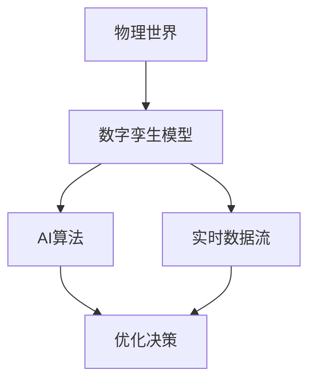
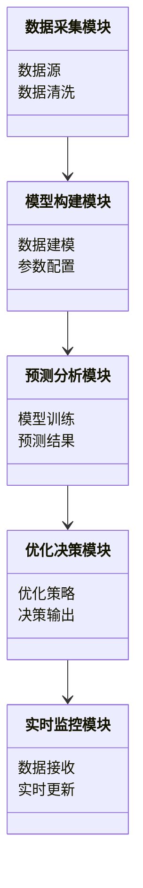
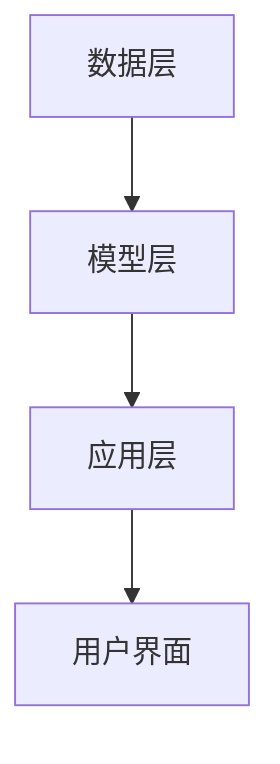
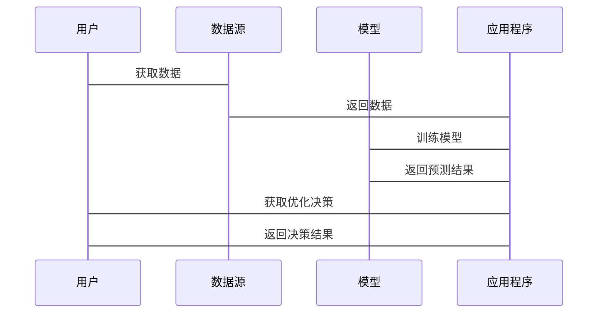

                 


# AI驱动的企业数字孪生技术：虚拟环境中的决策优化

## 关键词：AI、数字孪生、虚拟环境、决策优化、企业数字化、数据建模、实时反馈

## 摘要：  
数字孪生技术通过在虚拟环境中创建现实世界的数字映射，利用AI技术优化企业决策。本文从数字孪生的背景出发，详细探讨其核心概念、算法原理、系统架构以及实际应用案例，分析如何利用数字孪生技术实现企业数字化转型中的决策优化。

---

## 第1章：数字孪生技术的背景与概念

### 1.1 数字孪生的定义与背景

#### 1.1.1 数字孪生的定义  
数字孪生（Digital Twin）是一种通过物理实体的虚拟模型，结合实时数据、人工智能和机器学习等技术，在虚拟环境中对物理实体进行模拟、分析和优化的技术。数字孪生的核心在于建立物理世界与虚拟世界的双向实时互动，从而实现对物理系统的洞察、预测和优化。

#### 1.1.2 数字孪生的发展历程  
数字孪生的概念最早可以追溯到20世纪90年代的计算机辅助建模技术，随着物联网（IoT）、大数据和人工智能技术的发展，数字孪生逐渐从理论走向实践，并在近年来得到了广泛应用。

#### 1.1.3 数字孪生在企业中的重要性  
在企业数字化转型中，数字孪生技术可以帮助企业构建虚拟化的业务模型，实现对生产、供应链、客户行为等的实时监控和预测，从而优化资源配置、降低运营成本、提高决策效率。

### 1.2 企业数字孪生的背景与问题

#### 1.2.1 企业数字化转型的现状  
随着市场竞争的加剧和客户需求的多样化，企业需要通过数字化技术提高效率、降低成本。数字孪生作为数字化转型的重要工具，为企业提供了全新的视角和方法。

#### 1.2.2 数字孪生技术的应用场景  
数字孪生在企业中的应用场景广泛，包括产品设计、生产优化、供应链管理、客户服务等。例如，在制造企业中，数字孪生可以用于模拟生产线，预测设备故障，优化生产流程。

#### 1.2.3 企业决策优化的挑战与需求  
企业在决策过程中面临数据孤岛、信息滞后、预测不准确等问题。数字孪生技术通过实时数据和AI模型，帮助企业在虚拟环境中快速迭代和优化决策，从而提高决策的准确性和效率。

---

## 第2章：数字孪生的核心概念与原理

### 2.1 数字孪生的核心概念

#### 2.1.1 数据流与模型构建  
数字孪生的核心是数据流和模型构建。物理世界中的数据（如传感器数据、业务数据）通过数据采集、处理和建模，生成虚拟模型。虚拟模型通过实时数据更新，与物理世界保持一致。

#### 2.1.2 虚拟环境中的实时反馈  
数字孪生在虚拟环境中模拟物理系统的运行，通过实时数据反馈，对虚拟模型进行动态调整，从而实现对物理系统的实时监控和优化。

#### 2.1.3 AI驱动的决策优化机制  
AI技术在数字孪生中的应用主要体现在数据建模、预测分析和优化决策。通过机器学习算法，数字孪生可以预测未来趋势，优化资源配置，提供决策支持。

### 2.2 核心概念的属性特征对比

| **核心概念** | **传统模型** | **数字孪生** |
|--------------|---------------|--------------|
| 数据来源     | 单一数据源   | 多数据源     |
| 实时性       | 低            | 高            |
| 可扩展性     | 有限          | 强            |
| 交互性       | 单向          | 双向          |

### 2.3 实体关系图



---

## 第3章：数字孪生中的算法原理

### 3.1 机器学习与深度学习在数字孪生中的应用

#### 3.1.1 机器学习算法  
机器学习算法在数字孪生中主要用于数据建模和预测。例如，回归算法可以用于预测设备的故障时间，分类算法可以用于识别客户行为模式。

#### 3.1.2 深度学习算法  
深度学习算法在数字孪生中的应用主要体现在图像识别、语音识别和自然语言处理等领域。例如，卷积神经网络（CNN）可以用于图像识别，生成对抗网络（GAN）可以用于数据增强。

### 3.2 算法实现

#### 3.2.1 简单线性回归示例

```python
import numpy as np
from sklearn.linear_model import LinearRegression

# 生成数据
X = np.array([1, 2, 3, 4, 5]).reshape(-1, 1)
y = np.array([2, 4, 5, 4, 5])

# 训练模型
model = LinearRegression()
model.fit(X, y)

# 预测
print(model.predict([[6]]))  # 输出：[[7.5]]
```

#### 3.2.2 神经网络实现

```python
import tensorflow as tf
import numpy as np

# 数据准备
X = np.array([[0.05, 0.10]])
y = np.array([[0.01, 0.99]])

# 模型定义
model = tf.keras.Sequential([
    tf.keras.layers.Dense(4, activation='relu', input_shape=(2,)),
    tf.keras.layers.Dense(2, activation='softmax')
])

# 编译模型
model.compile(optimizer='adam', loss='sparse_categorical_crossentropy', metrics=['accuracy'])

# 训练模型
model.fit(X, y, epochs=100, verbose=0)

# 预测
print(model.predict(X))  # 输出：[[0.01, 0.99]]
```

---

## 第4章：数学模型与公式解析

### 4.1 回归模型

#### 4.1.1 简单线性回归  
简单线性回归模型可以表示为：

$$ y = \beta_0 + \beta_1 x + \epsilon $$

其中，$y$ 是目标变量，$x$ 是自变量，$\beta_0$ 是截距，$\beta_1$ 是回归系数，$\epsilon$ 是误差项。

#### 4.1.2 多元线性回归  
多元线性回归模型可以表示为：

$$ y = \beta_0 + \beta_1 x_1 + \beta_2 x_2 + \dots + \beta_n x_n + \epsilon $$

### 4.2 神经网络模型

#### 4.2.1 神经网络结构  
神经网络的结构可以表示为：

$$ \text{输入} \rightarrow \text{隐藏层} \rightarrow \text{输出} $$

其中，隐藏层通过激活函数（如ReLU）进行非线性变换。

#### 4.2.2 激活函数  
常用的激活函数包括：

- ReLU：$$ f(x) = \max(0, x) $$
- Sigmoid：$$ f(x) = \frac{1}{1 + e^{-x}} $$
- Tanh：$$ f(x) = \tanh(x) $$

---

## 第5章：系统分析与架构设计

### 5.1 问题场景介绍

#### 5.1.1 供应链优化  
以供应链优化为例，数字孪生可以帮助企业在虚拟环境中模拟供应链的运作，预测库存短缺、物流延迟等问题，并优化供应链的配置。

#### 5.1.2 生产线优化  
在制造企业中，数字孪生可以模拟生产线的运行，预测设备故障，优化生产流程，提高生产效率。

### 5.2 系统功能设计

#### 5.2.1 功能模块  
系统功能模块包括数据采集、模型构建、实时监控、预测分析和优化决策。



### 5.3 系统架构设计

#### 5.3.1 分层架构  
数字孪生系统的架构可以分为数据层、模型层和应用层。



#### 5.3.2 接口设计  
系统接口设计包括数据接口、模型接口和用户接口。



---

## 第6章：项目实战

### 6.1 环境安装

#### 6.1.1 安装Python  
安装Python 3.8以上版本。

#### 6.1.2 安装依赖库  
安装必要的依赖库：

```bash
pip install numpy pandas scikit-learn tensorflow matplotlib
```

### 6.2 系统核心实现

#### 6.2.1 数据采集与预处理  
读取数据并进行清洗。

```python
import pandas as pd

# 读取数据
data = pd.read_csv('data.csv')

# 数据清洗
data.dropna(inplace=True)
```

#### 6.2.2 模型训练与预测  
训练机器学习模型并进行预测。

```python
from sklearn.model_selection import train_test_split
from sklearn.linear_model import LinearRegression

# 划分数据集
X_train, X_test, y_train, y_test = train_test_split(data.drop('target', axis=1), data['target'], test_size=0.2)

# 训练模型
model = LinearRegression()
model.fit(X_train, y_train)

# 预测
y_pred = model.predict(X_test)
```

#### 6.2.3 优化决策  
基于模型预测结果，生成优化决策。

```python
# 生成决策
decisions = []
for i in range(len(y_pred)):
    if y_pred[i] > 0.9:
        decisions.append('采取行动')
    else:
        decisions.append('不采取行动')
```

### 6.3 项目小结

#### 6.3.1 核心功能总结  
数字孪生项目的核心功能包括数据采集、模型构建、实时监控和优化决策。

#### 6.3.2 项目实现的关键点  
- 数据的实时更新与处理  
- 模型的训练与优化  
- 决策的实时反馈与调整

---

## 第7章：总结与展望

### 7.1 最佳实践 tips

#### 7.1.1 数据质量管理  
确保数据的准确性和完整性是数字孪生成功的关键。

#### 7.1.2 模型迭代优化  
定期更新模型参数，确保模型的预测准确性和优化效果。

#### 7.1.3 安全与隐私保护  
在数据采集和模型训练过程中，要注意数据隐私和安全问题。

### 7.2 小结  
数字孪生技术通过在虚拟环境中建立物理系统的数字映射，利用AI技术优化企业决策。本文从背景、概念、算法、系统架构到项目实战，全面介绍了数字孪生技术的核心内容和应用实践。

### 7.3 注意事项  
- 数据隐私和安全问题需要高度重视  
- 模型的可解释性和透明性需要关注  
- 系统的实时性和稳定性需要优化

### 7.4 拓展阅读  
- 《Digital Twin: From Concepts to Applications》  
- 《Artificial Intelligence: A Modern Approach》  

---

## 作者：AI天才研究院/AI Genius Institute & 禅与计算机程序设计艺术/Zen And The Art of Computer Programming

