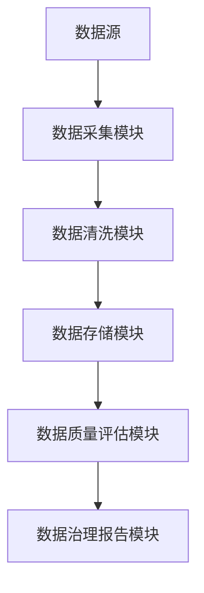

                 


# AI驱动的企业数据质量管理与治理

> 关键词：AI驱动，数据质量管理，数据治理，企业数据管理，人工智能技术

> 摘要：在数字化转型的背景下，企业数据质量管理与治理的重要性日益凸显。传统方法在面对数据多样性、复杂性和动态性时显得力不从心，而人工智能技术的引入为数据质量管理带来了新的可能性。本文系统地探讨了AI在企业数据质量管理中的应用，从算法原理到系统架构，从项目实战到最佳实践，为企业构建高效、智能的数据治理系统提供了全面的解决方案。

---

# 第1章: 数据质量管理与治理的背景与挑战

## 1.1 数据质量管理的定义与重要性

### 1.1.1 数据质量管理的核心概念
- 数据质量管理（Data Quality Management，DQM）是确保数据的准确性、完整性、一致性和及时性的过程。
- 数据是企业的核心资产，数据质量直接影响企业的决策能力和竞争力。

### 1.1.2 数据质量管理对企业价值的影响
- 数据质量差可能导致决策失误，影响企业声誉和财务表现。
- 高质量的数据是企业数字化转型成功的关键。

### 1.1.3 数据治理的定义与目标
- 数据治理（Data Governance）是通过制定政策、流程和工具来确保数据的有效管理和使用。
- 目标是实现数据的标准化、规范化和可追溯性。

## 1.2 数据质量管理的挑战

### 1.2.1 数据孤岛与不一致性问题
- 数据分布在不同的系统和部门中，导致信息不一致。
- 数据格式和术语的差异增加了整合和分析的难度。

### 1.2.2 数据安全与隐私保护
- 数据泄露和滥用威胁企业的安全和合规性。
- 数据隐私法规（如GDPR）对企业数据管理提出更高要求。

### 1.2.3 数据源的多样性和复杂性
- 数据来源包括结构化、半结构化和非结构化数据。
- 数据质量和治理需要适应不同数据类型和场景。

## 1.3 AI在数据质量管理中的作用

### 1.3.1 AI技术如何提升数据质量
- 通过机器学习算法自动识别和修复数据错误。
- 利用自然语言处理技术处理非结构化数据。

### 1.3.2 AI驱动的数据治理新范式
- 建立智能化的数据治理体系，实现数据的自动化管理。
- 引入AI辅助工具提高数据治理的效率和精准性。

### 1.3.3 企业数据质量管理的未来趋势
- 数据质量管理将更加智能化和自动化。
- 数据治理将与企业业务战略更加紧密地结合。

## 1.4 本章小结
本章介绍了数据质量管理的重要性和挑战，探讨了AI在数据质量管理中的作用，并展望了未来的发展趋势。

---

# 第2章: 数据质量管理的核心概念与框架

## 2.1 数据质量管理的框架体系

### 2.1.1 数据生命周期模型
- 数据生命周期包括数据的创建、存储、处理、分析和归档。
- 数据质量管理贯穿数据生命周期的每个阶段。

### 2.1.2 数据质量管理的五大核心维度
| 维度 | 描述 |
|------|------|
| 准确性 | 数据反映真实情况的程度。 |
| 完整性 | 数据的完整性和无缺失性。 |
| 一致性 | 数据在不同系统中的统一性。 |
| 及时性 | 数据的更新和提供的时间性。 |
| 可用性 | 数据的可访问性和可理解性。 |

### 2.1.3 数据治理的组织架构
- 数据治理委员会：负责制定数据治理政策和监督执行。
- 数据管理员：负责数据质量管理的具体实施。

## 2.2 数据清洗与数据标准化

### 2.2.1 数据清洗的基本步骤
1. 识别和删除重复数据。
2. 修复数据错误和异常值。
3. 处理缺失数据。

### 2.2.2 数据标准化的实现方法
- 标准化：将数据转换为统一的格式和术语。
- 规范化：确保数据符合行业标准和法规要求。

### 2.2.3 数据转换与映射规则
- 数据转换：将数据从一种格式转换为另一种格式。
- 数据映射：将数据从一个系统映射到另一个系统。

## 2.3 数据质量评估指标

### 2.3.1 数据完整性指标
- 数据完整率：实际数据量与预期数据量的比率。
- 数据覆盖范围：数据是否覆盖所有相关字段。

### 2.3.2 数据准确性指标
- 数据准确率：正确数据与总数据的比率。
- 数据误差率：错误数据与总数据的比率。

### 2.3.3 数据一致性指标
- 数据一致性：数据在不同系统中的统一性。
- 数据冲突率：数据不一致的频率。

## 2.4 数据质量管理的流程与方法

### 2.4.1 数据需求分析
- 确定数据质量管理的目标和范围。
- 识别关键数据资产和风险点。

### 2.4.2 数据收集与预处理
- 数据收集：从不同来源获取数据。
- 数据预处理：清洗和转换数据。

### 2.4.3 数据质量评估与优化
- 数据评估：使用指标和工具评估数据质量。
- 数据优化：根据评估结果优化数据质量。

## 2.5 本章小结
本章详细介绍了数据质量管理的核心概念和框架，包括数据清洗、标准化、评估指标和流程方法。

---

# 第3章: AI驱动的数据质量管理算法原理

## 3.1 数据清洗与预处理的AI算法

### 3.1.1 基于机器学习的异常检测算法
- 算法流程：
  1. 数据预处理：归一化和特征选择。
  2. 训练异常检测模型：使用随机森林或Isolation Forest。
  3. 检测异常数据并标记。
  4. 可视化结果：使用箱线图或热图展示异常数据。

```python
import pandas as pd
from sklearn.ensemble import IsolationForest

# 示例数据加载
data = pd.read_csv('data.csv')

# 数据预处理：归一化
from sklearn.preprocessing import StandardScaler
scaler = StandardScaler()
scaled_data = scaler.fit_transform(data)

# 训练异常检测模型
model = IsolationForest(n_estimators=100, contamination=0.05)
model.fit(scaled_data)

# 检测异常数据
outliers = model.predict(scaled_data)
outliers[outliers == -1] = 1
outliers[outliers == 1] = 0

# 可视化
import matplotlib.pyplot as plt
plt.scatter(data.iloc[:, 0], data.iloc[:, 1], c=outliers, cmap='viridis')
plt.xlabel('Feature 1')
plt.ylabel('Feature 2')
plt.title('Anomaly Detection with Isolation Forest')
plt.show()
```

### 3.1.2 基于聚类分析的重复数据识别
- 算法流程：
  1. 数据预处理：去除无关字段。
  2. 使用聚类算法（如K-means）识别重复数据。
  3. 标记和删除重复数据。

### 3.1.3 基于自然语言处理的文本数据清洗
- 算法流程：
  1. 分词：将文本数据分割成词语。
  2. 去除停用词和标点符号。
  3. 去重：合并重复的词语或句子。

## 3.2 数据标准化与归一化的数学模型

### 3.2.1 数据标准化的公式与实现
- 标准化公式：
$$ x_{\text{normalized}} = \frac{x - \mu}{\sigma} $$
其中，$\mu$ 是均值，$\sigma$ 是标准差。

### 3.2.2 数据归一化的数学模型
- 归一化公式：
$$ x_{\text{normalized}} = \frac{x - \min(x)}{\max(x) - \min(x)} $$

### 3.2.3 数据转换的函数映射
- 常见的函数映射包括对数变换和指数变换。

## 3.3 数据质量评估的AI模型

### 3.3.1 基于深度学习的特征提取
- 使用卷积神经网络（CNN）提取文本数据的特征。

### 3.3.2 数据质量评分的回归模型
- 回归模型：预测数据质量分数。
$$ y = \beta_0 + \beta_1x_1 + \beta_2x_2 + \dots + \beta_nx_n + \epsilon $$

### 3.3.3 数据关联性分析的图模型
- 使用图神经网络分析数据之间的关联性。

## 3.4 数据治理的AI驱动优化

### 3.4.1 基于强化学习的决策优化
- 使用强化学习算法（如Q-learning）优化数据治理策略。

### 3.4.2 数据治理的自适应反馈机制
- 根据实时数据反馈调整数据治理策略。

### 3.4.3 数据安全与隐私保护的AI算法
- 使用联邦学习保护数据隐私。

## 3.5 本章小结
本章详细介绍了AI驱动的数据质量管理算法，包括异常检测、数据清洗、标准化和深度学习模型的应用。

---

# 第4章: 数据质量管理的系统架构与设计

## 4.1 数据质量管理系统的功能模块

### 4.1.1 数据采集与预处理模块
- 功能：从多个数据源采集数据并进行初步清洗。

### 4.1.2 数据清洗与标准化模块
- 功能：使用AI算法清洗和标准化数据。

### 4.1.3 数据质量评估与报告模块
- 功能：评估数据质量并生成报告。

## 4.2 数据治理的系统架构设计

### 4.2.1 数据治理的分层架构
- 分层架构包括数据采集层、数据处理层、数据存储层和数据应用层。

### 4.2.2 数据治理的组件交互图


### 4.2.3 数据治理的系统接口设计
- API接口：提供数据采集、清洗和评估的接口。

## 4.3 数据质量管理的系统实现

### 4.3.1 系统功能模块的实现流程
1. 数据采集：从数据库、API和文件中采集数据。
2. 数据清洗：使用AI算法清洗数据。
3. 数据标准化：将数据转换为统一格式。
4. 数据评估：使用回归模型评估数据质量。

### 4.3.2 系统功能模块的代码实现
```python
import requests
import json

# 数据采集模块
def fetch_data(url):
    response = requests.get(url)
    return json.loads(response.text)

# 数据清洗模块
def clean_data(data):
    cleaned_data = []
    for item in data:
        if item['status'] == 'valid':
            cleaned_data.append(item)
    return cleaned_data

# 数据标准化模块
def normalize_data(data):
    normalized_data = []
    for item in data:
        normalized_item = {
            'id': item['id'],
            'name': item['name'].lower(),
            'value': float(item['value'])
        }
        normalized_data.append(normalized_item)
    return normalized_data

# 数据评估模块
from sklearn.metrics import accuracy_score

def evaluate_data(golden_set, predicted_set):
    return accuracy_score(golden_set, predicted_set)
```

### 4.3.3 系统功能模块的测试与验证
- 测试数据完整性：确保所有数据都被正确采集和清洗。
- 测试数据一致性：确保数据在不同模块中保持一致。

## 4.4 数据治理的系

---

# 第5章: 项目实战：AI驱动的数据质量管理解决方案

## 5.1 项目背景与目标

### 5.1.1 项目背景
- 某企业面临数据孤岛和数据质量问题，影响业务决策。

### 5.1.2 项目目标
- 实现数据的清洗、标准化和质量评估。
- 提供数据治理的可视化报告。

## 5.2 环境安装与配置

### 5.2.1 安装Python与相关库
- Python版本：3.8及以上。
- 安装库：pandas、scikit-learn、requests。

### 5.2.2 数据源获取
- 数据来源：企业数据库和API接口。

## 5.3 系统核心实现

### 5.3.1 数据采集模块实现
```python
import requests
import json

def fetch_data(url):
    response = requests.get(url)
    return json.loads(response.text)
```

### 5.3.2 数据清洗模块实现
```python
def clean_data(data):
    cleaned_data = []
    for item in data:
        if item['status'] == 'valid':
            cleaned_data.append(item)
    return cleaned_data
```

### 5.3.3 数据标准化模块实现
```python
def normalize_data(data):
    normalized_data = []
    for item in data:
        normalized_item = {
            'id': item['id'],
            'name': item['name'].lower(),
            'value': float(item['value'])
        }
        normalized_data.append(normalized_item)
    return normalized_data
```

### 5.3.4 数据质量评估模块实现
```python
from sklearn.metrics import accuracy_score

def evaluate_data(golden_set, predicted_set):
    return accuracy_score(golden_set, predicted_set)
```

## 5.4 实际案例分析与结果解读

### 5.4.1 数据清洗与标准化的案例
- 数据清洗：去除无效数据。
- 数据标准化：统一字段格式。

### 5.4.2 数据质量评估的案例
- 使用回归模型评估数据准确性。
- 生成数据质量报告。

## 5.5 项目小结
本章通过实际案例展示了AI驱动的数据质量管理解决方案，详细讲解了系统实现和结果分析。

---

# 第6章: 最佳实践与未来展望

## 6.1 数据质量管理的最佳实践

### 6.1.1 数据治理的组织架构优化
- 建立跨部门的数据治理团队。
- 制定明确的数据治理政策和流程。

### 6.1.2 数据安全与隐私保护的建议
- 遵守数据隐私法规。
- 使用加密和匿名化技术保护数据。

## 6.2 小结与注意事项

### 6.2.1 小结
- AI技术为数据质量管理带来了新的可能性。
- 数据治理需要结合企业实际情况进行定制化实施。

### 6.2.2 注意事项
- 数据治理需要长期持续的努力。
- 数据隐私和安全问题是需要重点关注的。

## 6.3 未来展望

### 6.3.1 数据质量管理的智能化发展
- 更多AI技术的应用，如自适应数据治理系统。

### 6.3.2 数据治理的全球化与标准化
- 数据治理标准的统一和国际化。

### 6.3.3 数据质量与业务价值的深度结合
- 数据质量管理与企业业务目标更加紧密地结合。

---

# 作者：AI天才研究院/AI Genius Institute & 禅与计算机程序设计艺术 /Zen And The Art of Computer Programming

---

这篇文章全面系统地探讨了AI驱动的企业数据质量管理与治理，从理论到实践，从算法到系统架构，为企业提供了完整的解决方案。

