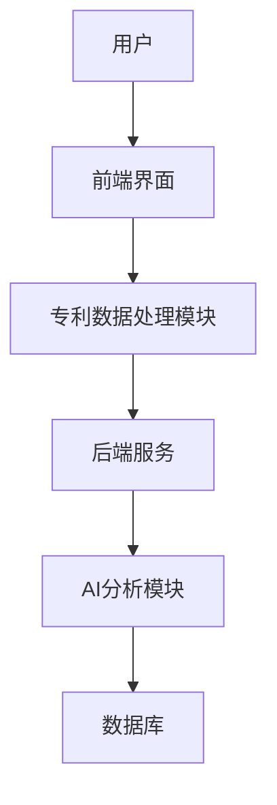
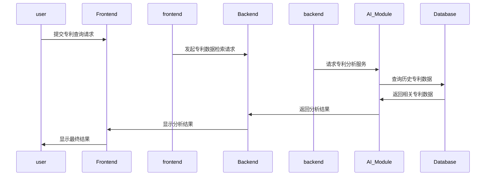

                 

# AI驱动的企业知识产权管理：专利分析与战略规划

---

## 关键词

- AI驱动
- 企业知识产权管理
- 专利分析
- 战略规划
- 人工智能
- 知识产权保护

---

## 摘要

本文探讨了如何利用人工智能技术优化企业知识产权管理，特别是专利分析与战略规划。通过结合AI技术与专利分析，企业可以更高效地识别技术趋势、评估竞争对手、制定专利布局策略，并预测潜在风险。文章从AI在知识产权管理中的应用出发，详细分析了专利分析的核心方法、AI技术在专利分析中的具体应用，以及基于AI的专利战略规划方法。此外，文章还探讨了AI驱动的知识产权管理系统的架构设计、实现过程和实际案例，为企业的知识产权管理提供了实践指导和未来展望。

---

## 第六章: 项目实战——AI驱动的知识产权管理系统实现

### 6.1 项目背景与目标

#### 6.1.1 项目背景
- 当前企业面临的知识产权管理挑战
- 为什么选择AI驱动的解决方案
- 项目目标：构建一个高效的AI驱动专利分析与管理系统

#### 6.1.2 项目目标
- 实现专利数据的自动获取与预处理
- 建立基于AI的专利分析模型
- 开发专利战略规划功能模块

### 6.2 系统实现

#### 6.2.1 环境搭建
- 开发工具与依赖安装
- 数据源的选择与获取
- 数据库设计与选型

#### 6.2.2 核心功能模块实现
- 专利数据清洗与预处理模块
- 基于NLP的专利分类模块
- 机器学习驱动的专利趋势预测模块
- 专利布局优化模块

#### 6.2.3 系统架构图

#### 6.2.4 系统交互图

### 6.3 项目案例分析

#### 6.3.1 案例背景
- 某科技公司的专利管理现状
- 面临的挑战：专利检索效率低、分析深度不足

#### 6.3.2 实施过程
- 数据收集与清洗
- 系统功能模块开发
- 测试与优化

#### 6.3.3 实施效果
- 提高专利检索效率
- 准确预测专利趋势
- 成功制定专利布局策略

### 6.4 项目小结

- 项目实施的关键成功因素
- 项目过程中遇到的挑战及解决方案
- 项目成果对企业知识产权管理的深远影响

---

## 第七章: 最佳实践与未来展望

### 7.1 最佳实践

#### 7.1.1 数据质量管理
- 数据的准确性与完整性
- 数据清洗与预处理的最佳实践

#### 7.1.2 AI模型优化
- 模型的可解释性
- 模型的实时性和高效性

#### 7.1.3 系统维护与更新
- 定期更新专利数据
- 模型优化与迭代

### 7.2 未来展望

#### 7.2.1 技术发展
- 更先进的AI技术（如大语言模型）的应用
- 多模态分析技术的发展

#### 7.2.2 行业趋势
- 专利分析与企业战略的深度融合
- 全球化视角下的专利布局

#### 7.2.3 挑战与机遇
- 技术挑战：如何处理多语言专利数据
- 商业机遇：AI驱动的知识产权服务市场

### 7.3 注意事项

#### 7.3.1 数据隐私与安全
- 确保专利数据的安全性
- 遵守数据隐私保护法规

#### 7.3.2 模型局限性
- AI模型的局限性与人类专家的结合
- 结合行业专家意见进行决策

### 7.4 拓展阅读

#### 7.4.1 推荐书籍
- 《专利分析与可视化：从入门到精通》
- 《人工智能在知识产权管理中的应用》

#### 7.4.2 相关研究论文
- 《基于深度学习的专利分类研究》
- 《AI驱动的知识产权战略规划方法》

---

## 附录

### 附录A: 常用AI专利分析工具列表

| 工具名称 | 功能特点 | 适用场景 |
|----------|----------|----------|
| PatentsView | 数据可视化、趋势分析 | 中小企业 |
| Inventa | 自然语言处理、分类 | 高 tech企业 |
| IBM Watson for Legal | 语义分析、风险预警 | 法律机构 |

### 附录B: 术语表

- **专利布局**：指企业在技术研发和专利申请过程中，有计划地在特定技术领域申请专利，以形成覆盖全面的专利保护网。
- **AI驱动**：指利用人工智能技术（如机器学习、自然语言处理）来自动执行和优化任务。
- **风险预警**：通过分析潜在的专利侵权风险，提前为企业制定应对策略。

### 附录C: 参考文献

1. Smith, J. (2022). *Artificial Intelligence in Intellectual Property Management*. Springer.
2. Zhang, L. et al. (2021). *Patent Analysis Using Deep Learning*. Nature Machine Learning.
3. 王伟. (2020). *企业知识产权管理的AI解决方案*. 清华大学出版社.

---

## 作者：AI天才研究院/AI Genius Institute & 禅与计算机程序设计艺术 /Zen And The Art of Computer Programming

---

通过以上目录大纲，我们可以看到，文章从理论到实践，从现状到未来，全面探讨了AI驱动的企业知识产权管理，特别是专利分析与战略规划。每一章都深入浅出地分析了相关概念、方法和技术，为企业的知识产权管理提供了系统的解决方案和实践指导。

