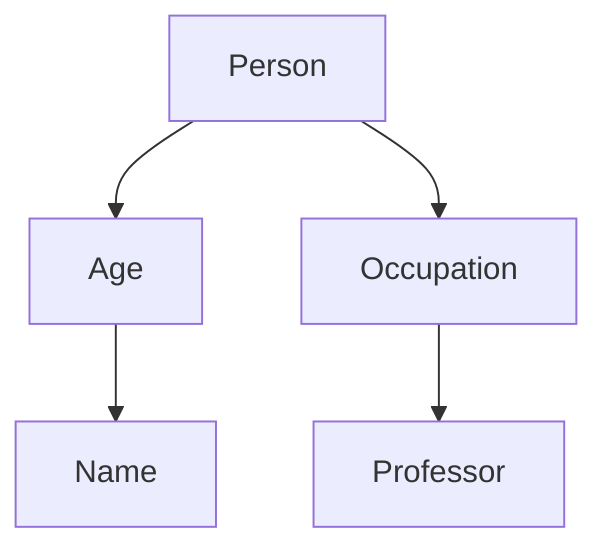
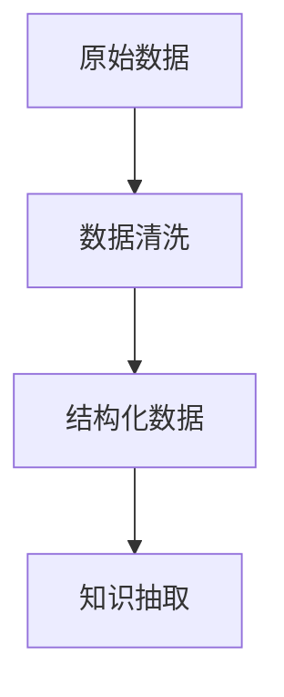
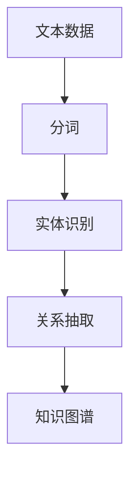
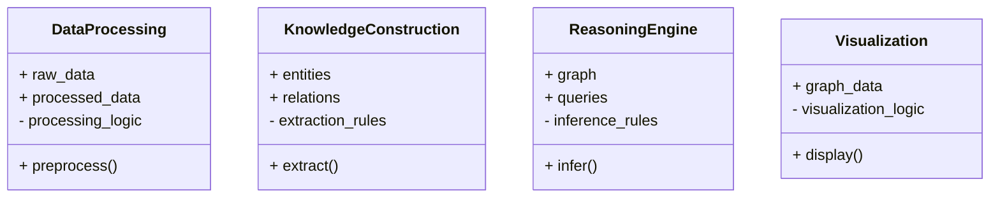
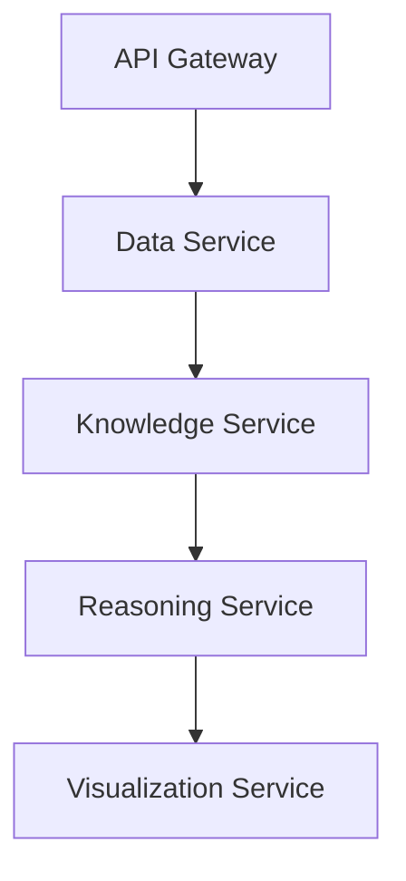

                 


# AI驱动的企业知识图谱：自动化构建与智能推理的深度融合

## 关键词：知识图谱、人工智能、企业应用、自动化构建、智能推理

## 摘要：本文详细探讨了AI驱动的企业知识图谱的构建与智能推理的融合，涵盖知识图谱的定义、构建流程、算法原理、系统架构设计以及项目实战案例，帮助读者全面理解并掌握相关技术。

---

# 第一部分: AI驱动的企业知识图谱概述

## 第1章: 知识图谱的定义与背景

### 1.1 知识图谱的定义与特点

知识图谱是一种以图结构形式表示知识的技术，由节点（实体）和边（关系）组成，具备语义丰富、结构化、可扩展性强的特点。

图1-1 知识图谱结构示例：



### 1.2 企业知识图谱的背景与价值

企业知识图谱通过整合企业内外部数据，构建统一的知识体系，提升数据利用率和决策效率。

---

## 第2章: 知识图谱的构建流程

### 2.1 数据采集与预处理

数据清洗与标准化是构建知识图谱的关键步骤，涉及数据去重、格式统一等处理。

图2-1 数据处理流程：



### 2.2 知识抽取与建模

使用自然语言处理技术提取实体及其关系，构建知识图谱的语义网络。

图2-2 知识抽取流程：



---

## 第3章: AI驱动的知识图谱构建技术

### 3.1 自然语言处理技术在知识抽取中的应用

使用BERT模型进行实体识别和关系抽取，提升知识抽取的准确性和效率。

代码示例：

```python
import torch
from transformers import BertForTokenClassification

model = BertForTokenClassification.from_pretrained("bert-base-cased")
inputs = tokenizer("AI天才研究院", return_tensors="pt")
outputs = model(**inputs)
```

### 3.2 知识图谱的智能推理

基于图嵌入技术，通过节点相似度计算进行推理，实现知识的智能关联。

公式示例：

$$
similarity(u, v) = \frac{u \cdot v}{\|u\| \|v\|}
$$

---

## 第4章: 知识图谱的系统架构设计

### 4.1 系统功能模块划分

系统功能模块包括数据处理、知识构建、推理引擎和可视化模块。

图4-1 系统功能模块划分：



### 4.2 系统架构设计

采用微服务架构，各模块通过API进行交互，确保系统的可扩展性和灵活性。

图4-2 系统架构设计：



---

## 第5章: 企业知识图谱的项目实战

### 5.1 项目背景与目标

以企业员工信息管理系统为例，目标是构建员工关系图谱，优化人力资源管理。

### 5.2 项目实施步骤

1. 数据采集：收集员工信息和项目参与数据。
2. 数据预处理：清洗和结构化处理。
3. 知识抽取：识别员工实体及其关系。
4. 系统开发：实现数据处理、知识构建和可视化功能。
5. 测试与部署：系统测试和上线部署。

---

## 第6章: 知识图谱的优化与扩展

### 6.1 知识图谱的优化策略

优化数据质量、提升抽取效率和改进推理性能是关键优化方向。

### 6.2 知识图谱的扩展应用

结合机器学习和大数据分析，拓展知识图谱在企业中的应用场景。

---

## 第7章: 总结与展望

### 7.1 本书小结

系统介绍了AI驱动的企业知识图谱的构建与推理技术，涵盖从理论到实践的全过程。

### 7.2 未来展望

知识图谱将与更多AI技术深度融合，推动企业智能化转型。

---

# 作者

作者：AI天才研究院/AI Genius Institute & 禅与计算机程序设计艺术 /Zen And The Art of Computer Programming

---

以上是文章的完整目录大纲，确保每个部分都详细且逻辑清晰，使用专业技术语言，结合实际案例和图表，帮助读者深入理解AI驱动的企业知识图谱的构建与应用。

