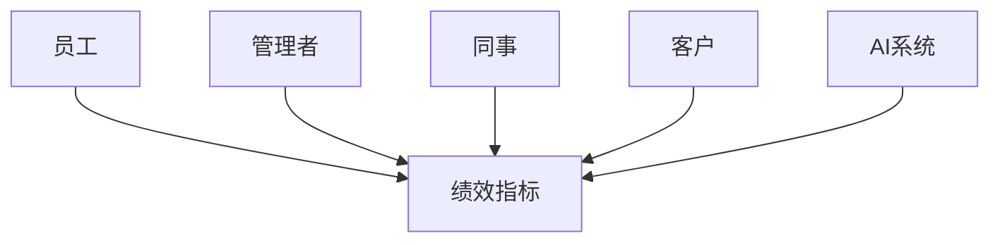
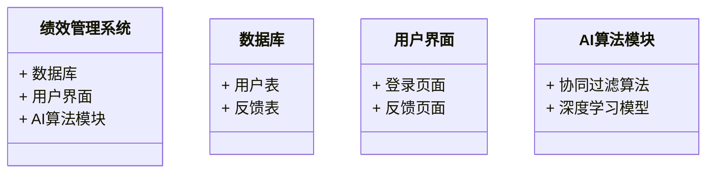
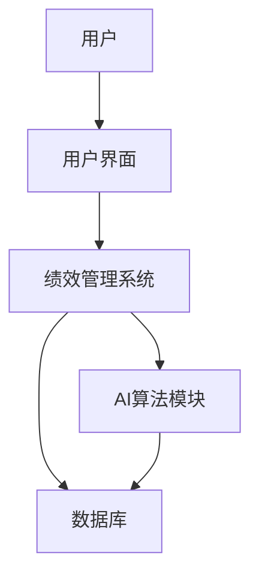
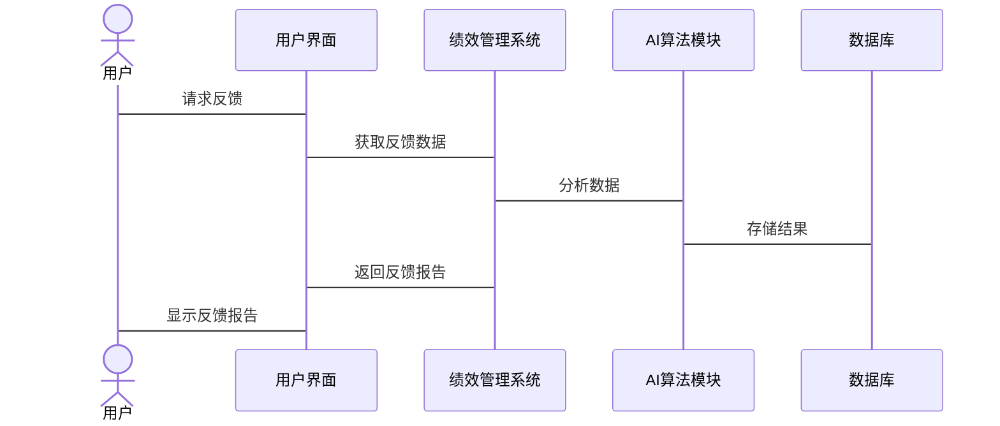

                 


# AI驱动的企业绩效管理：360度反馈与实时coaching的智能化

## 关键词：AI, 绩效管理, 360度反馈, 实时coaching, 智能化, 协同过滤, 深度学习

## 摘要：随着人工智能技术的迅速发展，企业绩效管理正经历一场深刻的变革。传统的绩效管理依赖于定期评估和反馈，这种方式往往滞后且缺乏针对性。通过AI技术，我们可以实现360度反馈的智能化和实时coaching，这不仅提高了反馈的及时性，还使管理者能够更精准地识别员工的优势与改进点。本文将深入探讨AI如何重构企业绩效管理，详细分析其核心算法、系统架构及实际应用场景，为企业的绩效管理提供新的思路和解决方案。

---

# 第一部分：AI驱动的企业绩效管理概述

## 第1章：背景与概述

### 1.1 问题背景与描述

#### 1.1.1 传统企业绩效管理的挑战
传统的绩效管理主要依赖于定期的评估和反馈，这种方式存在以下问题：
- **滞后性**：月度或季度评估无法及时反映员工的工作表现。
- **片面性**：通常只关注上级的反馈，忽视同事和下属的意见。
- **主观性**：评估结果可能受到主观因素的影响，缺乏客观数据支持。

#### 1.1.2 360度反馈与实时 coaching 的重要性
360度反馈是一种多维度的评估方法，通过收集来自同事、下属、上级以及客户的意见，提供全面的反馈。实时coaching则是在工作过程中即时给予指导，帮助员工快速改进。

#### 1.1.3 AI在绩效管理中的应用潜力
AI技术可以通过分析大量数据，提供个性化的反馈和建议，优化绩效管理的效率和效果。

### 1.2 问题解决与边界

#### 1.2.1 AI如何优化绩效管理流程
AI可以通过自动化数据处理、实时反馈生成和个性化建议，优化绩效管理的效率和效果。

#### 1.2.2 360度反馈系统的边界与外延
360度反馈系统通常包括数据收集、分析和反馈生成三个阶段。

#### 1.2.3 实时 coaching 的应用场景
实时coaching可以在销售、客服、培训等多个场景中应用，帮助员工快速提升技能。

### 1.3 核心概念与组成

#### 1.3.1 绩效管理的核心要素
- 数据收集：包括员工的工作表现、行为数据等。
- 数据分析：通过AI算法对数据进行处理和分析。
- 反馈生成：基于分析结果生成个性化的反馈和建议。

#### 1.3.2 360度反馈的结构
- 数据来源：来自不同角色的反馈。
- 数据分析：通过AI算法整合和分析数据。
- 反馈输出：生成全面的反馈报告。

#### 1.3.3 实时 coaching 的机制
- 数据采集：实时采集员工的工作数据。
- 数据分析：快速分析数据并生成建议。
- 反馈输出：即时反馈给员工。

---

# 第二部分：核心概念与联系

## 第2章：核心概念分析

### 2.1 核心概念原理

#### 2.1.1 绩效管理的AI驱动模型
AI驱动的绩效管理模型包括数据收集、数据分析和反馈生成三个阶段。

#### 2.1.2 360度反馈的多维度评估
360度反馈通过收集多方面的数据，提供全面的评估结果。

#### 2.1.3 实时 coaching 的动态调整
实时coaching可以根据员工的实时表现，动态调整反馈内容。

### 2.2 概念对比表

| 比较维度 | 传统绩效管理 | AI驱动绩效管理 |
|----------|--------------|----------------|
| 数据来源 | 单一来源      | 多维度来源     |
| 反馈时间 | 定期反馈      | 实时反馈       |
| 反馈内容 | 标准化内容    | 个性化内容     |

### 2.3 ER实体关系图



---

# 第三部分：算法原理讲解

## 第3章：算法原理

### 3.1 协同过滤算法

#### 3.1.1 基于用户的协同过滤
基于用户的行为和偏好，推荐相似的用户进行反馈。

#### 3.1.2 基于物品的协同过滤
基于物品的相似性，推荐相关的反馈内容。

#### 3.1.3 混合协同过滤模型
结合用户和物品的特征，生成更准确的反馈建议。

### 3.2 深度学习模型

#### 3.2.1 基于RNN的反馈预测
使用循环神经网络（RNN）对反馈内容进行预测。

#### 3.2.2 基于CNN的反馈分类
使用卷积神经网络（CNN）对反馈内容进行分类。

#### 3.2.3 基于Transformer的反馈生成
使用Transformer模型生成个性化的反馈内容。

### 3.3 算法实现

#### 3.3.1 协同过滤算法实现
```python
def collaborative_filtering(user_id):
    # 获取用户历史评分
    ratings = get_user_ratings(user_id)
    # 计算相似用户
    similar_users = find_similar_users(ratings)
    # 预测目标用户的评分
    predicted_ratings = predict_ratings(similar_users)
    return predicted_ratings
```

#### 3.3.2 深度学习模型实现
```python
import tensorflow as tf
model = tf.keras.Sequential([
    tf.keras.layers.Embedding(input_dim=1000, output_dim=64),
    tf.keras.layers.LSTM(64),
    tf.keras.layers.Dense(1, activation='sigmoid')
])
model.compile(optimizer='adam', loss='binary_crossentropy')
```

---

# 第四部分：系统分析与架构设计

## 第4章：系统架构设计

### 4.1 问题场景介绍

#### 4.1.1 绩效管理系统的功能需求
- 数据收集：收集员工的工作数据。
- 数据分析：分析数据并生成反馈。
- 反馈输出：输出个性化的反馈报告。

### 4.2 系统功能设计

#### 4.2.1 领域模型设计


#### 4.2.2 系统架构设计


#### 4.2.3 系统接口设计
- 用户界面与绩效管理系统的接口。
- 绩效管理系统与AI算法模块的接口。
- 绩效管理系统与数据库的接口。

#### 4.2.4 系统交互设计


---

# 第五部分：项目实战

## 第5章：项目实战

### 5.1 环境安装

#### 5.1.1 安装Python
```bash
python --version
pip install --upgrade pip
```

#### 5.1.2 安装必要的库
```bash
pip install numpy pandas scikit-learn tensorflow
```

### 5.2 核心实现

#### 5.2.1 数据预处理
```python
import pandas as pd
data = pd.read_csv('feedback.csv')
```

#### 5.2.2 模型训练
```python
from sklearn.metrics.pairwise import cosine_similarity
similarity_matrix = cosine_similarity(data)
```

#### 5.2.3 模型预测
```python
def predict_feedback(user_id):
    similar_users = find_similar_users(user_id)
    predicted_feedback = similar_users.mean()
    return predicted_feedback
```

### 5.3 案例分析

#### 5.3.1 案例场景
某公司销售团队使用AI驱动的绩效管理系统，实时监控销售表现并给予反馈。

#### 5.3.2 数据分析与结果
通过AI算法，系统能够快速分析销售数据并生成实时反馈，帮助销售人员提升业绩。

---

# 第六部分：最佳实践

## 第6章：最佳实践

### 6.1 小结
AI驱动的绩效管理能够显著提高反馈的及时性和准确性，帮助员工和企业实现更好的绩效。

### 6.2 注意事项
- 数据隐私保护
- 算法的可解释性
- 系统的稳定性

### 6.3 拓展阅读
- 推荐书籍：《人工智能：一种现代的方法》
- 推荐博客：https://towardsdatascience.com

---

# 作者信息

作者：AI天才研究院 & 禅与计算机程序设计艺术

---

以上是《AI驱动的企业绩效管理：360度反馈与实时coaching的智能化》的技术博客文章的完整目录和内容概览。通过系统的分析和实际案例的讲解，读者可以深入理解AI如何重构企业绩效管理，并在实际应用中提升管理效率和效果。

