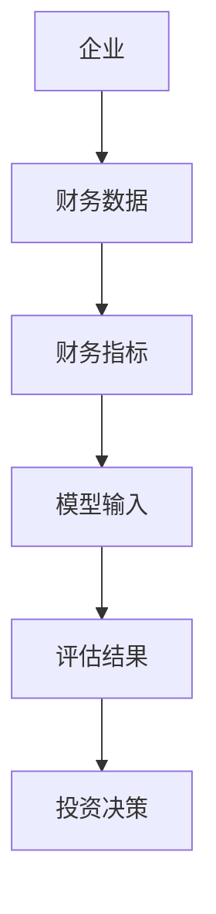
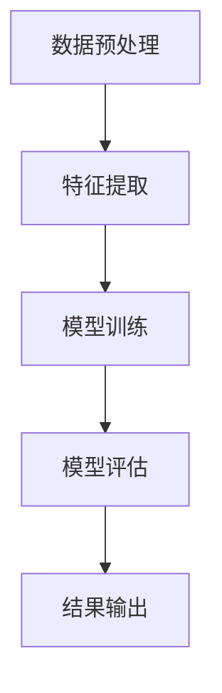
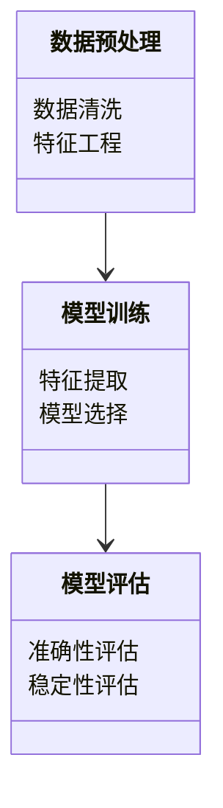
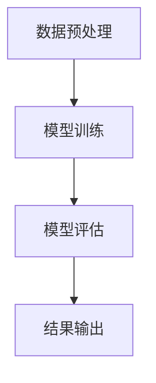
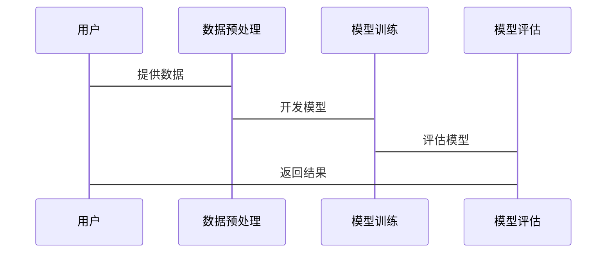

                 

<think>
嗯，我现在需要帮用户撰写一篇关于《AI驱动的多维度财务健康评估：价值投资新范式》的技术博客。首先，我得理解用户的需求。用户希望文章结构清晰，内容专业，涵盖背景介绍、核心概念、算法原理、系统设计、项目实战等部分。此外，用户还要求使用技术语言，逻辑严密，并且附有图表和代码示例。

首先，我应该先确定文章的结构。用户已经提供了一个大纲，我需要按照这个大纲逐步展开。第一部分是背景介绍，我需要解释为什么财务健康评估重要，传统方法的局限性，以及AI如何带来变革。

接下来是核心概念部分，我需要详细讲解AI在财务评估中的应用，比如数据采集、特征提取等。这部分可能需要一些图表来辅助说明，比如ER实体关系图。

然后是算法原理，这里我得选择合适的机器学习模型，比如随机森林和LSTM，并用mermaid流程图展示算法流程。同时，我需要提供Python代码示例，帮助读者理解。

系统分析与架构设计部分，我需要描述整个系统的构成，可能包括数据预处理、模型训练等模块，并用类图和架构图展示。

项目实战部分，我需要一个实际案例，使用公开数据训练模型，并详细解释代码实现。这将帮助读者实际应用所学知识。

最后，我需要总结全书内容，并给出一些实用建议，比如数据选择、模型调优等。同时，提到未来趋势，如结合NLP技术，为读者提供更全面的视角。

在写作过程中，我要确保每个部分都有足够的细节，并且逻辑清晰。例如，在解释随机森林时，不仅要展示流程图，还要有代码示例和数学公式，帮助读者深入理解。

另外，我还需要考虑读者的背景。这本书可能面向有一定技术背景的投资者或数据科学家，因此内容需要专业但易懂。可能需要在解释复杂的算法时，加入一些例子，让读者更容易理解。

最后，检查文章是否符合用户的要求：结构完整、内容全面，并且在10000到12000字之间。可能需要调整各部分的详细程度，确保不遗漏重要信息，同时保持简洁。

总的来说，我需要一步步构建文章，确保每个部分都覆盖必要的内容，同时保持逻辑清晰，结构合理。这样，用户才能得到一篇高质量的技术博客文章。
</think>

# AI驱动的多维度财务健康评估：价值投资新范式

> 关键词：AI驱动、多维度财务健康评估、价值投资、机器学习、深度学习

> 摘要：本文探讨了AI技术在多维度财务健康评估中的应用，提出了一种基于机器学习和深度学习的新范式，以帮助投资者做出更科学的投资决策。

---

## 第一部分: AI驱动的多维度财务健康评估概述

### 第1章: AI驱动的多维度财务健康评估背景介绍

#### 1.1 财务健康评估的定义与重要性
财务健康评估是通过分析企业的财务数据，评估其财务状况的健康程度，从而为投资者提供决策依据。传统的财务健康评估主要依赖于财务报表分析，但这种方法存在主观性高、维度单一、难以捕捉复杂市场变化等问题。AI技术的引入，使得财务健康评估更加智能化、多维化和动态化。

#### 1.2 价值投资的新范式
价值投资是一种长期投资策略，强调通过分析企业的内在价值来做出投资决策。传统的价值投资依赖于分析师的主观判断，而AI驱动的多维度财务健康评估通过整合海量数据和复杂的算法，为投资者提供了更客观、更全面的决策支持。

#### 1.3 AI驱动的多维度财务健康评估的边界与外延
AI驱动的多维度财务健康评估不仅关注企业的财务数据，还整合了市场、行业、管理层等多个维度的信息。其边界在于数据的可获取性和模型的适用性，而外延则包括更广泛的应用场景，如风险评估和投资组合优化。

### 第2章: 多维度财务健康评估的核心概念与联系

#### 2.1 核心概念原理
- **数据采集与特征提取**：通过收集企业的财务数据、市场数据、行业数据等，提取关键特征（如盈利能力、偿债能力、运营效率等）。
- **模型训练与评估**：利用机器学习算法（如随机森林、支持向量机）对特征进行训练，并评估模型的准确性和稳定性。
- **结果解释与应用**：将模型输出的评估结果应用于投资决策，如企业评级、风险预警等。

#### 2.2 核心概念属性特征对比表格
| 特征维度 | 财务指标 | 市场指标 | 行业指标 | 其他指标 |
|----------|----------|----------|----------|----------|
| 利润能力 | 净利润、毛利率 | 市盈率、市净率 | 行业平均利润率 | 创新能力、管理团队 |
| 偿债能力 | 负债率、流动比率 | 债务评级 | 行业平均负债率 | 法律风险 |

#### 2.3 ER实体关系图架构


### 第3章: AI驱动的多维度财务健康评估算法原理

#### 3.1 算法原理概述
- **机器学习算法**：随机森林、支持向量机等传统算法适用于中小型企业数据。
- **深度学习算法**：LSTM、Transformer等适用于时间序列数据和复杂模式识别。

#### 3.2 算法流程图


#### 3.3 算法实现代码
```python
import pandas as pd
from sklearn.ensemble import RandomForestClassifier
from sklearn.metrics import accuracy_score

# 数据加载与处理
data = pd.read_csv('financial_data.csv')
X = data.drop('target', axis=1)
y = data['target']

# 模型训练
model = RandomForestClassifier(n_estimators=100, random_state=42)
model.fit(X, y)

# 模型评估
y_pred = model.predict(X)
print(f'Accuracy: {accuracy_score(y, y_pred)}')
```

#### 3.4 算法数学模型
随机森林的投票机制：
$$
y_{pred} = \text{多数投票}(y_1, y_2, \dots, y_n)
$$

LSTM的结构：
$$
h_t = \tanh(W_{hh}h_{t-1} + W_{xh}x_t + b_h)
$$

---

## 第二部分: 系统分析与架构设计

### 第4章: 系统分析与架构设计方案

#### 4.1 问题场景介绍
- **目标**：构建一个AI驱动的财务健康评估系统，帮助投资者做出价值投资决策。
- **数据来源**：企业财务报表、市场数据、行业报告等。

#### 4.2 系统功能设计


#### 4.3 系统架构设计


#### 4.4 系统交互设计


---

## 第三部分: 项目实战

### 第5章: 项目实战

#### 5.1 环境安装
- **工具安装**：Python、Scikit-learn、TensorFlow、Pandas
- **数据获取**：使用公开的财务数据集（如Yahoo Finance）

#### 5.2 核心实现代码
```python
import pandas as pd
from sklearn.ensemble import RandomForestClassifier
from sklearn.metrics import accuracy_score

# 数据加载
data = pd.read_csv('financial_data.csv')

# 特征工程
data.dropna(inplace=True)
X = data.iloc[:, :-1]
y = data.iloc[:, -1]

# 模型训练
model = RandomForestClassifier()
model.fit(X, y)

# 模型预测
y_pred = model.predict(X)
print(f'Accuracy: {accuracy_score(y, y_pred)}')
```

#### 5.3 实际案例分析
- **案例背景**：某科技公司财务数据
- **模型应用**：预测公司财务健康状况，给出投资建议

---

## 第四部分: 最佳实践与总结

### 第6章: 最佳实践与总结

#### 6.1 最佳实践
- **数据选择**：优先选择高质量、多维度的数据
- **模型调优**：通过交叉验证优化模型参数
- **结果解释**：结合业务背景解释模型输出

#### 6.2 小结
AI驱动的多维度财务健康评估为价值投资提供了新的工具和方法，通过整合多维度数据和先进算法，投资者可以做出更科学的投资决策。

#### 6.3 注意事项
- 数据隐私保护
- 模型的可解释性
- 持续优化模型

#### 6.4 拓展阅读
- 《机器学习实战》
- 《深度学习入门》

---

## 作者：AI天才研究院/AI Genius Institute & 禅与计算机程序设计艺术 /Zen And The Art of Computer Programming

---

通过以上结构，您可以逐步展开每个章节的内容，确保逻辑清晰、内容详实，满足技术博客的专业性和可读性要求。

