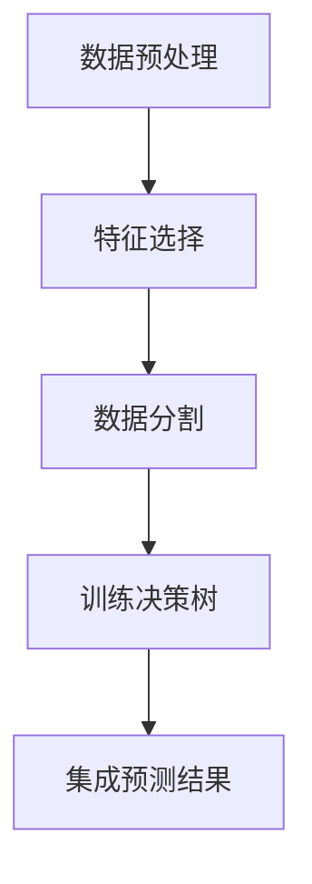
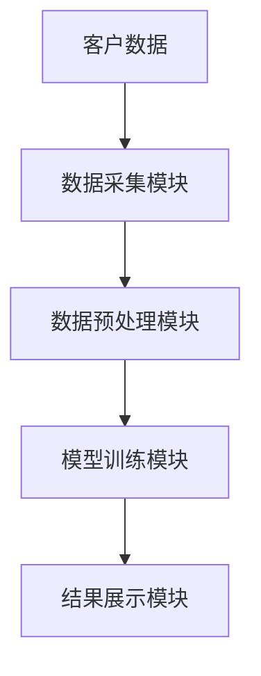

                 

<think>
好的，我需要撰写一篇关于AI驱动的客户粘性分析的技术博客文章。首先，我需要理解客户粘性分析的定义和其对公司长期收入质量的影响。客户粘性指的是客户对公司的产品或服务的依赖程度，高粘性意味着客户更可能长期使用公司的产品，从而提高公司的收入稳定性。

接下来，我需要了解AI在客户粘性分析中的应用。AI可以通过分析大量的客户数据，识别出客户的消费习惯、偏好和行为模式，从而预测客户的粘性。这可以通过机器学习模型来实现，例如逻辑回归、随机森林等算法。

然后，我需要考虑如何设计文章的结构。首先，应该介绍客户粘性分析的基本概念和背景，然后详细讲解AI在其中的作用。接着，可以讨论客户粘性分析的核心因素，如客户行为、满意度和产品依赖度等，并通过表格和图表来展示这些因素之间的关系。

接下来，我需要深入讲解AI驱动客户粘性分析的算法原理。选择一个具体的机器学习模型，如逻辑回归，详细解释其工作原理，并通过mermaid流程图展示模型的训练和预测过程。同时，提供Python代码示例，帮助读者理解如何实现这些模型。

系统架构设计也是重要的一部分。我需要描述一个AI驱动的客户粘性分析系统的整体架构，包括数据采集模块、模型训练模块和结果展示模块。使用mermaid架构图展示系统的组成部分及其交互关系。

最后，我需要通过一个实际案例来展示如何应用这些分析方法。从数据预处理到模型训练，再到结果解读，详细描述每一步的操作，并分析案例结果，总结经验教训。

在写作过程中，我需要确保内容逻辑清晰，结构紧凑，语言专业且易于理解。同时，合理使用表格、图表和代码示例，以增强文章的可读性和实用性。这不仅帮助读者更好地理解AI在客户粘性分析中的应用，还能为他们提供实际操作的指导。

总结一下，我的思考过程包括：理解客户粘性分析的基本概念，了解AI在其中的作用，设计文章结构，详细讲解算法原理和系统架构，最后通过实际案例进行分析。通过这样的步骤，我可以系统地撰写一篇高质量的技术博客文章，满足读者对AI驱动客户粘性分析的深入了解需求。
</think>

# AI驱动的客户粘性分析：评估公司的长期收入质量

## 关键词：客户粘性分析、AI驱动、长期收入质量、机器学习、客户行为分析

## 摘要：  
本文将深入探讨AI驱动的客户粘性分析，分析如何通过机器学习技术评估公司的长期收入质量。从客户行为分析到产品依赖度评估，再到客户满意度预测，我们将一步步揭示AI如何助力企业优化客户关系管理，提升客户保留率，从而实现可持续的收入增长。

---

## 第1章: 客户粘性分析概述

### 1.1 什么是客户粘性  
客户粘性（Customer Churn）指的是客户停止使用公司产品或服务的行为。高客户粘性意味着客户对公司产品或服务的高度依赖，从而提高公司的长期收入稳定性。  

#### 1.1.1 客户粘性的定义  
客户粘性可以通过以下公式计算：  
$$客户粘性 = 1 - \frac{\text{客户流失率}}{\text{客户保留率}}$$  

#### 1.1.2 客户粘性的核心要素  
客户粘性分析的核心要素包括：  
1. 客户行为：客户的购买频率、购买金额和购买时间。  
2. 客户满意度：客户对产品或服务的满意程度。  
3. 产品依赖度：客户对产品的依赖程度。  

#### 1.1.3 客户粘性与公司收入质量  
客户粘性高的客户通常具有更高的生命周期价值（Customer Lifetime Value, CLV），从而为公司带来更稳定的收入来源。

---

### 1.2 AI驱动客户粘性分析的背景  

#### 1.2.1 数据驱动决策的兴起  
随着大数据技术的发展，企业越来越多地依赖数据驱动的决策来优化业务流程。  

#### 1.2.2 AI在商业分析中的应用  
AI技术（如机器学习和自然语言处理）被广泛应用于客户行为分析、市场预测和风险评估等领域。  

#### 1.2.3 客户粘性分析的演变  
传统的客户粘性分析主要依赖于统计方法，而AI驱动的客户粘性分析则通过机器学习模型实现更精准的预测和分析。

---

### 1.3 AI驱动客户粘性分析的意义  

#### 1.3.1 提升客户保留率  
通过AI技术预测客户流失风险，企业可以采取主动措施（如优惠活动或个性化服务）来降低客户流失率。  

#### 1.3.2 优化收入结构  
AI驱动的客户粘性分析可以帮助企业识别高价值客户，并制定针对性的营销策略，从而优化收入结构。  

#### 1.3.3 提高客户生命周期价值  
通过分析客户的消费行为和偏好，企业可以为客户提供更个性化的服务，从而提高客户的生命周期价值。

---

## 第2章: 客户粘性分析的核心概念与联系  

### 2.1 客户行为分析  

#### 2.1.1 客户行为的定义  
客户行为是指客户在购买和使用产品或服务过程中的具体行为，包括购买频率、购买金额和购买时间等。  

#### 2.1.2 客户行为的分类  
客户行为可以分为以下几类：  
1. **主动行为**：客户主动购买或使用产品。  
2. **被动行为**：客户被动接受产品或服务。  
3. **潜在行为**：客户可能在未来购买产品或服务。  

#### 2.1.3 客户行为与粘性分析的关系  
客户行为是客户粘性分析的重要组成部分，通过分析客户的购买频率和金额，可以预测客户的粘性程度。

---

### 2.2 客户满意度分析  

#### 2.2.1 客户满意度的定义  
客户满意度是指客户对产品或服务的满意程度，通常通过调查问卷或数据分析来衡量。  

#### 2.2.2 客户满意度的测量方法  
客户满意度可以通过以下方法进行测量：  
1. 调查问卷：通过问卷调查收集客户对产品或服务的评价。  
2. 数据分析：通过分析客户的行为数据来推断客户满意度。  

#### 2.2.3 客户满意度与粘性分析的关系  
客户满意度高的客户通常具有更高的粘性，从而更有可能长期使用公司的产品或服务。

---

### 2.3 产品依赖度分析  

#### 2.3.1 产品依赖度的定义  
产品依赖度是指客户对特定产品或服务的依赖程度，通常通过客户购买的频率和金额来衡量。  

#### 2.3.2 产品依赖度的测量方法  
产品依赖度可以通过以下方法进行测量：  
1. 购买频率：客户在一定时间内购买产品的次数。  
2. 购买金额：客户每次购买的金额。  

#### 2.3.3 产品依赖度与粘性分析的关系  
产品依赖度高的客户通常具有更高的粘性，从而更有可能长期使用公司的产品或服务。

---

### 2.4 客户粘性分析的核心要素对比  

| 核心要素       | 定义                           | 对粘性分析的影响               |
|----------------|--------------------------------|--------------------------------|
| 客户行为       | 客户购买和使用产品的方式         | 影响客户粘性程度               |
| 客户满意度     | 客户对产品或服务的满意程度       | 客户满意度高，粘性程度高         |
| 产品依赖度     | 客户对特定产品或服务的依赖程度   | 产品依赖度高，粘性程度高         |

---

## 第3章: AI驱动客户粘性分析的算法原理  

### 3.1 机器学习模型在客户粘性分析中的应用  

#### 3.1.1 逻辑回归模型  
逻辑回归是一种常用的分类算法，适用于二分类问题（如客户流失或保留）。  

#### 3.1.2 随机森林模型  
随机森林是一种基于决策树的集成学习算法，适用于处理高维数据和非线性关系。  

---

### 3.2 算法原理详解  

#### 3.2.1 逻辑回归模型的数学公式  
逻辑回归的损失函数可以表示为：  
$$ L(\theta) = -\sum_{i=1}^{n} [y_i \ln(h(x_i)) + (1 - y_i) \ln(1 - h(x_i))] $$  
其中，$h(x_i) = \frac{e^{\theta^T x_i}}{1 + e^{\theta^T x_i}}$ 是逻辑回归函数。  

#### 3.2.2 随机森林模型的流程图  


---

### 3.3 算法实现与代码示例  

#### 3.3.1 逻辑回归模型的Python代码  
```python
import numpy as np
from sklearn.linear_model import LogisticRegression

# 数据预处理
X = np.array([[1, 2], [3, 4], [5, 6]])
y = np.array([0, 1, 1])

# 模型训练
model = LogisticRegression()
model.fit(X, y)

# 模型预测
print(model.predict(X))
```

---

## 第4章: 系统分析与架构设计  

### 4.1 系统功能设计  

#### 4.1.1 数据采集模块  
数据采集模块负责收集客户的购买行为、满意度和产品依赖度等数据。  

#### 4.1.2 模型训练模块  
模型训练模块负责使用机器学习算法（如逻辑回归或随机森林）对客户数据进行训练，生成客户粘性预测模型。  

#### 4.1.3 结果展示模块  
结果展示模块负责将客户粘性预测结果以可视化形式呈现给企业决策者。

---

### 4.2 系统架构设计  

#### 4.2.1 系统架构图  


---

## 第5章: 项目实战  

### 5.1 环境安装与数据预处理  

#### 5.1.1 环境安装  
需要安装以下Python库：  
- pandas  
- numpy  
- scikit-learn  

#### 5.1.2 数据预处理  
```python
import pandas as pd
import numpy as np

# 数据加载
data = pd.read_csv('customer_data.csv')

# 数据清洗
data.dropna(inplace=True)
```

---

### 5.2 模型训练与结果分析  

#### 5.2.1 模型训练  
```python
from sklearn.model_selection import train_test_split
from sklearn.metrics import accuracy_score

# 数据分割
X_train, X_test, y_train, y_test = train_test_split(data.drop('churn', axis=1), data['churn'], test_size=0.2)

# 模型训练
model = LogisticRegression()
model.fit(X_train, y_train)

# 模型预测
y_pred = model.predict(X_test)
print("准确率:", accuracy_score(y_test, y_pred))
```

---

## 第6章: 总结与展望  

### 6.1 总结  
本文详细介绍了AI驱动的客户粘性分析，从核心概念到算法原理，再到系统设计和项目实战，全面解析了如何利用AI技术提升客户的粘性，从而优化公司的长期收入质量。  

### 6.2 未来展望  
随着AI技术的不断发展，客户粘性分析将更加精准和智能化，为企业提供更有力的支持。

---

## 作者：AI天才研究院/AI Genius Institute & 禅与计算机程序设计艺术 /Zen And The Art of Computer Programming

