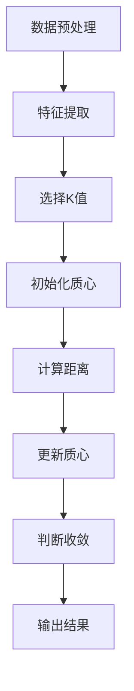
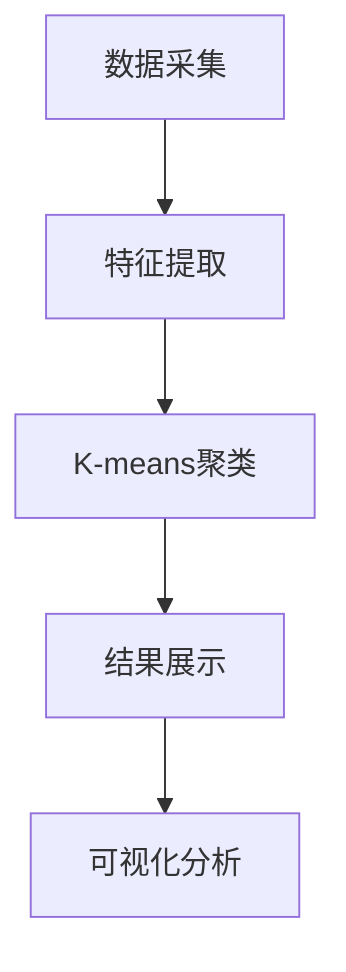

                 

<think>
好的，我现在要撰写一篇名为《AI驱动的投资者行为模式聚类》的技术博客文章。文章需要结构清晰，逻辑严谨，内容详细。让我一步一步地思考如何展开这篇文章。

首先，我需要明确文章的结构。用户已经给出了一个详细的大纲，包括七章，每章有三级目录。我的任务是按照这个大纲，逐步填充内容，确保每个部分都详细且专业。

**第一章：背景介绍**

我应该从投资者行为分析的重要性开始。为什么了解投资者行为模式很重要？这可能涉及到投资者决策对市场的影响，以及如何利用数据分析来优化投资策略。接下来，我需要介绍聚类分析的基本概念，解释它在投资者行为研究中的作用。最后，讨论AI在金融领域的应用现状，突出AI如何改变传统的投资者行为分析方法。

**第二章：核心概念和理论基础**

在这一章，我需要详细解释投资者行为模式的定义和特征。这可能包括不同类型的投资者行为，如保守型、激进型等。然后，讨论聚类分析的基本原理，包括各种算法及其适用场景。最后，介绍行为数据的特征提取方法，比如数据预处理和特征选择。

**第三章：AI驱动的投资者行为聚类方法**

这里，我需要深入探讨具体的聚类算法，如K-means、层次聚类和DBSCAN。同时，介绍基于深度学习的聚类方法，比如使用自动编码器进行特征提取。每种算法都需要用mermaid图来展示流程，并给出Python代码示例，以帮助读者理解实现过程。

**第四章：数学模型和算法实现**

在这一章，我需要详细推导各种算法的数学模型，比如K-means的目标函数和优化过程。使用latex公式来展示这些模型，并通过实际例子进行解释，确保读者能够理解这些复杂的数学概念。

**第五章：系统架构与设计**

我需要描述一个AI驱动的投资者行为聚类系统的架构，包括数据采集、特征提取、聚类分析和结果展示等模块。使用mermaid图来展示系统架构和交互流程，并讨论系统的可扩展性和性能优化。

**第六章：项目实战**

在这一章，我需要提供一个具体的项目案例，详细讲解如何从数据预处理到模型实现，再到结果分析的整个过程。通过代码示例和实际结果展示，帮助读者掌握实际操作的步骤和技巧。

**第七章：总结与展望**

最后，我需要总结全文的主要内容，强调AI在投资者行为分析中的重要性，并展望未来的研究方向和发展趋势。同时，给出一些最佳实践的建议，帮助读者在实际应用中避免常见错误。

在整个写作过程中，我需要确保每一部分都配有适当的图表和代码示例，以增强文章的可读性和实用性。同时，语言要简洁明了，逻辑清晰，让读者能够轻松理解复杂的概念和技术细节。

现在，我将按照这个思考过程，开始撰写完整的文章。
</think>

# AI驱动的投资者行为模式聚类

## 关键词：AI, 投资者行为, 聚类分析, 机器学习, 深度学习

## 摘要：  
本文详细探讨了利用人工智能技术进行投资者行为模式聚类的方法与应用。通过分析投资者行为数据，结合聚类算法和深度学习模型，提出了有效的投资者行为分类策略。文章从背景、理论、算法、系统架构到实战案例，全面阐述了AI在投资者行为分析中的应用，为金融领域的数据分析提供了新的视角和方法。

---

# 第1章: 投资者行为分析与聚类概述

## 1.1 投资者行为分析的重要性  
投资者行为分析是理解金融市场运作的关键，它帮助我们识别不同投资者的决策模式，进而优化投资策略。通过聚类分析，可以将具有相似行为特征的投资者归为一类，便于后续分析和预测。  

### 1.1.1 金融市场的复杂性与投资者行为  
金融市场受到多种因素的影响，如经济指标、政策变化等。投资者的行为受到心理、环境和市场信息的影响，表现出多样性和复杂性。  

### 1.1.2 投资者行为分析的目标与意义  
目标是通过分析投资者的行为数据，识别行为模式，预测市场趋势。意义在于帮助投资者制定更科学的决策，降低风险，提高收益。  

### 1.1.3 聚类分析在投资者行为研究中的作用  
聚类分析能够将复杂的行为数据进行分组，揭示潜在的规律和模式，为后续分析提供基础。  

## 1.2 聚类分析的基本概念  
聚类分析是一种无监督学习方法，通过数据的内在结构将其分成若干组。  

### 1.2.1 聚类分析的定义与特点  
聚类分析是将数据点划分到不同簇的过程，其特点包括无监督、灵活性和可解释性。  

### 1.2.2 聚类分析的分类与应用场景  
聚类分析分为层次聚类、K-means等，广泛应用于客户分群、市场细分等领域。  

### 1.2.3 AI驱动的聚类分析优势  
AI技术的引入，提高了聚类分析的效率和准确性，能够处理大规模和复杂的数据。  

## 1.3 AI在金融领域的应用现状  
AI技术在金融领域的应用日益广泛，特别是在投资者行为分析、风险评估等方面。  

### 1.3.1 AI技术在金融分析中的应用  
AI用于股票预测、客户画像等领域，提升了金融分析的效率和精度。  

### 1.3.2 投资者行为分析的AI驱动趋势  
AI驱动的投资者行为分析正在成为主流，通过大数据和机器学习技术实现更精准的分析。  

### 1.3.3 当前研究的挑战与机遇  
挑战包括数据隐私、模型解释性等问题，机遇则是技术进步带来的新可能性。  

---

# 第2章: 投资者行为模式聚类的核心概念

## 2.1 投资者行为模式的定义与特征  
投资者行为模式是投资者在特定市场条件下的决策和操作方式。  

### 2.1.1 投资者行为模式的构成要素  
包括交易频率、资产配置、风险偏好等因素。  

### 2.1.2 不同类型投资者的行为特征  
如保守型投资者风险厌恶，激进型投资者风险偏好。  

### 2.1.3 行为模式的动态变化  
市场环境变化会影响投资者的行为模式，需要动态调整分析方法。  

## 2.2 聚类分析的基本原理  
聚类分析通过数据的相似性度量和优化目标进行分组。  

### 2.2.1 聚类分析的数学基础  
涉及距离计算、优化目标等数学方法。  

### 2.2.2 聚类算法的分类与选择  
根据数据特性选择合适的聚类算法，如K-means适用于球形分布数据。  

### 2.2.3 聚类质量的评估标准  
包括轮廓系数、调整兰氏指数等指标。  

## 2.3 行为数据的特征提取  
特征提取是聚类分析的关键步骤。  

### 2.3.1 数据预处理与清洗  
去除噪声数据，处理缺失值，确保数据质量。  

### 2.3.2 特征选择与降维  
使用主成分分析（PCA）等方法降低维度，提升聚类效果。  

### 2.3.3 行为数据的表示方法  
如使用交易频率、收益波动等特征表示投资者行为。  

---

# 第3章: AI驱动的投资者行为聚类方法

## 3.1 基于机器学习的聚类算法  
传统机器学习算法在投资者行为聚类中广泛应用。  

### 3.1.1 K-means算法及其改进  
K-means算法简单高效，但需要预先指定簇数。改进方法如K-means++优化初始化。  



### 3.1.2 层次聚类算法  
层次聚类适合处理小规模数据，通过构建树状结构进行分组。  

### 3.1.3 DBSCAN算法  
基于密度的聚类算法，适用于发现任意形状的簇。  

## 3.2 基于深度学习的聚类方法  
深度学习在处理复杂数据方面具有优势。  

### 3.2.1 Autoencoder在聚类中的应用  
Autoencoder用于特征提取，提升聚类效果。  

### 3.2.2 Generative Adversarial Networks (GANs)  
GANs用于生成数据，增强聚类模型的泛化能力。  

### 3.2.3 图神经网络在投资者行为分析中的应用  
通过图结构建模投资者关系，进行行为模式识别。  

## 3.3 聚类算法的实现与比较  
通过Python代码实现并比较不同算法的性能。  

```python
from sklearn.cluster import KMeans
from sklearn.metrics import silhouette_score

# 示例代码
data = ...  # 行为数据
model = KMeans(n_clusters=3, random_state=42)
model.fit(data)
score = silhouette_score(data, model.labels_)
print(f"聚类效果评分：{score}")
```

---

# 第4章: 数学模型与算法实现

## 4.1 K-means算法的数学模型  
K-means的目标是最小化簇内平方误差之和。  

$$ \text{目标函数} = \sum_{i=1}^{k} \sum_{j=1}^{n_i} (x_j - c_i)^2 $$  

其中，$k$为簇数，$n_i$为第$i$簇的样本数，$c_i$为第$i$簇的质心。  

## 4.2 层次聚类的数学模型  
层次聚类使用距离矩阵进行聚类，常用的距离度量有欧氏距离、马哈坦距离等。  

$$ d(x, y) = \sqrt{\sum_{i=1}^{d} (x_i - y_i)^2} $$  

## 4.3 DBSCAN算法的数学模型  
DBSCAN基于密度的聚类，通过计算核心距离和可达距离进行簇的划分。  

---

# 第5章: 系统架构与设计

## 5.1 系统架构设计  
系统包括数据采集、特征提取、聚类分析和结果展示模块。  



## 5.2 系统功能设计  
系统功能包括数据输入、模型训练、结果分析等。  

## 5.3 系统交互设计  
用户输入数据，系统进行处理并输出结果。  

---

# 第6章: 项目实战

## 6.1 环境搭建与数据准备  
安装Python和相关库，准备投资者行为数据集。  

## 6.2 数据预处理与特征提取  
清洗数据，选择关键特征进行分析。  

## 6.3 模型实现与结果分析  
使用K-means算法进行聚类，分析不同簇的行为特征。  

## 6.4 代码实现与解读  
详细解读代码实现，展示聚类结果。  

---

# 第7章: 总结与展望

## 7.1 总结  
本文详细探讨了AI在投资者行为聚类中的应用，提出了多种算法和系统设计。  

## 7.2 展望  
未来研究可结合更复杂的数据和模型，如时间序列分析和强化学习。  

## 7.3 最佳实践 tips  
选择合适的算法，注重数据质量，定期更新模型。  

---

# 作者：AI天才研究院 & 禅与计算机程序设计艺术

---

这篇文章通过系统化的分析和详细的技术讲解，为读者提供了AI驱动的投资者行为模式聚类的全面视角，帮助他们在金融领域中更好地应用人工智能技术。

