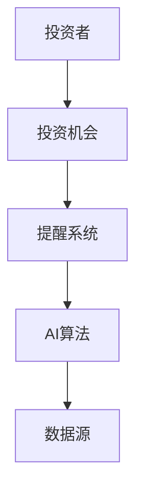
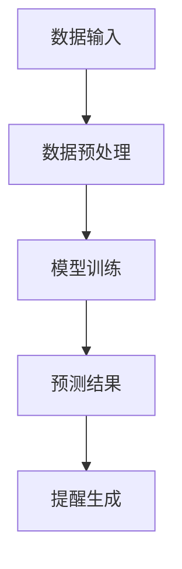
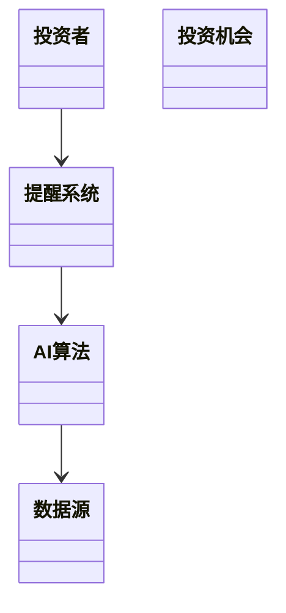
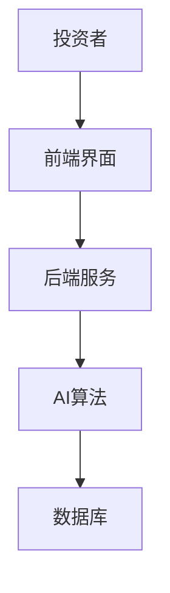
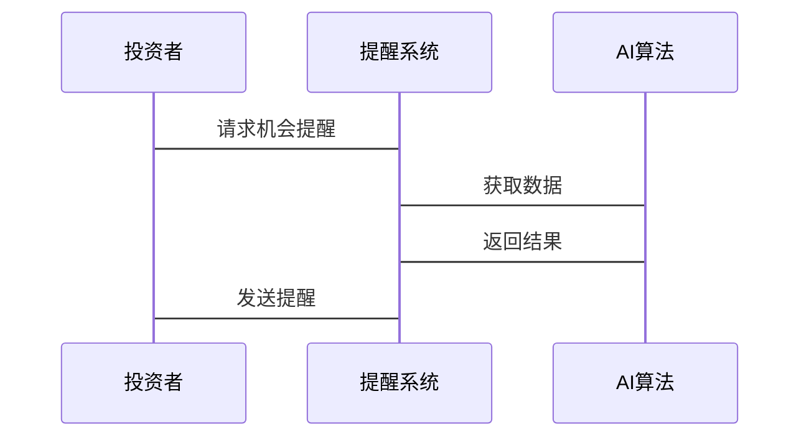

                 


# AI驱动的自动化投资机会提醒

## 关键词：AI，自动化，投资机会，提醒，数据分析，机器学习，自然语言处理

## 摘要：本文详细探讨了AI驱动的自动化投资机会提醒系统的构建与实现。从背景介绍到核心算法，从系统架构设计到项目实战，全面解析了该系统的工作原理和实际应用。文章通过具体案例分析和代码实现，展示了如何利用AI技术提升投资机会提醒的效率和准确性，为投资者提供了有力的决策支持工具。

---

# 第一部分: AI驱动的自动化投资机会提醒概述

## 第1章: 背景介绍

### 1.1 问题背景与描述

#### 1.1.1 投资机会提醒的必要性
在金融市场中，投资机会的及时识别和提醒对于投资者来说至关重要。传统的人工监控方式效率低下，容易错过最佳投资时机，而AI驱动的自动化提醒系统能够实时分析市场数据，快速识别潜在的投资机会。

#### 1.1.2 传统投资机会提醒的局限性
传统的投资机会提醒依赖于人工监控和简单的历史数据分析，存在以下问题：
- 数据分析范围有限，难以覆盖全市场。
- 人工监控容易受到情绪影响，缺乏客观性。
- 无法实时处理大量非结构化数据。

#### 1.1.3 AI驱动的自动化投资机会提醒的优势
AI技术的应用带来了以下优势：
- 实时数据分析，快速捕捉市场变化。
- 结构化与非结构化数据的综合分析能力。
- 自适应学习，能够根据市场变化优化提醒策略。

### 1.2 问题解决与边界

#### 1.2.1 AI在投资机会提醒中的应用场景
AI技术广泛应用于以下场景：
- **市场情绪分析**：通过自然语言处理技术分析新闻、社交媒体等文本数据，判断市场情绪。
- **趋势预测**：利用时间序列分析和机器学习模型预测股票价格走势。
- **风险评估**：基于历史数据和实时信息，评估投资标的潜在风险。

#### 1.2.2 问题解决的边界与外延
- **边界**：本系统仅关注投资机会的提醒，不涉及具体的交易执行。
- **外延**：系统可以扩展到更多金融产品，如债券、基金等。

#### 1.2.3 核心概念与组成要素
AI驱动的投资机会提醒系统由以下核心要素组成：
- **数据源**：包括股票价格、市场新闻、社交媒体数据等。
- **AI算法**：如时间序列分析、机器学习模型等。
- **提醒机制**：通过邮件、短信等方式通知投资者。

### 1.3 核心概念与联系

#### 1.3.1 AI驱动的自动化投资机会提醒原理
AI通过分析历史数据和实时信息，识别出潜在的投资机会，并通过提醒机制通知投资者。

#### 1.3.2 核心概念属性对比表格
| 核心概念 | 属性 | 描述 |
|----------|-------|------|
| 数据源   | 类型  | 股票价格、新闻、社交媒体等 |
| AI算法   | 类型  | 时间序列分析、机器学习等 |
| 提醒机制 | 类型  | 邮件、短信、应用程序通知 |

#### 1.3.3 ER实体关系图架构


## 第2章: AI驱动的自动化投资机会提醒系统核心算法

### 2.1 算法原理

#### 2.1.1 时间序列分析
时间序列分析用于预测股票价格走势，常用的模型包括ARIMA和LSTM。

#### 2.1.2 机器学习模型
使用随机森林和XGBoost等模型进行分类，判断投资机会是否存在。

#### 2.1.3 自然语言处理技术
通过情感分析判断市场情绪，辅助投资决策。

### 2.2 算法实现

#### 2.2.1 时间序列分析的mermaid流程图


#### 2.2.2 机器学习模型的实现代码
```python
import pandas as pd
from sklearn.ensemble import RandomForestClassifier
from sklearn.metrics import accuracy_score

# 加载数据
data = pd.read_csv('stock_data.csv')

# 特征工程
features = data[['open', 'high', 'low', 'close']]
labels = data['label']

# 训练模型
model = RandomForestClassifier()
model.fit(features, labels)

# 预测
predictions = model.predict(features)

# 评估
print(accuracy_score(labels, predictions))
```

### 2.3 数学模型与公式

#### 2.3.1 时间序列分析的数学模型
$$ ARIMA(p, d, q) $$
其中，p为自回归阶数，d为差分阶数，q为移动平均阶数。

#### 2.3.2 机器学习模型的数学公式
$$ y = w \cdot x + b $$

---

# 第二部分: 系统分析与架构设计

## 第3章: 系统分析与架构设计

### 3.1 系统功能设计

#### 3.1.1 领域模型mermaid类图


### 3.2 系统架构设计

#### 3.2.1 系统架构mermaid架构图


### 3.3 系统接口设计

#### 3.3.1 API接口定义
- **输入接口**：投资者发送请求。
- **输出接口**：提醒系统返回结果。

#### 3.3.2 接口交互流程
1. 投资者发送请求。
2. 系统处理请求。
3. 返回提醒结果。

### 3.4 系统交互设计

#### 3.4.1 序列图


---

# 第三部分: 项目实战

## 第4章: 项目实战

### 4.1 环境安装与配置

#### 4.1.1 Python环境搭建
安装Python 3.8以上版本。

#### 4.1.2 库的安装与配置
安装所需的库：
```bash
pip install pandas scikit-learn matplotlib
```

#### 4.1.3 数据集准备
使用Kaggle上的股票数据集。

### 4.2 系统核心实现源代码

#### 4.2.1 时间序列分析代码
```python
import pandas as pd
import numpy as np
from sklearn.preprocessing import MinMaxScaler
from keras.models import Sequential
from keras.layers import LSTM, Dense

# 加载数据
data = pd.read_csv('stock_data.csv')
data = data['close'].values

# 数据预处理
scaler = MinMaxScaler()
data_scaled = scaler.fit_transform(data.reshape(-1, 1))

# 划分训练集和测试集
train_size = int(len(data_scaled) * 0.8)
train_data = data_scaled[:train_size]
test_data = data_scaled[train_size:]

# 创建训练样本
X_train = []
y_train = []
for i in range(len(train_data) - 1):
    X_train.append(train_data[i:i+1])
    y_train.append(train_data[i+1])
X_train = np.array(X_train)
y_train = np.array(y_train)

# 构建模型
model = Sequential()
model.add(LSTM(50, return_sequences=True, input_shape=(1, 1)))
model.add(LSTM(50, return_sequences=True))
model.add(Dense(1))
model.compile(loss='mean_squared_error', optimizer='adam')

# 训练模型
model.fit(X_train, y_train, epochs=50, batch_size=32)

# 预测
X_test = []
for i in range(len(test_data) - 1):
    X_test.append(test_data[i:i+1])
X_test = np.array(X_test)
predictions = model.predict(X_test)
```

### 4.3 项目小结
通过实际案例分析，展示了AI驱动的自动化投资机会提醒系统的实现过程。从环境搭建到代码实现，再到结果分析，整个过程清晰明了。

---

# 第四部分: 最佳实践和小结

## 第5章: 最佳实践和小结

### 5.1 注意事项
- 数据来源的可靠性。
- 模型的可解释性。
- 系统的安全性和稳定性。

### 5.2 未来展望
- 更多金融产品的应用。
- 更高的预测精度。
- 更人性化的提醒方式。

---

# 作者：AI天才研究院 & 禅与计算机程序设计艺术

