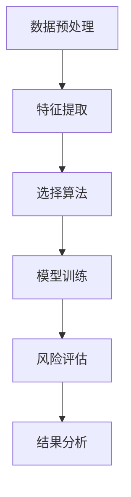
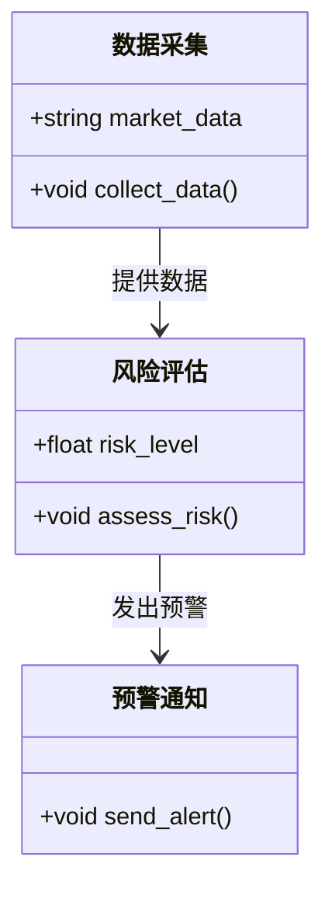
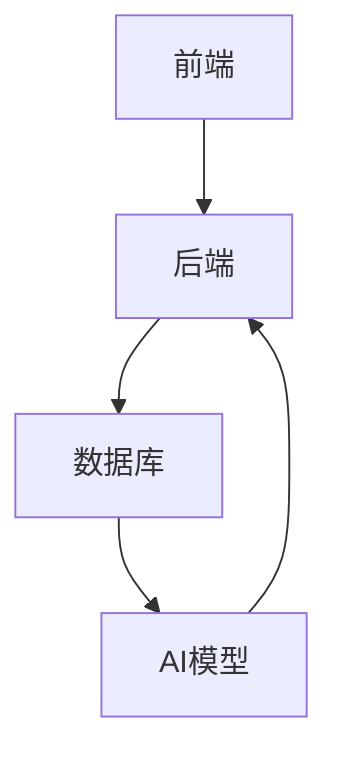
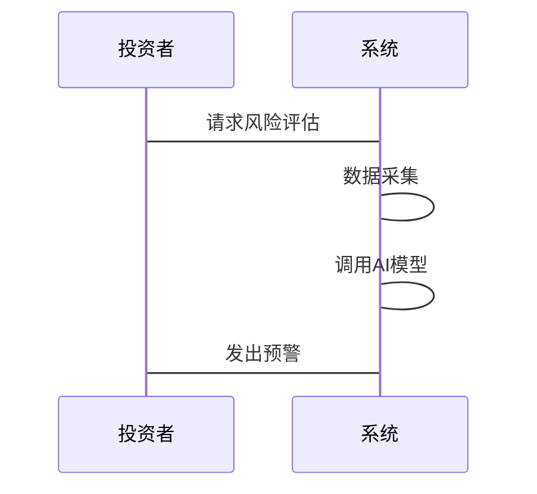

                 


# AI驱动的自适应投资风险预警

> **关键词**：AI，投资风险，预警系统，自适应，风险管理，机器学习，大数据

> **摘要**：本文详细探讨了AI在投资风险管理中的应用，特别是自适应风险预警系统的构建与实现。通过分析传统方法的局限性，提出基于AI的解决方案，并详细讲解了算法原理、系统架构设计、项目实战及优化策略，为投资风险管理提供了新的思路。

---

## 第1章：AI驱动的自适应投资风险预警背景

### 1.1 投资风险管理的现状与挑战

#### 1.1.1 投资风险管理的传统方法
投资风险管理是金融领域的重要组成部分，传统方法依赖于历史数据分析和统计模型，如VaR（Value at Risk）和CVaR（Conditional Value at Risk）。这些方法虽然提供了基本的风险评估，但存在以下问题：

- 数据依赖性强，难以捕捉市场变化的实时动态。
- 需要大量历史数据支持，面对新兴市场或突发事件时表现不足。
- 无法实时调整模型参数，难以应对快速变化的市场环境。

#### 1.1.2 传统方法的局限性
传统方法在处理复杂和动态的投资环境时显得力不从心。例如，金融危机或市场崩盘往往具有突发性和不可预测性，传统模型难以提前预警。此外，传统方法对市场参与者的行为分析较少，难以捕捉情绪和市场心理的变化。

#### 1.1.3 人工智能在投资风险管理中的作用
人工智能（AI）通过机器学习、自然语言处理和大数据分析，能够实时捕捉市场动态，识别潜在风险。AI能够处理非结构化数据，如新闻、社交媒体和公司财报，提供更全面的风险评估。此外，AI模型能够自适应调整，根据市场反馈优化预警机制，显著提高了风险预警的准确性和及时性。

---

## 第2章：自适应风险预警模型的核心概念

### 2.1 自适应风险预警模型的定义与特点

#### 2.1.1 模型的定义
自适应风险预警模型是一种基于AI的动态风险评估系统，能够根据市场环境的变化自适应调整预警策略。该模型通过实时数据处理和机器学习算法，识别潜在风险因素，并根据历史数据和当前市场状况进行风险评估。

#### 2.1.2 自适应机制的核心特征
自适应机制具有以下核心特征：
- **实时性**：能够实时处理市场数据，快速识别潜在风险。
- **动态性**：根据市场反馈不断优化模型参数。
- **自学习能力**：通过反馈机制学习新的风险特征，提升预警准确性。

#### 2.1.3 模型与传统风险预警模型的对比
| 对比维度 | 传统模型 | 自适应模型 |
|----------|----------|------------|
| 数据依赖 | 高 | 低 |
| 实时性 | 低 | 高 |
| 自适应性 | 无 | 有 |
| 预警准确性 | 中 | 高 |

### 2.2 自适应风险预警模型的构建框架

#### 2.2.1 数据流与模型结构
自适应风险预警模型的数据流包括：
1. 数据收集：从多个来源获取实时数据，如股票价格、新闻、社交媒体等。
2. 数据预处理：清洗和转换数据，提取特征。
3. 模型训练：使用机器学习算法训练模型。
4. 风险评估：根据模型输出结果进行风险预警。
5. 反馈机制：根据市场反馈优化模型。

#### 2.2.2 实体关系图（ER图）
```mermaid
erDiagram
    customer[CUSTOMER] {
        +string id
        +string name
        +string email
    }
    transaction[TRANSACTION] {
        +int id
        +int customerId
        +datetime date
        +float amount
    }
    risk预警[RISK预警] {
        +int id
        +int customerId
        +float riskLevel
        +datetime预警时间
    }
    customer --> transaction : 进行
    transaction --> risk预警 : 引发
```

---

## 第3章：自适应风险预警模型的算法原理

### 3.1 算法选择与流程

#### 3.1.1 时间序列分析
时间序列分析常用于预测市场走势。常用算法包括ARIMA（AutoRegressive Integrated Moving Average）和LSTM（Long Short-Term Memory）。

#### 3.1.2 机器学习模型
机器学习模型如随机森林和XGBoost可用于分类和回归任务，帮助识别风险因素。

#### 3.1.3 算法流程图


#### 3.1.4 算法实现
以下是使用LSTM的Python代码示例：
```python
import numpy as np
from keras.layers import LSTM, Dense
from keras.models import Sequential

# 数据准备
X_train = ...  # 形状 (samples, timesteps, features)
y_train = ...  # 形状 (samples, output)

# 模型构建
model = Sequential()
model.add(LSTM(64, input_shape=(timesteps, features)))
model.add(Dense(1))
model.compile(optimizer='adam', loss='mean_squared_error')

# 训练
model.fit(X_train, y_train, epochs=10, batch_size=32)
```

#### 3.1.5 数学模型与公式
LSTM的细胞状态更新公式：
$$
f_t = \sigma(g(x_t + W_f h_{t-1} + U_f s_{t-1}))
$$
其中，$f_t$ 是遗忘门，$g$ 是激活函数，$h_{t-1}$ 是前一时刻的隐藏状态，$s_{t-1}$ 是前一时刻的细胞状态。

---

## 第4章：系统分析与架构设计

### 4.1 系统分析

#### 4.1.1 问题场景介绍
系统需实时监控市场数据，识别潜在风险，并向投资者发出预警。主要功能包括数据采集、风险评估、预警通知和结果分析。

#### 4.1.2 系统功能设计


### 4.2 系统架构设计

#### 4.2.1 系统架构图


#### 4.2.2 接口设计
主要接口包括：
- 数据采集接口：从API获取市场数据。
- 风险评估接口：调用AI模型进行风险评估。
- 预警通知接口：向投资者发送预警信息。

#### 4.2.3 交互流程


---

## 第5章：项目实战

### 5.1 环境安装与配置

#### 5.1.1 Python环境搭建
安装Python 3.8及以上版本，建议使用Anaconda。

#### 5.1.2 库的安装与配置
安装必要的库：
```bash
pip install numpy pandas scikit-learn keras tensorflow
```

### 5.2 核心代码实现

#### 5.2.1 数据预处理
```python
import pandas as pd
import numpy as np

data = pd.read_csv('market_data.csv')
data = data.dropna()
```

#### 5.2.2 模型训练
```python
from sklearn.model_selection import train_test_split
from keras.models import Sequential
from keras.layers import LSTM, Dense

X_train, X_test, y_train, y_test = train_test_split(data_features, data_labels, test_size=0.2)
model = Sequential()
model.add(LSTM(64, input_shape=(timesteps, features)))
model.add(Dense(1))
model.compile(optimizer='adam', loss='mean_squared_error')
model.fit(X_train, y_train, epochs=10, batch_size=32)
```

#### 5.2.3 结果分析
训练完成后，评估模型性能：
```python
score = model.evaluate(X_test, y_test, verbose=0)
print('Test loss:', score[0])
print('Test accuracy:', score[1])
```

---

## 第6章：系统优化与扩展

### 6.1 系统优化

#### 6.1.1 算法优化
使用超参数调优技术，如网格搜索，优化模型性能。

#### 6.1.2 性能优化
采用分布式计算和并行处理，提升数据处理速度。

#### 6.1.3 可扩展性设计
设计模块化的系统架构，便于扩展功能和增加新模块。

### 6.2 系统扩展

#### 6.2.1 大数据处理
整合大数据平台，处理更大规模的数据集。

#### 6.2.2 多模型集成
结合多种AI模型，提升风险预警的准确性和鲁棒性。

#### 6.2.3 与其他系统的集成
与交易系统和投资组合管理系统集成，实现端到端的风险管理流程。

---

## 第7章：总结与展望

### 7.1 全书总结

#### 7.1.1 核心知识点回顾
本文详细讲解了AI驱动的自适应投资风险预警系统的构建与实现，涵盖算法原理、系统设计和项目实战等内容。

#### 7.1.2 自适应风险预警模型的优势
自适应模型能够实时捕捉市场动态，动态调整预警策略，显著提高了投资风险管理的效率和准确性。

### 7.2 未来展望

#### 7.2.1 技术发展趋势
随着AI技术的不断进步，自适应风险预警系统将更加智能化和自动化，可能结合区块链和边缘计算等新技术。

#### 7.2.2 应用领域的扩展
未来，自适应风险预警系统将不仅仅应用于金融领域，还可能扩展到其他风险较高的行业，如网络安全和公共安全。

#### 7.2.3 进一步学习建议
建议读者深入学习机器学习和时间序列分析，同时关注最新的研究成果和技术动态。

---

**作者：AI天才研究院 & 禅与计算机程序设计艺术**

