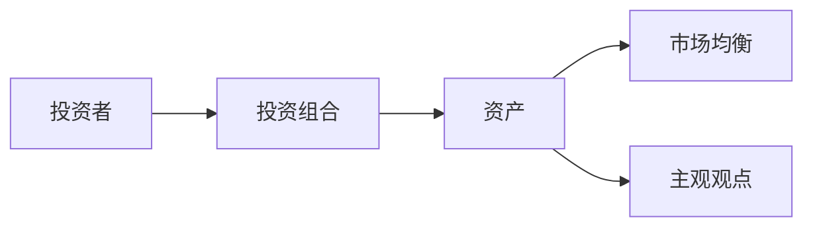
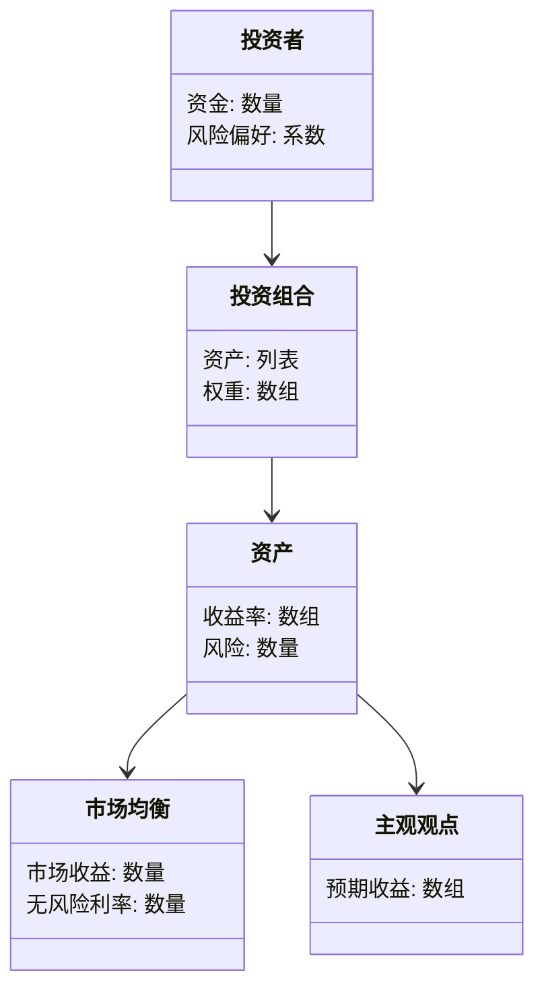
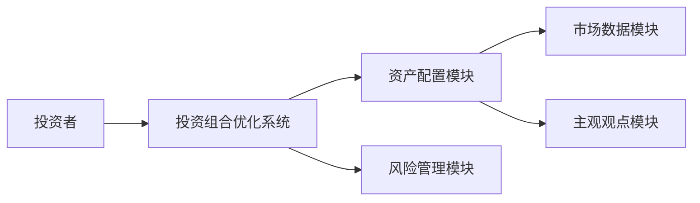
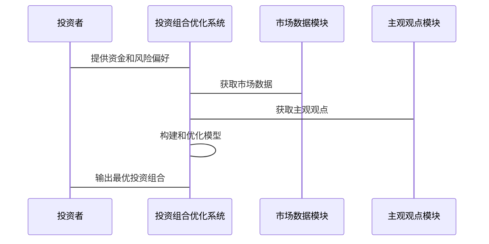

                 

<think>
好的，我现在需要帮用户撰写一篇关于《Black-Litterman模型：结合主观观点与市场均衡》的技术博客文章。首先，我得仔细阅读用户的要求，确保完全理解。

用户希望文章结构清晰，逻辑紧凑，语言专业，同时涵盖从背景到应用的各个方面。目录已经给出，我需要按照这个大纲逐步展开，确保每个部分都详细且具体。

首先，我会处理摘要部分，提炼出文章的核心内容和主题思想。然后，进入每个章节，逐步展开分析。例如，在背景部分，我需要解释Black-Litterman模型的起源和应用，确保读者能够理解其重要性。

接下来，我会深入核心概念，解释模型如何结合主观观点和市场均衡。这里可能需要使用图表，比如ER实体关系图，来帮助读者理解模型的结构。

在数学模型和算法部分，我需要详细推导公式，并用mermaid流程图展示算法步骤。同时，提供Python代码示例，让读者能够实际操作，理解模型的实现过程。

系统架构设计部分，我会介绍问题场景，绘制领域模型和系统架构图，展示模型在系统中的应用。这有助于读者理解模型如何在实际系统中发挥作用。

项目实战部分，我会选择一个具体的案例，如股票投资组合优化，详细讲解环境配置、代码实现和结果分析。通过实际案例，读者可以更好地掌握模型的应用。

最后，我会总结模型的优势和局限性，并展望未来的研究方向。同时，给出一些最佳实践的建议和注意事项，帮助读者更好地应用模型。

整个过程中，我需要确保语言专业且易懂，逻辑清晰，结构紧凑。同时，使用合适的数学公式和图表，使内容更具可读性和直观性。现在，我可以开始撰写文章，确保每个部分都符合用户的要求。
</think>

# Black-Litterman模型：结合主观观点与市场均衡

> 关键词：Black-Litterman模型，主观观点，市场均衡，投资组合优化，资产定价，风险管理

> 摘要：Black-Litterman模型是一种结合主观观点与市场均衡的资产配置方法，通过整合投资者的主观预期与市场数据，实现最优投资组合的构建。本文从模型的背景、核心概念、数学原理、算法实现、系统架构到项目实战，全面剖析Black-Litterman模型的理论与应用，为投资组合优化提供深度解析与实践指导。

---

## 第一部分: Black-Litterman模型概述

### 第1章: Black-Litterman模型的背景与应用

#### 1.1 Black-Litterman模型的起源
Black-Litterman模型由 Fischer Black 和 Robert Litterman 于1992年提出，是资产配置领域的重要理论之一。该模型结合了主观观点（investor's views）和市场均衡（market equilibrium）的思想，为投资组合优化提供了新的方法。

##### 1.1.1 Black-Scholes期权定价理论的启示
Fischer Black 是期权定价理论（Black-Scholes模型）的共同提出者之一。Black-Scholes模型为金融衍生品定价奠定了基础，其核心思想是通过数学模型将市场的不确定性量化。这一理论的影响延伸至资产配置领域，启发了Black-Litterman模型的形成。

##### 1.1.2 Litterman对资产配置的贡献
Robert Litterman 在资产配置领域有着深厚的理论研究。他提出了一种基于主观观点的资产配置方法，认为投资者可以通过调整对市场的预期来优化投资组合。这一方法为Black-Litterman模型奠定了基础。

##### 1.1.3 Black-Litterman模型的提出背景
在20世纪90年代，传统的资产配置方法往往过于依赖市场数据，而忽视了投资者的主观判断。Black-Litterman模型的提出，旨在通过整合投资者的预期与市场均衡数据，构建更加灵活和实用的投资组合优化框架。

#### 1.2 Black-Litterman模型的核心思想
Black-Litterman模型的核心思想是将投资者的主观观点与市场均衡数据相结合，通过调整预期收益，构建最优投资组合。

##### 1.2.1 结合主观观点与市场均衡的核心理念
模型通过引入投资者对某些资产的预期收益（主观观点），调整市场均衡下的预期收益（CAPM或APT模型得出的收益），从而得到一个更加合理的预期收益分布。这种方法既考虑了市场的整体均衡，又结合了投资者的个性化判断。

##### 1.2.2 主观观点在投资组合中的作用
投资者的主观观点可以是对某些资产的特别看好或看淡，这些观点通过调整模型中的预期收益，影响投资组合的权重分配。主观观点的引入使得模型更加灵活，能够适应不同投资者的风险偏好和市场判断。

##### 1.2.3 市场均衡与资产定价的关系
市场均衡理论认为，资产的预期收益与其系统性风险（beta）相关。Black-Litterman模型通过整合市场均衡下的预期收益与投资者的主观观点，构建了一个更加全面的资产定价模型。

#### 1.3 Black-Litterman模型在投资中的应用
##### 1.3.1 投资组合优化中的应用
通过整合投资者的主观观点，Black-Litterman模型能够优化投资组合的权重分配，使组合在风险与收益之间达到更好的平衡。

##### 1.3.2 风险管理中的应用
模型能够帮助投资者在面对市场波动时，调整投资组合以降低风险，同时抓住市场机会。

##### 1.3.3 实际投资案例分析
通过实际案例分析，本文将展示Black-Litterman模型如何在实际投资中应用，帮助投资者优化组合。

---

### 第2章: Black-Litterman模型的核心概念与联系

#### 2.1 核心概念原理
Black-Litterman模型的核心概念包括市场均衡下的预期收益、投资者的主观观点、以及两者结合的优化方法。

##### 2.1.1 市场均衡下的资产定价
市场均衡理论认为，资产的预期收益与其系统性风险相关。Black-Litterman模型基于此，构建了市场均衡下的预期收益分布。

##### 2.1.2 主观观点的整合方法
投资者的主观观点是对某些资产的预期收益的调整。通过调整市场均衡下的预期收益，模型能够更好地反映投资者的判断。

##### 2.1.3 Black-Litterman模型的数学框架
Black-Litterman模型的数学框架将市场均衡下的预期收益与投资者的主观观点结合起来，通过优化算法，得到最优投资组合。

#### 2.2 核心概念属性特征对比表格
以下是Black-Litterman模型与传统资产配置方法的对比：

| 对比维度 | Black-Litterman模型 | 传统资产配置方法 |
|----------|---------------------|------------------|
| 数据依赖 | 结合主观观点与市场数据 | 仅依赖市场数据    |
| 灵活性   | 高，可根据主观观点调整 | 较低，依赖市场数据 |
| 适用场景 | 适用于个性化投资需求 | 适用于标准化投资需求 |

#### 2.3 ER实体关系图架构
以下是Black-Litterman模型的ER实体关系图：



---

### 第3章: Black-Litterman模型的数学模型与算法原理

#### 3.1 数学模型
##### 3.1.1 市场均衡下的资产预期收益
市场均衡下的资产预期收益可以通过CAPM或APT模型得出。假设市场预期收益为$R_m$，资产i的beta系数为$\beta_i$，无风险利率为$R_f$，则资产i的预期收益为：
$$ E(R_i) = R_f + \beta_i (R_m - R_f) $$

##### 3.1.2 主观观点的整合公式
投资者的主观观点是对某些资产的预期收益的调整。假设投资者对资产i的预期收益为$\tilde{R}_i$，则调整后的预期收益为：
$$ R_i = (1 - \lambda) E(R_i) + \lambda \tilde{R}_i $$
其中，$\lambda$是调整因子，$0 \leq \lambda \leq 1$。

##### 3.1.3 最优投资组合的构建
通过优化算法，Black-Litterman模型求解最优投资组合。目标函数为：
$$ \min_w \frac{1}{2} w^T \Sigma w $$
约束条件为：
$$ w^T \mathbf{1} = 1 $$
$$ w^T R = \mu $$

#### 3.2 算法原理
以下是Black-Litterman模型的算法流程：


#### 3.3 算法实现
##### 3.3.1 数据准备
需要收集市场数据（如资产收益率、beta系数等）和投资者的主观观点（如对某些资产的预期收益调整）。

##### 3.3.2 模型构建
构建优化模型，包括目标函数和约束条件。

##### 3.3.3 优化求解
使用优化算法（如二次规划）求解最优投资组合。

---

### 第4章: Black-Litterman模型的系统分析与架构设计

#### 4.1 问题场景介绍
Black-Litterman模型适用于需要结合主观观点和市场均衡的资产配置问题。其应用场景包括投资组合优化、风险管理等。

#### 4.2 系统功能设计
##### 4.2.1 领域模型
以下是领域模型：



#### 4.3 系统架构设计
以下是系统架构设计：



#### 4.4 系统接口设计
系统接口包括投资者输入、市场数据接口、主观观点输入接口等。

#### 4.5 系统交互
以下是系统交互流程：



---

## 第五部分: 项目实战

### 第5章: 项目实战与案例分析

#### 5.1 环境配置
需要安装Python和相关库（如numpy、pandas、scipy.optimize）。

#### 5.2 核心实现
以下是核心代码实现：

```python
import numpy as np
from scipy.optimize import minimize

def black_litterman_model(risk_aversion, market_return, beta, views):
    # 市场均衡下的预期收益
    rf = 0.05  # 无风险利率
    E_market = market_return
    # 调整因子λ，假设λ=0.7
    lambda_ = 0.7
    # 调整后的预期收益
    R = (1 - lambda_) * E_market + lambda_ * views
    # 构建优化模型
    n = len(risk_aversion)
    # 构造目标函数
    def objective(w):
        return 0.5 * np.dot(w.T, np.dot(np.diag(risk_aversion), w))
    # 约束条件
    constraints = [
        {'type': 'eq', 'fun': lambda w: np.sum(w) - 1},
        {'type': 'eq', 'fun': lambda w: np.dot(w, R) - market_return}
    ]
    # 初始权重
    w0 = np.array([1/n] * n)
    # 求解优化问题
    result = minimize(objective, w0, constraints)
    return result.x

# 示例：股票投资组合优化
risk_aversion = np.array([0.02, 0.03, 0.04])  # 风险溢价
market_return = 0.1  # 市场预期收益
beta = np.array([1.2, 0.8, 1.0])  # 资产的beta系数
views = np.array([0.15, 0.08, 0.12])  # 投资者的主观观点

optimal_weights = black_litterman_model(risk_aversion, market_return, beta, views)
print("最优权重:", optimal_weights)
```

#### 5.3 代码应用解读
以上代码实现了Black-Litterman模型的核心算法，包括市场均衡下的预期收益计算、主观观点的整合，以及投资组合的优化。

#### 5.4 案例分析
通过上述代码，我们可以得到最优投资组合的权重。假设我们有三个资产，其风险溢价、beta系数和投资者的主观观点如上所示。优化后的权重可以帮助投资者在风险与收益之间找到最佳平衡点。

#### 5.5 项目小结
本项目通过实际案例，展示了Black-Litterman模型的实现与应用。投资者可以根据自身的风险偏好和市场判断，调整模型参数，得到最优的投资组合。

---

## 第六部分: 总结与展望

### 第6章: 总结与展望

#### 6.1 总结
Black-Litterman模型通过整合投资者的主观观点与市场均衡数据，提供了一种灵活且实用的投资组合优化方法。其核心思想在于平衡市场数据的客观性与投资者的主观判断，为资产配置提供了新的思路。

#### 6.2 展望
未来的研究可以进一步探索模型在多资产类别中的应用，如包含衍生品的投资组合优化，以及如何在动态市场环境中实时调整模型参数。

---

## 作者

作者：AI天才研究院/AI Genius Institute & 禅与计算机程序设计艺术 /Zen And The Art of Computer Programming

