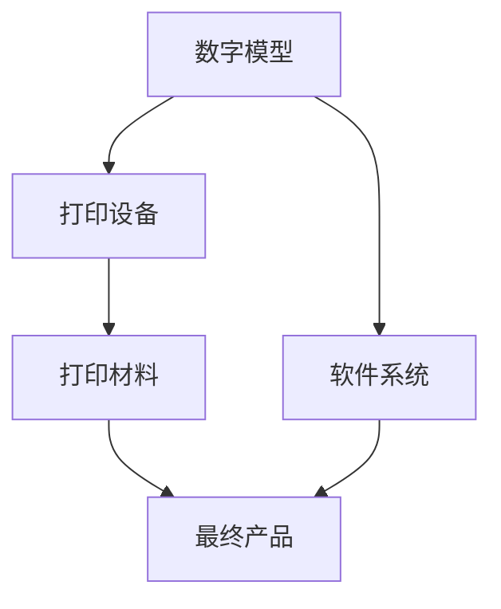
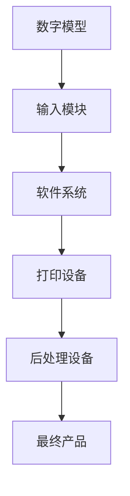
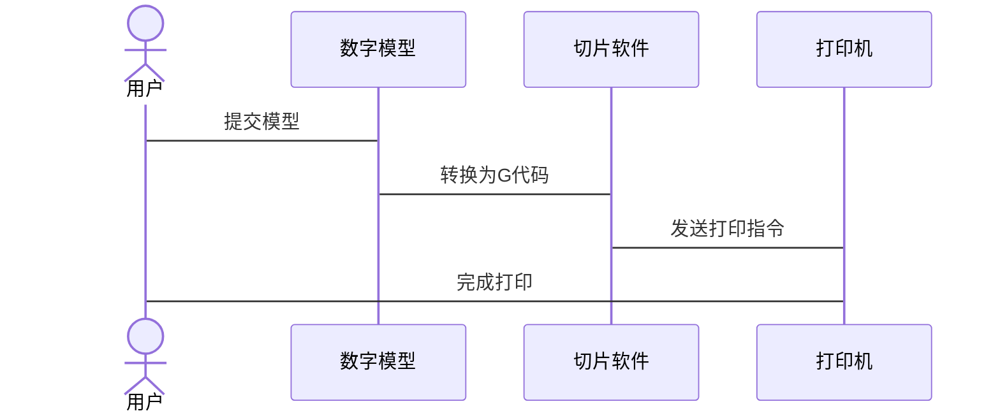
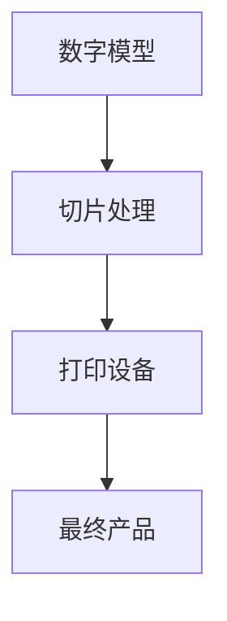

                 


# 3D打印技术对制造业的革新与投资机会

## 关键词：3D打印技术, 制造业革新, 投资机会, 制造业转型, 数字化制造

## 摘要：  
3D打印技术作为一项革命性的制造技术，正在深刻改变传统制造业的生产方式和商业模式。本文从技术原理、行业应用、投资价值等多维度深入分析3D打印技术对制造业的革新，并探讨其背后的投资机会。通过对汽车、航空航天、医疗和消费品行业的案例分析，揭示3D打印技术如何实现设计优化、成本降低和生产效率提升。同时，本文还从市场现状、投资策略和未来趋势等角度，为投资者提供深度分析和建议。

---

# 第1章: 3D打印技术的背景与概述

## 1.1 3D打印技术的定义与特点

### 1.1.1 3D打印技术的定义  
3D打印技术，全称为“增材制造”（Additive Manufacturing，AM），是一种通过逐层叠加材料来构建三维物体的技术。与传统减材制造（如 machining）不同，3D打印从数字模型直接生成实体，减少了材料浪费并提高了生产效率。

### 1.1.2 3D打印技术的核心特点  
- **快速原型制造**：从设计到实物快速迭代。  
- **复杂结构实现**：能够制造传统工艺无法实现的复杂几何形状。  
- **按需生产**：支持小批量、定制化生产，减少库存压力。  
- **材料多样化**：支持塑料、金属、陶瓷等多种材料。  

### 1.1.3 3D打印技术与传统制造技术的区别  
| **特点**       | **3D打印技术**                     | **传统制造技术**                   |  
|----------------|------------------------------------|------------------------------------|  
| 设计复杂度     | 支持高度复杂结构                   | 仅支持简单或规则结构               |  
| 生产效率       | 快速迭代，减少开发时间             | 开发周期长，需要多次试错           |  
| 材料利用率     | 高，接近100%                      | 低，通常仅20%-30%                 |  
| 成本结构       | 初始设备成本高，但后期较低         | 初始成本低，但后期维护和材料成本高 |  

---

## 1.2 3D打印技术的发展历程

### 1.2.1 3D打印技术的起源与发展  
3D打印技术的起源可以追溯到19世纪末的“照相制版术”，但现代意义上的增材制造技术始于20世纪80年代。1986年，Charles Hull发明了立体光刻（Stereolithography，SLA）技术，标志着3D打印技术的诞生。

### 1.2.2 3D打印技术的成熟与商业化  
进入21世纪，3D打印技术逐渐成熟，并开始在汽车、航空航天、医疗等领域实现商业化应用。开源软件（如Slic3r、cura）和开放硬件（如RepRap）的出现，降低了3D打印技术的门槛，推动了其普及。

### 1.2.3 3D打印技术的未来趋势  
随着人工智能和物联网技术的融合，3D打印技术将更加智能化、网络化。未来的3D打印将实现端到端的数字化生产，从设计到交付全流程自动化。

---

## 1.3 3D打印技术在制造业中的应用背景

### 1.3.1 制造业转型升级的背景  
全球制造业正面临成本上升、资源浪费、环境污染等问题。传统制造模式亟需转型，以适应个性化需求和可持续发展的要求。

### 1.3.2 3D打印技术对制造业的革新作用  
- **降低生产成本**：减少材料浪费和人工干预。  
- **缩短生产周期**：从设计到交付的时间大幅缩短。  
- **支持定制化生产**：满足客户的个性化需求。  

### 1.3.3 3D打印技术的边界与外延  
3D打印技术的应用范围不断扩大，从最初的原型制造延伸至最终产品的生产。其边界包括材料种类、设备精度和生产规模。

---

## 1.4 3D打印技术的核心要素与概念结构

### 1.4.1 核心要素组成  
- **数字模型**：3D打印的基础，通常通过CAD软件生成。  
- **打印材料**：塑料、金属、陶瓷等。  
- **打印设备**：如FDM、SLA、SLS等。  
- **软件系统**：负责模型处理和设备控制。  

### 1.4.2 概念结构图  


### 1.4.3 核心要素对比表格  
| **要素**         | **特点**                     |  
|------------------|------------------------------|  
| 数字模型         | 决定最终产品的形状和结构     |  
| 打印材料         | 影响产品的性能和成本         |  
| 打印设备         | 决定打印速度和精度           |  
| 软件系统         | 控制打印过程并优化模型       |  

---

# 第2章: 3D打印技术的核心原理

## 2.1 3D打印技术的材料选择

### 2.1.1 常见3D打印材料的种类  
- **塑料**：如ABS、PLA，适用于一般用途。  
- **金属**：如铝、钛，适用于高强度部件。  
- **陶瓷**：适用于复杂形状的陶瓷制品。  

### 2.1.2 材料性能对比分析  
| **材料类型** | **强度** | **韧性** | **耐高温性** |  
|--------------|----------|----------|---------------|  
| 塑料          | 中等     | 中等     | 一般           |  
| 金属          | 高       | 高       | 极高           |  
| 陶瓷          | 中等     | 低       | 极高           |  

---

## 2.2 3D打印技术的工艺流程

### 2.2.1 设计建模阶段  
- 使用CAD软件（如SolidWorks）创建数字模型。  
- 导出为标准文件格式（如STL）。  

### 2.2.2 切片处理阶段  
- 切片软件（如cura）将模型分割为薄层（通常厚度为0.1-1mm）。  
- 生成G代码，指导打印机运动。  

### 2.2.3 打印过程控制  
- 打印机根据G代码逐层叠加材料。  
- 监控温度、运动速度等参数，确保打印质量。  

### 2.2.4 后处理优化  
- �移除支撑结构。  
- 对表面进行抛光或涂层处理。  

---

## 2.3 3D打印技术的设备与软件

### 2.3.1 常见3D打印设备类型  
- **FDM（熔融沉积建模）**：最常用的桌面级打印机。  
- **SLA（立体光刻）**：精度高，适用于复杂结构。  
- **SLS（选择性激光烧结）**：支持金属和陶瓷材料。  

### 2.3.2 打印软件的功能与特点  
- **模型处理**：优化模型以适应打印需求。  
- **切片设置**：调整层高、速度等参数。  
- **设备控制**：通过G代码控制打印机。  

---

## 2.4 3D打印技术的数学模型与公式

### 2.4.1 打印层厚度与精度的关系  
- 层厚越小，精度越高，但打印时间增加。  
- 常见层厚：0.1mm（FDM）、0.05mm（SLA）。  

### 2.4.2 打印速度与材料消耗的计算公式  
- 打印速度：$v = \frac{面积}{层厚}$  
- 材料消耗：$m = \text{体积} \times \text{密度}$  

### 2.4.3 打印成本的数学模型  
$$ \text{成本} = \text{设备折旧} + \text{材料成本} + \text{能耗} $$  

---

# 第3章: 3D打印技术在制造业中的应用

## 3.1 汽车行业的应用

### 3.1.1 汽车零部件的快速原型制造  
- 例如，特斯拉使用3D打印技术快速迭代电动机外壳。  

### 3.1.2 轻量化结构设计的应用  
- 通过拓扑优化设计，减少材料使用，降低车身重量。  

### 3.1.3 汽车制造流程的优化  
- 减少模具成本，缩短生产周期。  

---

## 3.2 航空航天行业的应用

### 3.2.1 高强度金属零件的制造  
- 如波音787使用3D打印技术制造钛合金支架。  

### 3.2.2 复杂结构的优化设计  
- 减少装配需求，降低维护成本。  

### 3.2.3 航空制造流程的优化  
- 提高生产效率，降低库存成本。  

---

## 3.3 医疗行业的应用

### 3.3.1 个性化医疗器件的制造  
- 如定制化假肢、牙冠等。  

### 3.3.2 医疗模型的快速制造  
- 用于手术规划和教学培训。  

### 3.3.3 医疗器械的优化设计  
- 提高产品性能和患者舒适度。  

---

## 3.4 消费品行业的应用

### 3.4.1 定制化产品的生产  
- 如定制化鞋类、珠宝等。  

### 3.4.2 小批量生产的优势  
- 适合新兴品牌和小批量需求。  

### 3.4.3 市场响应速度的提升  
- 快速满足消费者个性化需求。  

---

# 第4章: 3D打印技术的投资机会分析

## 4.1 3D打印技术的市场现状

### 4.1.1 全球3D打印市场规模  
- 根据IDC数据，2022年全球3D打印市场规模约为150亿美元。  

### 4.1.2 市场增长驱动因素  
- 技术进步、行业需求增加、政策支持。  

### 4.1.3 市场发展趋势  
- 高端材料、智能设备、软件生态将成为未来增长点。  

---

## 4.2 3D打印技术的投资策略

### 4.2.1 技术驱动型投资  
- 关注材料技术创新和设备性能提升。  

### 4.2.2 应用场景驱动型投资  
- 重点布局医疗、航空航天等高附加值行业。  

### 4.2.3 供应链整合型投资  
- 通过收购或合作，构建完整的3D打印生态。  

---

## 4.3 3D打印技术的投资风险与评估

### 4.3.1 技术风险  
- 核心技术被替代的风险。  

### 4.3.2 市场风险  
- 应用场景受限，市场需求不足。  

### 4.3.3 经营风险  
- 设备维护成本高，耗材价格昂贵。  

---

## 4.4 3D打印技术的成功投资案例

### 4.4.1 Stratasys的收购战略  
- 通过收购材料和技术公司，巩固市场地位。  

### 4.4.2 3D Systems的软件生态建设  
- 打造开放的软件平台，吸引开发者和用户。  

---

# 第5章: 3D打印技术的未来发展趋势

## 5.1 技术创新与突破

### 5.1.1 新型材料的开发  
- 如生物基材料、自修复材料。  

### 5.1.2 智能打印技术的融合  
- 结合AI和物联网，实现智能监控和预测性维护。  

---

## 5.2 行业整合与生态构建

### 5.2.1 产业链整合  
- 设备厂商与材料厂商的合作。  

### 5.2.2 开放平台的建设  
- 推动开源社区发展，降低技术门槛。  

---

## 5.3 可持续发展与绿色制造

### 5.3.1 节能降耗  
- 优化打印过程，减少能源消耗。  

### 5.3.2 循环利用  
- 推动材料回收和再利用。  

---

# 第6章: 3D打印技术的系统架构与实现

## 6.1 3D打印系统的整体架构

### 6.1.1 系统组成  
- **数字模型**：输入模块  
- **打印设备**：执行模块  
- **软件系统**：控制模块  
- **后处理设备**：优化模块  

### 6.1.2 系统架构图  


---

## 6.2 3D打印系统的实现细节

### 6.2.1 系统功能设计  
- **设计建模**：生成STL文件  
- **切片处理**：生成G代码  
- **设备控制**：实现运动控制  
- **过程监控**：实时监控打印状态  

### 6.2.2 系统交互流程  


---

## 6.3 3D打印系统的优化与改进

### 6.3.1 系统优化方向  
- 提高打印精度  
- 降低设备成本  
- 优化软件算法  

### 6.3.2 改进措施  
- 引入AI算法优化打印路径  
- 提升材料利用率  

---

# 第7章: 3D打印技术的项目实战

## 7.1 3D打印项目环境搭建

### 7.1.1 开发环境安装  
- 安装Linux系统  
- 安装Cura切片软件  

### 7.1.2 工具链配置  
- 安装Python和相关库  

---

## 7.2 3D打印系统核心实现

### 7.2.1 打印机控制代码  
```python
import serial

# 初始化串口连接
ser = serial.Serial('COM3', 115200)

# 发送G代码指令
def send_gcode(command):
    ser.write(f"{command}\n".encode())

send_gcode("G28")  # 回零点
send_gcode("G1 X0 Y0 Z0.1 F1000")  # 移动到起始点
send_gcode("M104 S200")  # 设置温度
send_gcode("M303 E0 S200")  # 校准挤出机
```

### 7.2.2 打印过程监控代码  
```python
import serial

def read_serial():
    while True:
        line = ser.readline().decode()
        if line:
            print(line.strip())

read_serial()
```

---

## 7.3 项目实战案例分析

### 7.3.1 案例：打印一个简单的立方体  


### 7.3.2 代码实现与优化  
- 优化打印路径算法，减少层间停顿时间。  

---

## 7.4 项目总结与经验分享

### 7.4.1 项目总结  
- 成功实现了3D打印系统的搭建与控制。  
- 突出了系统架构设计的重要性。  

### 7.4.2 经验分享  
- 确保硬件与软件的兼容性。  
- 优化打印参数以提高效率和质量。  

---

# 第8章: 3D打印技术的最佳实践与未来展望

## 8.1 最佳实践

### 8.1.1 技术应用中的注意事项  
- 选择合适的材料和设备。  
- 定期维护和校准设备。  

### 8.1.2 投资决策中的注意事项  
- 关注技术创新和市场趋势。  
- 评估企业的实际需求和资源。  

---

## 8.2 未来展望

### 8.2.1 技术创新方向  
- 新型材料和工艺的开发。  
- 人工智能与3D打印的深度融合。  

### 8.2.2 行业整合趋势  
- 产业链协同合作。  
- 数字化制造生态的构建。  

---

## 作者：AI天才研究院/AI Genius Institute & 禅与计算机程序设计艺术 /Zen And The Art of Computer Programming

---

**本文版权归作者所有，转载请注明出处。**

