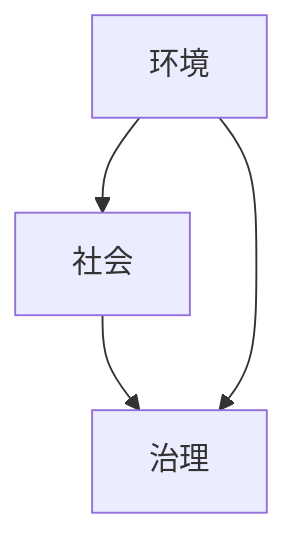
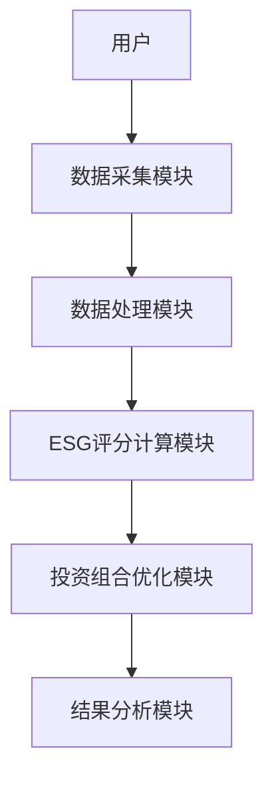
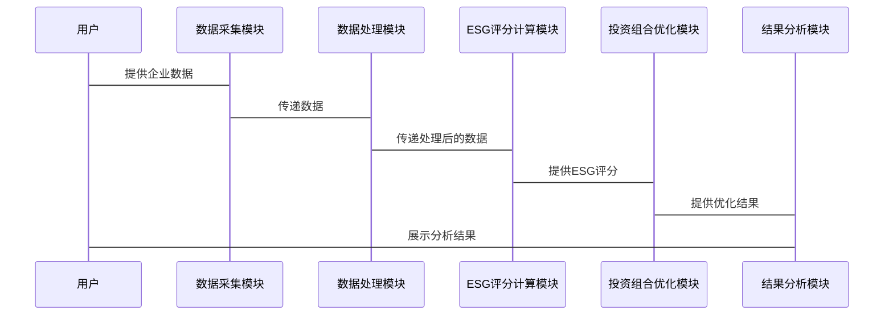

                 


# ESG投资策略：平衡社会责任和财务回报

> 关键词：ESG投资，环境，社会，治理，财务回报，可持续投资

> 摘要：本文深入探讨了ESG投资策略的核心概念、算法原理、系统架构及项目实战，帮助读者理解如何在投资决策中平衡社会责任与财务回报。通过详细分析环境、社会和治理三个维度，结合实际案例和数学模型，本文为投资者提供了一套科学的ESG投资策略框架，帮助其在追求收益的同时，实现可持续发展目标。

---

# 第一部分: ESG投资策略概述

## 第1章: ESG投资策略的背景与概念

### 1.1 ESG投资的背景与发展趋势

#### 1.1.1 可持续投资的兴起  
近年来，全球范围内对可持续发展的关注日益增加，投资者开始意识到社会责任的重要性。ESG投资作为一种新兴的投资策略，不仅关注企业的财务表现，还关注其在环境、社会和治理方面的表现。这种投资方式不仅有助于改善社会福祉，还能为企业创造长期价值。

#### 1.1.2 全球ESG投资的现状与趋势  
根据最新数据显示，全球ESG投资规模已超过30万亿美元，占全球管理资产的三分之一以上。ESG投资在欧美市场尤为盛行，而在亚洲市场也逐渐崭露头角。随着气候变化、社会不平等和公司治理问题的加剧，ESG投资将继续保持增长趋势。

#### 1.1.3 ESG投资对社会和经济的影响  
ESG投资通过推动企业采取环保措施、改善员工福利和提高治理透明度，能够有效减少社会不平等，降低环境风险，并提升企业的长期竞争力。同时，ESG投资还能引导资本流向更具社会责任感的企业，促进经济的可持续发展。

### 1.2 ESG的核心概念与内涵

#### 1.2.1 环境（Environmental）维度  
环境维度关注企业在资源利用、碳排放、污染控制等方面的表现。例如，企业是否采取了有效的环保措施，是否遵守了环保法规，以及是否在产品设计中考虑了环境影响。

#### 1.2.2 社会（Social）维度  
社会维度关注企业在员工权益、社会责任、社区参与等方面的表现。例如，企业是否保障员工的合法权益，是否积极参与公益活动，以及是否关注弱势群体的福祉。

#### 1.2.3 治理（Governance）维度  
治理维度关注企业的公司治理结构、董事会构成、高管薪酬、股权结构等方面。例如，企业是否建立了透明的治理机制，是否避免了利益输送，以及是否能够有效监督管理层的行为。

#### 1.2.4 ESG的综合评价体系  
为了全面评估企业的ESG表现，投资者需要将环境、社会和治理三个维度结合起来，构建一个综合的评价体系。例如，可以通过问卷调查、数据分析和第三方评级机构的评估来综合衡量企业的ESG表现。

### 1.3 ESG投资与财务回报的平衡

#### 1.3.1 ESG投资的财务表现分析  
研究表明，ESG表现良好的企业通常具有更强的抗风险能力和更高的股东回报率。例如，环境表现优异的企业能够降低运营成本，提高能源使用效率，从而增强企业的盈利能力。

#### 1.3.2 长期投资视角下的ESG价值  
从长期来看，ESG投资能够为企业创造更大的社会价值，同时也能为投资者带来稳定的财务回报。例如，关注社会责任的企业往往能够获得更多的客户支持和品牌溢价，从而在竞争中占据优势。

#### 1.3.3 如何平衡社会责任与投资收益  
投资者需要在追求财务回报的同时，关注企业的社会责任表现。例如，可以通过筛选ESG评分高的企业，构建一个优化的投资组合，从而在满足社会责任的同时实现收益最大化。

---

## 第2章: ESG投资策略的核心概念与联系

### 2.1 ESG核心概念的原理

#### 2.1.1 环境因素的量化方法  
环境因素可以通过碳排放量、能源消耗量、水资源利用效率等指标进行量化。例如，企业可以通过安装环保设备、采用清洁能源等方式降低碳排放量。

#### 2.1.2 社会因素的评估维度  
社会因素可以从员工满意度、劳动权益保护、社区参与度等方面进行评估。例如，企业可以通过开展员工培训、提供福利保障等方式提高员工满意度。

#### 2.1.3 治理结构的关键要素  
治理结构包括董事会构成、高管薪酬、股权激励机制等方面。例如，企业可以通过优化董事会结构、建立有效的监督机制来提高治理透明度。

### 2.2 ESG核心概念的对比分析

#### 2.2.1 环境与社会维度的对比  
环境维度关注企业的外部环境影响，而社会维度关注企业的内部社会责任。例如，环境维度关注碳排放，而社会维度关注员工权益保护。

#### 2.2.2 社会与治理维度的对比  
社会维度关注企业的社会影响，而治理维度关注企业的内部管理。例如，社会维度关注社区参与，而治理维度关注董事会结构。

#### 2.2.3 环境、社会、治理的综合对比表格  
以下是环境、社会、治理三个维度的对比表格：

| 维度 | 关注点 | 示例指标 |
|------|--------|----------|
| 环境 | 碳排放、资源消耗 | 碳排放量、能源消耗 |
| 社会 | 员工权益、社区参与 | 员工满意度、公益活动参与度 |
| 治理 | 董事会结构、高管薪酬 | 董事会独立性、高管激励机制 |

### 2.3 ESG实体关系图（Mermaid流程图）



---

## 第3章: ESG投资策略的算法原理

### 3.1 ESG评分模型的构建

#### 3.1.1 数据采集与预处理  
数据采集可以通过企业公开报告、第三方评级机构数据等方式获取。预处理步骤包括数据清洗、标准化和特征选择。例如，可以使用Python中的pandas库进行数据清洗。

```python
import pandas as pd
data = pd.read_csv('esg_data.csv')
data.dropna(inplace=True)
```

#### 3.1.2 ESG评分的计算方法  
ESG评分可以通过加权平均法计算，权重可以根据各维度的重要性进行调整。例如，环境权重为40%，社会权重为30%，治理权重为30%。

$$ ESG\text{评分} = 0.4 \times E + 0.3 \times S + 0.3 \times G $$

#### 3.1.3 多因素回归模型的建立  
可以通过回归分析方法，研究ESG评分与企业财务表现之间的关系。例如，可以使用多元线性回归模型，分析ESG评分对企业净利润的影响。

$$ \text{净利润} = \beta_0 + \beta_1 \times ESG\text{评分} + \beta_2 \times \text{行业哑变量} + \epsilon $$

### 3.2 ESG投资组合优化算法

#### 3.2.1 现金流贴现模型（DCF）的应用  
现金流贴现模型可以用于评估企业的内在价值。例如，可以通过DCF模型计算企业的未来现金流，结合ESG评分进行投资决策。

#### 3.2.2 Markowitz均值-方差模型的扩展  
在传统的均值-方差模型中，可以加入ESG评分作为优化目标。例如，可以通过优化算法，构建一个在满足ESG评分要求下的最优投资组合。

#### 3.2.3 遗传算法在ESG投资组合中的应用  
遗传算法可以用于解决复杂的优化问题。例如，可以通过遗传算法优化ESG投资组合，使其在满足风险约束下实现最大收益。

### 3.3 算法实现代码示例

```python
import numpy as np
from sklearn.linear_model import LinearRegression

# 示例数据
X = np.array([[1, 2], [3, 4], [5, 6]])
y = np.array([7, 8, 9])

# 模型训练
model = LinearRegression()
model.fit(X, y)

# 预测结果
print(model.predict([[7, 8]]))
```

---

## 第4章: 系统分析与架构设计方案

### 4.1 问题场景介绍  
在实际投资决策中，投资者需要综合考虑企业的财务表现和社会责任表现。因此，构建一个ESG投资决策支持系统具有重要意义。

### 4.2 系统功能设计  
系统功能包括数据采集、ESG评分计算、投资组合优化和结果分析。例如，可以通过构建一个用户友好的界面，帮助投资者进行ESG投资决策。

### 4.3 系统架构设计（Mermaid架构图）



### 4.4 系统交互设计（Mermaid序列图）



---

## 第5章: 项目实战

### 5.1 环境安装  
需要安装Python、Pandas、NumPy、Scikit-learn等库。例如，可以通过以下命令安装：

```bash
pip install numpy pandas scikit-learn
```

### 5.2 系统核心实现源代码  
以下是ESG评分计算的Python代码示例：

```python
import pandas as pd
import numpy as np

# 数据预处理
data = pd.read_csv('esg_data.csv')
data.dropna(inplace=True)

# 计算ESG评分
weights = {'环境': 0.4, '社会': 0.3, '治理': 0.3}
esg_scores = data[weights.keys()].apply(lambda x: np.dot(x, weights.values()))
data['ESG评分'] = esg_scores

# 模型训练
from sklearn.linear_model import LinearRegression
model = LinearRegression()
model.fit(data[['ESG评分']], data['净利润'])

# 预测结果
print(model.predict([[0.8]]))
```

### 5.3 代码应用解读与分析  
通过上述代码，可以实现企业ESG评分的计算，并利用回归模型预测企业的净利润。这可以帮助投资者评估企业的财务表现与ESG评分之间的关系。

### 5.4 实际案例分析  
以某企业为例，计算其ESG评分，并结合财务数据进行投资决策分析。例如，可以比较不同企业的ESG评分和财务表现，选择一个ESG评分高且财务表现良好的企业进行投资。

### 5.5 项目小结  
通过本项目，读者可以掌握ESG评分计算的基本方法，并能够利用Python进行投资组合优化。这为后续的实际投资决策提供了有力支持。

---

## 第6章: 最佳实践与小结

### 6.1 最佳实践 tips  
- 在进行ESG投资时，应综合考虑企业的财务表现和社会责任表现。
- 使用多种指标和模型进行综合评估，避免单一指标的片面性。
- 定期更新数据和模型，以适应市场变化和企业动态。

### 6.2 小结  
本文详细介绍了ESG投资策略的核心概念、算法原理、系统架构及项目实战。通过理论与实践相结合的方式，帮助读者全面理解如何在投资决策中平衡社会责任与财务回报。

### 6.3 注意事项  
- 投资者应根据自身需求和市场环境选择合适的ESG投资策略。
- 数据的准确性和模型的合理性是确保投资决策的关键。
- 在实际操作中，应结合专业机构的建议，避免盲目投资。

### 6.4 拓展阅读  
- 参考权威机构发布的ESG评级报告。
- 阅读相关的学术论文和行业研究报告。
- 关注ESG投资领域的最新动态和发展趋势。

---

# 作者：AI天才研究院/AI Genius Institute & 禅与计算机程序设计艺术 /Zen And The Art of Computer Programming

