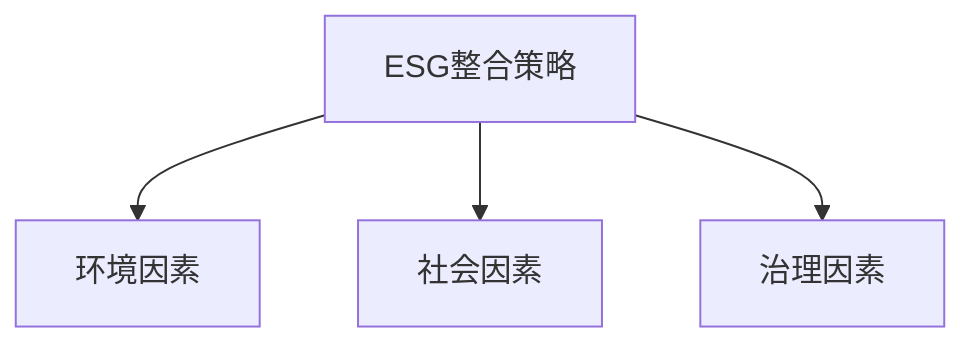
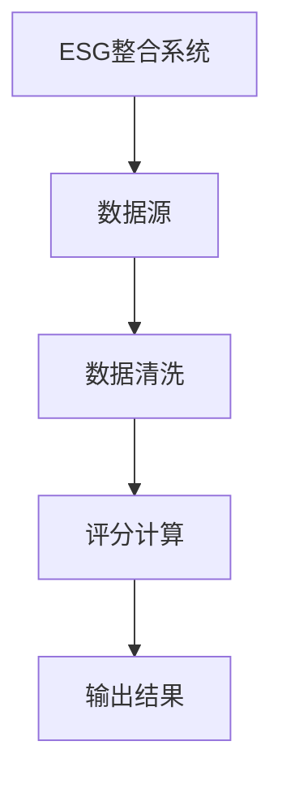

                 


# ESG整合策略：将可持续发展因素纳入投资流程

> 关键词：ESG整合，可持续投资，环境、社会、治理，投资策略，风险管理

> 摘要：  
本文探讨了如何将环境（E）、社会（S）和治理（G）因素整合到投资流程中，通过系统的方法分析ESG的核心概念、数学模型和实际应用，提供从理论到实践的详细指导。

---

# 第1章：ESG整合策略的背景介绍

## 1.1 问题背景与问题描述

在当代金融市场中，可持续投资已成为不可忽视的趋势。ESG（环境、社会、治理）因素的整合不仅是道德责任，更是降低风险和提升收益的关键。传统投资往往忽视非财务因素，而ESG整合通过考虑企业对环境的影响、社会责任和治理结构，提供了更全面的评估框架。

## 1.2 问题解决的必要性

投资者需要在决策中纳入ESG因素，以应对环境风险（如气候变化）、社会责任（如员工权益）和治理风险（如高管责任）。忽视这些因素可能导致投资组合的价值波动和声誉损失。

## 1.3 ESG的边界与外延

ESG的外延包括但不限于碳排放、社会责任报告和公司治理结构。其边界主要集中在企业的经营活动中，但可能延伸到供应链和产品生命周期。

## 1.4 核心概念的结构与组成

ESG由三个核心要素组成，通过Mermaid流程图展示其相互关系：



---

# 第2章：ESG的核心概念与联系

## 2.1 ESG的核心原理

### 2.1.1 环境（E）

环境因素关注企业的资源利用效率和碳排放。例如，一家高碳排放的公司可能面临更高的监管风险，影响其股价。

### 2.1.2 社会（S）

社会责任包括员工权益和社区影响。例如，员工待遇良好的企业可能更具吸引力，减少员工流动率。

### 2.1.3 治理（G）

治理因素涉及董事会结构和高管责任。良好的治理结构能够提升公司透明度，降低风险。

## 2.2 ESG核心概念的属性特征对比表

| 属性 | E    | S    | G    |
|------|------|------|------|
| 定义 | 环境表现 | 社会责任 | 治理结构 |
| 重点 | 碳排放、资源利用 | 劳工权益、社区影响 | 董事会结构、高管责任 |
| 数据来源 | 环境报告、政府数据 | 社会责任报告、非政府组织数据 | 公司治理报告、监管数据 |

---

# 第3章：ESG整合的算法原理

## 3.1 ESG评分模型的构建

### 3.1.1 数据预处理与标准化

首先对数据进行清洗，处理缺失值和异常值。例如，使用Z-score方法检测异常值。

### 3.1.2 权重分配与计算公式

权重根据行业和投资目标调整：

$$ \text{ESG评分} = \alpha \cdot E + \beta \cdot S + \gamma \cdot G $$

其中，$\alpha + \beta + \gamma = 1$，权重根据行业调整。

### 3.1.3 示例计算

假设权重为$\alpha=0.4$，$\beta=0.3$，$\gamma=0.3$，计算某公司的ESG评分：

$$ ESG = 0.4 \times 80 + 0.3 \times 70 + 0.3 \times 75 = 74.5 $$

---

# 第4章：ESG整合的系统分析与架构设计

## 4.1 系统分析

ESG整合系统需要处理数据清洗、特征选择和评分计算。使用Python进行数据处理，例如：

```python
import pandas as pd
data = pd.read_csv('esg_data.csv')
data_clean = data.dropna()
```

## 4.2 系统架构设计

使用Mermaid架构图展示系统模块：



---

# 第5章：ESG整合的项目实战

## 5.1 案例分析

以某能源公司为例，分析其ESG表现。环境因素关注碳排放，社会因素关注员工权益，治理因素关注董事会结构。

## 5.2 实际应用

通过Python代码实现评分模型：

```python
def calculate_esg(e, s, g):
    alpha = 0.4
    beta = 0.3
    gamma = 0.3
    return alpha * e + beta * s + gamma * g

esg_score = calculate_esg(80, 70, 75)
print(esg_score)  # 输出74.5
```

---

# 结语

ESG整合策略不仅是投资决策的重要部分，也是企业可持续发展的关键。通过系统的方法和数学模型，投资者可以更有效地将ESG因素纳入投资流程，实现长期价值。

---

# 作者

作者：AI天才研究院 & 禅与计算机程序设计艺术

---

这篇文章详细阐述了ESG整合策略的背景、核心概念、算法原理和系统架构设计，结合实际案例和代码示例，为读者提供了从理论到实践的全面指导。

