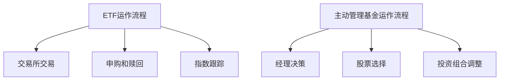
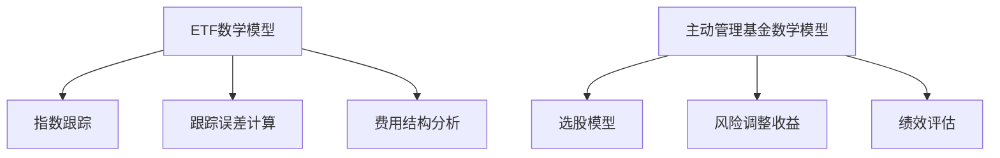
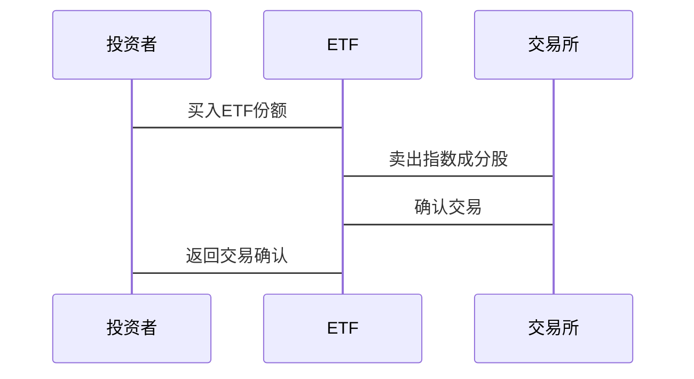
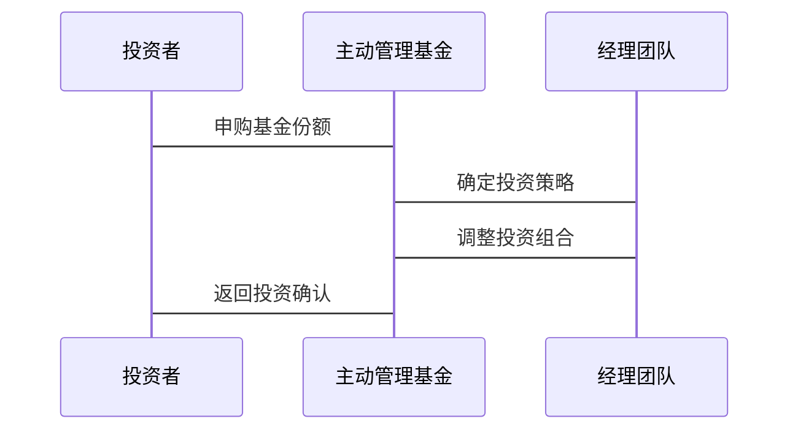

                 

<think>
好的，我需要分析用户的需求。用户希望我撰写一篇关于ETF和主动管理基金的比较文章，结构清晰，内容专业。我首先得明确文章的结构，包括背景介绍、核心概念对比、数学模型、系统分析、实际案例和投资建议。

我需要确保每个部分都有足够的细节，比如在背景部分详细解释ETF和主动管理基金的定义和特点。核心概念对比部分需要用表格和图表来展示差异。数学模型部分要涉及跟踪误差和绩效评估的公式，可能需要使用LaTeX来表达。

系统分析部分需要使用Mermaid图来展示架构和接口设计。实际案例分析部分，我需要结合当前市场环境，讨论哪种基金更适合，并给出具体的例子。最后，投资建议部分要实用，帮助读者做出决策。

我需要确保语言简洁专业，同时保持逻辑连贯，让读者容易理解。可能需要多次修改，以确保每个章节的内容都详实且有深度。还要注意避免使用过于复杂的术语，使内容更具可读性。

现在，我将按照目录大纲逐步展开每个部分的内容，确保涵盖所有关键点，并进行详细分析。这样，读者能够清晰地理解ETF和主动管理基金的区别，并根据当前市场做出明智的选择。
</think>

# ETF vs 主动管理基金：哪个更适合当前市场

> **关键词**：ETF，主动管理基金，市场比较，投资选择，基金运作

> **摘要**：本文详细比较了ETF和主动管理基金的定义、运作机制、数学模型和系统架构，分析了两者在当前市场环境下的优劣，并提供了实际投资建议。

---

## 第一章: ETF与主动管理基金的背景与基本概念

### 1.1 ETF的定义与特点

#### 1.1.1 ETF的定义
ETF（交易所交易基金）是一种在交易所上市交易的基金，它跟踪特定的指数、商品或一篮子资产。ETF结合了封闭式基金和开放式基金的特点，可以在二级市场买卖，也可以通过申购和赎回机制进行操作。

#### 1.1.2 ETF的核心特点
- **透明性**：ETF的持仓信息公开，投资者可以实时了解基金的投资组合。
- **流动性**：ETF在交易所上市，可以随时买卖，具有较高的流动性。
- **分散风险**：ETF通常跟踪指数，分散了个别资产的风险。
- **费用低**：ETF的管理费用通常低于主动管理基金。

#### 1.1.3 ETF的优缺点
- **优点**：
  - 费用低。
  - 透明性高。
  - 分散风险。
- **缺点**：
  - 不能主动调整投资组合。
  - 受指数表现限制。

### 1.2 主动管理基金的定义与特点

#### 1.2.1 主动管理基金的定义
主动管理基金是由基金经理主动选股，试图通过精选个股或择时来超越市场指数表现的基金。

#### 1.2.2 主动管理基金的核心特点
- **主动性**：基金经理根据市场情况调整投资组合。
- **专业管理**：由专业团队进行管理和决策。
- **可能跑赢市场**：通过选股和择时，有可能获得超额收益。
- **费用高**：通常收取较高的管理费和托管费。

#### 1.2.3 主动管理基金的优缺点
- **优点**：
  - 有机会跑赢市场。
  - 专业管理。
- **缺点**：
  - 费用较高。
  - 受经理能力和市场判断影响较大。

### 1.3 ETF与主动管理基金的适用场景

#### 1.3.1 ETF的适用场景
- **长期投资**：适合长期投资，尤其是指数基金。
- **被动投资**：适合不想主动管理投资组合的投资者。
- **分散风险**：适合希望通过分散投资降低风险的投资者。

#### 1.3.2 主动管理基金的适用场景
- **短期投资**：适合希望抓住市场机会的短期投资者。
- **主动管理需求**：适合有能力或需求主动管理投资组合的投资者。
- **市场波动较大时**：适合希望通过专业管理应对市场波动的投资者。

#### 1.3.3 两种基金的边界与外延
- ETF和主动管理基金的边界在于是否主动调整投资组合。
- ETF的外延包括各种指数基金和商品ETF。
- 主动管理基金的外延包括股票型基金、债券型基金等。

### 1.4 ETF与主动管理基金的核心要素对比

#### 1.4.1 核心概念对比表格

| 对比维度 | ETF | 主动管理基金 |
|----------|-----|-------------|
| 费用     | 低  | 高          |
| 透明度   | 高  | 中          |
| 主动性   | 无  | 有          |
| 风险     | 低  | 中高        |
| 适用场景 | 长期投资 | 短期投资、市场波动较大时 |

#### 1.4.2 ETF与主动管理基金的ER实体关系图

```mermaid
erDiagram
    class ETF {
        id
        名称
        指数跟踪
        交易时间
    }
    class 主动管理基金 {
        id
        名称
        经理团队
        投资策略
    }
    ETF -|> 指数
    主动管理基金 -|> 股票
    ETF -|> 交易市场
    主动管理基金 -|> 经理
```

---

## 第二章: ETF与主动管理基金的运作机制

### 2.1 ETF的运作机制

#### 2.1.1 ETF的构造与管理
ETF通常由资产管理公司管理，跟踪特定指数。投资者可以通过交易所买卖ETF，也可以通过申购和赎回机制参与。

#### 2.1.2 ETF的指数跟踪策略
ETF通过复制指数成分股的组合来实现跟踪指数的目标。常见的跟踪误差公式为：
$$ \text{跟踪误差} = \text{基金收益} - \text{指数收益} $$

#### 2.1.3 ETF的申购与赎回流程
投资者可以通过基金公司或经纪商进行申购和赎回，ETF的申购和赎回基于篮子机制，即投资者用一篮子股票换取ETF份额。

### 2.2 主动管理基金的运作机制

#### 2.2.1 主动管理基金的选股策略
基金经理根据市场分析和基本面研究选择个股，目标是跑赢指数。选股策略可以用以下公式表示：
$$ \text{选股收益} = \sum (\text{个股收益} \times \text{权重}) $$

#### 2.2.2 主动管理基金的基金经理角色
基金经理是主动管理基金的核心，负责制定投资策略和调整投资组合。

#### 2.2.3 主动管理基金的投资组合管理
主动管理基金通过动态调整投资组合来应对市场变化，包括增减股票和调整权重。

### 2.3 ETF与主动管理基金的运作机制对比

#### 2.3.1 ETF与主动管理基金的运作流程对比



#### 2.3.2 ETF与主动管理基金的风险控制对比
ETF的风险主要来自指数波动，主动管理基金的风险来自经理能力和市场判断。

---

## 第三章: ETF与主动管理基金的数学模型与算法原理

### 3.1 ETF的数学模型

#### 3.1.1 ETF的指数复制模型
指数复制模型通过最小化跟踪误差来优化投资组合。公式如下：
$$ \text{最小化} \sum (\text{基金收益} - \text{指数收益})^2 $$

#### 3.1.2 ETF的跟踪误差计算
跟踪误差的计算公式为：
$$ \text{跟踪误差} = \sqrt{\text{平均跟踪误差的平方}} $$

#### 3.1.3 ETF的费用结构分析
ETF的费用通常包括管理费和托管费，计算公式为：
$$ \text{费用} = \text{管理费} + \text{托管费} $$

### 3.2 主动管理基金的数学模型

#### 3.2.1 主动管理基金的选股模型
选股模型通过分析个股的基本面和技术面来选择标的，公式为：
$$ \text{选股收益} = \sum (\text{个股收益} \times \text{权重}) $$

#### 3.2.2 主动管理基金的风险调整收益模型
风险调整收益模型通过夏普比率来衡量，公式为：
$$ \text{夏普比率} = \frac{\text{超额收益}}{\text{收益标准差}} $$

#### 3.2.3 主动管理基金的绩效评估模型
绩效评估模型通常使用特雷诺比率，公式为：
$$ \text{特雷诺比率} = \frac{\text{超额收益}}{\text{跟踪误差}} $$

### 3.3 ETF与主动管理基金的数学模型对比

#### 3.3.1 ETF与主动管理基金的数学模型对比表格

| 对比维度 | ETF模型 | 主动管理基金模型 |
|----------|---------|----------------|
| 核心目标 | 跟踪指数 | 跑赢指数          |
| 风险控制 | 低       | 中高            |
| 计算复杂度 | 低       | 高              |

#### 3.3.2 ETF与主动管理基金的数学模型流程图



---

## 第四章: ETF与主动管理基金的系统分析与架构设计

### 4.1 ETF与主动管理基金的系统架构

#### 4.1.1 ETF的系统架构图

```mermaid
classDiagram
    ETF
    指数提供方
    交易所
    投资者
    ETF -> 交易所: 上市交易
    ETF -> 指数提供方: 跟踪指数
    ETF -> 投资者: 提供投资渠道
```

#### 4.1.2 主动管理基金的系统架构图

```mermaid
classDiagram
    主动管理基金
    经理团队
    投资者
    市场数据
    主动管理基金 -> 经理团队: 投资决策
    主动管理基金 -> 投资者: 提供投资渠道
    主动管理基金 -> 市场数据: 数据支持
```

### 4.2 ETF与主动管理基金的接口设计

#### 4.2.1 ETF的接口设计
- 交易所接口：买卖ETF份额。
- 指数提供方接口：提供指数数据和成分股信息。

#### 4.2.2 主动管理基金的接口设计
- 经理团队接口：提供投资策略和决策。
- 投资者接口：提供资金和投资需求。

### 4.3 ETF与主动管理基金的系统交互

#### 4.3.1 ETF的系统交互



#### 4.3.2 主动管理基金的系统交互



---

## 第五章: ETF与主动管理基金的实际投资分析

### 5.1 ETF与主动管理基金的市场适应性

#### 5.1.1 当前市场的特点
- 稳定性：市场波动较小，适合ETF。
- 不稳定性：市场波动较大，适合主动管理基金。

#### 5.1.2 ETF在当前市场的优势
- 透明性高。
- 费用低。
- 风险分散。

#### 5.1.3 主动管理基金在当前市场的优势
- 专业管理。
- 有机会跑赢市场。
- 灵活性高。

### 5.2 ETF与主动管理基金的案例分析

#### 5.2.1 ETF案例
假设当前市场为牛市，指数基金的表现稳定，适合长期投资。

#### 5.2.2 主动管理基金案例
假设当前市场为震荡市，主动管理基金通过选股和调整仓位可能获得超额收益。

### 5.3 ETF与主动管理基金的投资建议

#### 5.3.1 投资者选择建议
- 长期投资者：选择ETF。
- 短期投资者：选择主动管理基金。
- 风险厌恶投资者：选择ETF。
- 风险偏好投资者：选择主动管理基金。

#### 5.3.2 投资组合配置建议
- ETF适合配置为底仓。
- 主动管理基金适合作为增强收益的部分。

#### 5.3.3 风险管理建议
- ETF的风险较低，适合稳健投资者。
- 主动管理基金的风险较高，适合有风险承受能力的投资者。

---

## 结语

在当前市场环境下，ETF和主动管理基金各有优劣。ETF适合长期投资者和风险厌恶者，而主动管理基金适合短期投资者和风险偏好者。投资者应根据自身的投资目标、风险承受能力和市场环境选择合适的基金类型。

---

**作者：AI天才研究院/AI Genius Institute & 禅与计算机程序设计艺术 /Zen And The Art of Computer Programming**

