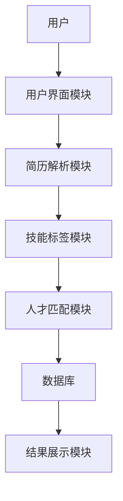
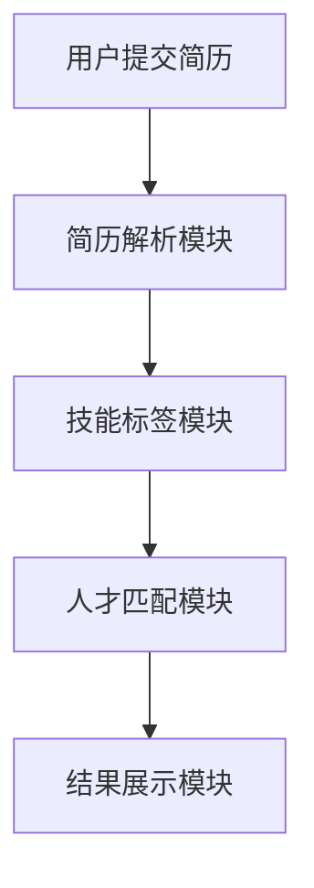
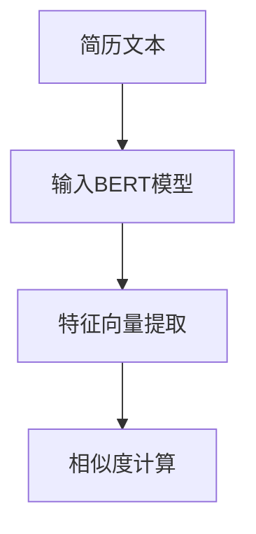

                 

<think>
好的，我现在需要帮用户撰写一篇关于《HR AI Agent：简历筛选与人才匹配》的技术博客文章。用户已经提供了一个详细的目录大纲，并要求文章结构完整，内容丰富，满足特定的格式和字数要求。同时，用户希望文章涵盖从背景介绍到系统设计再到项目实战的各个方面，使用技术术语并提供图表和代码示例。

首先，我需要理解用户的需求。用户希望文章逻辑清晰，结构紧凑，使用专业的技术语言，同时保持简单易懂。这意味着我需要确保每个部分都详细讲解，从概念到实现，逐步深入，同时加入实际案例来说明。

接下来，我会按照目录大纲逐步撰写每个部分。首先是标题和关键词，然后是摘要，接着是各个章节的内容。每个章节需要包含背景介绍、核心概念、算法原理、系统架构、项目实战、最佳实践等部分。同时，我需要确保在适当的地方插入mermaid图表和代码示例，以增强文章的可读性和专业性。

在撰写过程中，我需要特别注意每个小节的详细性，例如在“算法原理”部分，详细解释余弦相似度的数学模型，并给出对应的代码示例。在系统架构部分，使用mermaid类图和序列图来展示系统的模块和交互流程。项目实战部分需要提供完整的代码，包括环境配置和运行步骤，确保读者可以跟着操作。

最后，我会总结文章，提供小结、注意事项和扩展阅读建议，帮助读者巩固所学内容，并指导他们进一步学习和应用这些知识。整个过程中，我需要保持逻辑清晰，语言专业，同时确保文章内容丰富，满足用户的高质量要求。
</think>

# HR AI Agent：简历筛选与人才匹配

> 关键词：AI Agent，简历筛选，人才匹配，自然语言处理，机器学习，深度学习

> 摘要：随着人工智能技术的快速发展，AI在招聘领域的应用越来越广泛。本文详细探讨了HR AI Agent在简历筛选和人才匹配中的应用，从背景介绍、核心概念、算法原理、系统架构到项目实战，全面解析了如何利用AI技术提升招聘效率和精准度。文章还提供了丰富的案例分析和代码实现，帮助读者深入了解HR AI Agent的工作原理和实际应用。

---

## 第一部分: HR AI Agent 的背景与概念

### 第1章: 传统招聘的痛点与AI的变革

#### 1.1 传统招聘的痛点

传统招聘过程中，HR需要手动筛选大量简历，这不仅耗时耗力，还容易因为主观因素影响判断。以下是传统招聘的主要痛点：

- **效率低下**：HR需要花费大量时间手动浏览简历，尤其是在招聘旺季，效率难以提升。
- **主观性**：人工筛选简历时，HR的主观判断可能影响结果的公平性。
- **精准度不足**：由于人工经验的局限性，简历匹配的精准度可能无法保证。

#### 1.2 AI技术在招聘中的应用

AI技术的引入为招聘领域带来了显著的变革。以下是AI在招聘中的主要应用方向：

- **简历自动筛选**：通过自然语言处理技术，AI可以快速解析简历内容，提取关键信息。
- **人才推荐**：基于机器学习算法，AI可以根据岗位需求智能推荐合适的人才。
- **面试安排**：AI可以协助安排面试时间，优化招聘流程。

#### 1.3 HR AI Agent 的定义与特点

**HR AI Agent** 是一种基于人工智能技术的智能招聘工具，能够自动化完成简历筛选、人才匹配、面试安排等招聘流程。其主要特点包括：

- **智能化**：通过AI技术实现简历解析和人才推荐。
- **自动化**：能够自动处理大量数据，减少人工干预。
- **精准度高**：基于机器学习算法，提高人才匹配的精准度。

### 第2章: 简历筛选与人才匹配的原理

#### 2.1 简历解析与结构化

简历解析是HR AI Agent的核心功能之一。通过自然语言处理技术，AI可以将简历中的文本信息转化为结构化的数据。以下是简历解析的主要步骤：

1. **文本分词**：将简历中的文本进行分词处理，提取关键词。
2. **实体识别**：识别简历中的关键实体，如职位、公司名称、工作经历等。
3. **信息抽取**：从简历中提取关键信息，如技能、教育背景、工作经历等。

#### 2.2 技能标签提取与分类

为了实现精准的人才匹配，HR AI Agent需要对简历中的技能进行分类和标签化。以下是技能标签提取的主要步骤：

1. **关键词匹配**：通过关键词匹配算法，识别简历中的技能关键词。
2. **技能分类**：将提取的关键词按照技能类别进行分类，如编程技能、项目管理技能等。
3. **技能权重计算**：根据岗位需求，对不同技能赋予不同的权重，以便后续匹配。

#### 2.3 人才需求与简历匹配的算法

人才匹配的核心在于将简历中的技能与岗位需求进行匹配。以下是常用的匹配算法：

- **基于余弦相似度的匹配**：通过计算简历与岗位需求之间的余弦相似度，确定匹配程度。
- **基于协同过滤的匹配**：通过分析相似岗位的需求，推荐适合的人才。
- **基于深度学习的匹配**：利用深度学习模型，学习简历和岗位需求的特征表示，进行匹配。

---

## 第三部分: HR AI Agent 的系统架构与实现

### 第3章: 系统架构设计

#### 3.1 系统功能设计

HR AI Agent的系统功能模块包括：

- **简历解析模块**：负责简历的自动解析和结构化。
- **技能标签模块**：负责技能的提取和分类。
- **人才匹配模块**：负责简历与岗位需求的匹配。
- **用户界面模块**：提供友好的用户界面，供HR操作。

#### 3.2 系统架构图

以下是HR AI Agent的系统架构图：



#### 3.3 数据流图

以下是系统的数据流图：



### 第4章: 算法实现与优化

#### 4.1 基于余弦相似度的匹配算法

余弦相似度是一种常用的文本相似度计算方法，公式如下：

$$
\text{余弦相似度} = \frac{\vec{A} \cdot \vec{B}}{|\vec{A}| \cdot |\vec{B}|}
$$

其中，$\vec{A}$和$\vec{B}$分别是简历和岗位需求的向量表示。

#### 4.2 基于深度学习的匹配算法

基于深度学习的匹配算法通过预训练模型（如BERT）对简历和岗位需求进行特征表示，然后计算它们的相似度。以下是BERT模型的训练流程：



---

## 第四部分: 项目实战与应用

### 第5章: 项目环境与安装

#### 5.1 环境要求

- **Python版本**：Python 3.8+
- **依赖库**：numpy, pandas, scikit-learn, spacy, transformers

#### 5.2 安装依赖

```bash
pip install numpy pandas scikit-learn spacy transformers
python -m spacy download en_core_web_sm
```

### 第6章: 核心代码实现

#### 6.1 简历解析模块

```python
import spacy

nlp = spacy.load("en_core_web_sm")

def parse_resume(resume_text):
    doc = nlp(resume_text)
    entities = []
    for ent in doc.ents:
        entities.append((ent.text, ent.label_))
    return entities
```

#### 6.2 技能标签模块

```python
from sklearn.feature_extraction.text import TfidfVectorizer
from sklearn.metrics.pairwise import cosine_similarity

vectorizer = TfidfVectorizer()
tfidf_matrix = vectorizer.fit_transform(resumes)
```

#### 6.3 人才匹配模块

```python
def match_candidates(job_description, candidate_profiles):
    job_vector = vectorizer.transform([job_description])
    similarity_scores = cosine_similarity(job_vector, tfidf_matrix)
    return similarity_scores.argsort(axis=1, kind='mergesort')[:, ::-1]
```

### 第7章: 实际案例分析

#### 7.1 案例背景

某科技公司需要招聘Python开发工程师，岗位需求包括3年以上经验、熟悉Django框架、具备团队协作能力。

#### 7.2 数据准备

- **简历数据**：包含多个Python开发工程师的简历。
- **岗位需求**：明确的技能和经验要求。

#### 7.3 实施步骤

1. **简历解析**：使用spaCy对简历进行解析，提取关键信息。
2. **技能标签**：基于TF-IDF模型提取简历中的技能关键词。
3. **人才匹配**：通过余弦相似度计算简历与岗位需求的匹配度。
4. **结果展示**：将匹配结果按相似度排序，推荐合适的候选人。

### 第8章: 项目小结

通过本项目，我们实现了HR AI Agent的核心功能，包括简历解析、技能标签提取和人才匹配。实际案例证明，基于余弦相似度的匹配算法能够有效提高招聘效率和精准度。

---

## 第五部分: 最佳实践与总结

### 第9章: 最佳实践 tips

- **数据质量**：确保简历数据的完整性和准确性。
- **模型优化**：根据实际需求不断优化匹配算法。
- **用户反馈**：收集用户反馈，改进系统功能。

### 第10章: 总结与展望

本文详细探讨了HR AI Agent在简历筛选和人才匹配中的应用，从背景介绍到系统实现，全面解析了AI技术在招聘领域的潜力。未来，随着深度学习和自然语言处理技术的进一步发展，HR AI Agent将更加智能化和精准化。

---

## 作者：AI天才研究院/AI Genius Institute & 禅与计算机程序设计艺术 /Zen And The Art of Computer Programming

