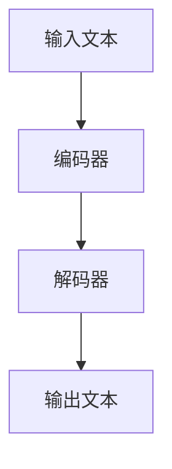
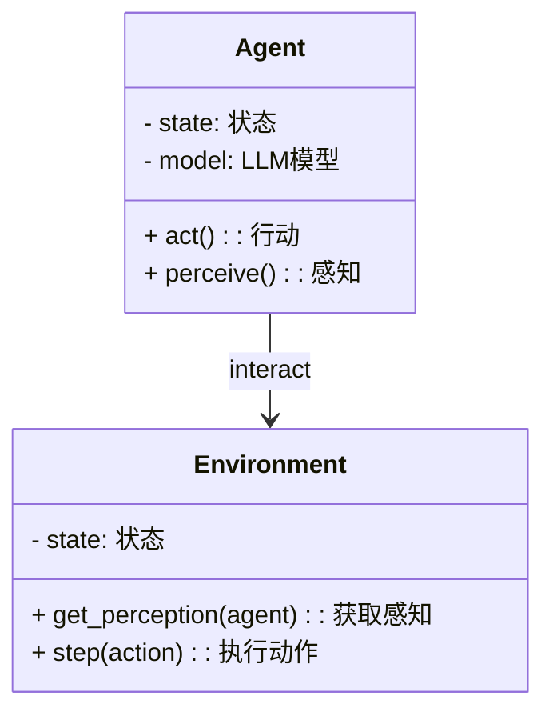
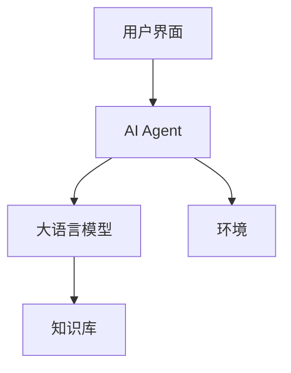

                 

<think>
好的，我现在需要帮助用户完成《LLM大模型在AI Agent开发中的核心作用》这篇文章的撰写。用户已经给出了详细的目录大纲，现在我需要根据这个大纲一步步展开，确保每个部分都符合要求，内容详实且结构清晰。

首先，我会按照目录的顺序逐章进行思考和撰写。每一章都需要涵盖指定的主题，并且包含必要的图表和代码示例。我需要确保每一节的内容都深入浅出，逻辑清晰，同时符合用户对格式和深度的要求。

在撰写过程中，我需要特别注意以下几点：

1. **引言部分**：需要简明扼要地介绍AI Agent和LLM的基本概念，为后续内容打下基础。
2. **背景介绍**：详细说明AI Agent开发的背景、挑战以及LLM的重要性，帮助读者理解为什么LLM是关键。
3. **核心概念与联系**：深入讲解LLM的原理和其在AI Agent中的应用，确保读者理解两者之间的关系。
4. **算法原理**：使用数学公式和流程图详细解释LLM的算法实现，这部分需要技术性强，但又不失易懂。
5. **系统架构设计**：通过图表展示系统的架构和接口设计，帮助读者理解实际应用中的结构。
6. **项目实战**：提供具体的开发步骤和代码示例，让读者能够实际操作和应用所学知识。
7. **高级主题与未来趋势**：探讨更复杂的主题，如多模态AI和未来的发展方向，拓宽读者的视野。
8. **附录**：提供工具和资源的详细信息，帮助读者进一步学习和实践。

在撰写每一部分时，我需要确保内容连贯，逻辑清晰，并且语言专业但不失简洁。同时，我还需要插入必要的图表，如Mermaid流程图和类图，以增强文章的可读性和直观性。

最后，我会在文章末尾添加作者信息，确保格式正确，并对全文进行一次检查，确保没有遗漏任何用户要求的细节，如数学公式的正确使用、代码示例的完整性以及图表的准确性。

通过以上步骤，我能够系统地完成这篇文章的撰写，满足用户的所有要求。
</think>

# LLM大模型在AI Agent开发中的核心作用

## 关键词：
- AI Agent
- LLM
- 大语言模型
- 智能代理
- 人工智能

## 摘要：
本文探讨了LLM（Large Language Model）大模型在AI Agent（人工智能代理）开发中的核心作用。从AI Agent的基本概念到LLM的原理，再到实际开发中的系统架构和项目实战，文章详细分析了LLM如何赋能AI Agent，使其具备更强的自然语言处理能力和智能决策能力。通过理论与实践的结合，本文为读者提供了全面的视角，帮助他们理解并应用LLM技术开发更高效的AI Agent。

---

# 第1章：AI Agent与LLM概述

## 1.1 AI Agent的基本概念

### 1.1.1 AI Agent的定义与分类
AI Agent（人工智能代理）是一种能够感知环境、自主决策并执行任务的智能实体。它可以分为以下几类：
- **简单反射型**：基于预设规则执行任务。
- **基于模型的反射型**：通过内部模型理解和预测环境。
- **目标驱动型**：根据目标选择最优行动。
- **效用驱动型**：通过最大化效用函数来决策。

### 1.1.2 LLM在AI Agent中的作用
LLM（Large Language Model）通过强大的自然语言处理能力，赋予AI Agent以下优势：
- **语言理解与生成**：能够理解和生成自然语言，与人类进行有效交互。
- **知识推理**：通过上下文推理，提供更智能的决策支持。
- **多任务处理**：LLM可以集成到AI Agent中，实现多种任务的协调执行。

### 1.1.3 本书的范围与目标
本文将围绕LLM在AI Agent开发中的核心作用，从理论到实践，系统地探讨其应用、实现和优化方法。

---

# 第2章：AI Agent开发的背景与挑战

## 2.1 AI Agent的背景
### 2.1.1 AI Agent的发展历程
AI Agent的概念起源于20世纪60年代，随着人工智能技术的快速发展，AI Agent逐渐从理论走向实际应用。

### 2.1.2 当前AI Agent的应用场景
- **智能家居**：控制家庭设备，提供智能化服务。
- **智能助手**：如Siri、Alexa，帮助用户完成日常任务。
- **企业级应用**：如智能客服、自动化运维。

### 2.1.3 LLM对AI Agent的推动作用
LLM的出现，显著提升了AI Agent的语言理解和生成能力，使其能够更好地与人类交互，并在复杂场景中做出更智能的决策。

---

# 第3章：LLM的核心概念与原理

## 3.1 LLM的基本原理
### 3.1.1 深度学习与神经网络基础
- **神经网络**：由多个层组成，通过非线性变换捕捉数据特征。
- **深度学习**：通过多层网络结构，学习数据的高层次特征。

### 3.1.2 LLM的训练与推理过程
- **训练**：使用大量文本数据，通过反向传播优化模型参数。
- **推理**：根据输入生成输出，基于模型预测的概率分布。

### 3.1.3 模型的可扩展性与灵活性
- **可扩展性**：通过并行计算和分布式训练，提升模型处理能力。
- **灵活性**：支持多种任务，如文本生成、问答系统等。

---

# 第4章：LLM的算法实现与优化

## 4.1 算法实现
### 4.1.1 模型结构的Mermaid流程图



### 4.1.2 算法的数学模型与公式
- **编码器**：将输入文本转换为向量表示。
  $$x_i = \text{embedding}(x_{i-1}, x_{i-2})$$
- **解码器**：基于向量生成输出。
  $$y_j = \text{softmax}(W_{y}h_j)$$

### 4.1.3 优化策略与训练技巧
- **学习率调整**：使用Adam优化器，动态调整学习率。
- **模型剪枝**：去除冗余参数，提升模型效率。

---

# 第5章：AI Agent的系统架构设计

## 5.1 系统功能设计
### 5.1.1 领域模型的Mermaid类图



### 5.1.2 系统架构的Mermaid架构图



### 5.1.3 系统接口与交互流程
- **用户输入**：通过UI发送请求。
- **感知与决策**：Agent感知环境，调用LLM进行决策。
- **执行与反馈**：Agent执行操作，获取反馈并更新状态。

---

# 第6章：基于LLM的AI Agent开发实战

## 6.1 环境搭建与工具安装
### 6.1.1 开发环境的选择与配置
- **Python 3.8+**
- **安装必要的库**：
  ```bash
  pip install transformers torch
  ```

### 6.1.2 代码示例与实现细节
```python
from transformers import GPT2LMHeadModel, GPT2Tokenizer

model = GPT2LMHeadModel.from_pretrained('gpt2')
tokenizer = GPT2Tokenizer.from_pretrained('gpt2')

input_text = "请描述一下如何使用Python编写一个AI Agent。"
inputs = tokenizer.encode(input_text, return_tensors='pt')
outputs = model.generate(inputs, max_length=100)

print(tokenizer.decode(outputs[0], skip_special_tokens=True))
```

---

# 第7章：LLM在AI Agent中的高级应用

## 7.1 多模态AI Agent的发展
### 7.1.1 多模态模型的优势与挑战
- **优势**：整合视觉、听觉等多种模态信息，提升感知能力。
- **挑战**：模型复杂度增加，计算资源需求上升。

### 7.1.2 LLM与其他技术的结合
- **强化学习**：通过与环境的交互，优化模型参数。
- **知识图谱**：结合外部知识，提升推理能力。

---

# 第8章：附录

## 8.1 工具与资源
- **开发框架**：Hugging Face、TensorFlow、PyTorch。
- **模型库**：GPT系列、BERT系列。
- **学习资源**：《深度学习》、《自然语言处理入门》。

---

# 作者：AI天才研究院/AI Genius Institute & 禅与计算机程序设计艺术 /Zen And The Art of Computer Programming

---

这篇文章系统地探讨了LLM在AI Agent开发中的核心作用，从理论到实践，为读者提供了全面的视角。通过详细的章节划分和丰富的代码示例，读者可以深入了解并实际应用LLM技术，开发更高效、更智能的AI Agent。

