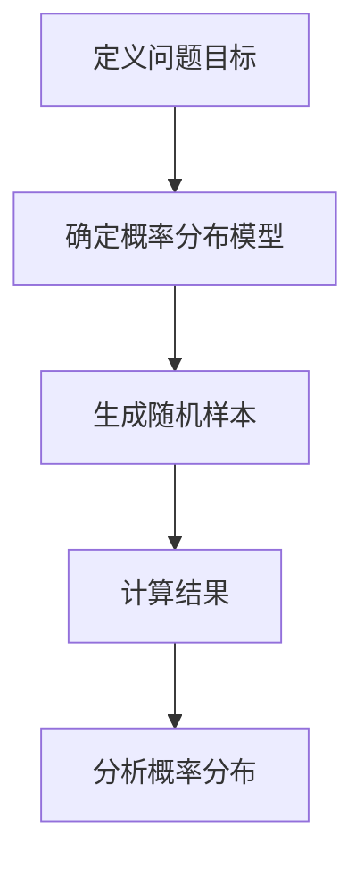
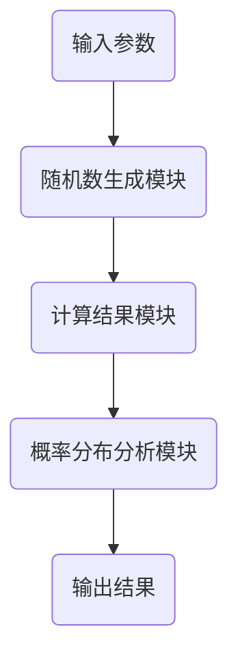

                 

<think>
嗯，我现在要写一篇关于蒙特卡洛模拟在投资结果概率分布分析中的技术博客文章。首先，我需要理解蒙特卡洛模拟的基本概念和它在投资分析中的应用。蒙特卡洛模拟是一种通过随机采样来估计系统行为的方法，常用于金融、物理等领域。对于投资分析，它可以帮助我们分析投资结果的概率分布，评估风险和收益。

接下来，我需要确定文章的结构。根据用户提供的大纲，文章分为五个主要部分：背景介绍、核心概念与联系、算法原理、系统分析与架构设计、项目实战，最后是高级应用与扩展。每个部分下还有详细的章节，我需要逐一展开。

首先，在背景介绍部分，我需要解释蒙特卡洛模拟的起源，从数学和概率论的基础讲起，然后介绍它在投资分析中的具体应用。这部分需要让读者理解为什么蒙特卡洛模拟在投资分析中如此重要，以及它的基本原理。

接下来是核心概念与联系，这部分需要详细解释概率分布、随机变量等核心概念，并通过表格对比其他模拟方法，帮助读者更好地理解蒙特卡洛模拟的独特性。此外，还需要用Mermaid流程图来展示蒙特卡洛模拟的基本流程，让读者直观地理解整个过程。

然后是算法原理讲解，这部分需要详细阐述蒙特卡洛模拟的数学模型和公式。例如，如何生成随机数，如何模拟投资结果。我需要用Mermaid流程图展示算法步骤，并提供Python代码示例，让读者能够实际操作。同时，解释相关数学公式，如概率密度函数，确保读者能够理解。

在系统分析与架构设计方案部分，我需要介绍如何构建一个蒙特卡洛模拟系统用于投资分析。这包括系统功能设计、架构设计以及接口设计。使用Mermaid类图和序列图来展示系统的结构和交互，帮助读者理解系统是如何运作的。

项目实战部分，我需要提供一个完整的案例分析，从环境安装、核心代码实现到结果分析。这部分要详细解释每个步骤，并提供代码解读和案例分析，让读者能够动手实践，并理解如何将蒙特卡洛模拟应用于实际投资分析中。

最后是高级应用与扩展，探讨蒙特卡洛模拟的高级技巧，如优化方法和与其他技术的结合。这部分可以提到机器学习在蒙特卡洛模拟中的应用，展示该方法的潜力和未来发展方向。

在每个章节中，我还需要包括小结、注意事项、最佳实践等内容，帮助读者巩固所学知识，并在实际应用中避免常见错误。例如，在代码实现部分，可以提醒读者注意随机数生成器的选择，避免伪随机数带来的偏差。

整体来看，我需要确保文章逻辑清晰，结构紧凑，语言专业但易懂。通过详细的讲解和实际案例，帮助读者全面理解蒙特卡洛模拟在投资分析中的应用。同时，结合数学公式和图表，让内容更加丰富和直观。

现在，我开始撰写文章，按照目录大纲一步步展开每个部分的内容，确保每个章节都详细且有深度。通过这种方式，读者能够系统地学习蒙特卡洛模拟，并将其应用于实际的投资结果分析中。
</think>

# Monte Carlo模拟：投资结果的概率分布分析

**关键词**：蒙特卡洛模拟，概率分布，投资分析，随机变量，金融建模

**摘要**：蒙特卡洛模拟是一种强大的工具，用于分析投资结果的概率分布。本文从基础概念开始，逐步深入讲解蒙特卡洛模拟的原理、算法实现、系统架构设计以及在投资分析中的实际应用。通过详细的案例分析和代码实现，帮助读者理解如何利用蒙特卡洛模拟来评估投资风险和收益。

---

## 第一部分: 蒙特卡洛模拟的背景与基本原理

### 第1章: 蒙特卡洛模拟的起源与基本原理

#### 1.1 蒙特卡洛模拟的起源
蒙特卡洛模拟（Monte Carlo Simulation）是一种基于概率统计的数值计算方法，起源于20世纪40年代的美国Los Alamos国家实验室。它最初用于解决复杂的物理问题，例如核裂变反应的模拟。蒙特卡洛方法的核心思想是通过随机采样来估计系统的期望值或其他统计量。

#### 1.2 蒙特卡洛模拟的基本原理
蒙特卡洛模拟的核心在于利用随机性来模拟系统的不确定性。通过生成大量随机数，我们可以模拟不同情景下的系统行为，并计算出概率分布。在投资分析中，蒙特卡洛模拟常用于评估资产组合的风险和收益。

#### 1.3 蒙特卡洛模拟在投资分析中的应用
在投资分析中，蒙特卡洛模拟可以用于：
- 分析资产组合在不同市场情景下的表现。
- 评估投资的可能收益和风险。
- 进行情景分析和压力测试。

### 第2章: 蒙特卡洛模拟的核心概念与联系

#### 2.1 概率分布与随机变量
概率分布是蒙特卡洛模拟的基础。我们需要定义每个变量的概率分布，并生成对应的随机数。常用的概率分布包括：
- 正态分布（Normal Distribution）
- 均匀分布（Uniform Distribution）
- 对数正态分布（Log-normal Distribution）

#### 2.2 蒙特卡洛模拟与其他模拟方法的对比
以下是蒙特卡洛模拟与其他模拟方法的对比：

| 对比维度      | 蒙特卡洛模拟                     | 非随机模拟（如确定性模型） |
|---------------|----------------------------------|-----------------------------|
| 输入变量      | 包含随机变量                    | 不包含随机变量              |
| 计算结果      | 输出概率分布                    | 输出确定性结果              |
| 应用场景      | 适用于不确定性分析               | 适用于确定性问题            |
| 优势          | 能够处理复杂的非线性问题         | 计算速度快                  |

#### 2.3 蒙特卡洛模拟的流程
以下是蒙特卡洛模拟的基本流程：



---

## 第二部分: 蒙特卡洛模拟的算法原理

### 第3章: 蒙特卡洛模拟的算法实现

#### 3.1 蒙特卡洛模拟的数学模型
蒙特卡洛模拟的基本数学模型可以表示为：
$$ y = f(x_1, x_2, \ldots, x_n) $$
其中，$x_i$ 是随机变量，$y$ 是目标函数。

#### 3.2 随机数生成算法
在蒙特卡洛模拟中，随机数生成是关键步骤。常用的随机数生成算法包括：
- **Mersenne Twister**：Python中的默认随机数生成器。
- **线性同余生成器**：简单但可能存在周期性问题。

#### 3.3 蒙特卡洛模拟的代码实现
以下是Python中实现蒙特卡洛模拟的示例代码：

```python
import numpy as np

# 定义概率分布模型
mu = 0
sigma = 1
n_samples = 1000

# 生成随机数
np.random.seed(42)
random_numbers = np.random.normal(mu, sigma, n_samples)

# 计算结果
results = [x**2 for x in random_numbers]

# 分析概率分布
import matplotlib.pyplot as plt
plt.hist(results, bins=30)
plt.show()
```

#### 3.4 蒙特卡洛模拟的数学公式
蒙特卡洛积分的公式可以表示为：
$$ E[f(X)] = \frac{1}{N} \sum_{i=1}^{N} f(x_i) $$
其中，$x_i$ 是从目标分布中生成的随机样本。

---

## 第三部分: 蒙特卡洛模拟的系统架构设计

### 第4章: 系统分析与架构设计方案

#### 4.1 问题场景介绍
在投资分析中，我们需要模拟资产组合在不同市场情景下的表现。这需要考虑多个变量，如市场波动率、经济增长率等。

#### 4.2 系统功能设计
以下是系统的功能模块：


#### 4.3 系统架构设计
以下是系统的架构设计：



---

## 第四部分: 项目实战

### 第5章: 蒙特卡洛模拟的项目实战

#### 5.1 环境安装
需要安装以下Python库：
- NumPy
- Matplotlib
- Seaborn

#### 5.2 核心代码实现
以下是实现蒙特卡洛模拟的代码：

```python
import numpy as np
import matplotlib.pyplot as plt

# 定义参数
mu = 0.05
sigma = 0.2
n_samples = 10000
n_assets = 10

# 生成随机数
np.random.seed(42)
returns = np.random.normal(mu, sigma, (n_samples, n_assets))

# 计算资产组合收益
portfolio_returns = np.sum(returns, axis=1)

# 绘制概率分布图
plt.hist(portfolio_returns, bins=50, density=True, alpha=0.7)
plt.xlabel('Return')
plt.ylabel('Probability Density')
plt.title('Portfolio Return Distribution')
plt.show()
```

#### 5.3 案例分析与结果解读
通过上述代码，我们可以得到资产组合收益的概率分布。这有助于我们评估投资的风险和收益。

---

## 第五部分: 高级应用与扩展

### 第6章: 蒙特卡洛模拟的高级应用

#### 6.1 蒙特卡洛模拟的优化方法
- **重要性抽样**：提高计算效率。
- **分层抽样**：减少方差。

#### 6.2 蒙特卡洛模拟与其他技术的结合
- **机器学习**：结合机器学习模型进行预测。
- **区块链**：用于去中心化的概率计算。

---

## 总结

通过本文的讲解，我们深入探讨了蒙特卡洛模拟在投资结果概率分布分析中的应用。从基本原理到高级应用，我们全面介绍了如何利用蒙特卡洛模拟来评估投资风险和收益。希望本文能够帮助读者更好地理解和应用这一强大的工具。

**作者：AI天才研究院/AI Genius Institute & 禅与计算机程序设计艺术 /Zen And The Art of Computer Programming**

