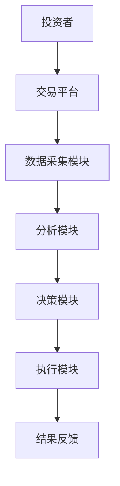
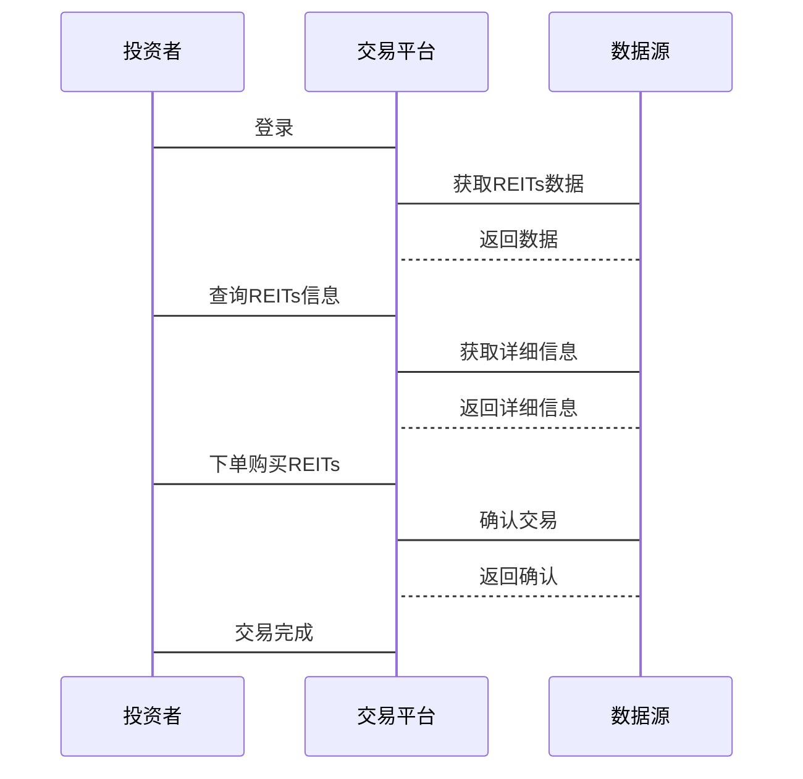

                 


# REITs投资：房地产市场的流动性解决方案

## 关键词：REITs, 房地产投资, 流动性解决方案, 投资策略, 风险分析, 数学模型

## 摘要：  
REITs（房地产投资信托基金）作为一种将房地产投资转化为金融产品的工具，为投资者提供了更高的流动性和专业化的管理。本文将详细分析REITs的定义、运作机制、市场环境、投资策略，以及其在房地产市场中的重要性。通过数学模型和实际案例，本文将帮助读者理解如何利用REITs优化投资组合，降低风险，并在房地产市场中获得长期收益。

---

## 第一部分: REITs投资基础

### 第1章: REITs的起源与发展

#### 1.1 REITs的定义与特点

REITs（房地产投资信托基金）是一种通过汇集资金投资于房地产项目，并将收益以股息形式分配给投资者的金融工具。其核心特点包括：

- **高流动性**：REITs通常在交易所上市，投资者可以随时买卖。
- **专业管理**：由专业团队负责房地产的收购、管理和运营。
- **风险分散**：通过投资多个房地产项目分散单一资产的风险。
- **高收益潜力**：通过租金收入和资本增值为投资者提供收益。

REITs与传统房地产投资相比，具有门槛低、流动性高、风险分散等优势。

#### 1.2 REITs的起源与演变

REITs起源于20世纪60年代的美国。1960年，美国通过《REITs法案》，允许公司通过发行股份募集资金并投资于房地产，同时享受税收优惠。此后，REITs在全球范围内迅速发展，尤其是在美国、欧洲和亚洲市场。目前，全球REITs市场规模超过 trillion美元，成为房地产投资的重要工具。

#### 1.3 REITs的运作机制

REITs的运作流程如下：

1. **发行与资金募集**：通过公开发行或私募方式筹集资金。
2. **房地产投资**：将资金用于购买、开发和管理房地产资产。
3. **收益分配**：将租金收入和资本增值收益分配给股东，通常每年至少分配90%的可分配利润。

REITs的管理结构包括董事会、管理层和专业团队，负责战略决策和日常运营。

### 第2章: REITs的市场环境与经济影响

#### 2.1 房地产市场的周期性

房地产市场具有明显的周期性，包括衰退、复苏、增长和繁荣阶段。REITs在不同周期中的表现如下：

- **衰退阶段**：REITs价格下跌，但租金收入稳定。
- **复苏阶段**：REITs价格逐步回升，收益增长。
- **增长阶段**：REITs价格稳步上涨，收益增加。
- **繁荣阶段**：REITs价格达到高点，风险上升。

REITs的周期性表现需要结合宏观经济指标进行分析。

#### 2.2 REITs的流动性分析

REITs的流动性高于传统房地产投资，投资者可以随时买卖股票。然而，流动性还受到市场波动、交易量等因素的影响。REITs的流动性对投资者的投资决策至关重要，尤其是在市场波动较大时。

#### 2.3 REITs的收益与风险

REITs的收益主要来自租金收入和资本增值。风险包括市场风险（房地产价格波动）、利率风险（利率上升导致估值下降）和流动性风险（市场流动性不足）。投资者需要通过多元化投资和风险评估来降低风险。

### 第3章: REITs的投资策略与分析方法

#### 3.1 REITs的投资策略

REITs的投资策略包括：

- **长期投资**：持有优质REITs，长期获得稳定收益。
- **短期交易**：根据市场波动进行买卖，获取价差收益。
- **多元化投资**：投资不同地区的REITs，分散风险。

#### 3.2 REITs的分析框架

分析REITs时，需要考虑财务指标、市场指标和宏观经济因素。例如：

- **财务指标**：股息率、净收益、杠杆率。
- **市场指标**：市盈率、市净率。
- **宏观经济因素**：利率、经济增长、通货膨胀。

#### 3.3 REITs的数学模型与公式

使用CAPM模型评估REITs的预期收益：

$$ E = R_f + \beta (R_m - R_f) $$

其中，\( E \) 为预期收益，\( R_f \) 为无风险利率，\( \beta \) 为系统性风险系数，\( R_m \) 为市场预期收益。

---

## 第二部分: 系统分析与架构设计方案

### 系统架构设计

REITs投资系统包括以下几个模块：

- **数据采集模块**：收集房地产市场数据和REITs相关信息。
- **分析模块**：使用数学模型评估REITs的收益和风险。
- **决策模块**：根据分析结果制定投资策略。
- **执行模块**：通过交易平台执行投资指令。

系统架构图如下：



### 接口设计

- **投资者接口**：提供REITs产品信息查询、投资组合管理功能。
- **交易平台接口**：连接到交易所，实现REITs的买卖操作。
- **数据接口**：与房地产数据源对接，获取实时数据。

### 交互流程图



---

## 第三部分: 项目实战

### 环境搭建

- **工具**：Excel、Python（Pandas、Matplotlib）
- **数据源**：公开的REITs市场数据，如Yahoo Finance。

### 核心实现代码

```python
import pandas as pd
import matplotlib.pyplot as plt

# 数据加载
data = pd.read_csv('reits_data.csv')

# 计算收益和风险
returns = data['Return'].values
volatility = data['Volatility'].values

# 绘制收益与风险散点图
plt.scatter(volatility, returns, c='blue', alpha=0.5)
plt.xlabel('Volatility (%)')
plt.ylabel('Returns (%)')
plt.title('REITs Risk vs. Return')
plt.show()
```

### 实际案例分析

以某REITs产品为例，分析其历史表现和未来潜力。使用上述代码计算其收益和风险，绘制散点图，帮助投资者做出决策。

---

## 第四部分: 总结与展望

### 最佳实践 tips

- 定期审查投资组合，调整风险敞口。
- 关注宏观经济指标，抓住市场机会。
- 分散投资，降低特定风险。

### 小结

REITs作为房地产市场的流动性解决方案，为投资者提供了便捷、高效的投资渠道。通过科学的分析和策略，投资者可以有效管理风险，实现长期收益。

### 注意事项

- REITs市场具有波动性，需谨慎评估风险。
- 投资者应根据自身风险承受能力选择合适的产品。

### 拓展阅读

- REITs的税收政策与法律结构。
- 新兴市场中的REITs投资机会。

---

## 作者：AI天才研究院 & 禅与计算机程序设计艺术

通过系统的分析和实战指导，本书旨在帮助读者全面理解REITs的投资价值，并在实际操作中优化投资策略，实现财富增长。

