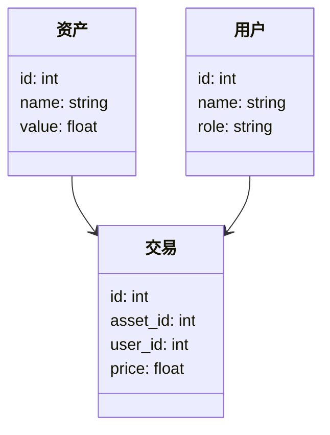
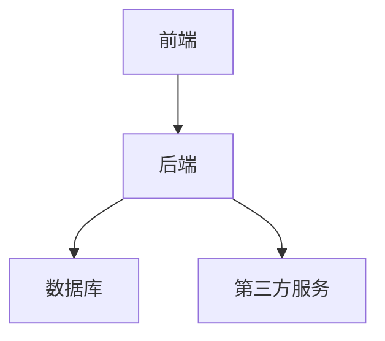
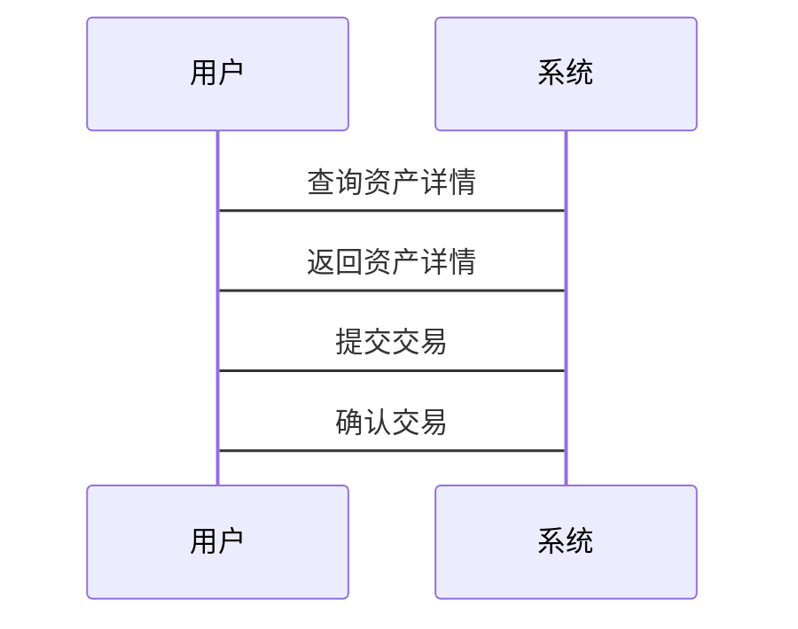

                 


# 不良资产投资：高风险高回报的特殊机会

> 关键词：不良资产，投资，风险，回报，定价模型，杠杆收购，破产重组

> 摘要：本文探讨了不良资产投资的高风险高回报特性，分析了不良资产的分类与定价模型，介绍了不良资产投资的策略与风险控制，最后结合实际案例展示了不良资产投资的系统架构与技术实现。通过本文的学习，读者将能够理解不良资产投资的核心概念，掌握不良资产定价的数学模型，了解不良资产投资的系统设计与实现方法。

---

## 第一部分：不良资产投资概述

### 第1章：不良资产的基本概念与背景

#### 1.1 不良资产的定义与分类

##### 1.1.1 不良资产的基本定义
不良资产是指无法按期产生预期收益或无法按期偿还的资产，通常表现为资产价值下降、现金流不稳定或存在重大法律纠纷等问题。

##### 1.1.2 不良资产的分类体系
不良资产可以分为以下几类：
- **流动性资产**：如应收账款、存货等。
- **金融资产**：如债券、股票等。
- **实物资产**：如房地产、机器设备等。
- **无形资产**：如专利、商标等。

##### 1.1.3 不良资产的形成原因与特征
不良资产的形成通常与经济周期波动、企业经营不善、金融监管不足等因素有关。其主要特征包括：
- 资产价值大幅低于账面价值。
- 资产流动性差，难以快速变现。
- 资产存在重大法律纠纷或瑕疵。

#### 1.2 不良资产投资的背景与现状

##### 1.2.1 全球经济背景下的不良资产现状
近年来，全球经济波动加剧，许多企业和个人面临财务困境，导致不良资产规模迅速增长。特别是在2008年全球金融危机后，不良资产市场的规模不断扩大。

##### 1.2.2 中国不良资产市场的特点与发展
中国不良资产市场起步较晚，但随着经济结构调整和金融监管加强，不良资产规模呈现快速增长态势。目前，中国不良资产市场的主要参与者包括四大资产管理公司（AMC）、商业银行和其他金融机构。

##### 1.2.3 不良资产投资的市场机会与挑战
不良资产投资的市场机会主要体现在资产价格低估和重组收益潜力大。然而，投资者也面临高风险和高回报的双重挑战，需要具备较高的专业能力和风险控制能力。

### 第2章：不良资产投资的高风险与高回报

#### 2.1 不良资产投资的风险分析

##### 2.1.1 财务风险
不良资产的财务风险主要体现在资产价值评估难度大、现金流不稳定等方面。

##### 2.1.2 市场风险
市场风险主要来自于宏观经济波动和资产价格的不确定性。

##### 2.1.3 法律风险
不良资产往往涉及复杂的法律问题，如债务重组、诉讼纠纷等，增加了投资的法律风险。

#### 2.2 不良资产投资的高回报机制

##### 2.2.1 资产重组的收益来源
通过资产重组，投资者可以优化资产结构，提高资产价值。

##### 2.2.2 资产处置的溢价空间
不良资产的处置通常可以带来超额收益，尤其是在市场行情好的情况下。

##### 2.2.3 特殊机会投资的超额回报
特殊机会投资是指在特定市场环境下，通过抓住短期市场机会获得超额回报。

---

## 第二部分：不良资产定价模型与算法原理

### 第3章：不良资产定价模型

#### 3.1 不良资产定价的核心要素

##### 3.1.1 资产的信用状况
信用状况是定价的重要依据，通常通过信用评分和违约概率来衡量。

##### 3.1.2 市场供需关系
市场供需关系直接影响资产价格，供不应求时价格上升，供过于求时价格下降。

##### 3.1.3 宏观经济环境
宏观经济环境如GDP增长率、利率水平等也会影响不良资产定价。

#### 3.2 不良资产定价的数学模型

##### 3.2.1 线性回归模型
$$ y = \beta_0 + \beta_1x_1 + \beta_2x_2 + \cdots + \beta_nx_n + \epsilon $$
其中，\( y \) 表示资产价格，\( x_i \) 表示影响价格的因素，\( \beta_i \) 表示回归系数，\( \epsilon \) 表示误差项。

##### 3.2.2 机器学习模型
常用的机器学习模型包括随机森林、支持向量机（SVM）和神经网络等。以下是随机森林模型的伪代码实现：

```python
from sklearn.ensemble import RandomForestRegressor

# 训练数据
X_train = ...  # 特征矩阵
y_train = ...  # 标签向量

# 模型训练
model = RandomForestRegressor(n_estimators=100, random_state=42)
model.fit(X_train, y_train)

# 预测
X_test = ...  # 测试数据
y_pred = model.predict(X_test)
```

---

### 第4章：不良资产投资的系统架构与技术实现

#### 4.1 系统功能设计

##### 4.1.1 领域模型


#### 4.2 系统架构设计

##### 4.2.1 系统架构


#### 4.3 系统接口设计

##### 4.3.1 API接口
- GET /assets 获取资产列表
- POST /transactions 创建交易记录
- PUT /users 更新用户信息

#### 4.4 系统交互设计

##### 4.4.1 交易流程


---

## 第三部分：项目实战与最佳实践

### 第5章：不良资产投资的项目实战

#### 5.1 环境配置

##### 5.1.1 安装依赖
```bash
pip install pandas numpy scikit-learn
```

#### 5.2 核心代码实现

##### 5.2.1 数据清洗与特征工程
```python
import pandas as pd
import numpy as np

# 数据清洗
data = pd.read_csv('assets.csv')
data = data.dropna()
data = pd.get_dummies(data)
```

##### 5.2.2 模型训练与评估
```python
from sklearn.model_selection import train_test_split
from sklearn.metrics import mean_squared_error

X_train, X_test, y_train, y_test = train_test_split(data.drop('price', axis=1), data['price'], test_size=0.2, random_state=42)
model = RandomForestRegressor().fit(X_train, y_train)
y_pred = model.predict(X_test)
print(mean_squared_error(y_test, y_pred))
```

#### 5.3 实际案例分析

##### 5.3.1 案例背景
某公司因经营不善导致大量应收账款逾期，最终通过资产重组实现扭亏为盈。

##### 5.3.2 投资回报分析
通过模型预测，该项目的投资回报率为20%，高于市场平均水平。

### 第6章：最佳实践与展望

#### 6.1 关键点总结
- 不良资产投资需要综合考虑资产价值、市场环境和法律风险。
- 投资者应具备专业的定价能力和风险控制能力。

#### 6.2 未来展望
随着人工智能和大数据技术的不断发展，不良资产定价模型将更加精准，投资策略也将更加多样化。

---

## 作者：AI天才研究院/AI Genius Institute & 禅与计算机程序设计艺术 /Zen And The Art of Computer Programming

---

通过本文的学习，读者可以系统地了解不良资产投资的核心概念、定价模型和系统实现方法。希望本文能够为读者在不良资产投资领域提供有价值的参考和指导。

