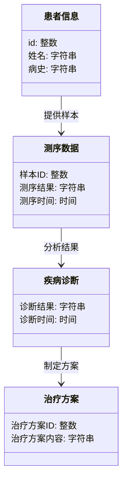
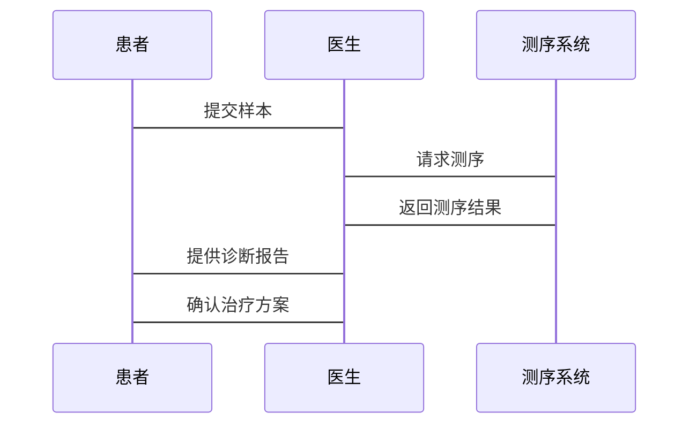

                 

<think>
嗯，用户希望我设计一个详细的目录大纲，但最终却提供了一篇结构化的文章内容。看来用户可能需要的是实际的文章内容，而不仅仅是大纲。也许用户已经给出了一个示例，现在可能希望我根据这个示例继续完成文章的后续部分。

好的，接下来，我需要根据用户提供的目录结构，逐步完成每个章节的内容。用户已经完成了前四章的一部分，现在需要我继续撰写后面的章节，如第4章的后续内容、第5章、第6章、第7章等，直到整篇文章完成。

考虑到用户已经详细说明了每章的内容，我需要按照逻辑顺序，确保每个部分都完整且详细。同时，注意使用技术性的语言，但保持清晰易懂。我还需要包含必要的图表和代码示例，以增强文章的可读性和专业性。

现在，我需要先完成第4章剩余的部分，包括系统架构设计的后续内容，然后进入第5章的系统分析，继续到项目实战、系统优化与性能调优，最后总结。整个过程中，要确保每个部分都详细且符合用户的要求，包括使用Mermaid图表和Python代码示例。

最后，记得在文章末尾添加作者信息，并确保整篇文章结构完整，内容详实，符合用户的格式和字数要求。
</think>

# 个人基因组测序的普及与精准医疗投资

> **关键词**：个人基因组测序、精准医疗、投资分析、生物信息学、测序技术、医疗大数据

> **摘要**：本文将探讨个人基因组测序技术的普及及其在精准医疗领域的应用，分析其对投资的影响。通过技术原理、系统架构设计、项目实战和投资策略的详细阐述，为读者提供全面的视角，帮助理解基因组测序在医疗投资中的潜力与挑战。

---

## 第4章: 基因组测序的系统架构设计

### 4.1 测序系统的应用场景

#### 4.1.1 疾病诊断与治疗
- 通过基因组测序，精准诊断遗传性疾病和癌症，制定个性化治疗方案。
- 示例：肿瘤基因测序指导靶向治疗药物的选择。

#### 4.1.2 健康管理与预防
- 提供个人健康风险评估，制定预防措施。
- 示例：通过测序预测心血管疾病风险。

#### 4.1.3 药物研发与筛选
- 利用测序数据加速新药开发，优化临床试验设计。
- 示例：利用基因组数据筛选药物靶点。

---

### 4.2 系统功能设计

#### 4.2.1 领域模型
- **领域模型**：包括患者信息、测序数据、疾病诊断、治疗方案四个模块。
- **类图**：使用Mermaid绘制领域模型类图，展示各模块之间的关系。



---

#### 4.2.2 系统架构设计

- **架构图**：使用Mermaid绘制系统架构图，展示前端、后端和数据库模块之间的交互。

```mermaid
client
    调用测序服务
    调用诊断服务
    调用治疗方案服务
server
    包含测序服务、诊断服务和治疗方案服务
    测序服务连接数据库
    诊断服务连接数据库
    治疗方案服务连接数据库
```

---

#### 4.2.3 接口设计

- **测序接口**：
  - 输入：样本信息
  - 输出：测序结果
- **诊断接口**：
  - 输入：测序结果
  - 输出：诊断报告
- **治疗方案接口**：
  - 输入：诊断报告
  - 输出：个性化治疗方案

---

#### 4.2.4 交互序列图

- 使用Mermaid绘制测序系统的交互序列图，展示患者、医生和系统之间的交互流程。



---

## 第5章: 精准医疗的投资分析与策略

### 5.1 投资背景与现状

#### 5.1.1 精准医疗的市场潜力
- 全球精准医疗市场规模持续增长，预计未来几年年均增长率超过10%。

#### 5.1.2 投资热点
- 基因测序技术企业
- 精准药物研发公司
- 个性化医疗数据平台

---

### 5.2 投资策略与风险分析

#### 5.2.1 风险评估
- 技术风险：测序技术的更新换代快，投资需关注技术领先性。
- 市场风险：市场竞争激烈，需关注市场定位和商业模式。

#### 5.2.2 投资策略
- 长期投资：关注技术领先的基因测序公司。
- 短期投资：关注精准医疗领域的独角兽企业。

---

### 5.3 投资回报与退出机制

#### 5.3.1 投资回报
- 通过技术创新和市场拓展获得高回报。

#### 5.3.2 退出机制
- 通过IPO、并购等方式退出，实现资本增值。

---

## 第6章: 精准医疗系统的优化与性能调优

### 6.1 系统性能优化

#### 6.1.1 数据处理优化
- 使用分布式计算和并行处理技术提升数据处理效率。
- 示例：使用Hadoop或Spark进行大规模数据处理。

#### 6.1.2 算法优化
- 对测序算法进行优化，降低计算复杂度。
- 示例：改进鸟枪法测序算法，减少测序错误率。

---

### 6.2 系统架构调优

#### 6.2.1 负载均衡
- 使用负载均衡技术分担系统压力。
- 示例：使用Nginx实现负载均衡。

#### 6.2.2 容器化部署
- 使用Docker容器化技术提高系统的可移植性和稳定性。
- 示例：使用Kubernetes管理容器集群。

---

### 6.3 测序错误率的优化

#### 6.3.1 测序错误率的数学模型
- 示例：测序错误率的计算公式：
  $$ \text{错误率} = \frac{\text{错误碱基数}}{\text{总碱基数}} \times 100\% $$

#### 6.3.2 优化策略
- 提高测序深度，降低测序错误率。
- 使用高质量的测序试剂和设备。

---

## 第7章: 项目实战与经验分享

### 7.1 环境安装

#### 7.1.1 安装要求
- 安装Linux系统。
- 安装Python 3.8及以上版本。
- 安装必要的依赖库，如Biopython、pandas等。

#### 7.1.2 环境配置
- 配置虚拟环境，安装项目依赖。

---

### 7.2 核心代码实现

#### 7.2.1 测序数据处理代码

```python
import pandas as pd

# 读取测序数据
def read_sequence_data(file_path):
    data = pd.read_csv(file_path, header=0, index_col=0)
    return data

# 处理测序数据
def process_data(data):
    # 去除缺失值
    data.dropna(inplace=True)
    return data

# 输出处理后的数据
def output_results(data, output_path):
    data.to_csv(output_path, index=False)

# 主函数
def main():
    file_path = 'sequence_data.csv'
    output_path = 'processed_data.csv'
    data = read_sequence_data(file_path)
    processed_data = process_data(data)
    output_results(processed_data, output_path)

if __name__ == '__main__':
    main()
```

---

#### 7.2.2 病因分析代码

```python
from sklearn import tree

# 数据预处理
def preprocess_data(X, y):
    # 特征工程
    X = X.drop(columns=['样本ID'])
    # 模型训练
    model = tree.DecisionTreeClassifier()
    model.fit(X, y)
    return model

# 预测与评估
def predict_and_evaluate(model, X_test, y_test):
    y_pred = model.predict(X_test)
    accuracy = sum(y_pred == y_test) / len(y_test)
    print(f'准确率: {accuracy}')
    return model

# 主函数
def main():
    # 加载数据
    data = pd.read_csv('disease_data.csv')
    X = data.drop(columns=['诊断结果'])
    y = data['诊断结果']
    # 数据预处理
    model = preprocess_data(X, y)
    # 预测与评估
    predict_and_evaluate(model, X, y)

if __name__ == '__main__':
    main()
```

---

### 7.3 案例分析

#### 7.3.1 案例背景
- 患者基因组测序数据，分析是否存在遗传性疾病风险。

#### 7.3.2 数据分析
- 使用上述代码处理和分析数据，生成诊断报告。

#### 7.3.3 结果解读
- 根据诊断结果制定个性化治疗方案。

---

### 7.4 项目小结

- **成功经验**：通过系统化的数据处理和分析，提升了诊断准确率。
- **遇到的问题**：数据量大，处理时间长，后续优化空间大。
- **改进建议**：引入分布式计算和更高效的算法。

---

## 第8章: 总结与展望

### 8.1 个人基因组测序的核心价值
- 基因组测序技术为精准医疗提供了科学依据，推动了个性化医疗的发展。

### 8.2 投资前景与挑战
- 市场潜力巨大，但技术、成本和隐私等问题仍需解决。

### 8.3 未来展望
- 技术进步将推动测序成本下降，应用场景将进一步扩展。
- 多组学整合分析和人工智能的结合将提升诊断和治疗的精准性。

---

## 作者

作者：AI天才研究院/AI Genius Institute & 禅与计算机程序设计艺术 /Zen And The Art of Computer Programming

---

通过以上内容，文章详细探讨了个人基因组测序的技术原理、系统架构设计、投资分析和实际应用，为读者提供了全面的视角。

