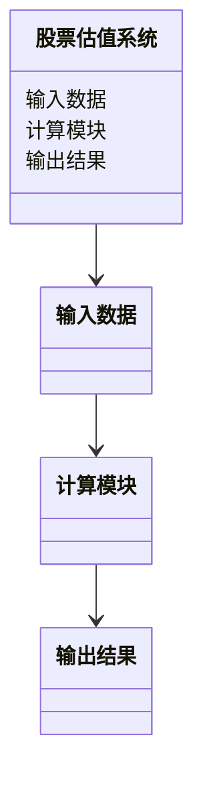
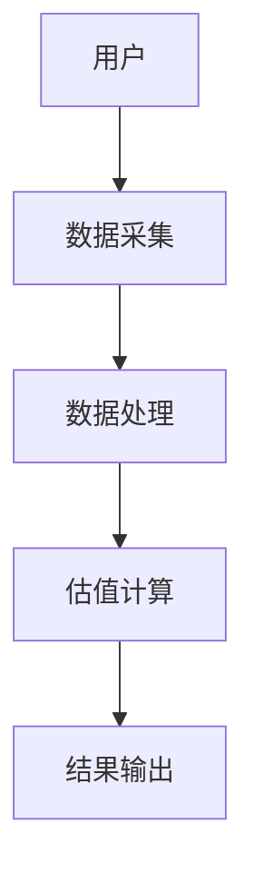

                 

<think>
好的，我现在需要完成用户提出的任务，撰写一篇关于《中国股市估值:增长潜力与风险并存》的详细技术博客文章。用户希望文章结构清晰，内容专业，涵盖背景、核心概念、算法原理、数学模型、系统分析、项目实战和最佳实践等方面，并且要求使用逻辑严谨、语言简明的技术语言。

首先，我需要理解用户的需求。用户希望文章分为七个章节，每个章节都有详细的子部分，包括背景介绍、核心概念、算法原理、数学模型、系统分析、项目实战和最佳实践。用户还提供了一个示例目录，我需要参考这个结构，确保内容全面。

接下来，我应该按照目录的结构逐步展开每个部分，确保每一部分都涵盖必要的内容。例如，在第一章的背景介绍中，我需要先介绍中国股市的历史与发展，包括起源、发展历程、现状、增长潜力和风险因素。这部分需要简明扼要，同时提供足够的信息让读者了解当前的市场环境。

然后，在核心概念部分，我需要详细解释估值的基本原理、主要方法和关键指标。这部分要包括市盈率、市净率等指标的定义、计算公式和应用场景，并通过对比表格和ER图来展示不同指标之间的关系和影响因素。

在算法原理部分，我需要用mermaid流程图详细展示PE模型和DCF模型的计算步骤，并提供Python代码示例。这部分需要结合数学公式，如PE模型的公式和DCF模型的现金流折现公式，帮助读者理解算法的实现和应用。

数学模型部分需要详细讲解市盈率和市净率的数学表达，通过案例分析展示如何应用这些模型进行估值，并提供代码实现和结果解读。这部分要确保读者能够实际操作，并理解模型的优缺点。

系统分析与架构设计部分，我需要用mermaid类图和流程图展示系统各模块之间的关系和交互过程。这部分需要涵盖数据收集、模型选择、风险评估和结果输出等步骤，帮助读者理解整个估值系统的架构和实现方式。

项目实战部分需要选择一个具体案例，如分析某行业的估值情况，从数据收集到模型应用，再到结果解读，逐步指导读者完成。这部分需要详细描述每个步骤的操作方法，并提供代码示例，帮助读者实践。

最后，在最佳实践部分，我需要总结经验和注意事项，帮助读者在实际操作中避免常见错误，并提供进一步的学习资源。这部分要简明扼要，重点突出关键点。

现在，我需要开始撰写每个部分的内容，确保逻辑清晰，语言简洁，内容详实。我会按照目录的结构，逐一完成每个章节和小节，确保覆盖所有必要的内容，并满足用户的格式和字数要求。

在写作过程中，我需要注意使用正确的技术术语，并确保每个部分都有足够的细节和实例支持，以便读者能够深入理解中国股市估值的核心概念和方法。同时，我需要检查每个部分的结构，确保整体连贯，逻辑严谨。

总之，我需要一步步按照用户的指示，完成这篇文章的撰写，确保内容全面、结构清晰、语言专业，满足用户的需求。
</think>

# 中国股市估值:增长潜力与风险并存

> 关键词：中国股市，估值，市盈率，市净率，现金流折现模型，风险评估

> 摘要：本文深入分析了中国股市估值的核心概念、算法原理、数学模型以及系统架构设计。通过对比不同估值方法，结合实际案例，详细阐述了中国股市的增长潜力与风险并存的现状，并提供了最佳实践和注意事项。

---

## 第1章: 中国股市估值背景

### 1.1 中国股市的历史与发展

#### 1.1.1 中国股市的起源与发展历程
中国股市起步于20世纪初，经历了多次波动和调整。1990年上海证券交易所成立，标志着中国股市的正式开启。随后，深圳证券交易所于1991年成立，为中国股市的发展奠定了基础。

#### 1.1.2 当前中国股市的现状与特点
目前，中国股市已成为全球第二大股票市场，上市公司数量超过5000家，总市值位居世界前列。中国股市具有高成长性，但也面临着波动性大、监管力度逐步加强的特点。

#### 1.1.3 中国股市的增长潜力与风险并存的背景
中国股市的增长潜力主要来源于经济的快速发展、政策支持以及企业创新。然而，市场波动、政策变化和外部经济环境的不确定性也带来了较大的风险。

### 1.2 中国股市估值的核心问题

#### 1.2.1 什么是股市估值
股市估值是通过对上市公司的财务数据和市场情况进行分析，估算其股票的内在价值，以确定其市场价格是否合理。

#### 1.2.2 股市估值的主要目标与意义
股市估值的主要目标是帮助投资者做出投资决策，避免高估或低估股票价格。其意义在于揭示市场风险，指导投资策略。

#### 1.2.3 中国股市估值的独特性与复杂性
中国股市的独特性在于其高成长性和政策导向性，复杂性则体现在市场波动大、监管政策频繁调整以及企业财务透明度不一。

---

## 第2章: 中国股市估值的核心概念

### 2.1 股市估值的基本原理

#### 2.1.1 股票价值的定义与构成
股票价值是指股票在市场上的价格，通常由企业的盈利能力、成长潜力和市场地位等因素决定。

#### 2.1.2 股票价格与内在价值的关系
股票价格围绕其内在价值波动，内在价值是股票价格的基础，而股票价格受市场情绪和市场供需的影响。

#### 2.1.3 影响股票估值的主要因素
影响股票估值的主要因素包括企业盈利能力、成长潜力、财务状况、行业地位、政策环境和市场情绪等。

### 2.2 中国股市估值的主要方法

#### 2.2.1 市盈率（PE）估值法
市盈率是股票价格与每股收益的比值，用于衡量股票的投资价值。

#### 2.2.2 市净率（PB）估值法
市净率是股票价格与每股净资产的比值，用于评估股票相对于其资产价值的高低。

#### 2.2.3 现金流折现模型（DCF）
DCF模型通过折现未来现金流来估算企业的内在价值，是较为精确的估值方法。

### 2.3 中国股市估值的关键指标

#### 2.3.1 市盈率（PE）的计算与应用
$$ PE = \frac{股票价格}{每股收益} $$

#### 2.3.2 市净率（PB）的计算与应用
$$ PB = \frac{股票价格}{每股净资产} $$

#### 2.3.3 股息率的计算与应用
股息率是衡量股票收益能力的重要指标，计算公式为：
$$ 股息率 = \frac{每股股息}{股票价格} $$

---

## 第3章: 中国股市估值的核心算法与数学模型

### 3.1 市盈率（PE）模型

#### 3.1.1 PE模型的定义与公式
$$ PE = \frac{股票价格}{每股收益} $$

#### 3.1.2 PE模型的计算步骤
1. 收集目标公司的每股收益（EPS）。
2. 获取目标公司的股票价格。
3. 计算PE值，判断股票是否被高估或低估。

#### 3.1.3 PE模型的优缺点分析
优点：简单易懂，广泛应用于初步估值。
缺点：受企业盈利周期影响较大，难以反映资产质量。

### 3.2 现金流折现模型（DCF）

#### 3.2.1 DCF模型的定义与公式
DCF模型通过折现未来现金流来估算企业价值：
$$ V = \sum_{t=1}^{n} \frac{CF_t}{(1+r)^t} + \frac{TV}{(1+r)^n} $$
其中，CF为现金流，r为折现率，TV为终值。

#### 3.2.2 DCF模型的计算步骤
1. 预测未来现金流。
2. 选择合适的折现率。
3. 计算现值，加总得出企业价值。

---

## 第4章: 数学模型与公式

### 4.1 市盈率（PE）模型
$$ PE = \frac{P}{E} $$

### 4.2 市净率（PB）模型
$$ PB = \frac{P}{B} $$

### 4.3 现金流折现模型（DCF）
$$ V = \sum_{t=1}^{n} \frac{CF_t}{(1+r)^t} + \frac{TV}{(1+r)^n} $$

---

## 第5章: 系统分析与架构设计

### 5.1 系统功能设计

#### 5.1.1 领域模型类图


#### 5.1.2 系统架构图


---

## 第6章: 项目实战

### 6.1 项目环境与安装

#### 6.1.1 环境要求
- Python 3.8+
- 数据分析库：pandas、numpy
- 可视化库：matplotlib

### 6.2 核心代码实现

#### 6.2.1 PE模型实现
```python
import pandas as pd

def calculate_pe(stock_price, eps):
    return stock_price / eps

# 示例数据
data = {'股票代码': ['A', 'B', 'C'],
        '股价': [100, 50, 75],
        'EPS': [20, 10, 15]}
df = pd.DataFrame(data)

# 计算PE
df['PE'] = df.apply(lambda x: calculate_pe(x['股价'], x['EPS']), axis=1)
print(df)
```

---

## 第7章: 最佳实践与注意事项

### 7.1 小结
中国股市估值是一个复杂而重要的任务，需要结合多种方法和模型进行分析。

### 7.2 注意事项
- 数据来源的可靠性
- 模型适用性的选择
- 市场风险的评估

### 7.3 拓展阅读
- 《投资学》
- 《股票估值方法》

---

作者：AI天才研究院/AI Genius Institute & 禅与计算机程序设计艺术 /Zen And The Art of Computer Programming

