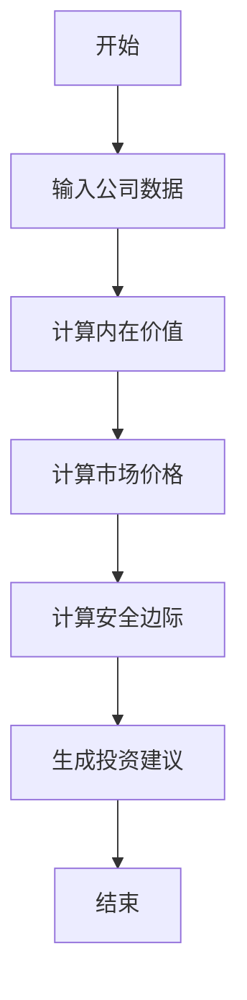
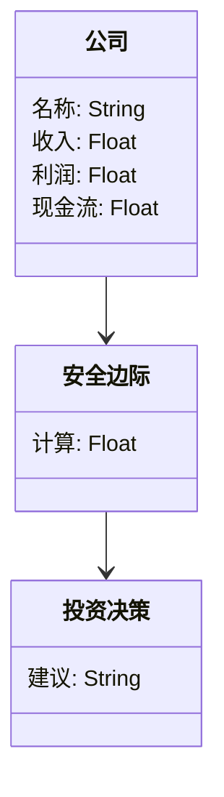
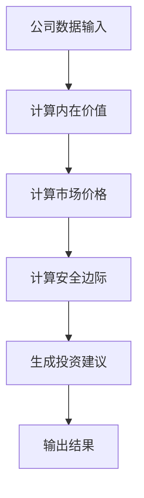

                 


# 乔尔·格林布拉特的价值投资教育

## 关键词：
价值投资、乔尔·格林布拉特、投资策略、数学模型、投资教育

## 摘要：
本文深入探讨了乔尔·格林布拉特的价值投资理念，从背景介绍、核心概念、数学模型、系统架构到实际案例分析，详细阐述了如何通过科学的方法进行投资决策。文章旨在帮助读者理解并掌握价值投资的精髓，为投资教育提供了系统的理论支持和实践指导。

## 第一部分: 价值投资的背景与核心概念

### 第1章: 价值投资的起源与发展

#### 1.1 价值投资的起源
- **投资学的起源与演变**：从古典投资理论到现代金融学的发展。
- **价值投资的核心理念**：寻找市场低估的公司，长期持有。
- **价值投资与现代金融理论的联系**：CAPM模型、APT模型与价值投资的关系。

#### 1.2 乔尔·格林布拉特的贡献
- **乔尔·格林布拉特的生平简介**：作为价值投资的重要人物，他的投资哲学和策略。
- **格林布拉特对价值投资的创新**：将数学模型引入投资分析。
- **价值投资哲学的核心思想**：寻找具有持续竞争优势且估值合理的公司。

### 第2章: 格林布拉特的价值投资策略

#### 2.1 核心概念与定义
- **价值投资的定义与特征**：基于内在价值的投资策略。
- **格林布拉特投资模型的构成要素**：现金流、折现率、竞争优势。
- **投资决策中的关键指标**：市盈率、市净率、股息率。

#### 2.2 格林布拉特投资策略的详细分析
- **基本面分析的核心要素**：收入、利润、现金流。
- **安全边际的概念与计算**：内在价值与市场价格的差异。
- **竞争优势的识别与评估**：市场地位、成本优势、品牌价值。

## 第二部分: 价值投资的数学模型与算法

### 第3章: 格林布拉特投资模型的数学公式

#### 3.1 公司内在价值的计算公式
$$ V = \frac{E}{(1 - g)} $$
其中，\( V \) 为公司内在价值，\( E \) 为公司未来现金流，\( g \) 为折现率。

#### 3.2 安全边际的计算方法
$$ \text{安全边际} = \text{内在价值} - \text{市场价格} $$

### 第4章: 投资组合优化的算法

#### 4.1 马科维茨投资组合理论
$$ \min_w \left( \frac{1}{2} w^T \Sigma w \right) $$
其中，\( w \) 为投资权重向量，\( \Sigma \) 为资产之间的协方差矩阵。

#### 4.2 格林布拉特投资组合优化的改进
$$ \text{收益} = \sum_{i=1}^{n} w_i r_i $$
$$ \text{风险} = \sum_{i=1}^{n} w_i^2 \sigma_i^2 $$

### 第5章: 算法流程图

#### 5.1 投资决策流程图


## 第三部分: 价值投资的系统分析与架构设计

### 第6章: 价值投资的系统架构

#### 6.1 系统功能设计
- **领域模型类图**：


#### 6.2 系统架构图


## 第四部分: 项目实战与案例分析

### 第7章: 价值投资的实战分析

#### 7.1 项目实战
- **环境安装**：安装必要的金融分析工具和编程环境。
- **核心实现**：
  ```python
  def calculate_intrinsic_value(revenue, profit, cash_flow, discount_rate):
      return revenue / (1 - discount_rate)
  ```
- **代码应用解读与分析**：详细解读代码实现和应用。
- **实际案例分析**：以某公司为例，进行详细分析。

## 第五部分: 总结与展望

### 第8章: 总结与投资建议

#### 8.1 总结
- **文章核心内容回顾**：系统介绍格林布拉特的价值投资策略。
- **投资策略的总结**：强调基本面分析和安全边际的重要性。

#### 8.2 投资建议
- **长期投资的重要性**：耐心持有优质资产。
- **风险管理**：合理分散投资，控制风险。

#### 8.3 小结
- **注意事项**：定期评估投资组合，关注公司基本面变化。
- **拓展阅读**：推荐格林布拉特的《绿灯投资》和其他价值投资经典书籍。

## 作者：
AI天才研究院/AI Genius Institute  
禅与计算机程序设计艺术/Zen And The Art of Computer Programming

