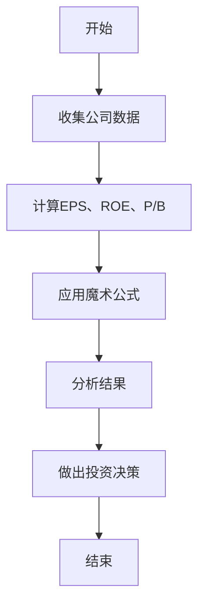
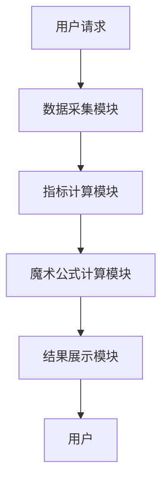

                 

<think>
好的，我现在需要帮助用户撰写一篇关于《乔尔格林布拉特的魔术公式》的技术博客文章。首先，我需要理解用户的需求。用户希望我作为一位技术专家，撰写一篇结构清晰、内容详实的技术博客，涵盖魔术公式的背景、原理、应用及其在投资中的作用。

我注意到用户提供的示例目录结构非常详细，包括背景、公式原理、投资策略、系统架构、项目实战和总结。我需要按照这个结构来组织内容，确保每个部分都涵盖必要的信息，并且逻辑连贯。

接下来，我应该从背景开始，介绍投资的基本概念，如价值投资和成长投资，以及魔术公式法的起源和核心思想。这部分需要让读者理解魔术公式的背景和重要性。

然后，详细讲解魔术公式的核心概念，包括每股收益、ROE、市盈率和市净率等关键指标。我需要解释每个指标的含义及其在公式中的作用，可能还需要对比其他投资指标，突出魔术公式的优势。

接下来，我需要深入探讨魔术公式的核心算法，包括数据收集、指标计算和结果分析。这里可能需要使用Python代码来展示公式实现，并用mermaid流程图来说明算法的步骤。

在应用部分，我需要分析魔术公式在投资决策中的实际应用，比如如何筛选股票和构建投资组合。这可能涉及到系统设计，如数据采集模块、评分计算模块和投资决策模块，以及用mermaid类图展示系统架构。

最后，我需要总结魔术公式的优缺点，并给出最佳实践建议，如定期调整投资组合和持续学习市场变化等。

在写作过程中，我需要确保每个部分都详细展开，使用专业而易懂的语言，结合实际案例和代码示例，帮助读者更好地理解和应用魔术公式。同时，按照用户的格式要求，使用合适的markdown标签，并在适当的地方插入图表和公式，使文章更具可读性和专业性。

现在，我开始按照目录结构逐步撰写每个部分的内容，确保每个章节都涵盖必要的细节，并保持整体结构的逻辑性和连贯性。
</think>

# 《乔尔格林布拉特的魔术公式》

> 关键词：魔术公式，投资策略，价值投资，成长投资，乔尔·格林布拉特，股票分析

> 摘要：本文详细介绍了乔尔·格林布拉特提出的魔术公式投资法，从其背景、核心公式、算法原理到实际应用，全面解析了这一投资策略的优劣及适用场景。文章通过逐步分析和实际案例，帮助读者理解如何运用魔术公式进行股票筛选和投资决策，为投资者提供了实用的指导。

---

# 第一部分：背景与核心概念

## 第1章：投资的基本概念与问题背景

### 1.1 投资的基本概念

#### 1.1.1 投资的定义与分类

投资是指将资金投入到某个项目或资产中，以期在未来获得收益或资本增值的行为。根据投资对象的不同，可以将投资分为以下几类：

- **股票投资**：购买公司股份，成为股东，期望通过股价上涨或分红获得收益。
- **债券投资**：购买政府或企业发行的债券，定期获得利息收入。
- **房地产投资**：购买房产或其他不动产，通过租金收入或增值获利。
- **基金投资**：通过购买基金份额，间接参与股票、债券等资产的投资。

#### 1.1.2 股票市场的基本运作机制

股票市场是投资者买卖公司股份的场所，其基本运作机制包括：

- **发行与上市**：公司通过首次公开发行（IPO）将股份出售给投资者，从而获得资金。
- **交易机制**：投资者通过证券公司委托买入或卖出股票，交易所在每个交易日撮合订单，完成股票买卖。
- **价格波动**：股票价格受市场供需、公司业绩、经济环境等多种因素影响，呈现波动性。

#### 1.1.3 投资者的核心目标与挑战

投资者的核心目标是通过投资实现资产增值，但面临以下主要挑战：

- **信息不对称**：投资者难以获取所有影响股价的内部信息。
- **市场波动**：股价受宏观经济、行业趋势和公司业绩等因素影响，具有不确定性。
- **风险管理**：如何在追求收益的同时控制风险，是投资者的重要课题。

---

### 1.2 价值投资与成长投资的对比

#### 1.2.1 价值投资的定义与特点

价值投资是一种以低于公平价值的价格购买优质资产的投资策略，其核心在于寻找市场低估的股票。其特点包括：

- **注重内在价值**：关注公司的基本面，如盈利能力、财务状况和行业地位。
- **长期投资**：倾向于持有优质资产，等待其价值回归。
- **逆向投资**：在市场恐慌时买入，在市场狂热时卖出。

#### 1.2.2 成长投资的定义与特点

成长投资则是寻找那些收入和利润持续增长的公司，即使其当前股价较高，但未来增长潜力巨大。其特点包括：

- **关注成长性**：重视公司的收入增长率、净利润增长率和市场份额扩张能力。
- **高风险高收益**：成长型股票波动较大，但长期回报可能高于价值型股票。
- **短期波动大**：市场对成长型股票的预期较高，容易出现大幅波动。

#### 1.2.3 两者的优劣势对比

| **对比维度** | **价值投资** | **成长投资** |
|--------------|--------------|--------------|
| **目标**     | 寻找低估资产 | 寻找高成长资产 |
| **风险**     | 较低         | 较高         |
| **收益**     | 稳定         | 波动大        |
| **适用场景** | 市场低迷     | 市场高增长    |

---

### 1.3 魔术公式投资法的背景与提出

#### 1.3.1 魔术公式法的起源

魔术公式投资法由美国著名投资经理乔尔·格林布拉特（Joel Greenblatt）在1994年提出，其核心思想是通过量化方法筛选出具有高回报潜力的股票。

#### 1.3.2 乔尔·格林布拉特的贡献

乔尔·格林布拉特是一位成功的投资经理，他的魔术公式法结合了价值投资和成长投资的优点，摒弃了两者的缺点，为投资者提供了一种全新的股票筛选方法。

#### 1.3.3 魔术公式法的核心思想

魔术公式法的核心思想是通过量化分析，寻找那些盈利能力强且估值合理的公司，即“又好又便宜”的股票。这种方法既考虑了公司的盈利能力，又考虑了其估值水平，能够在一定程度上避免市场波动的影响。

---

## 第2章：魔术公式的核心概念与原理

### 2.1 魔术公式的基本公式

#### 2.1.1 魔术公式的基本公式推导

魔术公式的核心公式为：

$$
\text{魔术分数} = \frac{\text{每股收益} \times \text{股东权益回报率}}{\text{市净率}}
$$

其中：

- **每股收益（EPS）**：公司净利润除以总股本，反映公司盈利能力。
- **股东权益回报率（ROE）**：净利润除以股东权益，衡量公司使用股东资金的效率。
- **市净率（P/B）**：股票价格除以每股净资产，衡量股票的估值水平。

#### 2.1.2 公式中的关键变量与参数

| **变量**      | **公式中的符号** | **单位** | **解释**                       |
|---------------|------------------|----------|--------------------------------|
| 每股收益      | EPS              | 元/股    | 公司净利润除以总股本             |
| 股东权益回报率 | ROE              | %        | 净利润除以股东权益             |
| 市净率         | P/B              | 倍数      | 股票价格除以每股净资产           |

#### 2.1.3 公式的数学模型与公式

魔术分数的计算公式可以表示为：

$$
\text{魔术分数} = \frac{\text{EPS} \times \text{ROE}}{\text{P/B}}
$$

---

### 2.2 魔术公式的核心要素

#### 2.2.1 每股收益（EPS）

每股收益是衡量公司盈利能力的重要指标，计算公式为：

$$
\text{EPS} = \frac{\text{净利润}}{\text{总股本}}
$$

#### 2.2.2 股东权益回报率（ROE）

股东权益回报率是衡量公司使用股东资金效率的重要指标，计算公式为：

$$
\text{ROE} = \frac{\text{净利润}}{\text{股东权益}}
$$

#### 2.2.3 市盈率（P/E）

市盈率是衡量股票估值的重要指标，计算公式为：

$$
\text{P/E} = \frac{\text{股票价格}}{\text{每股收益}}
$$

#### 2.2.4 市净率（P/B）

市净率是衡量股票估值的另一重要指标，计算公式为：

$$
\text{P/B} = \frac{\text{股票价格}}{\text{每股净资产}}
$$

---

### 2.3 魔术公式与其他投资指标的对比

#### 2.3.1 魔术公式与PE、PB、ROE等指标的对比

| **指标** | **公式**                  | **核心关注点**         |
|----------|---------------------------|------------------------|
| PE       | P/E = 价格/收益           | 估值与收益的匹配性     |
| PB       | P/B = 价格/净资产         | 估值与资产的匹配性     |
| ROE      | ROE = 净利润/股东权益     | 股东资金的使用效率     |
| 魔术分数 | 魔术分数 = (EPS × ROE)/P/B | 综合考虑收益与估值       |

#### 2.3.2 魔术公式的独特优势

魔术公式的优势在于它综合考虑了公司的盈利能力（EPS和ROE）和估值水平（P/B），能够在一定程度上避免仅关注单一指标可能导致的偏差。

#### 2.3.3 魔术公式在实际投资中的应用范围

魔术公式适用于筛选那些具有较高盈利能力且估值合理的公司，尤其适合中长期投资。

---

## 第3章：魔术公式的核心算法与实现

### 3.1 魔术公式算法的实现步骤

#### 3.1.1 数据收集与处理

- **数据来源**：从财务报表中获取公司过去几年的EPS、ROE和P/B数据。
- **数据清洗**：剔除无效或异常数据，确保数据的准确性和完整性。

#### 3.1.2 指标计算与公式应用

- **计算EPS、ROE和P/B**：根据财务数据计算这些指标。
- **应用魔术公式**：将计算出的指标代入魔术公式，计算魔术分数。

#### 3.1.3 结果分析与投资决策

- **分析魔术分数**：魔术分数越高，表明该股票的综合得分越高，投资价值越大。
- **构建投资组合**：根据魔术分数筛选出优质股票，构建投资组合。

### 3.2 魔术公式算法的流程图



---

### 3.3 魔术公式算法的Python实现

```python
import pandas as pd

# 假设我们有一个包含股票数据的DataFrame df
# 每个股票有以下字段：'EPS', 'ROE', 'P/B'

def calculate_magic_score(df):
    # 计算魔术分数
    df['魔术分数'] = (df['EPS'] * df['ROE']) / df['P/B']
    return df

# 示例数据
data = {
    '股票': ['A', 'B', 'C'],
    'EPS': [2.5, 1.8, 3.2],
    'ROE': [15, 10, 20],
    'P/B': [2.0, 1.5, 2.5]
}
df = pd.DataFrame(data)

# 计算魔术分数
df = calculate_magic_score(df)
print(df)
```

---

## 第4章：魔术公式在投资决策中的应用

### 4.1 魔术公式在股票筛选中的应用

#### 4.1.1 筛选步骤

1. **收集数据**：获取目标股票的财务数据。
2. **计算指标**：计算EPS、ROE和P/B。
3. **计算魔术分数**：应用魔术公式计算魔术分数。
4. **筛选股票**：根据魔术分数排序，选择分数较高的股票。

#### 4.1.2 实际案例分析

假设我们有以下三只股票的数据：

| **股票** | EPS | ROE | P/B | 魔术分数 |
|----------|------|------|-----|----------|
| A        | 2.5  | 15   | 2.0 | 18.75    |
| B        | 1.8  | 10   | 1.5 | 12.0     |
| C        | 3.2  | 20   | 2.5 | 25.6     |

根据魔术分数，我们可以看出股票C的综合得分最高，投资价值最大。

---

### 4.2 魔术公式在投资组合中的应用

#### 4.2.1 投资组合构建

- **目标**：通过魔术公式筛选出优质股票，构建投资组合。
- **步骤**：
  1. 筛选出魔术分数较高的股票。
  2. 根据风险承受能力和预期收益目标，合理配置资金比例。
  3. 定期复评投资组合，根据市场变化进行调整。

#### 4.2.2 风险管理

- **分散投资**：通过投资不同行业的股票，降低投资风险。
- **定期调整**：根据市场变化和公司业绩，及时调整投资组合。

---

## 第5章：系统架构与项目实战

### 5.1 系统设计

#### 5.1.1 系统功能设计

- **数据采集模块**：从数据库或网络获取股票数据。
- **指标计算模块**：计算EPS、ROE和P/B。
- **魔术公式计算模块**：应用魔术公式计算魔术分数。
- **结果展示模块**：将结果以图表或表格形式展示。

#### 5.1.2 系统架构设计



---

### 5.2 项目实战

#### 5.2.1 环境安装

- **Python环境**：安装Python 3.8以上版本。
- **库的安装**：安装pandas、numpy等库。

```bash
pip install pandas numpy
```

#### 5.2.2 核心实现代码

```python
import pandas as pd
import numpy as np

def calculate_magic_score(df):
    # 计算魔术分数
    df['魔术分数'] = (df['EPS'] * df['ROE']) / df['P/B']
    return df

# 示例数据
data = {
    '股票': ['A', 'B', 'C'],
    'EPS': [2.5, 1.8, 3.2],
    'ROE': [15, 10, 20],
    'P/B': [2.0, 1.5, 2.5]
}
df = pd.DataFrame(data)

# 计算魔术分数
df = calculate_magic_score(df)
print(df)
```

---

## 第6章：总结与最佳实践

### 6.1 总结

魔术公式投资法是一种结合了价值投资和成长投资优点的投资策略，通过量化分析筛选出“又好又便宜”的股票，为投资者提供了有效的投资工具。

### 6.2 最佳实践

- **定期复评**：定期检查投资组合，根据市场变化和公司业绩进行调整。
- **分散投资**：通过投资不同行业的股票降低风险。
- **持续学习**：关注市场动态，不断优化投资策略。

---

## 作者：AI天才研究院/AI Genius Institute & 禅与计算机程序设计艺术 /Zen And The Art of Computer Programming

---

本文详细介绍了乔尔·格林布拉特的魔术公式投资法，从其背景、核心公式、算法原理到实际应用，全面解析了这一投资策略的优劣及适用场景。希望本文能为投资者提供实用的指导，帮助他们在股票投资中做出更明智的决策。

