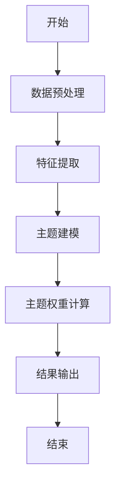
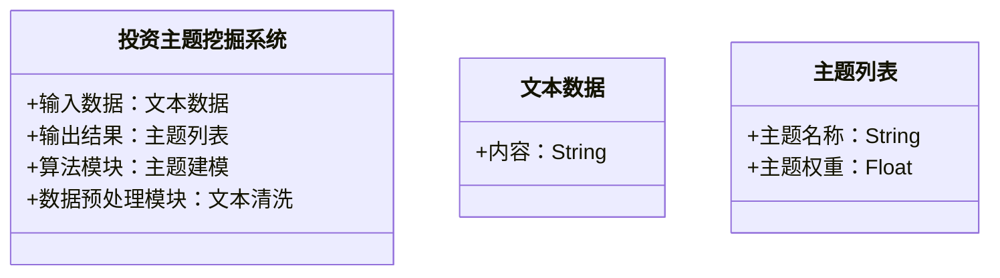
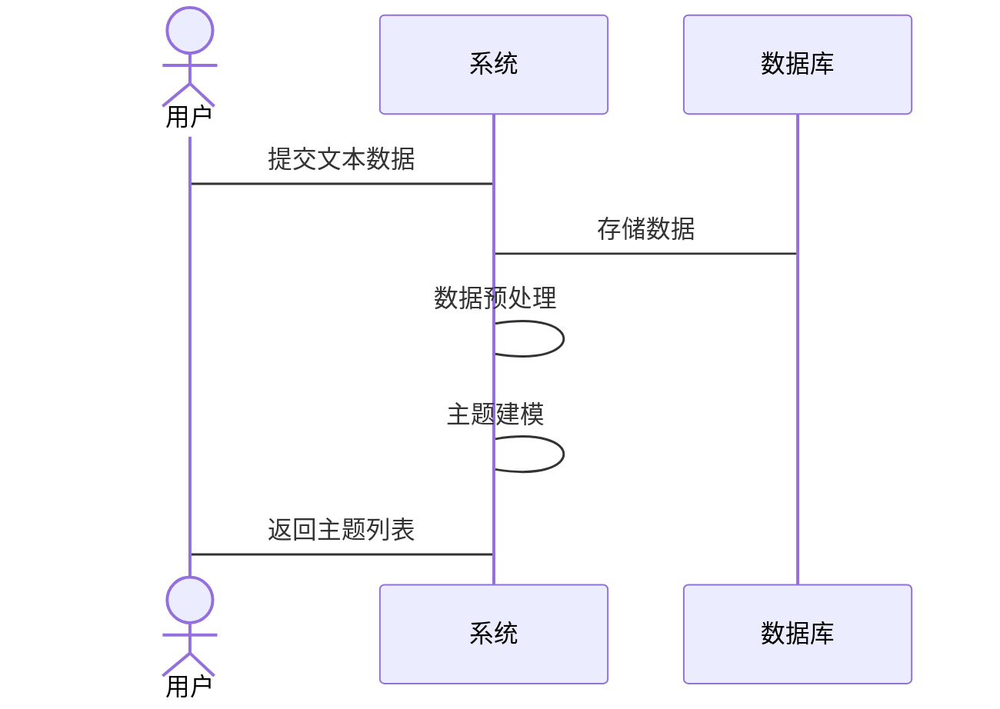

                 

<think>
嗯，用户让我设计一个关于《产业政策导向下的投资主题挖掘》的目录大纲，看起来他想要一个结构清晰、内容详尽的技术博客文章。首先，我需要理解这个主题的核心是什么。产业政策和投资主题挖掘，听起来像是结合政策分析和投资策略的领域。

用户给了一个示例，里面包含了背景介绍、核心概念、算法原理、系统架构、项目实战等部分。这意味着我需要确保我的大纲也包含这些内容，并且每个部分都要有足够的细节。

首先，我应该从背景开始，解释什么是产业政策，以及投资主题挖掘的重要性。然后，核心概念部分需要详细说明两者如何关联，可能用一些图表来帮助理解，比如ER图或流程图。

接下来，算法部分需要介绍具体的主题挖掘算法，比如文本挖掘和聚类分析，并用mermaid流程图展示流程。数学模型方面，可能需要涉及概率论或统计学，用latex公式来表达。

系统架构部分可能需要设计一个支持投资主题挖掘的系统，包括功能模块、架构图和接口设计。项目实战部分则需要具体的案例分析，环境配置，代码实现等。

最后，最佳实践和小结部分要总结全书的内容，并给出实用的建议。确保每个部分都符合用户的要求，字数控制在10000到12000字之间，使用markdown格式，并在结尾加上作者信息。

可能我需要调整章节结构，确保每个部分都涵盖用户提到的关键点，同时保持逻辑连贯。可能还需要检查是否遗漏了某些部分，比如系统交互图或最佳实践的具体建议。

总之，我需要一步步分析，确保每个章节都满足用户的要求，结构清晰，内容详细，帮助读者理解产业政策如何影响投资主题挖掘，并能够实际应用这些方法。
</think>

# 产业政策导向下的投资主题挖掘

> 关键词：产业政策、投资主题、主题挖掘、NLP、机器学习、投资策略、政策分析

> 摘要：本文探讨了在产业政策引导下的投资主题挖掘方法，通过分析产业政策对投资主题的影响，结合自然语言处理和机器学习算法，提出了基于主题建模的投资策略优化方案。文章从产业政策与投资主题的关联性出发，详细阐述了主题挖掘的算法原理、系统架构设计及实际应用案例，为投资者和政策制定者提供了实用的决策支持工具。

---

## 第1章：产业政策与投资主题挖掘的背景与概述

### 1.1 产业政策的基本概念

#### 1.1.1 产业政策的定义与分类
产业政策是指政府为了促进特定产业发展而制定的政策，主要包括产业规划、税收优惠、资金补贴、行业准入标准等。根据政策目标，产业政策可以分为结构调整型、技术创新型、区域发展型等类别。

#### 1.1.2 产业政策的作用机制
产业政策通过引导资源配置、优化产业结构、激励技术创新等方式，对经济和社会发展产生深远影响。政府通过政策工具（如补贴、税收优惠）引导企业投资方向，进而影响市场供需关系。

#### 1.1.3 产业政策与经济发展的关系
产业政策是推动经济发展的重要工具，通过优化资源配置、促进技术创新和产业升级，实现经济高质量发展。同时，经济发展水平也反哺产业政策的制定与实施。

---

### 1.2 投资主题挖掘的核心概念

#### 1.2.1 投资主题的定义与特征
投资主题是指在特定市场环境下，投资者关注的热点领域或投资方向，具有一定的市场前景和收益潜力。投资主题的特征包括时间性、行业性、政策导向性和可操作性。

#### 1.2.2 投资主题的分类与应用场景
投资主题可以分为周期性主题（如经济周期相关）、结构性主题（如产业升级）和事件驱动型主题（如政策变化）。应用场景包括股票投资、行业配置、风险对冲等。

#### 1.2.3 产业政策对投资主题的影响
产业政策通过引导行业发展方向，影响市场的供需关系，从而塑造投资主题。例如，政府对新能源产业的政策支持会推动新能源相关投资主题的兴起。

---

### 1.3 本章小结

本章从产业政策和投资主题的基本概念出发，分析了两者之间的关联性，并为后续章节的分析奠定了基础。通过理解产业政策的作用机制和投资主题的特征，我们可以更好地把握政策与市场的互动关系。

---

## 第2章：产业政策与投资主题挖掘的核心概念与联系

### 2.1 产业政策对投资主题的引导作用

#### 2.1.1 产业政策如何影响行业发展方向
政府通过产业政策引导资金流向特定行业，例如新能源、人工智能等领域。这种引导作用通过政策优惠、税收减免等方式实现。

#### 2.1.2 产业政策对投资者决策的影响
投资者会根据政策导向调整投资策略，例如加大对政策支持行业的投资力度，规避政策限制的行业。

#### 2.1.3 产业政策与投资主题的互动关系
产业政策不仅影响投资主题的形成，投资主体的行动也会反作用于政策的实施效果。这种互动关系构成了政策与市场的动态平衡。

---

### 2.2 产业政策与投资主题的内在逻辑

#### 2.2.1 产业政策的实施路径
产业政策的实施通常包括政策制定、政策执行、政策评估三个阶段。政策制定阶段需要明确目标行业，政策执行阶段通过财政和货币政策实现目标，政策评估阶段则检验政策效果。

#### 2.2.2 投资主题的形成机制
投资主题的形成受到市场环境、政策导向、行业趋势等多种因素的影响。政策导向是其中的重要因素，通过影响行业前景和市场预期，塑造投资主题。

#### 2.2.3 两者关系的系统性分析
通过构建系统模型，可以分析产业政策对投资主题的影响路径。例如，政府对某行业的政策支持会提升该行业的市场预期，进而推动相关投资主题的兴起。

---

### 2.3 核心概念的ER实体关系图

以下是产业政策与投资主题的核心概念的实体关系图：

```mermaid
er
actor:投资者
actor:政策制定者
actor:行业专家
class:产业政策
class:投资主题
class:市场数据
```

---

## 第3章：投资主题挖掘的算法原理与数学模型

### 3.1 文本挖掘与主题提取算法

#### 3.1.1 基于NLP的主题挖掘方法
自然语言处理（NLP）技术在主题挖掘中发挥重要作用。通过分析政策文件、行业报告等文本数据，提取关键词和主题。

#### 3.1.2 主题模型（如LDA）的原理与实现
主题模型（如Latent Dirichlet Allocation, LDA）通过概率统计方法，将文本数据分解为主题分布和关键词分布。LDA模型的基本思想是每个文本由多个主题组成，每个主题由若干关键词组成。

#### 3.1.3 基于TF-IDF的主题提取方法
TF-IDF（Term Frequency-Inverse Document Frequency）是一种统计方法，用于衡量关键词在文本中的重要性。通过计算关键词的TF-IDF值，可以提取主题。

---

### 3.2 投资主题挖掘的数学模型

#### 3.2.1 主题权重计算的数学公式
主题权重可以通过关键词的重要性评分和关键词在主题中的权重计算得出。例如：

$$ \text{主题权重} = \sum_{i=1}^{n} w_i \times t_i $$

其中，\( w_i \) 为第 \( i \) 个关键词的权重，\( t_i \) 为关键词在主题中的重要性评分。

---

### 3.3 算法实现的流程图

以下是主题挖掘算法的流程图：



---

### 3.4 代码实现示例

以下是基于TF-IDF和NMF（非负矩阵分解）的主题挖掘代码示例：

```python
import numpy as np
from sklearn.feature_extraction.text import TfidfVectorizer
from sklearn.decomposition import NMF

# 假设 corpus 是文本数据
vectorizer = TfidfVectorizer()
tfidf = vectorizer.fit_transform(corpus)
model = NMF(n_components=5, random_state=42)
nmf_components = model.fit_transform(tfidf)

# 提取主题关键词
keywords = vectorizer.get_feature_names()
for i, component in enumerate(nmf_components):
    print(f"主题 {i+1}:")
    top_keywords = np.argsort(component)[-5:-1]
    for j in reversed(top_keywords):
        print(f"  {keywords[j]}")
```

---

## 第4章：系统架构与投资主题挖掘的实现

### 4.1 问题场景介绍

投资主题挖掘系统的目标是通过分析政策文件、行业报告等文本数据，提取投资主题，并为投资者提供投资建议。

---

### 4.2 系统功能设计

#### 4.2.1 领域模型设计
以下是领域模型的类图：



---

### 4.3 系统架构设计

以下是系统架构的分层设计图：


---

### 4.4 系统接口设计

系统接口包括：
1. 数据输入接口：接收文本数据。
2. 数据预处理接口：清洗和转换文本数据。
3. 主题建模接口：调用NMF或LDA算法进行主题挖掘。
4. 结果输出接口：返回主题列表。

---

### 4.5 系统交互设计

以下是系统交互的序列图：



---

## 第5章：项目实战与案例分析

### 5.1 环境配置

#### 5.1.1 系统需求
- Python 3.8+
- Jupyter Notebook
- Numpy, Scikit-learn, NLTK

---

### 5.2 核心实现代码

以下是投资主题挖掘的核心代码示例：

```python
import numpy as np
from sklearn.feature_extraction.text import TfidfVectorizer
from sklearn.decomposition import NMF

# 数据预处理
corpus = ["政策支持新能源产业发展", "人工智能技术应用广泛", "5G技术推动行业发展"]
vectorizer = TfidfVectorizer()
tfidf = vectorizer.fit_transform(corpus)

# 主题建模
model = NMF(n_components=2, random_state=42)
nmf_components = model.fit_transform(tfidf)

# 提取主题关键词
keywords = vectorizer.get_feature_names()
for i, component in enumerate(nmf_components):
    print(f"主题 {i+1}:")
    top_keywords = np.argsort(component)[-3:-1]
    for j in reversed(top_keywords):
        print(f"  {keywords[j]}")
```

---

### 5.3 案例分析

以新能源产业为例，假设政策文件中提到“支持光伏技术的研发与应用”，通过主题挖掘算法可以提取出“光伏技术”、“新能源产业”等关键词，并生成对应的主题权重。

---

## 第6章：最佳实践与小结

### 6.1 最佳实践

1. **数据质量**：确保输入数据的准确性和完整性。
2. **算法选择**：根据实际需求选择合适的主题挖掘算法。
3. **结果验证**：通过人工检查和领域知识验证主题的有效性。

---

### 6.2 小结

本文从产业政策与投资主题挖掘的关系出发，详细探讨了主题挖掘的算法原理和系统实现，并通过案例分析展示了投资主题挖掘的实际应用。通过本文的研究，投资者可以更好地把握政策导向，制定科学的投资策略。

---

## 作者：AI天才研究院/AI Genius Institute & 禅与计算机程序设计艺术 /Zen And The Art of Computer Programming

