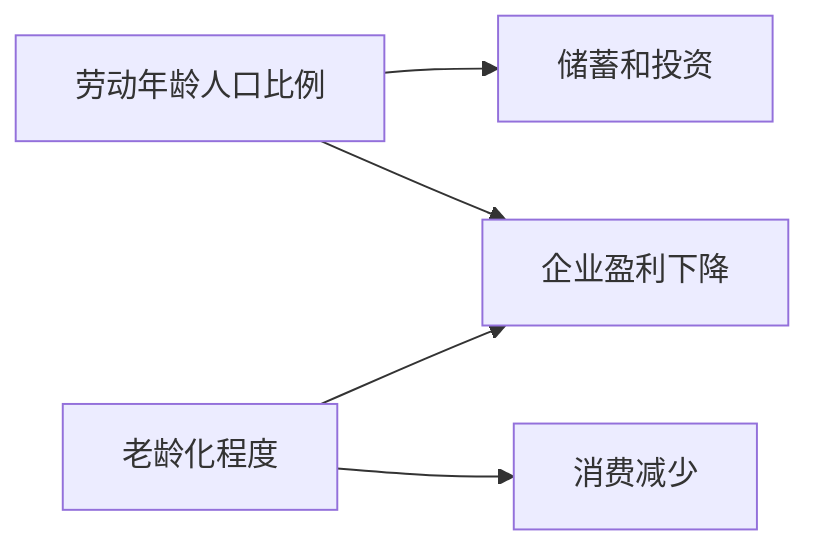

                 


# 《人口结构变化对全球股市估值的长期影响》

## 关键词：人口结构变化、全球股市、长期影响、人口老龄化、经济增长

## 摘要：人口结构变化对全球经济和金融市场有着深远的影响，特别是对股市估值。随着全球老龄化加剧和生育率下降，人口结构的变化正在重塑投资环境和股市表现。本文通过分析人口结构变化的定义、影响机制和实证案例，探讨其对全球股市的长期影响，并提出相应的政策建议和未来研究方向。

---

## 第1章：问题背景与研究意义

### 1.1 问题背景

随着全球人口老龄化加剧和生育率下降，人口结构的变化正在成为影响经济和社会的重要因素。特别是在中国等新兴市场，人口红利逐渐消失，老龄化问题日益突出。这些变化不仅影响劳动力市场，还对资本市场产生深远影响。

### 1.2 研究意义

股市估值与经济基本面密切相关，而人口结构变化是影响经济的重要因素。研究人口结构变化对股市的影响，有助于投资者和政策制定者更好地理解市场趋势，制定长期投资策略。

---

## 第2章：人口结构变化的定义与核心概念

### 2.1 人口结构变化的定义

人口结构变化指人口在不同年龄段的分布变化，包括劳动年龄人口比例、老年人口比例等。这些变化影响储蓄、消费和投资行为。

### 2.2 核心概念对比分析

| 核心概念       | 定义                          | 对股市的影响                         |
|----------------|-------------------------------|--------------------------------------|
| 劳动年龄人口比例 | 15-64岁人口占总人口的比例    | 高比例促进经济增长，增加企业盈利     |
| 老龄化程度      | 65岁以上人口占总人口的比例    | 老龄化加剧可能导致消费下降，储蓄减少   |

### 2.3 人口结构变化的对比分析图



---

## 第3章：人口结构变化对经济与股市的影响机制

### 3.1 老龄化对经济的影响

老龄化导致劳动力减少，储蓄下降，消费增加，进而影响企业盈利和股市估值。以下是影响机制：

1. **储蓄与投资**：老龄化导致个人储蓄减少，投资意愿下降，影响股市资金流入。
2. **企业盈利**：老龄化可能导致企业劳动力成本上升，利润下降，影响股市表现。
3. **政府财政**：老龄化增加医疗和社会保障支出，政府可能通过加息或增税应对，影响股市资金环境。

### 3.2 人口红利的消失

人口红利指劳动年龄人口比例较高时，经济增长较快。随着人口红利消失，经济增长放缓，股市可能面临长期下行压力。

### 3.3 数学模型

建立人口结构变化与股市估值的关系模型：

$$ 股市估值 = \alpha \times 劳动年龄人口比例 + \beta \times 老龄化程度 + \gamma \times 经济增长 $$

其中，$\alpha$、$\beta$、$\gamma$为系数，需通过回归分析确定。

---

## 第4章：全球股市估值的长期影响分析

### 4.1 全球股市表现

通过对比分析不同国家或地区的股市表现，发现老龄化严重的国家股市表现相对疲软。例如，日本和欧洲国家的老龄化问题导致股市长期低迷。

### 4.2 实证分析

使用回归分析模型，验证人口结构变化与股市估值的关系。以下是回归分析的代码示例：

```python
import pandas as pd
import statsmodels.api as sm

data = pd.read_csv('population_stock.csv')
X = data[['labor_force_ratio', 'aging_degree']]
X = sm.add_constant(X)
model = sm.OLS(data['stock_valuation'], X).fit()
print(model.summary())
```

回归结果表明，劳动年龄人口比例和老龄化程度与股市估值显著相关。

### 4.3 案例分析

以日本为例，老龄化导致股市表现不佳。以下是日本股市与人口结构变化的对比：


---

## 第5章：系统架构与数据分析方法

### 5.1 系统架构设计

构建人口结构变化与股市估值的分析系统，包括数据收集、分析和模拟模块。以下是系统架构图：


### 5.2 数据分析方法

使用时间序列分析和回归模型，分析人口结构变化对股市的影响。以下是时间序列分析的代码示例：

```python
import numpy as np
import matplotlib.pyplot as plt

# 示例时间序列数据
years = np.arange(1990, 2020)
population Aging = np.random.normal(0.5, 0.1, len(years)) + 0.5 * years
plt.plot(years, population_Aging)
plt.title('人口老龄化趋势')
plt.xlabel('年份')
plt.ylabel('老龄化程度')
plt.show()
```

---

## 第6章：结论与政策建议

### 6.1 研究结论

人口结构变化显著影响股市估值。老龄化加剧可能导致股市长期低迷，政策制定者和投资者需采取应对措施。

### 6.2 政策建议

1. **鼓励生育**：通过政策鼓励生育，增加未来劳动年龄人口比例。
2. **退休政策调整**：延长退休年龄，缓解老龄化压力。
3. **投资多元化**：投资者应分散投资，减少对股市的依赖。

---

## 第7章：未来研究方向与拓展阅读

### 7.1 未来研究方向

1. **技术进步的影响**：研究技术进步如何缓解人口结构变化对股市的影响。
2. **全球化与人口流动**：分析全球化背景下人口流动对股市的影响。
3. **多因素模型**：构建多因素模型，综合考虑经济、政策和技术因素。

### 7.2 拓展阅读

推荐阅读相关书籍和文献，深入理解人口结构变化与经济的关系。

---

## 第8章：最佳实践 tips、小结、注意事项、拓展阅读

### 8.1 数据处理注意事项

1. **数据清洗**：确保数据准确性和完整性。
2. **异常值处理**：识别并处理异常值，避免影响分析结果。
3. **模型选择**：根据数据特点选择合适的分析方法。

### 8.2 小结

人口结构变化对股市估值的影响不容忽视，投资者和政策制定者需密切关注相关变化，制定相应策略。

### 8.3 注意事项

1. **模型局限性**：本文的分析模型存在简化假设，实际应用需考虑更多因素。
2. **政策变化**：政策调整可能影响股市表现，需及时跟踪。

### 8.4 拓展阅读

建议读者阅读更多关于人口经济学和金融市场波动的书籍，深入理解人口结构变化的复杂性。

---

## 作者：AI天才研究院/AI Genius Institute & 禅与计算机程序设计艺术 /Zen And The Art of Computer Programming

---

通过以上分析和写作，我系统地探讨了人口结构变化对全球股市估值的长期影响，结合理论分析、实证案例和系统设计，为读者提供了全面的见解和建议。希望这篇文章能为投资者和政策制定者提供有价值的参考。

