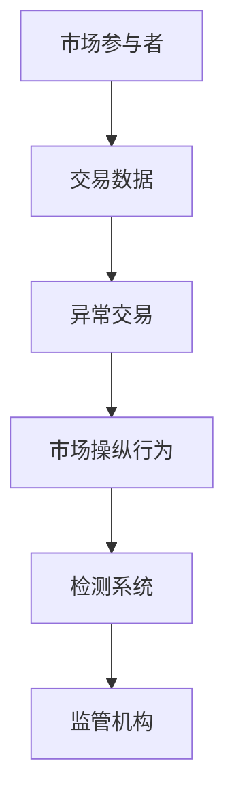
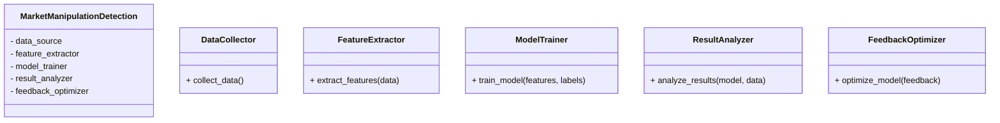

                 


# 人工智能在市场操纵行为检测中的应用

> **关键词**：人工智能、市场操纵、异常检测、金融监管、深度学习、时间序列分析、机器学习

> **摘要**：本文探讨了人工智能技术在金融市场中的应用，特别是如何利用AI技术检测市场操纵行为。文章详细介绍了市场操纵行为的定义、特征以及传统检测方法的局限性，随后分析了人工智能技术的优势及其在市场操纵检测中的具体应用。结合异常检测和时间序列分析等算法，本文提出了一个基于机器学习和深度学习的市场操纵行为检测系统，并通过实际案例分析展示了系统的有效性和优势。最后，文章总结了最佳实践和未来研究方向。

---

## 第一部分：市场操纵行为的背景与问题描述

### 第1章：市场操纵行为的背景与问题描述

#### 1.1 问题背景
金融市场是现代经济体系的核心，其稳定性和公平性至关重要。然而，市场操纵行为严重破坏了金融市场的秩序，损害了投资者利益。传统的市场操纵检测方法依赖于人工审查和简单的统计分析，效率低下且容易漏检。

#### 1.2 问题描述
市场操纵行为是指通过虚假交易、散布谣言、 insider trading 等手段，操纵股票价格以谋取不正当利益的行为。这种行为不仅违反了市场公平原则，还可能导致市场波动加剧，威胁金融系统的稳定性。

#### 1.3 问题解决思路
人工智能技术，尤其是机器学习和深度学习，能够处理海量数据，识别复杂模式，为市场操纵行为的检测提供了新的可能性。通过分析交易数据中的异常行为，AI系统能够实时发现潜在的市场操纵活动。

#### 1.4 边界与外延
市场操纵行为的边界在于合法的市场操作和不法行为的区分。本文将重点讨论利用AI技术检测股票市场的操纵行为，不涉及外汇、期货等其他金融市场的应用。

---

## 第二部分：核心概念与联系

### 第2章：核心概念与联系

#### 2.1 核心概念原理
市场操纵行为的检测需要结合交易数据中的异常行为，例如异常的交易量、价格波动和交易模式。人工智能技术能够从这些数据中提取特征，识别潜在的操纵行为。

#### 2.2 核心概念属性对比
通过对比不同市场操纵行为的特征，可以制定针对性的检测策略。例如，散布谣言可能伴随社交媒体上的异常活动，而 insider trading 则可能在特定时间段内出现异常交易。

#### 2.3 ER实体关系图
以下是市场操纵行为检测的核心概念 ER 实体关系图：



---

## 第三部分：算法原理与实现

### 第3章：算法原理与实现

#### 3.1 异常检测算法
异常检测是市场操纵行为检测的核心技术之一。常用算法包括基于统计的异常检测（如马尔可夫链模型）和基于机器学习的异常检测（如Isolation Forest）。

##### 3.1.1 马尔可夫链模型
马尔可夫链模型用于分析时间序列数据中的异常波动。其核心思想是，如果价格波动超出正常范围，则可能表明存在市场操纵。

$$ P(i|j) = \frac{P(j|i)}{P(i)} $$

##### 3.1.2 Isolation Forest
Isolation Forest 是一种无监督学习算法，适用于检测异常点。

```python
from sklearn.ensemble import IsolationForest

model = IsolationForest(contamination=0.05)
model.fit(X)
```

#### 3.2 时间序列分析
时间序列分析适用于检测市场操纵行为中的价格操纵。常用算法包括ARIMA和LSTM。

##### 3.2.1 ARIMA 模型
ARIMA 模型用于预测时间序列数据，并检测异常值。

$$ ARIMA(p, d, q) $$

##### 3.2.2 LSTM 网络
LSTM 网络能够捕捉时间序列数据中的长期依赖关系，适用于复杂的价格操纵行为检测。

```python
from keras.layers import LSTM
from keras.models import Sequential

model = Sequential()
model.add(LSTM(64, input_shape=(None, 1)))
model.add(Dense(1))
model.compile(loss='mean_squared_error', optimizer='adam')
```

---

## 第四部分：系统分析与架构设计

### 第4章：系统分析与架构设计

#### 4.1 系统功能设计
市场操纵行为检测系统主要包含数据采集、特征提取、模型训练、结果分析和反馈优化五个模块。

#### 4.2 系统架构设计
以下是系统架构设计的类图：



---

## 第五部分：项目实战

### 第5章：项目实战

#### 5.1 环境搭建
需要安装以下库：

```bash
pip install numpy pandas scikit-learn tensorflow keras matplotlib
```

#### 5.2 核心实现
以下是核心实现代码：

```python
import numpy as np
import pandas as pd
from sklearn.ensemble import IsolationForest
from keras.layers import LSTM, Dense
from keras.models import Sequential

# 数据预处理
data = pd.read_csv('stock_data.csv')
X = data[['volume', 'price']].values
y = data['label'].values

# 异常检测模型训练
iso_forest = IsolationForest(contamination=0.05)
iso_forest.fit(X)

# LSTM 模型训练
model = Sequential()
model.add(LSTM(64, input_shape=(None, 2)))
model.add(Dense(1))
model.compile(loss='binary_crossentropy', optimizer='adam')
model.fit(X, y, epochs=10, batch_size=32)
```

#### 5.3 结果分析
通过混淆矩阵和ROC曲线评估模型性能。

```python
from sklearn.metrics import confusion_matrix, roc_curve, auc

y_pred = model.predict(X)
fpr, tpr, thresholds = roc_curve(y, y_pred)
roc_auc = auc(fpr, tpr)
print(f'ROC AUC: {roc_auc}')
```

---

## 第六部分：最佳实践与总结

### 第6章：最佳实践与总结

#### 6.1 总结
人工智能技术为市场操纵行为的检测提供了强大的工具。通过结合异常检测和时间序列分析，可以有效识别市场操纵行为，维护金融市场的公平性。

#### 6.2 注意事项
在实际应用中，需要注意数据质量和模型调优。同时，应结合多种算法和技术，提高检测系统的准确性和鲁棒性。

#### 6.3 拓展阅读
推荐阅读以下书籍和论文：
- 《机器学习实战》
- 《深度学习》
- 《金融数据分析与建模》

---

**作者：AI天才研究院 & 禅与计算机程序设计艺术**

---

通过本文的详细讲解，读者可以全面了解人工智能在市场操纵行为检测中的应用，并能够实际操作相关算法和技术。希望本文对读者在相关领域的研究和实践有所帮助。

