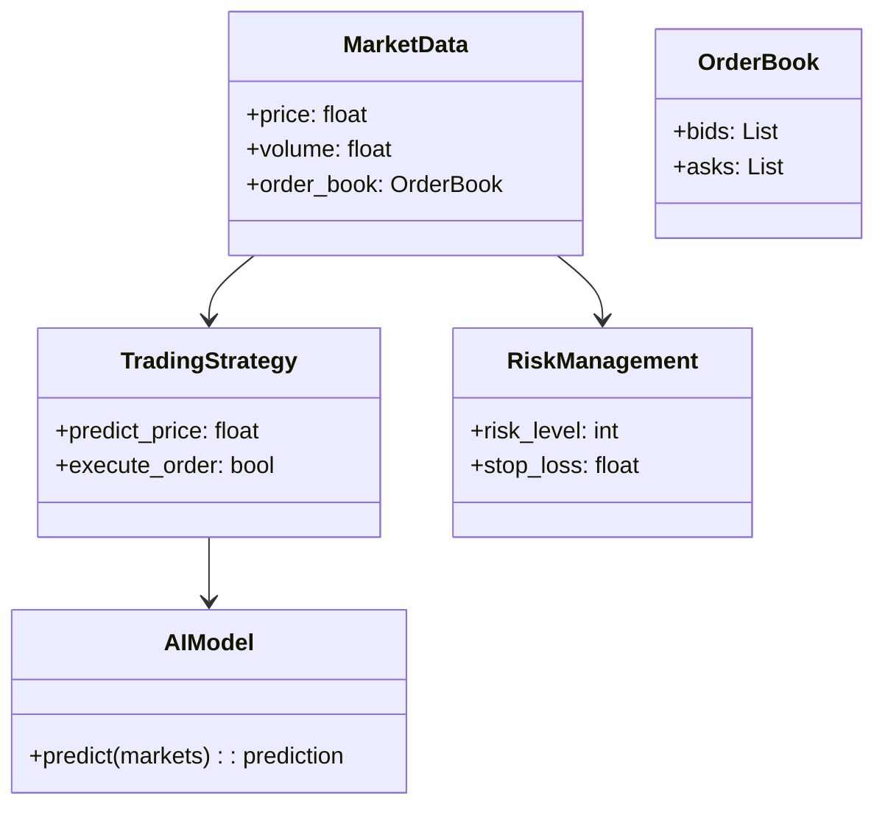
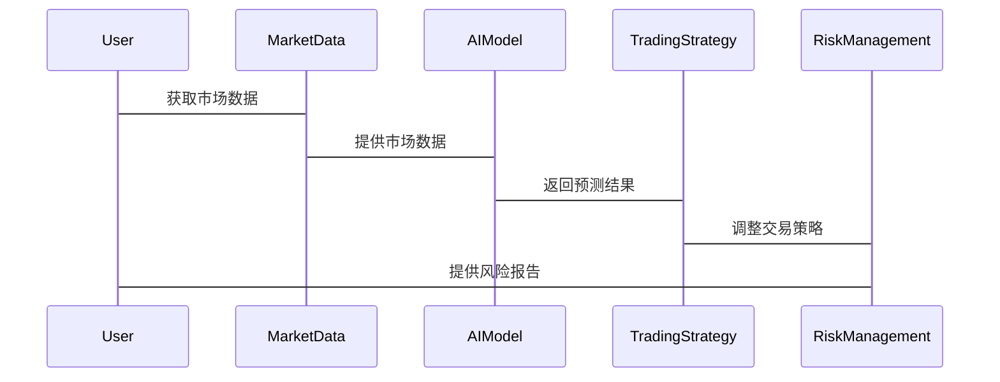

                 


# 人工智能在市场流动性提供策略中的应用

## 关键词：人工智能、市场流动性、交易策略、机器学习、深度学习

## 摘要：
本文探讨了人工智能技术在市场流动性提供策略中的应用，从理论到实践，详细分析了AI如何优化交易效率、提升资产配置和风险控制。文章结合常见AI算法和数学模型，展示了如何通过AI技术实现市场流动性预测和优化，提供了系统的解决方案和实战案例。

---

# 第1章: 市场流动性概述

## 1.1 市场流动性的基本概念

### 1.1.1 市场流动性的定义
市场流动性是指资产在市场中能够迅速以合理价格买卖的能力。流动性高的资产可以快速转换为现金，而流动性低的资产则需要较长时间和较高成本才能变现。

### 1.1.2 市场流动性的核心要素
- **买卖价差**：资产的买入价与卖出价之间的差异。
- **深度**：市场在特定价格下的订单量。
- **波动性**：价格在短时间内变动的程度。
- **交易量**：一定时间内成交的资产数量。

### 1.1.3 市场流动性与市场效率的关系
流动性高的市场通常具有较高的效率，交易成本低，价格发现快。流动性低的市场可能导致交易成本上升，价格波动加剧。

## 1.2 人工智能在市场流动性中的应用背景

### 1.2.1 传统市场流动性管理的局限性
传统方法依赖于人工分析和经验判断，存在以下问题：
- 数据处理能力有限，难以应对海量数据。
- 无法实时捕捉市场动态，导致交易机会错失。
- 风险预测能力不足，难以应对复杂市场环境。

### 1.2.2 人工智能技术的兴起与应用潜力
人工智能技术的进步，尤其是机器学习和深度学习的兴起，为市场流动性管理提供了新的解决方案。AI能够处理大量数据，实时分析市场动态，预测价格走势，优化交易策略。

### 1.2.3 人工智能在金融领域的应用现状
- **高频交易**：利用算法快速执行交易，提高流动性。
- **智能投顾**：通过AI提供个性化的投资建议，优化资产配置。
- **风险管理**：利用AI预测市场风险，制定应对策略。

## 1.3 人工智能在市场流动性提供中的核心价值

### 1.3.1 提高交易效率
AI通过自动化分析和执行交易，减少人为干预，提高交易速度和效率。

### 1.3.2 优化资产配置
AI能够根据市场动态和投资者需求，优化资产配置，提高投资回报率。

### 1.3.3 风险控制与预测
AI通过分析历史数据和市场趋势，预测潜在风险，制定风险控制策略，降低投资损失。

## 1.4 本章小结
本章介绍了市场流动性的基本概念，分析了传统市场流动性管理的局限性，探讨了人工智能在市场流动性管理中的应用背景和核心价值。

---

# 第2章: 人工智能在市场流动性中的应用原理

## 2.1 人工智能的基本原理

### 2.1.1 机器学习的核心概念
- **监督学习**：通过标签数据训练模型，预测新数据的标签。
- **无监督学习**：通过数据聚类分析，发现数据中的隐藏结构。
- **强化学习**：通过奖励机制，训练模型做出最优决策。

### 2.1.2 深度学习的基本原理
深度学习通过多层神经网络模拟人类大脑的学习方式，能够自动提取数据中的特征，适用于复杂的非线性问题。

### 2.1.3 自然语言处理与强化学习简介
- **自然语言处理（NLP）**：用于分析文本数据，提取市场情绪和新闻信息。
- **强化学习**：用于动态决策问题，如自动交易策略的优化。

## 2.2 市场流动性预测的AI模型

### 2.2.1 时间序列预测的基本原理
时间序列预测通过分析过去的价格和成交量数据，预测未来的价格走势。常用模型包括ARIMA和LSTM。

### 2.2.2 基于AI的流动性预测模型
- **ARIMA模型**：适用于线性时间序列数据。
- **LSTM网络**：适用于非线性时间序列数据，能够捕捉长期依赖关系。
- **混合模型**：结合多种模型的优势，提高预测精度。

### 2.2.3 模型的优缺点分析
- **优点**：能够捕捉复杂市场动态，提高预测精度。
- **缺点**：模型复杂度高，计算资源需求大，且存在过拟合风险。

## 2.3 人工智能在市场流动性优化中的应用

### 2.3.1 基于AI的订单簿分析
订单簿分析通过AI技术实时监控市场订单，识别市场深度和买卖价差，优化交易策略。

### 2.3.2 自动化交易策略的设计与实现
AI驱动的自动化交易策略能够根据市场动态实时调整交易参数，提高交易效率和收益。

### 2.3.3 市场微观结构分析与AI结合
AI技术能够分析市场微观结构，识别市场异动，制定应对策略。

## 2.4 本章小结
本章介绍了人工智能的基本原理，分析了市场流动性预测的AI模型，探讨了人工智能在市场流动性优化中的应用。

---

# 第3章: 常见AI算法及其在流动性策略中的应用

## 3.1 机器学习算法

### 3.1.1 线性回归与逻辑回归
- **线性回归**：用于预测连续型变量，如价格走势。
- **逻辑回归**：用于分类问题，如判断市场是牛市还是熊市。

### 3.1.2 支持向量机（SVM）
SVM适用于分类和回归问题，能够处理高维数据，适用于市场趋势预测。

### 3.1.3 随机森林与梯度提升树
- **随机森林**：通过集成学习提高预测精度，适用于市场风险预测。
- **梯度提升树**：通过逐步优化模型，适用于非线性问题。

## 3.2 深度学习算法

### 3.2.1 RNN与LSTM网络
- **RNN**：适用于序列数据，如时间序列预测。
- **LSTM**：改进版RNN，能够捕捉长期依赖关系，适用于复杂时间序列预测。

### 3.2.2 Transformer架构
Transformer架构通过自注意力机制，能够捕捉数据中的全局依赖关系，适用于市场情绪分析。

### 3.2.3 图神经网络（GNN）
GNN适用于网络结构数据，如社交网络分析，适用于市场参与者行为分析。

## 3.3 强化学习算法

### 3.3.1 Q-Learning与Deep Q-Learning
- **Q-Learning**：通过经验回放和策略评估，优化交易策略。
- **Deep Q-Learning**：结合深度学习，提高策略优化能力。

### 3.3.2 Policy Gradient Methods
通过直接优化策略，适用于复杂决策问题，如动态市场环境下的交易决策。

### 3.3.3 AlphaGo与AlphaZero的启示
AlphaGo和AlphaZero的成功表明，强化学习在复杂决策问题中具有巨大潜力，适用于金融市场中的策略优化。

## 3.4 本章小结
本章介绍了常见AI算法，分析了它们在市场流动性策略中的应用，探讨了不同算法的优缺点。

---

# 第4章: 数学模型与算法实现

## 4.1 时间序列分析模型

### 4.1.1 ARIMA模型
ARIMA模型通过自回归和移动平均部分，预测未来的价格走势。

### 4.1.2 GARCH模型
GARCH模型用于预测市场波动性，适用于风险管理。

### 4.1.3 Prophet模型
Prophet模型由Facebook开源，适用于时间序列预测，具有良好的易用性和准确性。

## 4.2 基于AI的市场流动性预测模型

### 4.2.1 LSTM网络的结构与原理
LSTM通过遗忘门、输入门和输出门，捕捉长期依赖关系，适用于复杂时间序列预测。

### 4.2.2 Transformer在时间序列预测中的应用
Transformer通过自注意力机制，捕捉数据中的全局依赖关系，适用于多维度市场数据的预测。

### 4.2.3 混合模型的设计与实现
混合模型结合LSTM和Transformer的优势，适用于复杂的市场环境。

## 4.3 数学公式与模型实现

### 4.3.1 LSTM的长短期记忆公式
$$
f_t = \sigma(W_f x_t + U_f h_{t-1} + b_f)
$$
其中，$f_t$为遗忘门的输出，$x_t$为输入数据，$h_{t-1}$为前一时刻的隐藏状态，$W_f$和$U_f$为权重矩阵，$b_f$为偏置项，$\sigma$为sigmoid函数。

### 4.3.2 Transformer的注意力机制公式
$$
\text{Attention}(Q, K, V) = \text{softmax}\left(\frac{QK^T}{\sqrt{d_k}}\right)V
$$
其中，$Q$为查询向量，$K$为键向量，$V$为值向量，$d_k$为向量维度。

## 4.4 本章小结
本章介绍了时间序列分析模型，分析了基于AI的市场流动性预测模型，展示了LSTM和Transformer的数学公式和实现细节。

---

# 第5章: 系统设计与实战案例

## 5.1 项目介绍
本项目旨在利用人工智能技术，设计一个市场流动性提供策略系统，实现市场流动性预测、交易策略优化和风险管理。

## 5.2 系统功能设计

### 5.2.1 领域模型（mermaid类图）


### 5.2.2 系统架构设计（mermaid架构图）
```mermaid
architectural
    DataLayer ↔ (Web) ↔ Controller ↔ Service ↔ Repository ↔ Domain ↔ UI
```

### 5.2.3 系统接口设计
- **数据接口**：从数据源获取市场数据，如股票价格、成交量等。
- **预测接口**：调用AI模型，返回市场流动性预测结果。
- **交易接口**：根据预测结果，执行交易策略。
- **风险控制接口**：实时监控市场风险，调整交易策略。

### 5.2.4 系统交互（mermaid序列图）


## 5.3 项目实战

### 5.3.1 环境安装
安装必要的Python库：
```bash
pip install numpy pandas scikit-learn tensorflow keras matplotlib
```

### 5.3.2 系统核心实现源代码

#### 1. 数据预处理
```python
import numpy as np
import pandas as pd

def preprocess_data(data):
    # 数据清洗
    data = data.dropna()
    # 标准化
    from sklearn.preprocessing import StandardScaler
    scaler = StandardScaler()
    data_scaled = scaler.fit_transform(data)
    return data_scaled
```

#### 2. LSTM模型实现
```python
from tensorflow.keras.models import Sequential
from tensorflow.keras.layers import LSTM, Dense, Dropout

def build_lstm_model(input_shape):
    model = Sequential()
    model.add(LSTM(64, input_shape=input_shape, return_sequences=True))
    model.add(Dropout(0.2))
    model.add(LSTM(32, return_sequences=False))
    model.add(Dense(1, activation='linear'))
    model.compile(loss='mean_squared_error', optimizer='adam')
    return model
```

#### 3. 交易策略实现
```python
def trading_strategy(predicted_price, current_price):
    if predicted_price > current_price:
        return 'buy'
    elif predicted_price < current_price:
        return 'sell'
    else:
        return 'hold'
```

#### 4. 风险管理实现
```python
def risk_management(portfolio_value, risk_level):
    if portfolio_value < risk_level:
        return 'reduce_position'
    else:
        return 'hold_position'
```

### 5.3.3 代码应用解读与分析
- **数据预处理**：清洗数据，标准化处理，确保模型输入一致。
- **LSTM模型**：通过多层LSTM捕捉时间序列数据的长期依赖关系，提高预测精度。
- **交易策略**：根据预测结果，制定买卖策略，优化交易收益。
- **风险管理**：实时监控投资组合价值，调整交易策略，降低市场风险。

### 5.3.4 实际案例分析
以某股票为例，利用LSTM模型预测未来价格走势，制定交易策略，实现自动化交易。

### 5.3.5 项目小结
本项目通过AI技术实现市场流动性预测和交易策略优化，验证了AI在金融领域的应用价值。

---

# 第6章: 总结与展望

## 6.1 本文总结
本文系统介绍了人工智能在市场流动性提供策略中的应用，从理论到实践，详细分析了AI技术如何优化交易效率、提升资产配置和风险控制。

## 6.2 未来展望
未来，随着AI技术的不断进步，市场流动性管理将更加智能化和自动化。深度学习、强化学习等技术将进一步提升市场流动性预测和优化能力，推动金融市场的发展。

---

# 作者：AI天才研究院/AI Genius Institute & 禅与计算机程序设计艺术 /Zen And The Art of Computer Programming

