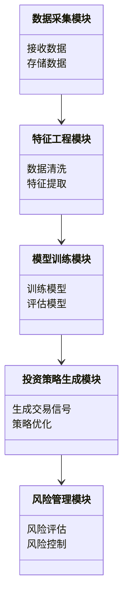
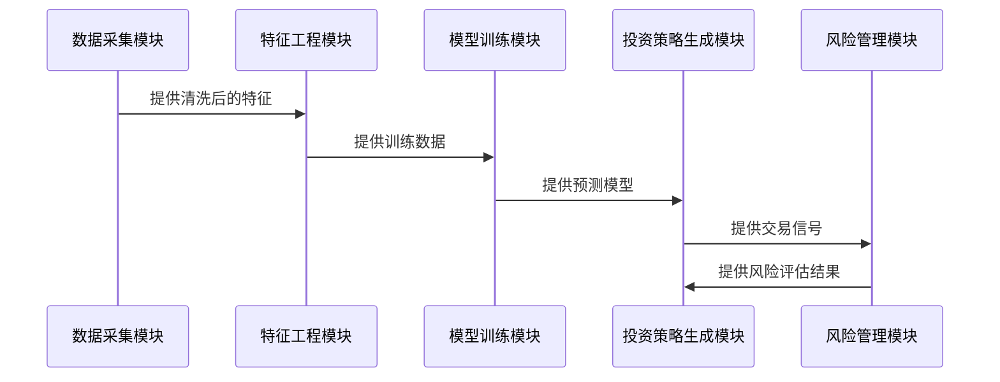

                 

<think>
好的，我需要为《人工智能在投资决策中的应用》这本书设计一个详细的目录大纲。让我一步步思考这个问题。

首先，我需要了解这本书的核心内容应该涵盖哪些方面。人工智能在投资中的应用是一个复杂的主题，涉及数据处理、算法选择、系统架构等多个方面。我需要确保目录能够覆盖这些关键点，并且结构清晰、逻辑严谨。

我应该从投资决策的背景开始，介绍投资决策的基本概念和其重要性。接下来，可以讨论人工智能的基本概念及其在投资中的优势和应用场景。这部分内容可以帮助读者理解AI在投资中的作用。

接下来，我需要详细讲解人工智能在投资决策中的核心概念，如数据驱动的投资决策、机器学习和自然语言处理的应用。这些内容能够帮助读者理解AI在投资中的具体应用方式。

然后，我应该讨论人工智能在投资决策中的算法原理。选择一些常用的算法，如线性回归、随机森林和神经网络，并用mermaid流程图展示它们的工作流程。同时，提供Python代码示例，帮助读者更好地理解这些算法的实现。

接下来，系统架构设计是一个重要的部分。我需要描述一个典型的金融投资系统，包括数据采集、特征工程、模型训练、策略生成和风险管理模块。用mermaid类图展示各模块之间的关系，以及接口设计和交互流程。

项目实战部分应该选择一个具体的案例，如股票预测，详细说明环境配置、数据预处理、模型实现、结果分析和优化。这部分需要提供代码和详细的解读，帮助读者实际操作。

最后，总结最佳实践经验和注意事项，提供一些扩展阅读的资源，帮助读者深入学习。这包括数据质量的重要性、模型选择的策略和风险管理的重要性等方面。

整个目录需要逻辑清晰，从基础到应用，层层递进。确保每个章节都有足够的细节，同时保持简洁，不冗余。这样，作者才能全面覆盖主题，读者也能系统地学习相关知识。

现在，我将根据这些思考，设计出一个详细的目录大纲。
</think>

# 人工智能在投资决策中的应用

> 关键词：人工智能，投资决策，机器学习，金融，数据分析

> 摘要：人工智能在投资决策中的应用是近年来金融领域的重要研究方向。本文从投资决策的基本概念出发，结合人工智能的核心技术，详细探讨了人工智能在投资决策中的应用原理、算法实现、系统架构设计以及实际项目案例。通过理论分析和实践结合，本文旨在帮助读者理解人工智能如何提升投资决策的效率和准确性，并在实际应用中提供指导和参考。

---

## 第一部分：投资决策的背景与挑战

### 第1章：投资决策的基本概念

#### 1.1 投资决策的定义
- 投资决策的核心概念
- 投资决策的分类与特点
- 投资决策的关键要素：风险、收益、时间价值

#### 1.2 投资决策的重要性
- 投资决策在金融领域的作用
- 投资决策的复杂性与挑战
- 投资决策的技术发展趋势

### 第2章：人工智能在投资决策中的作用

#### 2.1 人工智能的基本概念
- 人工智能的定义与分类
- 机器学习、深度学习与自然语言处理
- 人工智能在金融领域的应用现状

#### 2.2 人工智能在投资决策中的优势
- 数据处理能力：海量数据的收集与分析
- 模型构建能力：复杂关系的识别与预测
- 自适应优化能力：动态调整投资策略

#### 2.3 人工智能在投资决策中的应用场景
- 股票预测
- 量化交易
- 风险管理
- 资产配置

---

## 第二部分：人工智能在投资决策中的核心概念

### 第3章：数据驱动的投资决策

#### 3.1 数据在投资决策中的重要性
- 数据的来源：市场数据、公司基本面数据、新闻数据
- 数据的特征：时效性、全面性、准确性
- 数据的预处理：清洗、转换、特征提取

#### 3.2 数据分析方法
- 描述性分析：了解市场趋势
- 预测性分析：预测未来走势
- 相关性分析：发现数据之间的关系

#### 3.3 数据可视化
- 使用图表展示数据：K线图、折线图、散点图
- 数据可视化的工具：Matplotlib、Seaborn、Tableau

### 第4章：机器学习在投资决策中的应用

#### 4.1 机器学习的基本原理
- 监督学习：回归、分类
- 无监督学习：聚类、降维
- 强化学习：策略优化

#### 4.2 常见的机器学习算法
- 线性回归：预测股票价格
- 支持向量机：分类市场趋势
- 随机森林：特征重要性分析
- 神经网络：深度学习在金融中的应用

#### 4.3 机器学习在投资中的实际案例
- 使用线性回归预测股票价格
- 使用随机森林进行市场趋势分类
- 使用神经网络进行时间序列预测

### 第5章：自然语言处理在投资决策中的应用

#### 5.1 自然语言处理的基本概念
- 文本预处理：分词、去除停用词
- 词嵌入：Word2Vec、GloVe
- 文本分类：情感分析、主题分类

#### 5.2 自然语言处理在投资中的应用
- 从新闻中提取情绪指标
- 分析公司财报进行投资决策
- 监测市场热点话题

---

## 第三部分：人工智能在投资决策中的算法原理

### 第6章：线性回归算法

#### 6.1 线性回归的数学公式
$$ y = \beta_0 + \beta_1 x + \epsilon $$
其中，$y$ 是目标变量，$x$ 是自变量，$\beta_0$ 是截距，$\beta_1$ 是斜率，$\epsilon$ 是误差项。

#### 6.2 线性回归的假设检验
- 线性假设：因变量与自变量之间存在线性关系
- 独立性：自变量之间相互独立
- 正态性：误差项服从正态分布
- 同方差性：误差项的方差恒定

#### 6.3 线性回归的优缺点
- 优点：简单易懂，计算高效
- 缺点：假设严格，适用于线性关系

### 第7章：随机森林算法

#### 7.1 随机森林的数学公式
- 随机森林是基于决策树的集成方法：
$$ y = \text{sign} \left( \sum_{i=1}^{n} f_i(x) \right) $$
其中，$f_i(x)$ 是第 $i$ 棵决策树的预测函数。

#### 7.2 随机森林的特征重要性分析
- 特征重要性：通过计算每个特征在所有决策树中的分裂贡献率
- 优势：能够处理高维数据，抗过拟合

#### 7.3 随机森林的优缺点
- 优点：高准确率，鲁棒性强
- 缺点：计算复杂，解释性差

---

## 第四部分：人工智能在投资决策中的系统架构设计

### 第8章：系统功能设计

#### 8.1 数据采集模块
- 数据来源：API接口、数据库、网络爬虫
- 数据类型：时间序列数据、结构化数据、文本数据
- 数据存储：关系型数据库、非关系型数据库

#### 8.2 特征工程模块
- 数据清洗：处理缺失值、异常值
- 特征提取：主成分分析（PCA）、特征选择
- 特征转换：标准化、归一化

#### 8.3 模型训练模块
- 算法选择：根据任务选择合适的算法
- 参数调优：网格搜索、随机搜索
- 模型评估：均方误差（MSE）、准确率、召回率

#### 8.4 投资策略生成模块
- 策略生成：基于模型预测生成交易信号
- 策略优化：回测、风险调整
- 策略执行：模拟交易、实际交易

#### 8.5 风险管理模块
- 风险评估：VaR（在险价值）、CVaR（条件在险价值）
- 风险控制：止损、止盈、仓位管理

### 第9章：系统架构图

#### 9.1 系统架构类图


#### 9.2 系统接口设计
- 数据接口：数据输入输出接口
- 模型接口：模型训练与预测接口
- 策略接口：交易信号生成接口

#### 9.3 系统交互流程图


---

## 第五部分：人工智能在投资决策中的项目实战

### 第10章：项目环境安装与配置

#### 10.1 Python环境的安装
- 安装Python：推荐使用Anaconda
- 安装必要的库：numpy、pandas、sklearn、matplotlib

#### 10.2 数据集的获取与预处理
- 数据来源：Yahoo Finance API、CSV文件
- 数据清洗：处理缺失值、异常值
- 特征工程：标准化、归一化

### 第11章：项目核心实现

#### 11.1 数据预处理代码
```python
import pandas as pd
import numpy as np

# 加载数据
data = pd.read_csv('stock_data.csv')

# 处理缺失值
data = data.dropna()

# 标准化处理
from sklearn.preprocessing import StandardScaler
scaler = StandardScaler()
scaled_data = scaler.fit_transform(data[['open', 'high', 'low', 'close']])
```

#### 11.2 模型训练代码
```python
from sklearn.ensemble import RandomForestRegressor
from sklearn.metrics import mean_squared_error

# 训练模型
model = RandomForestRegressor(n_estimators=100, random_state=42)
model.fit(scaled_data, data['close'])

# 模型预测
predicted_prices = model.predict(scaled_data)
```

#### 11.3 投资策略生成代码
```python
# 生成交易信号
threshold = 0.1
predicted_prices = model.predict(scaled_data)
actual_prices = data['close']
signals = []
for i in range(len(predicted_prices)):
    if predicted_prices[i] > actual_prices[i] * (1 + threshold):
        signals.append(1)
    elif predicted_prices[i] < actual_prices[i] * (1 - threshold):
        signals.append(-1)
    else:
        signals.append(0)
```

#### 11.4 模型评估代码
```python
# 计算均方误差
mse = mean_squared_error(actual_prices, predicted_prices)
print(f'均方误差：{mse}')

# 计算准确率
from sklearn.metrics import accuracy_score
accuracy = accuracy_score(signals, actual_signals)
print(f'准确率：{accuracy}')
```

### 第12章：项目小结

#### 12.1 项目总结
- 项目目标的实现情况
- 模型的优缺点分析
- 实际应用中的注意事项

#### 12.2 项目扩展
- 引入更多数据源
- 使用更复杂的算法
- 实现自动化交易系统

---

## 第六部分：人工智能在投资决策中的最佳实践

### 第13章：投资决策中的注意事项

#### 13.1 数据质量的重要性
- 数据的完整性：避免缺失值
- 数据的准确性：确保数据来源可靠
- 数据的及时性：实时数据更新

#### 13.2 模型选择的策略
- 根据任务选择合适的算法
- 交叉验证：防止过拟合
- 模型解释性：便于分析和调整

#### 13.3 风险管理的重要性
- 设置止损点
- 分散投资：降低风险
- 定期评估和调整策略

### 第14章：小结与展望

#### 14.1 本章总结
- 人工智能在投资决策中的优势
- 需要注意的事项
- 未来的发展趋势

#### 14.2 未来展望
- 更加智能化的投资决策系统
- 结合区块链技术的去中心化金融（DeFi）
- 多模态数据的融合分析

---

## 作者：AI天才研究院 & 禅与计算机程序设计艺术

