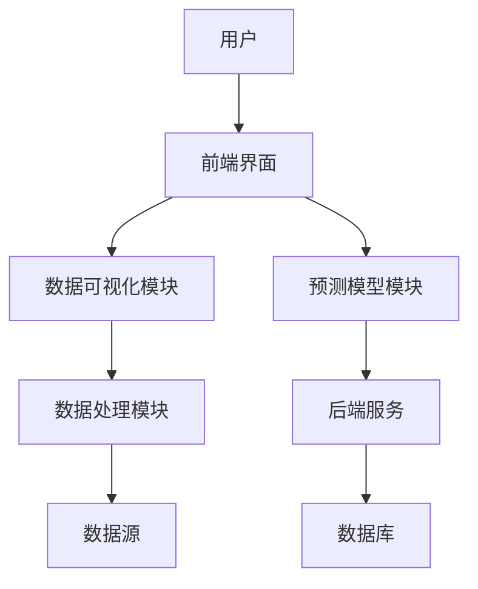

                 

<think>
好，我需要根据用户的要求，逐步分析并撰写一篇关于《人工智能在高维金融数据可视化中的应用》的长篇技术博客文章。首先，我需要理解用户的需求，包括文章的结构、内容、格式等具体要求。用户希望文章逻辑清晰、结构紧凑、语言专业，同时要包含丰富的技术细节和深入的分析。

首先，我会从文章的标题、关键词和摘要开始。标题已经确定为《人工智能在高维金融数据可视化中的应用》。接下来，我需要列出5-7个核心关键词，这些关键词应该能够覆盖文章的主要内容。考虑到文章的主题，我可以选择“人工智能”、“高维数据”、“金融数据”、“数据可视化”、“机器学习”、“深度学习”、“图神经网络”等关键词。

摘要部分需要简洁明了地概括文章的核心内容和主题思想。我会在摘要中介绍高维金融数据的复杂性，人工智能在其中的作用，以及通过具体算法和案例展示其应用。例如：“本文探讨了人工智能在高维金融数据可视化中的应用，通过介绍降维算法、机器学习模型和图神经网络等技术，结合实际案例分析，展示了如何利用AI提升金融数据分析和决策的效率。”

接下来是文章的正文部分。根据用户提供的目录大纲，我需要按照章节逐步展开内容。每个章节都需要详细讲解相关概念、算法原理、系统设计、项目实战等，并且要包含丰富的技术细节和实例。

在撰写过程中，我需要确保每个小节的内容都充分展开，包括背景介绍、核心概念、算法原理、系统架构设计、项目实战等部分。同时，要遵循用户的格式要求，使用markdown格式，包含mermaid流程图、Python代码示例、数学公式（使用latex格式）等元素。

例如，在“高维数据降维算法”部分，我会详细讲解主成分分析（PCA）和t-SNE算法，用mermaid流程图展示算法的步骤，并通过Python代码实现，同时给出数学公式以解释其原理。在“系统分析与架构设计”部分，我会介绍系统功能设计、架构图、接口设计和交互序列图，帮助读者理解系统整体结构。

项目实战部分需要选择一个具体的案例，如股票数据分析，展示如何安装环境、编写代码、分析数据，并得出结论。最后，加上最佳实践、小结、注意事项和拓展阅读，帮助读者巩固所学内容。

在完成所有章节的内容后，我会在文章末尾添加作者信息，确保格式正确。整个撰写过程需要保持逻辑清晰、语言专业，同时兼顾可读性，确保读者能够轻松理解复杂的技术内容。

通过以上步骤，我可以系统地完成一篇符合用户要求的高质量技术博客文章，深入探讨人工智能在高维金融数据可视化中的应用。
</think>

---

# 人工智能在高维金融数据可视化中的应用

## 关键词：
人工智能，高维数据，金融数据，数据可视化，机器学习，深度学习，图神经网络

## 摘要：
本文探讨了人工智能在高维金融数据可视化中的应用，通过介绍降维算法、机器学习模型和图神经网络等技术，结合实际案例分析，展示了如何利用AI提升金融数据分析和决策的效率。文章详细讲解了高维数据可视化的核心概念、算法原理、系统架构设计及项目实战，帮助读者理解人工智能在金融领域的深度应用。

---

# 第一部分: 高维金融数据可视化与人工智能概述

## 第1章: 高维金融数据可视化概述

### 1.1 高维数据的概念与特点

#### 1.1.1 高维数据的定义
高维数据指的是包含多个特征或维度的数据，通常超过人类直观认知的三维或二维空间。在金融领域，高维数据可以包括股票价格、交易量、市场情绪、新闻数据等多种信息。

#### 1.1.2 高维数据的特性
- **高维性**：数据维度远超人类认知能力。
- **复杂性**：数据之间的关联性复杂，难以直接观察。
- **稀疏性**：高维空间中数据点分布稀疏，导致信息提取困难。
- **噪声干扰**：高维数据中往往存在大量噪声，影响分析结果。

#### 1.1.3 高维数据在金融领域的应用
- **股票价格预测**：通过多维度数据（如技术指标、市场情绪）预测股票走势。
- **风险评估**：利用高维数据进行信用评分、市场风险分析。
- **客户分群**：基于多维度客户数据进行客户细分，制定个性化服务策略。

### 1.2 人工智能与金融数据的关系

#### 1.2.1 人工智能在金融领域的应用现状
- **量化交易**：基于算法的高频交易和策略优化。
- **风险管理**：利用机器学习模型预测市场风险。
- **智能投顾**：为投资者提供个性化的投资建议。

#### 1.2.2 人工智能如何处理高维金融数据
- **数据清洗与预处理**：利用AI自动去除噪声数据，提取有效特征。
- **特征工程**：通过机器学习技术自动提取关键特征，降低维度。
- **模型训练与优化**：基于高维数据训练预测模型，优化模型性能。

#### 1.2.3 人工智能在金融数据可视化中的优势
- **自动化分析**：AI能够快速处理大量数据，生成可视化图表。
- **智能交互**：支持用户与数据的互动，提供动态分析结果。
- **深度洞察**：通过AI技术挖掘数据中的隐含信息，提供更深层次的分析。

---

## 第2章: 高维数据可视化的核心概念

### 2.1 高维数据可视化的挑战

#### 2.1.1 数据维度与信息复杂性
高维数据难以直观展示，信息冗余导致数据难以被有效利用。

#### 2.1.2 数据冗余与噪声干扰
高维数据中可能存在大量冗余信息和噪声，影响分析结果的准确性。

#### 2.1.3 用户认知与交互限制
人类的认知能力有限，难以处理多维信息，交互方式的局限性也增加了分析难度。

### 2.2 人工智能在数据可视化中的作用

#### 2.2.1 自动化数据处理与特征提取
- **自动化清洗**：AI能够自动识别并处理异常数据，去除噪声。
- **特征提取**：通过无监督学习提取数据中的关键特征，降低维度。

#### 2.2.2 智能化数据展示与交互
- **动态可视化**：AI可以根据用户需求实时生成动态图表。
- **交互式分析**：支持用户与数据的深度交互，提供个性化分析结果。

#### 2.2.3 数据驱动的决策支持
- **预测模型**：基于高维数据训练预测模型，支持决策制定。
- **风险预警**：通过实时数据分析，及时发现潜在风险。

---

## 第3章: 高维金融数据可视化的应用场景

### 3.1 金融市场的实时数据可视化

#### 3.1.1 股票价格走势分析
- **多维度分析**：结合技术指标、市场情绪、新闻事件等多维度数据，分析股票价格走势。
- **动态图表**：实时更新股价走势，支持用户进行趋势预测。

#### 3.1.2 交易量与市场情绪分析
- **交易量分析**：通过分析交易量变化，判断市场活跃度。
- **市场情绪分析**：利用自然语言处理技术分析新闻和社交媒体，判断市场情绪。

#### 3.1.3 风险评估与预警系统
- **风险评估**：基于高维数据训练风险评估模型，识别潜在风险。
- **预警系统**：实时监控市场数据，触发预警信号。

### 3.2 金融数据的深度分析与建模

#### 3.2.1 时间序列数据分析
- **时间序列预测**：利用LSTM等深度学习模型预测未来走势。
- **异常检测**：识别时间序列中的异常点，及时发现潜在问题。

#### 3.2.2 聚类分析与客户分群
- **客户分群**：基于客户行为数据进行聚类分析，制定个性化服务策略。
- **市场细分**：通过聚类分析识别不同市场区域，制定精准营销策略。

#### 3.2.3 预测模型的可视化展示
- **模型可视化**：通过可视化工具展示预测模型的结构和参数。
- **结果解读**：将模型预测结果以图表形式展示，便于用户理解和应用。

---

## 第4章: 人工智能技术基础

### 4.1 机器学习基础

#### 4.1.1 监督学习与无监督学习
- **监督学习**：基于标注数据训练模型，如回归、分类任务。
- **无监督学习**：基于未标注数据进行聚类、降维等任务。

#### 4.1.2 神经网络与深度学习
- **神经网络**：模拟人脑神经网络结构，用于特征提取和模式识别。
- **深度学习**：通过多层神经网络提取深层次特征，提升模型性能。

#### 4.1.3 常见机器学习算法介绍
- **线性回归**：用于预测连续型变量。
- **决策树**：用于分类和回归任务。
- **随机森林**：通过集成多个决策树提升模型性能。

### 4.2 图神经网络与高维数据处理

#### 4.2.1 图神经网络的定义与特点
- **图神经网络**：一种处理图结构数据的深度学习模型。
- **节点表示**：通过图神经网络将节点特征表示为低维向量。
- **图结构分析**：利用图结构信息进行节点分类、聚类等任务。

#### 4.2.2 图神经网络在金融数据中的应用
- **欺诈检测**：通过图神经网络分析交易关系，识别欺诈行为。
- **信用评分**：基于图结构信息评估客户信用风险。

#### 4.2.3 图神经网络的优势与挑战
- **优势**：能够处理复杂的图结构数据，提取深层次特征。
- **挑战**：计算复杂度高，需要大量计算资源。

### 4.3 自然语言处理与金融文本分析

#### 4.3.1 NLP技术在金融新闻中的应用
- **文本分类**：判断新闻情感倾向，如正面、负面、中性。
- **实体识别**：识别新闻中的公司名称、人物等实体信息。

#### 4.3.2 金融文本的情感分析
- **情感分析模型**：基于NLP技术分析文本情感，判断市场情绪。
- **情感传播网络**：通过情感传播网络分析情绪在市场中的传播。

#### 4.3.3 基于NLP的市场情绪预测
- **情绪预测模型**：利用NLP技术预测市场情绪变化，辅助投资决策。

---

## 第5章: 高维数据降维算法

### 5.1 主成分分析（PCA）

#### 5.1.1 PCA的数学原理
- **协方差矩阵**：计算数据的协方差矩阵，反映数据的分布情况。
- **特征值分解**：通过特征值分解找到数据的主要成分。

#### 5.1.2 PCA的实现步骤
1. 数据标准化：对数据进行标准化处理，消除量纲影响。
2. 计算协方差矩阵：反映数据的分布情况。
3. 特征值分解：找到数据的主要成分。
4. 降维：选择主要成分，进行数据降维。

#### 5.1.3 PCA在金融数据中的应用
- **股票价格预测**：通过PCA降维提取主要特征，训练预测模型。
- **风险评估**：基于降维后的特征进行风险评估。

#### 5.1.4 PCA的优缺点
- **优点**：能够有效降低数据维度，保留数据的主要信息。
- **缺点**：忽略数据的非线性结构，可能丢失重要信息。

#### 5.1.5 PCA的Python实现
```python
import numpy as np
from sklearn.decomposition import PCA

# 示例数据
X = np.array([[2.5, 2.4],
              [4.2, 5.5],
              [3.7, 3.2],
              [3.2, 3.9],
              [2.6, 4.0]])

# PCA降维
pca = PCA(n_components=1)
pca.fit(X)
principal_components = pca.transform(X)
print("主成分矩阵：\n", pca.components_)
print("解释方差比：\n", pca.explained_variance_ratio_)
```

### 5.2 t-SNE算法

#### 5.2.1 t-SNE的原理与特点
- **t-SNE**：全称t-distributed stochastic neighbor embedding，是一种降维算法。
- **优点**：能够较好地保留数据的局部结构信息。
- **缺点**：计算复杂度较高，需要大量计算资源。

#### 5.2.2 t-SNE的实现流程
1. 数据预处理：对数据进行标准化处理。
2. 计算概率分布：基于高斯分布计算数据点的概率。
3. t-SNE变换：通过KL散度最小化，将数据映射到低维空间。

#### 5.2.3 t-SNE在金融数据可视化中的应用
- **客户分群**：通过t-SNE降维后的数据进行聚类分析，识别客户群体。
- **市场趋势分析**：基于降维后的数据，分析市场趋势。

#### 5.2.4 t-SNE的优缺点
- **优点**：能够较好地展示数据的局部结构。
- **缺点**：计算复杂度高，降维后的数据可能存在一定程度的失真。

#### 5.2.5 t-SNE的Python实现
```python
from sklearn.manifold import TSNE

# 示例数据
X = np.array([[2.5, 2.4],
              [4.2, 5.5],
              [3.7, 3.2],
              [3.2, 3.9],
              [2.6, 4.0]])

# t-SNE降维
tsne = TSNE(n_components=2, random_state=42)
tsne_result = tsne.fit_transform(X)
print("降维后的数据：\n", tsne_result)
```

---

## 第6章: 高维金融数据可视化系统的架构设计

### 6.1 系统功能设计

#### 6.1.1 系统功能模块
- **数据采集**：从多种数据源采集金融数据。
- **数据处理**：清洗、转换和预处理数据。
- **数据可视化**：生成动态图表，支持用户交互。
- **模型训练**：基于高维数据训练预测模型。
- **结果展示**：将模型预测结果以图表形式展示。

#### 6.1.2 功能流程
1. 数据采集：从股票交易所、新闻网站等数据源获取金融数据。
2. 数据处理：清洗数据，去除异常值和噪声。
3. 数据可视化：生成动态图表，支持用户交互。
4. 模型训练：基于预处理后的数据训练预测模型。
5. 结果展示：将模型预测结果以图表形式展示，辅助用户决策。

### 6.2 系统架构设计

#### 6.2.1 系统架构图


#### 6.2.2 系统交互设计
- **用户输入**：用户通过前端界面输入查询条件。
- **数据处理**：系统根据用户输入处理数据。
- **模型训练**：系统根据处理后的数据训练预测模型。
- **结果展示**：系统将预测结果以图表形式展示给用户。

#### 6.2.3 系统接口设计
- **数据接口**：与数据源对接，获取金融数据。
- **可视化接口**：与前端界面对接，展示数据可视化结果。
- **预测接口**：与预测模型对接，获取预测结果。

---

## 第7章: 项目实战——基于AI的高维金融数据分析系统

### 7.1 项目背景与目标

#### 7.1.1 项目背景
随着金融市场的快速发展，高维金融数据的处理和分析需求日益增加。传统方法难以应对复杂的数据维度和分析需求，因此需要借助人工智能技术提升数据分析效率。

#### 7.1.2 项目目标
- 实现高维金融数据的自动处理和分析。
- 提供动态数据可视化功能，支持用户交互。
- 基于高维数据训练预测模型，辅助投资决策。

### 7.2 项目环境搭建

#### 7.2.1 环境要求
- **操作系统**：Windows、Linux或MacOS。
- **编程语言**：Python 3.8及以上版本。
- **库与工具**：Pandas、NumPy、Matplotlib、Scikit-learn、TensorFlow、Keras。

#### 7.2.2 安装环境
```bash
pip install numpy pandas matplotlib scikit-learn tensorflow keras
```

### 7.3 核心系统实现

#### 7.3.1 数据采集模块
```python
import pandas as pd
import requests
import json

# 从API获取股票数据
def get_stock_data(ticker):
    url = f"https://api.example.com/stock/{ticker}"
    response = requests.get(url)
    data = json.loads(response.text)
    return pd.DataFrame(data)
```

#### 7.3.2 数据处理模块
```python
import numpy as np
from sklearn.preprocessing import StandardScaler

def preprocess_data(data):
    # 数据标准化
    scaler = StandardScaler()
    processed_data = scaler.fit_transform(data)
    return processed_data
```

#### 7.3.3 数据可视化模块
```python
import matplotlib.pyplot as plt

def visualize_data(data, labels):
    plt.scatter(data[:,0], data[:,1], c=labels)
    plt.xlabel('Feature 1')
    plt.ylabel('Feature 2')
    plt.show()
```

#### 7.3.4 模型训练模块
```python
from sklearn.model

