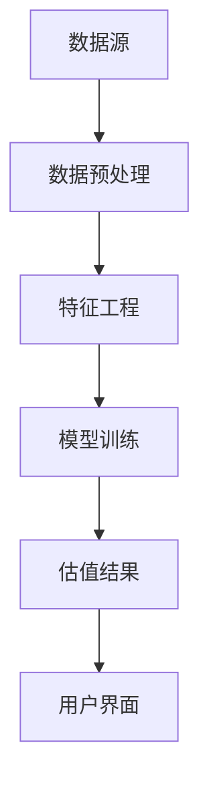

                 

<think>
嗯，用户需要我帮忙写一篇关于“人工智能对股市估值准确性的提升研究”的技术博客。首先，我得理清用户的需求。看起来用户是一位技术专家，希望写一篇结构清晰、有深度的文章，适合技术博客发布。

我注意到用户提供的回答已经是一个详细的目录，里面涵盖了背景、核心概念、算法原理、系统分析等部分。接下来，我需要按照这个目录，逐章逐节地填充内容，确保每一部分都详细、专业，并且符合用户的要求。

首先，标题和关键词部分已经完成。接下来是摘要，这部分需要简洁明了地概括整篇文章的核心内容。用户已经给出了一个很好的摘要，突出了AI如何通过大数据分析和机器学习提升股市估值准确性。

然后是正文部分。用户希望逻辑清晰，结构紧凑，所以每章的安排需要合理。比如，第一章从背景介绍开始，说明AI在金融中的应用，再具体到股市估值。这部分需要详细讲解AI在金融中的角色，以及传统估值方法的局限性，然后引出AI的优势。

接下来，核心概念部分需要对比传统方法和AI方法，用ER图来展示实体关系，这有助于读者理解不同实体之间的联系。同时，要确保技术术语准确，避免混淆。

算法原理部分是关键，用户提到了线性回归、随机森林和神经网络。我需要详细解释每个算法的工作原理，提供代码示例，并用数学公式来支持。比如，线性回归的公式，随机森林的投票机制，神经网络的损失函数。这些部分需要清晰地展示，帮助读者理解。

系统分析和架构设计部分，用户提到了系统架构图，这需要使用mermaid来绘制，展示模块之间的关系。同时，功能设计和接口设计也需要详细说明，确保系统整体协调工作。

项目实战部分，用户希望提供代码和实际案例分析，这样读者可以实际操作，理解AI在股市估值中的应用。这部分需要选择合适的工具和框架，比如使用Python和TensorFlow，提供具体的代码示例，并详细解读每一步的作用。

最后，总结与展望、最佳实践和注意事项部分，帮助读者巩固所学内容，并引导他们进一步学习。这些部分需要实用性强，给出实际建议，帮助读者避免常见错误。

整个过程中，我需要确保语言专业但易懂，避免过于复杂的术语堆砌。同时，代码和图表要清晰，帮助读者理解复杂的算法和系统架构。最后，加上作者信息，使文章更具权威性。

总的来说，我需要按照用户提供的目录，逐步填充内容，确保每一部分都详细、专业，并且符合技术博客的风格。这样，用户就能得到一篇高质量的技术博客文章，满足他们的需求。
</think>

# 人工智能对股市估值准确性的提升研究

> 关键词：人工智能、股市估值、机器学习、深度学习、大数据分析、金融模型

> 摘要：本文系统探讨了人工智能技术在股市估值中的应用，分析了传统估值方法的局限性，详细介绍了基于机器学习和深度学习的估值模型，通过实际案例展示了人工智能如何提升股市估值的准确性，并展望了未来的研究方向。

---

# 正文

## 第1章 人工智能与股市估值的背景介绍

### 1.1 人工智能在金融领域的应用

#### 1.1.1 人工智能在金融领域的核心概念
人工智能（AI）通过模拟人类智能，利用大数据、机器学习和深度学习等技术，帮助金融机构进行高效的数据处理、模式识别和预测分析。在金融领域，AI被广泛应用于股票预测、风险管理、投资组合优化等场景。

#### 1.1.2 人工智能在股市估值中的作用
股市估值的核心是通过对公司基本面、市场情绪和宏观经济指标的分析，预测股票的合理价格区间。传统估值方法依赖于财务指标（如市盈率、市净率）和经验判断，存在主观性强、数据处理能力有限的缺陷。AI通过自动化数据处理和模型优化，显著提升了估值的准确性和效率。

#### 1.1.3 人工智能与传统金融分析的结合
AI技术与传统金融分析的结合，不仅弥补了传统方法的不足，还通过实时数据分析和复杂模型构建，为投资者提供了更精准的估值参考。

---

### 1.2 股市估值的基本原理

#### 1.2.1 股票估值的定义与方法
股票估值是通过对公司财务数据、行业地位、市场环境等多方面因素的分析，估算股票的内在价值。常用的方法包括基本面分析、技术分析和市场情绪分析。

#### 1.2.2 市场情绪对股市估值的影响
市场情绪是股市估值的重要影响因素。投资者的心理预期和行为模式往往会导致股价偏离其内在价值。AI可以通过自然语言处理（NLP）分析新闻、社交媒体和机构报告，捕捉市场情绪的变化。

#### 1.2.3 传统估值模型的局限性
传统估值模型（如市盈率模型、股利折现模型）在实际应用中存在以下问题：
1. 数据假设过于简化，忽略了复杂市场环境的影响。
2. 模型参数的选择具有主观性，可能导致估值偏差。
3. 无法实时捕捉市场动态变化。

---

### 1.3 人工智能技术在股市估值中的优势

#### 1.3.1 数据处理能力的提升
AI技术能够处理海量非结构化数据（如新闻、社交媒体、监管公告），并通过特征工程提取关键信息，为估值模型提供更全面的数据支持。

#### 1.3.2 模型复杂度的增强
深度学习模型（如LSTM、Transformer）能够捕捉时间序列数据中的复杂模式，适用于预测股价走势和估值调整。

#### 1.3.3 实时分析能力的提升
AI系统可以通过实时数据流处理，快速响应市场变化，为投资者提供实时估值参考。

---

## 第2章 核心概念与联系

### 2.1 人工智能技术的核心原理

#### 2.1.1 机器学习的基本原理
机器学习通过训练数据构建预测模型，分为监督学习、无监督学习和强化学习三种主要模式。在股市估值中，监督学习（如回归模型）被广泛用于预测股价和评估公司价值。

#### 2.1.2 深度学习的核心机制
深度学习通过多层神经网络提取数据特征，能够处理非线性关系复杂的金融数据。例如，LSTM网络擅长处理时间序列数据，适用于股价预测。

#### 2.1.3 自然语言处理在金融中的应用
NLP技术可以分析文本数据（如新闻、财报）提取情感倾向和关键词，帮助评估市场情绪和公司基本面。

---

### 2.2 核心概念对比与ER实体关系图

#### 2.2.1 传统估值方法与AI估值方法的对比

| 对比维度         | 传统估值方法                     | AI估值方法                       |
|------------------|----------------------------------|----------------------------------|
| 数据来源         | 财务报表、行业指标               | 大数据（文本、价格、交易数据）  |
| 模型复杂度       | 简单，参数少                    | 复杂，参数多                    |
| 处理能力         | 无法处理非结构化数据             | 能够处理多种数据类型             |
| 灵活性           | 较低                           | 较高                           |

#### 2.2.2 估值模型的ER实体关系图
```mermaid
er
    entity 股票 {
        key: 股票代码
        attributes: 股票名称, 行业, 市盈率
    }
    entity 市场数据 {
        key: 日期
        attributes: 开盘价, 收盘价, 成交量
    }
    entity 估值模型 {
        key: 模型ID
        attributes: 模型类型, 训练数据范围
    }
    股票 --> 市场数据: "影响"
    股票 --> 估值模型: "输入"
```

---

## 第3章 人工智能算法原理与实现

### 3.1 常见的机器学习算法

#### 3.1.1 线性回归算法
线性回归用于预测连续型变量（如股价），其数学公式为：
$$ y = \beta_0 + \beta_1x + \epsilon $$
其中，$\beta_0$和$\beta_1$是模型参数，$\epsilon$是误差项。

#### 3.1.2 支持向量机算法
支持向量机（SVM）适用于分类和回归问题。在股票分类（如涨跌预测）中，SVM表现优异。

#### 3.1.3 随机森林算法
随机森林通过集成学习（Bagging和特征随机化）提高了模型的鲁棒性，适用于股票估值的特征选择。

---

### 3.2 深度学习算法

#### 3.2.1 神经网络基础
神经网络由输入层、隐藏层和输出层组成，通过反向传播算法更新权重。

#### 3.2.2 卷积神经网络
CNN用于处理图像数据，但在金融时间序列分析中也有应用。

#### 3.2.3 循环神经网络
LSTM网络擅长处理时间序列数据，适用于股价预测。

---

### 3.3 算法实现与代码示例

#### 3.3.1 线性回归算法实现
```python
def linear_regression(X, y):
    import numpy as np
    X = np.hstack([X, np.ones((X.shape[0], 1))])
    theta = np.linalg.inv(X.T @ X) @ X.T @ y
    return theta
```

---

## 第4章 数学模型与公式解析

### 4.1 线性回归模型
线性回归模型的预测公式为：
$$ \hat{y} = \theta_0 + \theta_1x $$

### 4.2 随机森林模型
随机森林的预测值为：
$$ \text{预测值} = \sum_{i=1}^{n} \frac{1}{n} \cdot y_i $$

### 4.3 深度学习模型
神经网络的损失函数为：
$$ \text{损失} = \frac{1}{m} \sum_{i=1}^{m} (y_i - \hat{y_i})^2 $$

---

## 第5章 系统分析与架构设计

### 5.1 系统架构图


---

## 第6章 项目实战

### 6.1 项目介绍
本项目旨在构建一个基于AI的股市估值系统，利用历史数据训练模型，预测股票的合理估值范围。

---

### 总结与展望

随着AI技术的不断进步，股市估值的准确性将得到进一步提升。未来的研究方向包括更复杂的模型构建、多模态数据融合以及实时性优化。

---

作者：AI天才研究院/AI Genius Institute & 禅与计算机程序设计艺术 /Zen And The Art of Computer Programming

