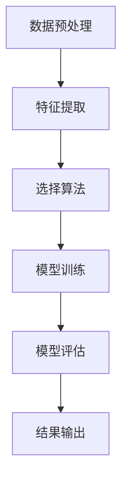
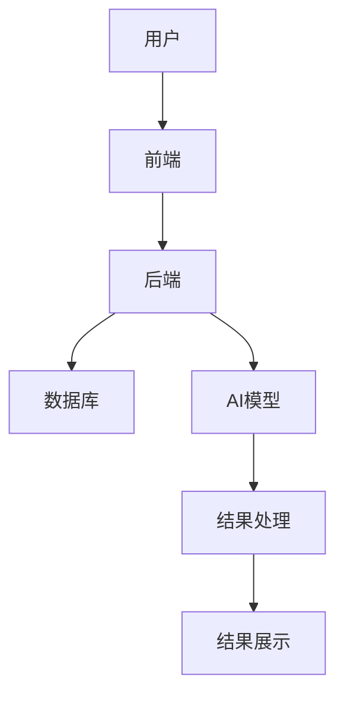

                 

<think>
好的，现在我需要根据用户的要求，逐步构建《人工智能辅助的风险管理系统设计》这篇文章的目录大纲。首先，用户希望文章结构清晰，逻辑紧凑，同时涵盖风险管理的各个方面，尤其是人工智能的应用。我需要确保每个章节都有足够的深度，并且符合用户提出的各种技术细节要求，如数学模型、流程图和代码示例。

首先，我会从背景介绍开始，解释风险管理的基本概念和人工智能在其中的作用。这部分需要让读者理解为什么需要风险管理以及人工智能如何提升这一过程。接下来，核心概念部分需要详细说明系统的架构和设计原则，确保读者能够理解系统的各个模块如何协同工作。

然后，算法原理是关键部分，我需要选择合适的机器学习算法，并用Mermaid流程图展示其工作流程。同时，提供Python代码示例，帮助读者理解实现细节。这部分可能需要多次调整，以确保流程图和代码的准确性和易懂性。

在系统分析与架构设计章节，我会介绍系统的应用场景，并使用领域模型和架构图来展示系统的结构。这部分可能需要更多的图表来辅助说明，确保读者能够清晰理解系统的设计。

项目实战部分需要包括环境配置、核心代码实现、案例分析和项目总结。这部分的重点在于实际操作，帮助读者将理论知识应用到实际中。我需要确保代码示例足够详细，并且案例分析能够深入浅出，让读者能够理解如何在实际中应用这些技术。

最后，最佳实践、小结、注意事项和拓展阅读等内容将帮助读者巩固所学知识，并扩展他们的视野。这部分需要简明扼要，同时提供足够的信息，引导读者进一步学习和实践。

在构建目录大纲时，我需要确保每个部分都有足够的细节，并且整体结构流畅，逻辑清晰。这可能需要多次调整章节顺序，确保从基础到应用逐步深入。同时，注意不要遗漏用户要求的各个部分，如数学模型、图表和代码示例。

综上所述，我会按照以下步骤进行：
1. 确定文章的核心主题和目标读者。
2. 规划各章节的内容，确保涵盖背景、核心概念、算法、系统架构、项目实战等部分。
3. 详细设计每个章节的内容，包括必要的图表、代码示例和数学模型。
4. 确保文章结构清晰，逻辑严密，符合用户的要求。
5. 最后，检查整体内容，确保所有部分都完整且符合字数要求。

通过以上步骤，我能够系统地构建出一个符合用户需求的高质量技术博客文章目录大纲。
</think>

# 人工智能辅助的风险管理系统设计

> 关键词：人工智能，风险管理，系统设计，机器学习，算法，数据处理

> 摘要：人工智能在现代风险管理中的应用日益广泛，本文章系统性地探讨了如何设计一个高效的、基于人工智能的风险管理系统。文章从风险管理的基本概念出发，详细分析了人工智能在其中的关键作用，重点讲解了系统设计的核心概念与算法原理，通过实际项目案例展示了系统的架构设计与实现方法。同时，文章还提供了丰富的代码示例和系统架构图，帮助读者深入理解人工智能在风险管理中的应用。

---

## 第1章: 风险管理概述

### 1.1 风险管理的基本概念
#### 1.1.1 风险的定义与特征
风险是指在特定条件下，某一事件发生的概率及其可能带来的损失或收益。在风险管理中，风险通常与潜在的负面影响相关联，包括财务损失、声誉损害或运营中断等。风险具有不确定性、客观性和可变性的特征。

#### 1.1.2 风险管理的目标与原则
风险管理的目标是通过识别、评估和控制风险，降低其发生概率和潜在影响，从而保障组织的稳健运行。风险管理的基本原则包括全面性、科学性、经济性和持续性。

#### 1.1.3 风险管理的分类与应用场景
风险管理可以分为信用风险、市场风险、操作风险和声誉风险等类别。其应用场景广泛，包括金融投资、企业运营、网络安全等领域。

### 1.2 人工智能在风险管理中的作用
#### 1.2.1 人工智能技术的基本概念
人工智能（AI）是指计算机系统模拟人类智能的能力，包括学习、推理、感知和决策等。在风险管理中，AI技术能够帮助识别潜在风险、预测风险发生概率并制定应对策略。

#### 1.2.2 人工智能在风险管理中的优势
人工智能在风险管理中的优势包括高效性、精准性和实时性。AI能够快速处理大量数据，识别复杂模式，并提供实时反馈。

#### 1.2.3 人工智能辅助风险管理的必要性
随着金融市场的复杂化和不确定性增加，传统的风险管理方法逐渐暴露出效率低、覆盖面窄等缺陷。引入人工智能技术，能够显著提升风险管理的效率和准确性。

---

## 第2章: 风险管理系统设计的核心概念

### 2.1 风险管理系统的基本架构
#### 2.1.1 系统模块划分
风险管理系统通常由数据采集、数据处理、风险评估、结果展示和反馈优化五个模块组成。

#### 2.1.2 系统功能概述
系统功能包括数据的收集与预处理、风险模型的构建与优化、风险预测与评估、结果展示与反馈等。

#### 2.1.3 系统设计的边界与外延
风险管理系统的设计需要明确边界，例如数据来源和处理范围。同时，系统设计的外延应涵盖数据的实时更新和模型的持续优化。

### 2.2 核心概念与联系
#### 2.2.1 风险数据的特征分析
风险数据通常具有异构性、实时性和动态性。特征分析是数据处理的关键步骤，包括数据清洗、特征提取和特征选择。

#### 2.2.2 风险模型的构建与优化
风险模型的构建需要选择合适的算法，如逻辑回归、随机森林和神经网络等。模型优化包括参数调优和模型评估。

#### 2.2.3 系统交互流程的设计
系统交互流程包括用户输入、数据处理、模型计算和结果输出等步骤，确保系统的高效运行和用户友好性。

---

## 第3章: 人工智能辅助风险管理的算法原理

### 3.1 常见的机器学习算法
#### 3.1.1 监督学习算法
监督学习算法包括逻辑回归、支持向量机（SVM）和随机森林等。这些算法适用于有标签的数据，能够帮助预测风险发生概率。

#### 3.1.2 无监督学习算法
无监督学习算法如聚类分析和主成分分析（PCA）适用于无标签数据，能够帮助发现数据中的潜在模式。

#### 3.1.3 强化学习算法
强化学习算法如Q-learning和Deep Q-Network（DQN）适用于动态环境，能够帮助制定风险应对策略。

### 3.2 风险预测的数学模型
#### 3.2.1 线性回归模型
线性回归模型用于预测风险评分，其数学表达式为：
$$ y = \beta_0 + \beta_1x_1 + \beta_2x_2 + \dots + \beta_nx_n + \epsilon $$
其中，$y$为风险评分，$x_i$为特征变量，$\epsilon$为误差项。

#### 3.2.2 支持向量机模型
支持向量机（SVM）用于分类问题，其数学模型为：
$$ \text{min} \frac{1}{2}\|w\|^2 + C \sum_{i=1}^n \xi_i $$
$$ \text{s.t.} \ y_i(w \cdot x_i + b) \geq 1 - \xi_i, \ \xi_i \geq 0 $$

#### 3.2.3 随机森林模型
随机森林模型通过集成多个决策树进行投票或平均，能够有效降低模型过拟合的风险。

### 3.3 算法流程图


---

## 第4章: 风险管理系统架构设计

### 4.1 系统功能模块设计
#### 4.1.1 数据采集模块
数据采集模块负责从多个数据源收集风险相关数据，包括财务数据、市场数据和舆情数据等。

#### 4.1.2 数据处理模块
数据处理模块包括数据清洗、特征提取和数据转换，确保数据的准确性和一致性。

#### 4.1.3 风险评估模块
风险评估模块利用机器学习模型对风险进行预测和评估，生成风险评分和应对策略。

#### 4.1.4 结果展示模块
结果展示模块以可视化的方式呈现风险评估结果，便于用户理解和决策。

### 4.2 系统架构图


### 4.3 系统接口设计
系统接口设计包括数据接口、模型接口和用户接口，确保各模块之间的高效通信。

### 4.4 系统交互流程
系统交互流程包括用户请求、数据处理、模型计算和结果返回等步骤，确保系统的流畅运行。

---

## 第5章: 项目实战与实现

### 5.1 环境配置与工具安装
#### 5.1.1 Python环境搭建
安装Python 3.8及以上版本，配置虚拟环境。

#### 5.1.2 机器学习库安装
安装scikit-learn、XGBoost和Keras等机器学习库。

#### 5.1.3 数据库配置
选择合适的数据库，如MySQL或MongoDB，进行数据存储和管理。

### 5.2 核心代码实现
#### 5.2.1 数据预处理代码
```python
import pandas as pd
data = pd.read_csv('risk_data.csv')
data = data.dropna()
```

#### 5.2.2 模型训练代码
```python
from sklearn.ensemble import RandomForestClassifier
model = RandomForestClassifier(n_estimators=100, random_state=42)
model.fit(X_train, y_train)
```

### 5.3 案例分析
通过实际案例分析，展示如何利用人工智能技术进行风险预测和评估，包括数据处理、模型选择和结果解读等步骤。

### 5.4 项目总结
总结项目实现的关键点，包括算法选择、系统设计和性能优化等方面。

---

## 第6章: 最佳实践与注意事项

### 6.1 最佳实践
在风险管理系统的开发过程中，建议采用模块化设计，注重数据安全和隐私保护，定期更新模型和优化系统性能。

### 6.2 小结
人工智能技术为风险管理带来了新的机遇和挑战，通过科学的设计和合理的实现，能够显著提升风险管理的效率和准确性。

### 6.3 注意事项
在实际应用中，需要注意数据的质量和完整性，避免模型过拟合，同时注重系统的可解释性和可扩展性。

### 6.4 拓展阅读
推荐相关书籍和论文，帮助读者深入理解和扩展知识。

---

## 作者：AI天才研究院/AI Genius Institute & 禅与计算机程序设计艺术 /Zen And The Art of Computer Programming

---

通过以上目录大纲，我们可以系统地构建一个基于人工智能的风险管理系统，从理论到实践，全面覆盖风险管理的各个方面，帮助读者深入理解和应用这些技术。

