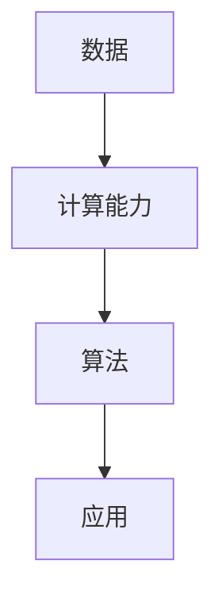
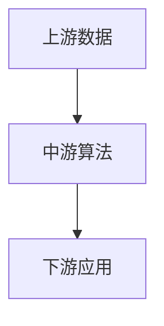
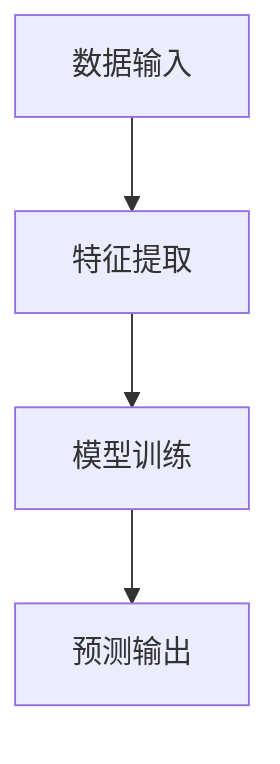
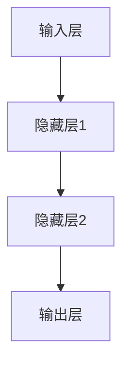

                 

# 人工智能革命：重塑产业链的投资逻辑

## 关键词
人工智能，投资逻辑，产业链，产业升级，技术驱动，投资策略，产业格局

## 摘要
人工智能技术的快速发展正在深刻改变各个行业的产业结构和商业模式，催生出新的投资机会。本文从人工智能的核心技术、应用场景和投资逻辑三个方面展开，系统分析人工智能如何重塑产业链，并为投资者提供切实可行的投资策略。

---

## 第一章：人工智能革命的背景与核心概念

### 1.1 人工智能革命的背景

#### 1.1.1 人工智能的定义与核心概念
人工智能（Artificial Intelligence, AI）是指计算机系统能够执行人类智力范围内的任务，如视觉识别、语音识别、决策推理等。其核心概念包括：
- 数据驱动：AI依赖大量数据进行训练和推理。
- 计算能力：强大的计算能力是AI发展的基础。
- 算法创新：从浅层学习到深度学习，算法的不断进步推动AI能力提升。

**图1-1：人工智能的核心要素**

#### 1.1.2 人工智能技术的演进历程
人工智能经历了三次发展浪潮：
1. **符号逻辑推理（20世纪50年代-70年代）**：基于规则的专家系统。
2. **机器学习与模式识别（20世纪80年代-90年代）**：基于统计学习的方法。
3. **深度学习与强化学习（21世纪初至今）**：基于神经网络的端到端学习。

#### 1.1.3 当前人工智能技术的突破与瓶颈
当前，人工智能在视觉、语音、自然语言处理等领域取得突破，但仍然面临数据依赖性强、可解释性差、算力需求高等瓶颈。

### 1.2 人工智能对产业链的重塑

#### 1.2.1 产业链的概念与构成
产业链是指围绕某一产业，从上游原料供应到下游产品销售的完整链条。人工智能技术正在从多个环节重塑产业链：
- **上游**：数据采集与处理。
- **中游**：算法开发与模型训练。
- **下游**：应用场景落地。

#### 1.2.2 人工智能如何改变产业链的各个环节
以制造业为例：
- 数据采集：通过IoT设备实时收集生产数据。
- 数据处理：利用AI算法优化生产流程。
- 应用落地：实现智能排产、质量检测等。

**图1-2：人工智能重塑产业链的示意图**

#### 1.2.3 人工智能对传统产业的颠覆性影响
人工智能正在改变传统的商业模式，例如：
- **金融行业**：从传统信贷评估到智能风控。
- **医疗行业**：从人工诊断到AI辅助诊断。
- **交通行业**：从人工驾驶到自动驾驶。

### 1.3 投资逻辑的演变

#### 1.3.1 传统投资逻辑的局限性
传统投资逻辑依赖于财务指标和行业经验，难以捕捉技术驱动型企业的价值。

#### 1.3.2 人工智能时代投资逻辑的转变
人工智能时代，投资逻辑更加关注：
- **技术壁垒**：企业的技术领先性。
- **数据资源**：企业的数据积累。
- **应用场景**：技术的商业化潜力。

#### 1.3.3 人工智能投资逻辑的核心要素
1. **技术壁垒**：企业是否拥有独特的算法或模型。
2. **数据资源**：企业是否掌握高质量的数据。
3. **应用场景**：技术是否能够在实际场景中落地。

---

## 第二章：人工智能的核心技术与应用

### 2.1 机器学习与深度学习的核心原理

#### 2.1.1 机器学习的基本原理
机器学习是一种通过数据训练模型的技术，其核心包括：
- **特征提取**：从数据中提取有用的特征。
- **模型训练**：通过优化算法调整模型参数。
- **预测与评估**：基于训练好的模型进行预测，并评估模型性能。

**图2-1：机器学习的基本流程**

#### 2.1.2 机器学习的核心算法
- **线性回归**：用于预测连续型变量。
- **决策树**：用于分类和回归。
- **支持向量机（SVM）**：用于分类任务。

#### 2.1.3 深度学习的核心原理
深度学习是一种基于神经网络的机器学习方法，其核心包括：
- **神经网络**：由多个层次的神经元组成。
- **反向传播**：通过链式法则计算损失函数的梯度。
- **梯度下降**：优化模型参数。

**图2-2：深度学习的神经网络结构**

#### 2.1.4 机器学习与深度学习的对比
| 对比维度 | 机器学习 | 深度学习 |
|----------|----------|----------|
| 数据需求 | 数据量小 | 数据量大 |
| 特征工程 | 特征工程复杂 | 特征工程简单 |
| 模型表现 | 模型表现受限 | 模型表现更好 |

### 2.2 自然语言处理与计算机视觉的应用

#### 2.2.1 自然语言处理的核心技术
- **分词**：将文本分割成词语或短语。
- **句法分析**：分析句子的语法结构。
- **情感分析**：判断文本的情感倾向。

#### 2.2.2 计算机视觉的核心技术
- **图像识别**：识别图像中的物体。
- **目标检测**：检测图像中的目标并定位其位置。
- **图像分割**：将图像分割成不同的区域。

#### 2.2.3 自然语言处理与计算机视觉的应用案例
- **智能客服**：利用自然语言处理实现智能对话。
- **自动驾驶**：利用计算机视觉实现环境感知。

---

## 第三章：人工智能在产业链中的应用案例

### 3.1 人工智能在制造业中的应用

#### 3.1.1 制造业智能化转型的背景
制造业正从传统的人工操作向智能化转型，其核心包括：
- **智能工厂**：通过AI优化生产流程。
- **预测性维护**：通过AI预测设备故障。

#### 3.1.2 人工智能在制造业中的具体应用
- **智能排产**：利用AI算法优化生产计划。
- **质量检测**：利用计算机视觉检测产品质量。

#### 3.1.3 制造业智能化转型的挑战
- **数据孤岛**：不同系统之间的数据难以整合。
- **技术落地**：AI技术的实际应用效果有限。

### 3.2 人工智能在金融领域的应用

#### 3.2.1 金融智能化转型的背景
金融行业正通过AI技术提升服务效率，其核心包括：
- **智能风控**：通过AI进行信用评估。
- **智能投顾**：通过AI提供投资建议。

#### 3.2.2 人工智能在金融领域的具体应用
- **智能风控**：利用机器学习进行风险评估。
- **智能投顾**：利用自然语言处理分析市场情绪。

---

## 第四章：人工智能的投资逻辑与策略

### 4.1 人工智能投资逻辑的核心要素

#### 4.1.1 技术壁垒
- **技术领先性**：企业是否拥有独特的技术。
- **研发团队**：团队是否具有强大的技术能力。

#### 4.1.2 数据资源
- **数据量**：企业是否掌握大量数据。
- **数据质量**：数据是否具有高价值。

#### 4.1.3 应用场景
- **商业化潜力**：技术是否能够在实际场景中落地。
- **市场空间**：应用场景的市场规模有多大。

### 4.2 人工智能投资策略

#### 4.2.1 长期投资策略
- **技术驱动型企业**：投资具有核心技术优势的企业。
- **数据资源型企业**：投资掌握大量数据资源的企业。

#### 4.2.2 短期投资策略
- **主题投资**：投资当前热门的人工智能主题企业。
- **事件驱动投资**：投资与AI相关的重大事件（如政策利好）。

---

## 第五章：人工智能的未来发展趋势

### 5.1 人工智能技术的未来趋势

#### 5.1.1 技术融合
- **多模态AI**：结合视觉、语音等多种模态信息。
- **人机协作**：人与AI协同工作。

#### 5.1.2 伦理与安全
- **AI伦理**：如何确保AI的决策符合伦理规范。
- **数据安全**：如何保护数据隐私。

### 5.2 人工智能产业链的新模式

#### 5.2.1 产业生态
- **开源社区**：通过开源技术构建生态。
- **产业链协作**：上下游企业协作发展。

#### 5.2.2 商业模式
- **SaaS模式**：提供AIaaS（AI即服务）。
- **数据变现**：通过数据交易实现变现。

### 5.3 人工智能投资机会的变化

#### 5.3.1 新兴领域
- **AI芯片**：投资AI芯片企业。
- **AI医疗**：投资AI在医疗领域的应用。

#### 5.3.2 技术演变
- **从专用AI到通用AI**：AI技术的未来发展。

---

## 第六章：总结与展望

### 6.1 总结

人工智能正在重塑产业链，投资者需要关注技术壁垒、数据资源和应用场景这三个核心要素。未来，人工智能将更加注重技术融合、伦理安全和产业链协作。

### 6.2 展望

人工智能的未来发展趋势包括技术融合、伦理安全和产业链协作。投资者应关注新兴领域和技术创新，抓住人工智能带来的投资机会。

---

## 作者信息

作者：AI天才研究院/AI Genius Institute & 禅与计算机程序设计艺术 /Zen And The Art of Computer Programming

---

# 参考文献
1. LeCun, Y., Bengio, Y., & Hinton, G. (2015). Deep learning. Nature, 521(7552), 436-444.
2. Goodfellow, I., Bengio, Y., & Courville, A. (2016). Deep learning. MIT Press.
3. Krizhevsky, A., Sutskever, I., & Hinton, G. E. (2012). ImageNet classification with deep convolutional neural networks. Communications of the ACM, 55(3), 32-40.

---

通过本文的详细分析，我们可以看到人工智能技术正在深刻改变产业链的各个环节，并为投资者提供新的机会。希望本文能为读者提供有价值的见解和指导。

