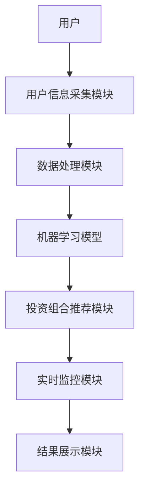
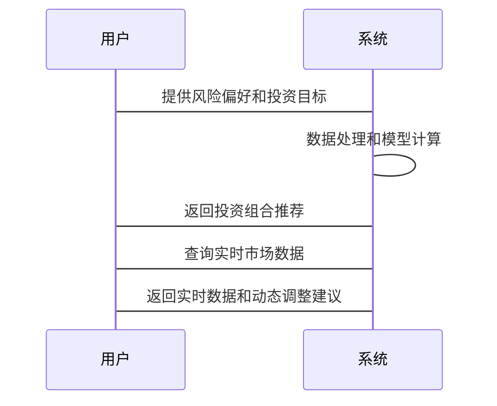

                 


# 人工智能驱动的个性化投资顾问服务

> 关键词：人工智能，个性化投资，投资顾问，机器学习，金融科技

> 摘要：本文深入探讨了人工智能技术在个性化投资顾问服务中的应用，从背景介绍、核心概念、算法原理、系统架构到项目实战，全面分析了如何利用AI技术实现智能化、个性化的投资顾问服务。通过具体的技术实现和案例分析，展示了人工智能在投资领域的巨大潜力和实际应用价值。

---

## 第一部分：人工智能驱动的个性化投资顾问服务背景

### 第1章：问题背景与描述

#### 1.1 问题背景
- **传统投资顾问服务的局限性**：依赖人工经验，服务成本高，难以覆盖大规模用户。
- **市场需求变化**：投资者对个性化、实时化投资建议的需求日益增长。
- **技术进步带来的机遇**：人工智能技术的快速发展为实现智能化投资顾问服务提供了可能。

#### 1.2 问题描述
- **投资者需求多样性**：不同投资者的风险偏好、投资目标和时间 horizon 各不相同。
- **市场数据复杂性**：金融市场数据呈现非线性、噪声多、动态变化等特点。
- **服务效率与成本**：传统投资顾问服务难以在低成本下实现大规模个性化服务。

#### 1.3 问题解决
- **引入人工智能技术**：利用机器学习、自然语言处理等技术，实现个性化投资建议的自动化和智能化。
- **数据驱动决策**：通过分析海量市场数据和用户行为数据，提供精准的投资策略。

#### 1.4 概念结构与核心要素
- **核心要素**：
  - 用户需求分析
  - 数据采集与处理
  - 智能算法推荐
  - 服务实时性与动态调整

---

## 第二部分：人工智能驱动的个性化投资顾问服务核心概念

### 第2章：核心概念与联系

#### 2.1 核心概念原理
- **人工智能技术在投资顾问中的应用**：
  - 机器学习模型用于市场预测和投资组合优化。
  - 自然语言处理技术用于分析财务报告和新闻资讯。
- **个性化服务的核心算法**：
  - 基于协同过滤的推荐算法。
  - 基于深度学习的强化学习模型。

#### 2.2 核心概念属性对比
| 概念                | 传统投资顾问 | 人工智能驱动的投资顾问 |
|---------------------|--------------|-------------------------|
| 服务模式            | 人工一对一服务 | 自动化、智能化服务     |
| 数据处理能力        | 数据量有限，处理速度慢 | 处理海量数据，实时响应 |
| 服务成本            | 高            | 低成本或零成本         |
| 服务范围            | 小众化        | 大规模个性化服务       |

#### 2.3 ER实体关系图
```mermaid
er
    entity 用户 {
        key 用户ID
        属性 用户风险偏好
        属性 用户投资目标
    }
    entity 资产配置方案 {
        key 方案ID
        属性 配置比例
        属性 投资期限
    }
    entity 市场数据 {
        key 数据ID
        属性 股票指数
        属性 债券指数
        属性 商品价格
    }
    用户 --> 资产配置方案: 生成个性化方案
    资产配置方案 --> 市场数据: 数据驱动调整
```

---

## 第三部分：人工智能驱动的个性化投资顾问服务算法原理

### 第3章：推荐算法概述

#### 3.1 基于协同过滤的推荐算法
- **算法流程**：
  1. 数据预处理：清洗、特征提取。
  2. 计算用户相似度：基于余弦相似度或欧式距离。
  3. 生成推荐列表：基于相似用户的购买或浏览记录。

- **数学公式**：
  $$相似度 = \frac{\sum_{i=1}^{n} (x_i - \bar{x})(y_i - \bar{y})}{\sqrt{\sum_{i=1}^{n} (x_i - \bar{x})^2} \cdot \sqrt{\sum_{i=1}^{n} (y_i - \bar{y})^2}}$$

- **Python代码示例**：
  ```python
  import numpy as np
  from sklearn.metrics.pairwise import cosine_similarity

  # 示例数据矩阵
  user_data = np.array([[4, 5, 3],
                         [2, 3, 5],
                         [5, 2, 4]])

  # 计算相似度矩阵
  similarity_matrix = cosine_similarity(user_data)
  print(similarity_matrix)
  ```

---

## 第四部分：人工智能驱动的个性化投资顾问服务系统架构

### 第4章：系统分析与架构设计

#### 4.1 问题场景介绍
- **用户需求**：投资者需要根据个人风险偏好和投资目标，获得实时的投资建议。
- **系统功能**：
  - 用户信息采集：风险偏好、投资目标、可投资金额。
  - 数据处理：市场数据清洗、特征提取。
  - 算法推荐：基于机器学习模型生成投资组合。
  - 实时监控：动态调整投资组合。

#### 4.2 系统架构设计


#### 4.3 系统接口设计
- **输入接口**：用户输入风险偏好、投资金额、投资期限。
- **输出接口**：推荐的投资组合、实时市场数据、动态调整建议。

#### 4.4 系统交互流程


---

## 第五部分：人工智能驱动的个性化投资顾问服务项目实战

### 第5章：项目实战

#### 5.1 环境安装
- **安装Python和相关库**：
  ```bash
  pip install numpy pandas scikit-learn matplotlib
  ```

#### 5.2 系统核心实现
- **基于协同过滤的推荐算法实现**：
  ```python
  from sklearn.metrics.pairwise import cosine_similarity

  def generate_recommendations(user_input, data_matrix):
      user_vector = user_input.reshape(1, -1)
      similarity = cosine_similarity(user_vector, data_matrix)
      return similarity.argsort()[0][::-1][:5]
  ```

- **基于深度学习的投资组合优化模型实现**：
  ```python
  import tensorflow as tf
  model = tf.keras.Sequential([
      tf.keras.layers.Dense(64, activation='relu'),
      tf.keras.layers.Dense(1, activation='sigmoid')
  ])
  model.compile(optimizer='adam', loss='binary_crossentropy')
  ```

#### 5.3 案例分析
- **实际案例**：假设用户风险偏好为中等，可投资金额为10万元，投资期限为3年。
- **系统推荐**：基于市场数据和用户输入，系统推荐60%股票、30%债券、10%黄金的配置方案。

#### 5.4 小结
- **项目总结**：通过项目实战，验证了人工智能技术在个性化投资顾问服务中的可行性。
- **代码实现**：详细解释了算法实现和系统架构设计。

---

## 第六部分：人工智能驱动的个性化投资顾问服务总结与展望

### 第6章：总结与展望

#### 6.1 最佳实践 tips
- **数据质量**：确保市场数据的准确性和实时性。
- **模型优化**：定期更新模型参数，适应市场变化。
- **用户体验**：提供清晰的投资建议和风险提示。

#### 6.2 小结
- **核心内容回顾**：本文从背景、核心概念、算法、系统架构到项目实战，全面介绍了人工智能驱动的个性化投资顾问服务。
- **未来展望**：随着AI技术的不断进步，个性化投资顾问服务将更加智能化和普及化。

---

## 作者信息

作者：AI天才研究院/AI Genius Institute & 禅与计算机程序设计艺术 /Zen And The Art of Computer Programming

