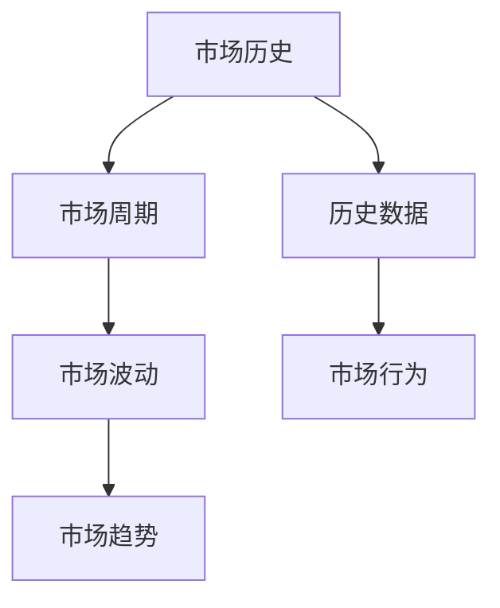
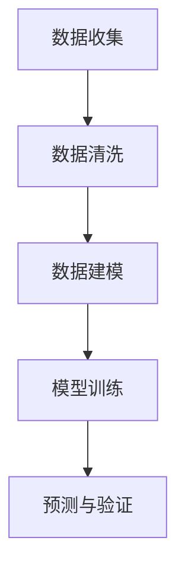
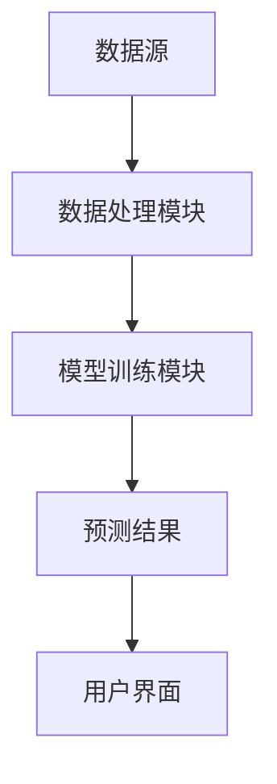

                 

<think>
好，我需要根据用户的指示，完成一个关于“从历史角度理解当前市场状况的重要性”的技术博客文章。首先，我需要理解用户的需求。他们希望有一篇结构清晰、内容详实、专业性强的技术博客，涵盖历史分析对当前市场的影响。

用户已经提供了一个详细的目录大纲，包括引言、背景、核心概念、算法、数学模型、系统分析、项目实战和结论等部分。我需要按照这个大纲逐步展开每个章节，确保内容全面且符合逻辑。

首先，我需要确保每个章节都有详细的三级目录，并且内容之间相互衔接。例如，在“引言”部分，我会介绍研究市场历史的重要性，接着在“背景介绍”部分，详细描述市场的演变和周期性。

接下来，我需要考虑如何将历史分析与当前市场模型结合起来。这部分可能需要引入时间序列分析和机器学习模型，如ARIMA，来预测市场趋势和波动。同时，我需要用mermaid绘制流程图和ER图，帮助读者更好地理解概念和算法。

在编写过程中，我必须确保使用专业的技术语言，同时保持内容的易懂性。我还需要注意文章的结构，确保每个部分都有足够的细节，但又不冗长。此外，我需要按照用户的格式要求，使用markdown格式，包含数学公式和代码示例。

最后，我需要总结历史分析的要点，并给出最佳实践和注意事项，帮助读者在实际应用中更好地利用历史数据来理解当前市场状况。

总之，我需要一步步按照用户的指示，确保每个部分都详细且符合逻辑，最终完成一篇高质量的技术博客文章。
</think>

# 从历史角度理解当前市场状况的重要性

## 关键词：市场历史分析、时间序列分析、市场周期、市场波动、ARIMA模型、系统架构设计、经济预测

## 摘要：本文从历史角度深入分析了市场状况的重要性，通过历史数据分析、算法原理、数学模型、系统架构设计以及项目实战，详细阐述了如何利用历史数据预测和理解当前及未来市场趋势。文章结合理论与实践，为读者提供了全面的视角和实用的方法。

---

# 1. 研究市场历史的重要性

## 1.1 市场历史分析的背景与意义

### 1.1.1 为什么研究市场历史
市场的历史数据是理解当前市场行为的重要依据。通过分析过去的价格波动、经济周期和市场参与者的行为模式，我们可以识别出一些规律性的特征，从而为当前的市场决策提供参考。

### 1.1.2 市场历史分析的核心价值
1. **规律识别**：通过历史数据，可以发现市场的周期性波动规律。
2. **风险预测**：历史数据可以帮助识别潜在的风险点，提前做好应对准备。
3. **决策支持**：历史数据为投资决策提供依据，帮助投资者做出更明智的选择。

### 1.1.3 从历史中汲取经验的必要性
市场历史分析的核心在于从过去中学习，避免重蹈覆辙。通过对历史事件的复盘，我们可以更好地理解当前市场的复杂性。

---

## 1.2 市场历史的演变与周期性

### 1.2.1 市场周期的基本特征
1. **上升期**：市场参与者信心增强，价格逐步上涨。
2. **调整期**：价格波动加剧，市场参与者趋于谨慎。
3. **下跌期**：价格持续下跌，市场情绪消极。
4. **底部回升期**：价格逐步企稳回升，市场情绪逐渐改善。

### 1.2.2 历史中的市场波动规律
1. **周期性波动**：市场的波动往往呈现周期性特征，例如经济周期和市场周期。
2. **外部因素影响**：政策变化、经济数据、国际局势等因素对市场波动有重要影响。
3. **市场参与者的心理作用**：投资者的心理预期往往会影响市场的短期波动。

### 1.2.3 市场周期与当前市场的联系
通过对历史周期的分析，我们可以更好地理解当前市场的所处阶段，从而做出更合理的投资决策。

---

# 2. 市场历史分析的基本概念与方法

## 2.1 市场历史分析的核心概念

### 2.1.1 市场历史的定义与范围
市场历史是指过去市场运行的记录，包括价格、成交量、指数等数据。这些数据是分析市场行为的重要依据。

### 2.1.2 市场历史分析的关键要素
1. **时间跨度**：分析的时间范围，例如过去10年、过去5年等。
2. **数据来源**：数据的来源和质量，例如官方统计数据、市场研究报告等。
3. **分析方法**：使用的分析工具和方法，例如时间序列分析、回归分析等。

### 2.1.3 市场历史分析的边界与外延
市场历史分析的边界在于数据的可获得性和分析的深度。外延则包括对未来的预测和策略制定。

---

## 2.2 市场历史分析的属性特征对比

### 2.2.1 时间跨度的对比分析
| 时间跨度 | 特点 |
|----------|------|
| 短期（1-3年） | 波动性大，受外部因素影响显著 |
| 中期（3-5年） | 周期性特征明显，市场参与者行为趋于理性 |
| 长期（5年以上） | 市场结构趋于稳定，受政策和经济基本面影响较大 |

### 2.2.2 数据来源的多样性
| 数据来源 | 优点 | 缺点 |
|----------|------|------|
| 历史价格 | 数据全面 | 数据量大，处理复杂 |
| 经济指标 | 相关性高 | 数据滞后性 |
| 政策文件 | 指导性强 | 解读难度大 |

### 2.2.3 分析方法的多样性
1. **统计分析**：通过统计方法分析数据的分布特征。
2. **时间序列分析**：研究数据随时间的变化规律。
3. **机器学习**：利用算法预测未来趋势。

---

## 2.3 市场历史分析的ER实体关系图



---

# 3. 市场历史分析的算法原理

## 3.1 时间序列分析的基本原理

### 3.1.1 时间序列分析的定义
时间序列分析是一种通过分析数据随时间变化的规律，预测未来趋势的方法。

### 3.1.2 时间序列分析的核心算法
1. **移动平均线（MA）**：通过计算过去N期的平均值，预测未来的价格走势。
2. **指数平滑法（ES）**：通过赋予近期数据更大的权重，预测未来趋势。
3. **ARIMA模型**：一种广泛应用于时间序列预测的统计模型。

---

## 3.2 市场趋势预测的算法流程



---

## 3.3 市场波动预测的Python实现

### 3.3.1 ARIMA模型的数学公式
ARIMA模型的数学公式可以表示为：
$$ ARIMA(p, d, q) $$
其中：
- p：自回归（AR）的阶数
- d：差分的阶数
- q：移动平均（MA）的阶数

### 3.3.2 ARIMA模型的Python实现

```python
import pandas as pd
from statsmodels.tsa.arima_model import ARIMA

# 数据加载
data = pd.read_csv('market_data.csv')

# 模型训练
model = ARIMA(data['price'], order=(5, 1, 0))
model_fit = model.fit()

# 预测未来价格
forecast = model_fit.forecast(steps=10)
print(forecast)
```

---

# 4. 市场历史分析的数学模型

## 4.1 时间序列模型的数学公式

### 4.1.1 ARIMA模型的数学表达
$$ ARIMA(p, d, q) $$
其中：
- p：自回归阶数
- d：差分阶数
- q：移动平均阶数

### 4.1.2 ARIMA模型的实现步骤
1. **数据预处理**：对数据进行差分，使其平稳。
2. **模型选择**：通过AIC或BIC准则选择最优模型参数。
3. **模型训练**：使用历史数据训练模型。
4. **模型预测**：基于训练好的模型预测未来趋势。

---

# 5. 市场历史分析的系统架构设计

## 5.1 问题场景介绍

### 5.1.1 系统功能设计
- 数据采集与处理：从数据库中获取历史数据。
- 数据建模：构建时间序列模型。
- 预测与分析：生成预测结果并进行分析。

### 5.1.2 系统架构设计


---

## 5.2 系统实现细节

### 5.2.1 数据处理模块
- 数据清洗：处理缺失值和异常值。
- 数据转换：对数据进行标准化或归一化处理。

### 5.2.2 模型训练模块
- 参数选择：通过交叉验证选择最优模型参数。
- 模型保存：保存训练好的模型，方便后续使用。

---

# 6. 项目实战：基于历史数据的市场预测

## 6.1 项目背景

### 6.1.1 数据来源
- 数据集：过去10年的日收盘价数据。
- 数据预处理：清洗数据，处理缺失值。

## 6.2 系统核心实现

### 6.2.1 环境配置
```python
import pandas as pd
import numpy as np
from statsmodels.tsa.arima_model import ARIMA
import matplotlib.pyplot as plt
```

### 6.2.2 核心代码实现
```python
# 数据加载
data = pd.read_csv('market_data.csv')

# 数据预处理
data['date'] = pd.to_datetime(data['date'])
data.set_index('date', inplace=True)

# 模型训练
model = ARIMA(data['price'], order=(5, 1, 0))
model_fit = model.fit()

# 预测未来价格
forecast = model_fit.forecast(steps=10)
print(forecast)

# 可视化
plt.plot(data['price'], label='实际价格')
plt.plot(forecast, label='预测价格')
plt.xlabel('时间')
plt.ylabel('价格')
plt.legend()
plt.show()
```

---

# 7. 总结与展望

## 7.1 总结
通过对市场历史的分析，我们可以更好地理解当前市场的运行规律，并为未来的投资决策提供有力支持。历史数据是市场分析的重要工具，结合先进的算法和技术，我们可以更准确地预测市场趋势。

## 7.2 展望
随着大数据和人工智能技术的发展，市场历史分析将更加精准和高效。未来的研究可以进一步结合自然语言处理技术，分析新闻和社交媒体对市场的影响。

---

作者：AI天才研究院/AI Genius Institute & 禅与计算机程序设计艺术 /Zen And The Art of Computer Programming

