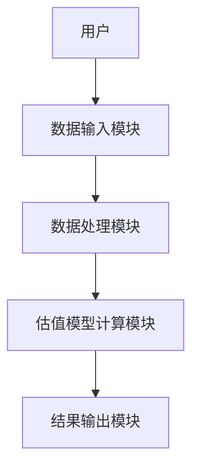

                 

<think>
好，我需要帮助用户撰写一篇关于《从零开始学习企业估值方法》的详细技术博客文章。用户已经提供了目录大纲，并要求我按照这个结构来完成文章。我需要确保每个章节都包含丰富的细节，符合用户的要求。

首先，我会从第一章开始，介绍企业估值的背景与重要性。这部分需要包括企业估值的定义、重要性、应用场景，以及其历史演变和边界。我需要用清晰的语言解释这些概念，并确保内容详实，帮助读者打下坚实的基础。

接下来是第二章，核心概念与联系。我需要详细讲解企业估值中的关键概念，比如企业价值的构成、现金流折现法的基本原理，以及核心指标如市盈率、市净率等。此外，还需要通过表格和图表来对比不同指标，帮助读者更好地理解它们的异同。

第三章将介绍基础方法，重点讲解现金流折现法（DCF模型）。我需要详细说明DCF模型的原理、自由现金流的计算公式，并通过数学公式和实例来解释。同时，还要分析DCF模型的优缺点，帮助读者全面了解其应用。

在第四章，我会深入高级方法，如杠杆收购法（LBO模型）和情景分析法。这部分需要使用数学公式和图表来展示这些方法的应用过程，并通过实际案例来说明如何进行企业价值评估。

第五章将涉及系统分析，包括企业价值评估的系统架构和数据驱动的估值方法。我会用Mermaid图来展示系统架构，并解释数据驱动方法的优势，比如如何利用大数据和机器学习来提高估值的准确性。

第六章是项目实战，从环境搭建到数据收集、建模、结果分析，再到报告撰写。这部分需要提供详细的代码实现，比如如何使用Python进行DCF模型的计算，并展示实际案例的分析过程，确保读者能够动手操作。

最后，第七章总结最佳实践，包括小结、注意事项和拓展阅读。这部分要帮助读者回顾所学内容，并指导他们在实际应用中避免常见错误，同时推荐进一步的学习资源。

在写作过程中，我需要确保每个部分都符合逻辑，内容连贯，并且使用技术性的语言但不过于晦涩。同时，要合理使用数学公式和图表，使文章更具可读性和专业性。我还要注意字数控制在10000到12000字之间，确保内容详实但不冗长。

总之，我会按照用户提供的目录大纲，逐一展开每个章节的内容，确保每一部分都包含丰富的细节和深入的分析，帮助读者系统地学习企业估值的方法。
</think>

# 从零开始学习企业估值方法

> **关键词**: 企业估值, 投资决策, 股权评估, 估值模型, 企业价值

> **摘要**: 企业估值是投资决策和企业价值评估的重要组成部分。本文从基础概念出发，系统讲解了企业估值的核心原理、常见方法及其应用场景。通过详细分析DCF模型、相对估值法等方法，结合实际案例和系统架构设计，帮助读者掌握企业估值的技巧和实践。本文还探讨了数据驱动的估值方法，为读者提供了从理论到实践的完整指导。

---

## 第1章: 企业估值的背景与重要性

### 1.1 企业估值的定义与意义

#### 1.1.1 企业估值的基本定义
企业估值是通过对企业的财务状况、市场地位、未来盈利能力等多方面因素的综合分析，估算其整体价值或股权价值的过程。它是企业融资、并购交易和投资决策中的关键环节。

#### 1.1.2 企业估值的重要性
企业估值是企业价值的量化表现，直接关系到企业的融资成本、并购价格和投资者回报。准确的估值能够帮助投资者和企业管理者做出科学的决策，避免因估值偏差导致的损失。

#### 1.1.3 企业估值的核心目标
企业估值的核心目标是通过分析企业的未来现金流和风险因素，计算其合理价值，为投资决策提供依据。

### 1.2 企业估值的常见应用场景

#### 1.2.1 投资决策中的应用
在投资决策中，企业估值是评估投资项目价值的重要工具。例如，风险投资机构通过对企业估值的分析，决定是否投资以及投资金额。

#### 1.2.2 并购交易中的应用
在企业并购中，买方通常需要对目标企业进行估值，以确定合理的收购价格，避免支付过高的溢价。

#### 1.2.3 企业融资中的应用
企业融资时，投资者和债权人都需要对企业估值进行评估，以确定融资金额和利率。

### 1.3 企业估值的历史演变

#### 1.3.1 传统估值方法的发展
早期的企业估值方法主要基于财务指标，如市盈率（P/E）和市净率（P/B）。这些方法简单易用，但在复杂市场环境下可能不够准确。

#### 1.3.2 现代估值方法的创新
随着金融理论的发展，现金流折现法（DCF模型）逐渐成为主流。这种方法通过对企业未来现金流的折现，计算其内在价值，适用于不同类型的企业的估值。

#### 1.3.3 数字化时代的估值变革
在数字化时代，大数据和人工智能技术的应用使得企业估值更加精确和高效。通过分析企业的市场数据、财务数据和竞争对手数据，可以构建更加复杂的估值模型。

### 1.4 企业估值的边界与外延

#### 1.4.1 估值的适用范围
企业估值适用于企业整体价值评估、股权价值评估和并购交易中的价格确定。

#### 1.4.2 估值的局限性
企业估值结果受到假设和模型限制，可能存在偏差。例如，DCF模型依赖于对未来的预测，如果预测不准确，估值结果可能偏离实际价值。

#### 1.4.3 估值与企业价值的关系
企业价值是估值的核心目标，而估值是实现企业价值最大化的重要手段。两者相互依存，共同推动企业的健康发展。

### 1.5 本章小结

---

## 第2章: 企业估值的核心概念与联系

### 2.1 企业估值的核心概念

#### 2.1.1 企业价值的构成
企业价值包括企业所有资产的公允价值，减去负债的公允价值。企业价值不仅包括有形资产，还包括无形资产，如品牌价值和客户关系。

#### 2.1.2 股东权益的价值
股东权益是企业价值的重要组成部分，包括普通股、优先股和可转换债券等。

#### 2.1.3 现金流的定义与计算
现金流是企业在一定时期内的现金流入和流出。自由现金流是企业扣除所有成本和支出后的剩余现金流，用于偿还债务和分配给股东。

### 2.2 企业估值的核心原理

#### 2.2.1 现金流折现法的原理
现金流折现法通过将未来现金流折现，计算其现值，作为企业的估值基础。这种方法的核心在于准确预测未来的现金流和确定合理的折现率。

#### 2.2.2 可比公司法的原理
可比公司法通过比较同行业可比公司的估值指标，推导出目标企业的估值。这种方法适用于企业所在的行业具有较多可比公司的情况。

#### 2.2.3 股权自由现金流模型的原理
股权自由现金流模型将企业的自由现金流分配给股东，计算其现值。这种方法适用于企业已经确定了股利政策或资本结构的情况。

### 2.3 企业估值的核心指标

#### 2.3.1 市盈率（P/E）
市盈率是企业市值与净利润的比值，用于衡量企业股票的相对价值。

#### 2.3.2 市净率（P/B）
市净率是企业市值与净资产的比值，适用于资产密集型行业。

#### 2.3.3 企业价值倍数（EV/EBITDA）
企业价值倍数是企业价值与息税折旧及摊销前利润的比值，用于衡量企业的整体价值。

### 2.4 核心概念之间的关系

#### 2.4.1 企业价值与股东权益的关系
企业价值是股东权益和债权权益的总和，股东权益是企业价值的重要组成部分。

#### 2.4.2 现金流与企业价值的关系
现金流是企业价值的核心驱动力，企业的未来现金流决定了其估值的高低。

#### 2.4.3 股权价值与债权价值的关系
股权价值和债权价值相互影响，股权价值的增加可能会影响债权价值，反之亦然。

### 2.5 本章小结

---

## 第3章: 企业估值的基础方法

### 3.1 现金流折现法（DCF模型）

#### 3.1.1 DCF模型的基本原理
现金流折现法通过将企业未来现金流折现，计算其现值，作为企业的估值基础。这种方法的核心在于准确预测未来的现金流和确定合理的折现率。

#### 3.1.2 自由现金流的计算公式
$$ FCFF = EBIT(1 - t) + DTL $$

#### 3.1.3 折现率的确定方法
折现率通常基于无风险利率和市场风险溢价，通过资本资产定价模型（CAPM）计算。

#### 3.1.4 DCF模型的优缺点
- **优点**: 理论基础扎实，能够反映企业的实际价值。
- **缺点**: 对未来现金流的预测依赖性强，容易受到假设的影响。

---

### 3.2 相对估值法

#### 3.2.1 相对估值法的基本原理
相对估值法通过比较同行业可比公司的估值指标，推导出目标企业的估值。

#### 3.2.2 可比交易法
可比交易法是通过分析类似交易的案例，推导出目标企业的估值。

#### 3.2.3 杠杆收购法
杠杆收购法通过分析杠杆收购交易中的债务和股权比例，计算企业的估值。

### 3.3 本章小结

---

## 第4章: 企业估值的高级方法

### 4.1 杠杆收购模型（LBO模型）

#### 4.1.1 LBO模型的基本原理
杠杆收购模型通过分析企业杠杆收购交易中的现金流和资本结构，计算企业的估值。

#### 4.1.2 LBO模型的计算步骤
1. 确定企业的EBITDA和息税折旧及摊销前利润。
2. 计算企业的杠杆收购交易中的债务和股权比例。
3. 确定合理的利率和还款计划。
4. 计算企业的估值。

#### 4.1.3 LBO模型的优缺点
- **优点**: 能够反映企业杠杆收购交易中的实际价值。
- **缺点**: 对资本结构和利率的假设敏感。

### 4.2 情景分析法

#### 4.2.1 情景分析法的基本原理
情景分析法通过分析不同市场情景对企业价值的影响，计算企业的估值。

#### 4.2.2 情景分析法的应用步骤
1. 确定不同市场情景下的现金流。
2. 计算每种情景下的折现率。
3. 计算每种情景下的企业估值。
4. 综合分析不同情景下的估值结果。

### 4.3 本章小结

---

## 第5章: 企业估值的系统分析

### 5.1 企业价值评估的系统架构

#### 5.1.1 系统功能设计
- 数据输入: 收集企业的财务数据和市场数据。
- 模型计算: 计算企业的现金流、折现率和估值。
- 结果输出: 输出企业的估值报告。

#### 5.1.2 系统架构设计


### 5.2 数据驱动的估值方法

#### 5.2.1 数据驱动方法的基本原理
数据驱动方法通过分析企业的历史数据和市场数据，利用大数据和机器学习技术，预测企业的未来现金流和估值。

#### 5.2.2 数据驱动方法的应用步骤
1. 收集企业的历史财务数据和市场数据。
2. 建立预测模型，预测企业的未来现金流。
3. 计算企业的估值。

### 5.3 本章小结

---

## 第6章: 项目实战

### 6.1 环境搭建

#### 6.1.1 软件安装
- Python 3.8+
- NumPy、Pandas、Matplotlib等库。

#### 6.1.2 数据来源
- 企业财务数据: 从公开的财务报表中获取。
- 市场数据: 从金融数据提供商获取。

### 6.2 核心实现

#### 6.2.1 DCF模型的实现
```python
import numpy as np
import pandas as pd

def calculate_dcf(discounted_cash_flows, discount_rate):
    present_value = np.npv(discount_rate, discounted_cash_flows)
    return present_value

# 示例数据
discounted_cash_flows = [-100, 200, 300, 400, 500]
discount_rate = 0.1

dcf_value = calculate_dcf(discounted_cash_flows, discount_rate)
print("DCF Value:", dcf_value)
```

#### 6.2.2 可比公司法的实现
```python
import pandas as pd

def calculate_relative_valuation(pe_ratio, target_pe_ratio, market_value):
    target_value = pe_ratio * target_pe_ratio * market_value
    return target_value

# 示例数据
pe_ratio = 15
target_pe_ratio = 20
market_value = 1000

relative_value = calculate_relative_valuation(pe_ratio, target_pe_ratio, market_value)
print("Relative Value:", relative_value)
```

### 6.3 案例分析

#### 6.3.1 案例背景
某科技公司近年来收入增长迅速，但净利润率较低。需要对其未来现金流进行预测，并计算其估值。

#### 6.3.2 数据收集
- 近5年的收入和利润数据。
- 行业平均市盈率和市净率。

#### 6.3.3 计算过程
1. 预测未来5年的现金流。
2. 使用DCF模型计算企业的内在价值。
3. 使用可比公司法验证估值的合理性。

### 6.4 本章小结

---

## 第7章: 最佳实践与小结

### 7.1 小结
企业估值是投资决策和企业价值评估的重要工具。通过系统的理论学习和实际案例分析，可以帮助读者掌握多种估值方法，并在实际工作中灵活运用。

### 7.2 注意事项
- 估值结果受到假设和模型的限制，需结合实际情况进行调整。
- 在实际应用中，应综合考虑企业的财务状况、市场环境和行业特点。

### 7.3 拓展阅读
- 资本资产定价模型（CAPM）
- 企业价值评估的多元模型
- 大数据分析在估值中的应用

---

**作者：AI天才研究院/AI Genius Institute & 禅与计算机程序设计艺术/Zen And The Art of Computer Programming**

