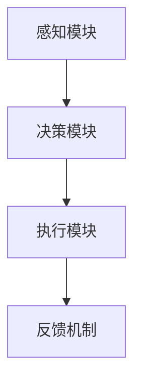
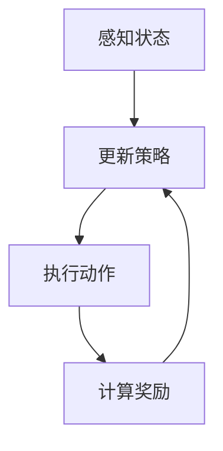
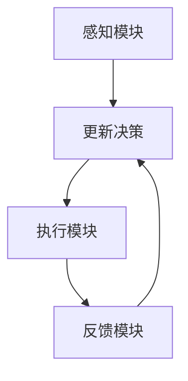
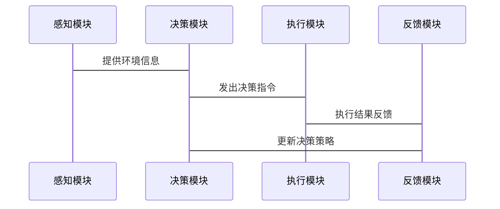

                 

<think>
嗯，用户希望我根据他们提供的查询生成一个详细的、结构化的技术博客文章目录。看起来他们已经给出了一部分目录，但可能需要进一步扩展和细化，以确保覆盖构建AI Agent的各个方面。

首先，用户提供的标题是《从零开始：构建AI Agent的完整指南》，关键词包括AI Agent、人工智能、机器学习、深度学习、强化学习，摘要概述了文章的核心内容。接下来是目录大纲，分为背景、核心概念、算法原理、系统分析、项目实战、最佳实践和附录。

我需要确保每个部分都详细且逻辑清晰，符合用户的要求。用户特别指出，文章需要包括背景介绍、核心概念、算法原理、系统分析、项目实战、最佳实践，并且使用特定的格式，比如Mermaid图表和Python代码示例。

首先，背景介绍部分需要解释什么是AI Agent，其应用场景和分类。核心概念部分需要详细讲解感知、决策、执行和反馈机制，并用表格对比不同类型的AI Agent。算法原理部分需要选择几个典型的算法，如DQN和强化学习，用Mermaid流程图展示，同时提供Python代码示例。数学模型部分要解释Q-learning的公式，并用LaTeX格式展示。

系统分析与架构设计部分需要介绍构建AI Agent的系统架构，包括功能模块和交互流程，用Mermaid类图、架构图和序列图来展示。项目实战部分要提供一个具体的案例，比如构建一个简单的文本聊天AI Agent，从环境安装到代码实现，逐步指导读者。最佳实践部分涵盖开发规范、测试方法、部署策略以及安全和伦理问题。附录部分提供工具和资源，参考文献和索引帮助读者深入研究。

现在，我需要将这些思考转化为具体的目录结构，确保每个部分都涵盖必要的内容，并且符合用户的格式要求。比如，第一章是背景与核心概念，第二章是算法原理，第三章是系统分析，第四章是项目实战，第五章是最佳实践，第六章是附录。

在编写过程中，要注意使用正确的Markdown格式，确保章节层级分明，内容详实。数学公式和流程图需要准确无误，帮助读者更好地理解复杂的概念。代码示例要简洁明了，方便读者直接应用和学习。

总的来说，我需要确保这本书的目录大纲不仅覆盖构建AI Agent的各个方面，还要逻辑清晰，易于理解和应用。这样才能真正帮助读者从零开始，全面掌握构建AI Agent的完整指南。
</think>

# 从零开始：构建AI Agent的完整指南

> 关键词：AI Agent、人工智能、机器学习、深度学习、强化学习

> 摘要：本文将详细讲解如何从零开始构建一个完整的AI Agent。通过逐步分析AI Agent的核心概念、算法原理、系统架构设计、项目实战以及最佳实践，帮助读者全面掌握构建AI Agent的技能。文章内容涵盖从理论到实践的各个方面，结合丰富的代码示例和可视化工具，确保读者能够深入理解并成功实现自己的AI Agent。

---

# 第一部分: AI Agent的背景与核心概念

# 第1章: AI Agent概述

## 1.1 AI Agent的基本概念

### 1.1.1 什么是AI Agent
AI Agent（人工智能代理）是指能够感知环境、自主决策并执行任务的智能实体。它可以是一个软件程序，也可以是一个物理设备，其核心目标是通过与环境交互来实现特定目标。

### 1.1.2 AI Agent的定义与特征
AI Agent具有以下核心特征：
1. **自主性**：能够自主决策，无需外部干预。
2. **反应性**：能够实时感知环境并做出反应。
3. **目标导向性**：所有行为都围绕实现特定目标展开。
4. **学习能力**：能够通过经验改进性能。

### 1.1.3 AI Agent与传统程序的区别
AI Agent与传统程序的主要区别在于其智能性和自主性。传统程序按照预设规则执行任务，而AI Agent能够根据环境动态调整行为。

## 1.2 AI Agent的应用场景

### 1.2.1 智能助手
AI Agent可以用于智能助手，如语音助手（Siri、Alexa）和聊天机器人。

### 1.2.2 自动化系统
AI Agent可以用于工业自动化、智能家居等领域，实现设备的智能控制。

### 1.2.3 游戏AI
AI Agent可以用于游戏开发，实现智能NPC（非玩家角色）的行为。

### 1.2.4 智慧城市
AI Agent可以用于交通管理、智能安防等领域，提升城市运行效率。

## 1.3 AI Agent的分类

### 1.3.1 反应式AI Agent
反应式AI Agent基于当前环境状态做出反应，不依赖于内部模型。

### 1.3.2 认知式AI Agent
认知式AI Agent具有推理和规划能力，能够根据内部模型做出决策。

### 1.3.3 基于模型的AI Agent
基于模型的AI Agent通过构建环境模型来优化决策。

### 1.3.4 基于规则的AI Agent
基于规则的AI Agent通过预定义的规则来执行任务。

## 1.4 本章小结
本章介绍了AI Agent的基本概念、应用场景和分类，为后续章节奠定了基础。

---

# 第2章: AI Agent的核心概念与联系

## 2.1 AI Agent的核心原理

### 2.1.1 感知模块
感知模块负责接收环境输入并提取有用信息。

### 2.1.2 决策模块
决策模块根据感知信息做出决策。

### 2.1.3 执行模块
执行模块将决策转化为具体行动。

### 2.1.4 反馈机制
反馈机制用于评估行动结果并调整后续行为。

## 2.2 AI Agent的属性特征对比

| 特性         | 反应式AI Agent | 认知式AI Agent | 基于模型的AI Agent |
|--------------|----------------|----------------|--------------------|
| 感知能力     | 强             | 弱             | 中                |
| 决策能力     | 快             | 慢             | 精确              |
| 环境适应性   | 高             | 中             

## 2.3 实体关系图



---

# 第三部分: AI Agent的算法原理

# 第3章: 基于强化学习的AI Agent算法

## 3.1 强化学习基础

### 3.1.1 强化学习简介
强化学习是一种通过试错机制学习策略的方法。

### 3.1.2 状态、动作和奖励
- **状态（State）**：环境的当前情况。
- **动作（Action）**：AI Agent的决策。
- **奖励（Reward）**：对动作的反馈。

## 3.2 DQN算法原理

### 3.2.1 DQN算法流程



### 3.2.2 DQN算法实现

```python
import numpy as np
class DQN:
    def __init__(self, state_dim, action_dim):
        self.state_dim = state_dim
        self.action_dim = action_dim
        self.model = self.build_model()
    def build_model(self):
        model = Sequential()
        model.add(Dense(64, input_dim=self.state_dim, activation='relu'))
        model.add(Dense(self.action_dim))
        return model
    def remember(self, state, action, reward, next_state):
        # 记忆库实现
    def replay(self, batch_size):
        # 回放策略实现
    def act(self, state):
        # 动作选择实现
```

## 3.3 数学模型与公式

### 3.3.1 Q-learning公式

$$ Q(s, a) = Q(s, a) + \alpha (r + \gamma \max Q(s', a') - Q(s, a)) $$

### 3.3.2 DQN损失函数

$$ \mathcal{L} = \mathbb{E}[(r + \gamma Q(s', a') - Q(s, a))^2] $$

---

# 第四部分: AI Agent的系统分析与架构设计

# 第4章: AI Agent系统架构设计

## 4.1 系统功能模块

### 4.1.1 感知模块
负责接收环境输入并提取特征。

### 4.1.2 决策模块
基于感知信息做出决策。

### 4.1.3 执行模块
将决策转化为具体行动。

### 4.1.4 反馈模块
评估行动结果并提供反馈。

## 4.2 系统架构图



## 4.3 系统交互流程



---

# 第五部分: AI Agent的项目实战

# 第5章: 从零开始构建AI Agent

## 5.1 环境安装与配置

### 5.1.1 安装Python
确保安装了Python 3.x版本。

### 5.1.2 安装依赖库
```bash
pip install numpy tensorflow gym matplotlib
```

## 5.2 AI Agent核心实现

### 5.2.1 感知模块实现

```python
def感知环境():
    # 实现环境感知逻辑
    return 状态
```

### 5.2.2 决策模块实现

```python
def做出决策(状态):
    # 实现决策逻辑
    return 动作
```

### 5.2.3 执行模块实现

```python
def执行动作(动作):
    # 实现动作执行逻辑
    return 新状态
```

## 5.3 项目实战案例

### 5.3.1 案例分析
以构建一个简单的文本聊天AI Agent为例。

### 5.3.2 代码实现

```python
class ChatAI:
    def __init__(self):
        self训练模型()
    def 训练模型(self):
        # 实现训练逻辑
    def 接收输入(self, input_str):
        # 实现输入处理逻辑
        return 回应
```

## 5.4 项目小结

---

# 第六部分: AI Agent的最佳实践

# 第6章: 最佳实践与注意事项

## 6.1 开发规范

### 6.1.1 代码规范
遵循Python代码规范，确保代码可读性和可维护性。

### 6.1.2 日志记录
在关键步骤添加日志记录，便于调试和优化。

## 6.2 测试方法

### 6.2.1 单元测试
对各个模块进行单元测试，确保功能正常。

### 6.2.2 集成测试
对整个系统进行集成测试，确保各模块协同工作。

## 6.3 部署与优化

### 6.3.1 系统部署
将AI Agent部署到目标环境。

### 6.3.2 性能优化
通过优化算法和调整参数提升系统性能。

## 6.4 安全与伦理

### 6.4.1 数据安全
确保数据存储和传输的安全性。

### 6.4.2 伦理问题
遵守相关法律法规，避免AI Agent滥用。

---

# 第七部分: 附录

# 第7章: 参考文献与工具资源

## 7.1 参考文献
1. Sutton, R. S., & Barto, A. G. (2018). Reinforcement Learning: An Introduction.
2. LeCun, Y., Bengio, Y., & Hinton, G. (2015). Deep Learning.

## 7.2 工具资源
- TensorFlow官方文档：https://tensorflow.org
- OpenAI API文档：https://openai.com/api
- Gym官方文档：https://gym.openai.com/docs

---

# 作者：AI天才研究院/AI Genius Institute & 禅与计算机程序设计艺术 /Zen And The Art of Computer Programming

